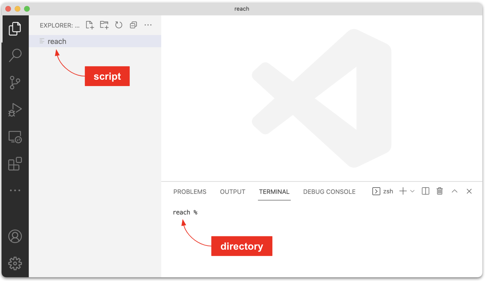
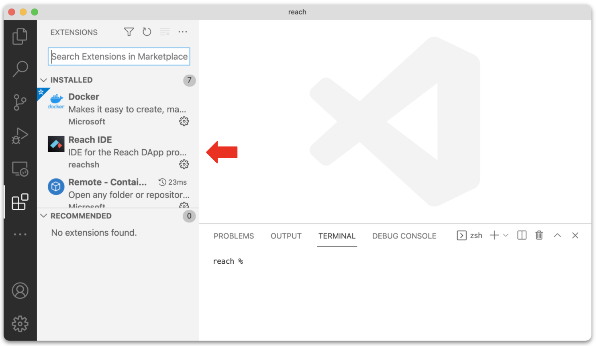
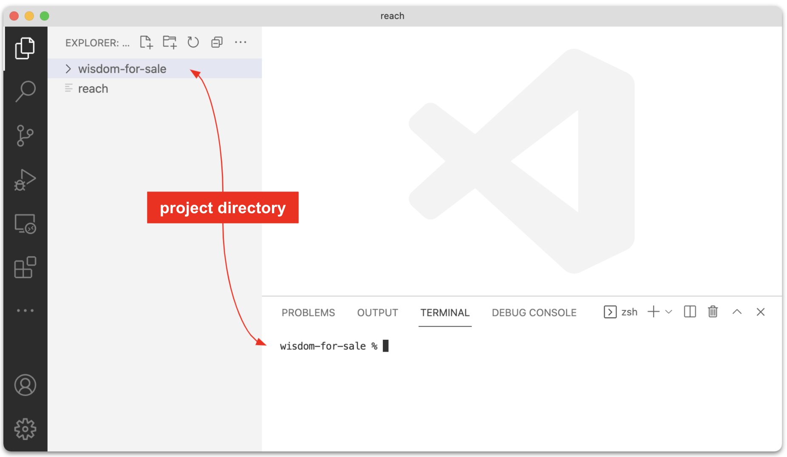
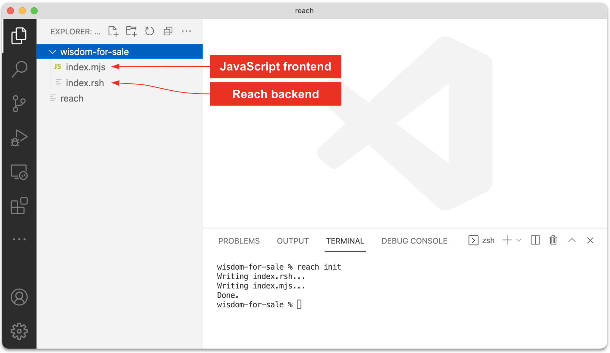

# Quick Start

The directions below show you how to build and run a sample Reach decentralized application (DApp).

# Prerequisites

1. Install [GNU Make](https://www.gnu.org/software/make/), or verify your fairly up-to-date installation:

    ``` nonum
    $ make -v
    GNU Make 4.3
    ```

1. Install [Docker](https://docs.docker.com/get-docker/), or verify your fairly up-to-date installation:

    ``` nonum
    $ docker -v
    Docker version 20.10.5
    ```

# Install Reach

1. Create a *reach* directory:

    ``` nonum
    $ mkdir ~/reach
    $ cd ~/reach
    ```

1. Download the [reach](https://github.com/reach-sh/reach-lang/blob/master/reach) script to the *reach* directory:

    ``` nonum
    $ curl https://docs.reach.sh/reach -o reach ; chmod +x reach
    ```

1. Verify that you can run the reach script:

    ``` nonum
    $ reach -v
    reach 0.1
    ```

    Optionally, to be able to run the *reach* script from any directory, add *reach* to the PATH variable in your shell startup file (e.g. `PATH=~/reach:$PATH`), and then rerun your startup file (e.g. close/open your terminal or run [source](https://en.wikipedia.org/wiki/Dot_(command))).

1. Download Reach Docker images:

    ``` nonum
    $ reach update
    ```

# Install VSCode

1. Install [Visual Studio Code](https://code.visualstudio.com/).

1. In vscode, open `~/reach`:

    <p></p>

1. Install the [Reach extension](https://marketplace.visualstudio.com/items?itemName=reachsh.reach-ide):

    <p></p>

# Create a project

1. Create a *wisdom-for-sale* project folder:

    <p></p>

1. Run `reach init` to create the source files for a simple Reach program:

    <p></p>

# Compile, verify, and run

```
$ reach run
$ REACH_CONNECTOR_MODE=ETH-devnet reach run
Verifying knowledge assertions
Verifying for generic connector
  Verifying when ALL participants are honest
  Verifying when NO participants are honest
  Verifying when ONLY "Alice" is honest
  Verifying when ONLY "Bob" is honest
Checked 4 theorems; No failures!
[+] Building 0.2s (7/7) FINISHED     
 => [internal] load build definition from Dockerfile
 => => transferring dockerfile: 234B 
 => [internal] load .dockerignore
 => => transferring context: 75B 
 => [internal] load metadata for docker.io/reachsh/runner:0.1.5
 => [internal] load build context
 => => transferring context: 4.90kB  
 => CACHED [1/2] FROM docker.io/reachsh/runner:0.1.5
 => [2/2] COPY . /app 
 => exporting to image
 => => exporting layers   
 => => writing image sha256:110953e2319564c0337b3c872189bd59e2ff37c45238fbb1b8ce431081297103 
 => => naming to docker.io/reachsh/reach-app-wisdom-for-sale:latest

Use 'docker scan' to run Snyk tests against images to find vulnerabilities and learn how to fix them
Creating reach2021-09-28t12-25-14z-zgjo_reach-app-wisdom-for-sale_run ... done

> @reach-sh/wisdom-for-sale@ index /app
> node --experimental-modules --unhandled-rejections=strict index.mjs

Hello, Alice and Bob!
Launching...
Starting backends...
Goodbye, Alice and Bob!
```

```
$ REACH_CONNECTOR_MODE=ALGO-devnet reach run
Verifying knowledge assertions
Verifying for generic connector
  Verifying when ALL participants are honest
  Verifying when NO participants are honest
  Verifying when ONLY "Alice" is honest
  Verifying when ONLY "Bob" is honest
Checked 4 theorems; No failures!
[+] Building 0.2s (7/7) FINISHED     
 => [internal] load build definition from Dockerfile      
 => => transferring dockerfile: 234B
 => [internal] load .dockerignore   
 => => transferring context: 75B    
 => [internal] load metadata for docker.io/reachsh/runner:0.1.5      
 => CACHED [1/2] FROM docker.io/reachsh/runner:0.1.5      
 => [internal] load build context   
 => => transferring context: 4.90kB 
 => [2/2] COPY . /app    
 => exporting to image   
 => => exporting layers  
 => => writing image sha256:2ece3525a17f6e9b76934e99076221528f91e9b8f00e18c3fc6635b0d1b74429 0.0s
 => => naming to docker.io/reachsh/reach-app-wisdom-for-sale:latest  

Use 'docker scan' to run Snyk tests against images to find vulnerabilities and learn how to fix them
Pulling devnet-algo-pg (postgres:11-alpine)...
11-alpine: Pulling from library/postgres
a0d0a0d46f8b: Already exists
5034a66b99e6: Pull complete
82e9eb77798b: Pull complete
351ed8634988: Pull complete
18d059d16088: Pull complete
4e934fbe90b5: Pull complete
faca3cd3c3fd: Pull complete
e884a1e228ac: Pull complete
Digest: sha256:f811f9f9dd96568118fc9f274a6d353b2ab30851d961e8bf8fd69c781c545fd3
Status: Downloaded newer image for postgres:11-alpine
Creating reach-devnet-algo-pg ... done
Creating reach-devnet-algo    ... done
Creating reach2021-09-28t12-45-31z-kvsp_reach-app-wisdom-for-sale_run ... done

> @reach-sh/wisdom-for-sale@ index /app
> node --experimental-modules --unhandled-rejections=strict index.mjs

Hello, Alice and Bob!
Launching...
Starting backends...
Goodbye, Alice and Bob!
```

```
$ REACH_CONNECTOR_MODE=CFX-devnet reach run
Verifying knowledge assertions
Verifying for generic connector
  Verifying when ALL participants are honest
  Verifying when NO participants are honest
  Verifying when ONLY "Alice" is honest
  Verifying when ONLY "Bob" is honest
Checked 4 theorems; No failures!
[+] Building 0.2s (7/7) FINISHED 
 => [internal] load build definition from Dockerfile      
 => => transferring dockerfile: 234B   
 => [internal] load .dockerignore      
 => => transferring context: 75B
 => [internal] load metadata for docker.io/reachsh/runner:0.1.5
 => CACHED [1/2] FROM docker.io/reachsh/runner:0.1.5      
 => [internal] load build context      
 => => transferring context: 4.90kB    
 => [2/2] COPY . /app    
 => exporting to image   
 => => exporting layers  
 => => writing image sha256:f5c034267578ab31c13cbe38e6553a3fc698ed8454512b145b4c0def393d213d    
 => => naming to docker.io/reachsh/reach-app-wisdom-for-sale:latest   

Use 'docker scan' to run Snyk tests against images to find vulnerabilities and learn how to fix them
Creating reach-devnet-cfx ... done
Creating reach2021-09-28t12-50-13z-uiho_reach-app-wisdom-for-sale_run ... done

> @reach-sh/wisdom-for-sale@ index /app
> node --experimental-modules --unhandled-rejections=strict index.mjs

Hello, Alice and Bob!
Launching...
Starting backends...
Goodbye, Alice and Bob!
```

# Add a web interface
