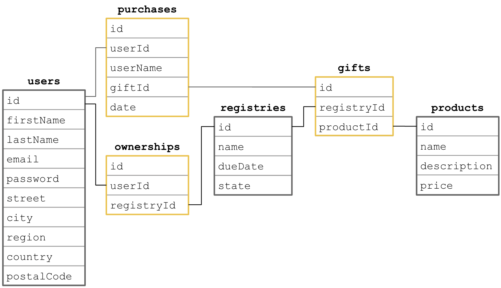

# Base App

Click https://hagenhaus.com:3000.

# Local Dot Env

``` nonum
appId=baby-registry.webapp.node.base-app
appName=Baby Registry
appPort=8083
appVersion=001
dbConnectionLimit=10
dbDatabase=baby_registry
dbHost=localhost
dbPassword=password
dbUser=native
https=false
jwtExpiresIn=86400
jwtSecret=mysecret
saltRounds=10
```

# Public Dot Env

``` nonum
appId=baby-registry.webapp.node.base-app
appName=Baby Registry
appPort=3000
appVersion=003
certificate=/opt/bitnami/letsencrypt/certificates/hagenhaus.com.crt
dbConnectionLimit=10
dbDatabase=baby_registry
dbHost=localhost
dbPassword=password
dbUser=sample
https=true
jwtExpiresIn=86400
jwtSecret=mysecret
privateKey=/opt/bitnami/letsencrypt/certificates/hagenhaus.com.key
saltRounds=10
```

# Database Setup

1. Create a mysql database:

    ``` nonum
    drop database if exists baby_registry;
    create database baby_registry;
    use baby_registry;
    ```

1. Create a native user if necessary:

    ``` nonum
    create user 'native'@'localhost' identified with mysql_native_password by 'password';
    grant all privileges on baby_registry.* to 'native'@'localhost';
    ```

    ``` nonum
    # MariaDB
    SET old_passwords=0;
    CREATE USER native@localhost IDENTIFIED BY 'password';
    ```

1. Add database tables.

1. Add database procedures.

1. If the db has existing data, run `call truncateTables;`.

1. Run `call insertProducts();`.

1. Run the *Create Users* operation in the *Runner* in the Postman collection.

# Database Tables

Here is the schema.

<p></p>

## &#35; gifts

``` nonum
drop table if exists gifts;
create table gifts (
  id int auto_increment primary key,
  registryId int not null,
  productId int not null
) character set = utf8;
```

## &#35; ownerships

``` nonum
drop table if exists ownerships;
create table ownerships (
  id int auto_increment primary key,
  userId int not null,
  registryId int not null
) character set = utf8;
```

## &#35; products

``` nonum
drop table if exists products;
create table products (
  id int auto_increment primary key,
  name varchar(128) not null,
  description text not null,
  price decimal(8, 2) not null
) character set = utf8;
```

## &#35; purchases

``` nonum
drop table if exists purchases;
create table purchases (
  id int auto_increment primary key,
  userId int not null,
  userName varchar(128) not null,
  giftId int not null unique,
  date timestamp not null default current_timestamp
) character set = utf8;
```

## &#35; registries

``` nonum
drop table if exists registries;
create table registries (
  id int auto_increment primary key,
  name varchar(128) not null,
  dueDate date not null,
  state enum ("active","inactive") not null
) character set = utf8;
```

## &#35; users

``` nonum
drop table if exists users;
create table users (
  id int auto_increment primary key,
  firstName varchar(64) not null,
  lastName varchar(64) not null,
  email varchar(128) not null unique,
  password varchar(64) not null,
  street varchar(128),
  city varchar(128),
  region varchar(64),
  country varchar(128),
  postalCode varchar(24)
) character set = utf8;
```

# Database Procedures

## &#35; deleteRegistry

``` nonum
drop procedure if exists deleteRegistry;
delimiter //
create procedure deleteRegistry(in id int)
begin

  declare errno int;
  declare exit handler for sqlexception
  begin
  get current diagnostics condition 1 errno = mysql_errno;
  select errno as mysql_error;
  rollback;
  end;

  start transaction;
  delete from registries where registries.id = id;
  delete from ownerships where ownerships.registryId = id;
  delete purchases from purchases inner join gifts on purchases.giftId=gifts.id where gifts.registryId = id;
  delete from gifts where gifts.registryId = id;
  commit;

end //
delimiter ;
```

## &#35; deleteUser

``` nonum
drop procedure if exists deleteUser;
delimiter //
create procedure deleteUser(in id int)
begin

  declare errno int;
  declare exit handler for sqlexception
  begin
  get current diagnostics condition 1 errno = mysql_errno;
  select errno as mysql_error;
  rollback;
  end;

  start transaction;
  select registries.id into @registryId 
  from ownerships inner join registries on ownerships.registryId = registries.id
  where ownerships.userId = id;
  delete from users where users.id = id; 
  call deleteRegistry(@registryId);
  commit;

end //
delimiter ;
```

## &#35; insertGift

``` nonum
drop procedure if exists insertGift;
delimiter //
create procedure insertGift(
  in registryId int, 
  in productId int
)
begin
  insert into gifts (registryId, productId) values (registryId, productId);
  if row_count() = 0 then 
    SIGNAL SQLSTATE '45000' SET MESSAGE_TEXT = 'Unable to create gift.';
  else
    select LAST_INSERT_ID() as giftId;
  end if;
end //
delimiter ;
```

## &#35; insertProduct

``` nonum
drop procedure if exists insertProduct;
delimiter //
create procedure insertProduct(
  in name varchar(128), 
  in description text,
  in price decimal(8, 2)
)
begin
  insert into products (name, description, price) 
  values (name, description, price);
  if row_count() = 0 then 
    SIGNAL SQLSTATE '45000' SET MESSAGE_TEXT = 'Unable to create product.';
  else
    call selectProduct(LAST_INSERT_ID());
  end if;
end //
delimiter ;
```

## &#35; insertProducts

``` nonum
drop procedure if exists insertProducts;
delimiter //
create procedure insertProducts()
begin

  declare errno int;
  declare exit handler for sqlexception
  begin
  get current diagnostics condition 1 errno = mysql_errno;
  select errno as mysql_error;
  rollback;
  end;

  start transaction;

  call insertProduct("Baby Zip Sleeper", "Crafted in organic cotton, our sleepers are great for keeping baby comfortable, day and night. A handy neck-to-knee zipper makes changing easy, and it won't lose it's remarkably soft feel or bright colors after washing.", 19.99);
  call insertProduct("Dream Blanket", "With four layers of cotton muslin, this snuggly baby blanket is nothing less than dreamy. Our softest baby blanket yet, the aden + anais dream blanket makes a comfy surface for tummy time, story time, and much more.", 49.99);
  call insertProduct("Floor Seat", "Give your baby the best seat in the house with the Baby Base 2-in-1 Seat. Use it on the floor for supported play or strap it to a chair for dining. Remove the soft insert as your child grows.", 39.99);
  call insertProduct("Baby Bassinet Bedside Sleeper", "A bedside bassinet gives you the closeness and convenience of co-sleeping, while allowing baby his or her own protected space. The side wall lowers to allow you to tend to baby without leaving your bed.", 159.99);
  call insertProduct("Jogging Stroller", "Having a baby doesn’t have to mean giving up your active lifestyle. With this jogging stroller, you can get out, get some exercise, and ensure your baby is never left out of the fun.", 269.99);
  call insertProduct("Table Chair", "Baby chairs that attach directly to the edge of the table are great because they put your little one right in the middle of the action instead of being slightly separated in a high chair.", 67.59);
  call insertProduct("Baby Carrier", "Carrier slips on like a T-shirt and adjusts by pulling fabric through the rings in the back. Your baby sits in a double layer of fabric, and there’s a safety sash to tie to ensure that they’re secure.", 54.99);
  call insertProduct("White Onesies", "Ideal as a cozy underlayer beneath a shirt and pants, these bodysuits are the foundation of any baby's wardrobe.", 11.94);
  call insertProduct("Baby Playpen", "Bassinet is designed for babies up to 15 lbs. Reach-through bassinet folds with your Playard for quick set-up and easy travel with less parts to carry.", 84.99);
  call insertProduct("Teething Bibs", "Waterproof protection for drools and spit ups. Waterproof inner layer keeps baby dry and comfortable.", 17.89);

  commit;

end //
delimiter ;
```

## &#35; insertPurchase

``` nonum
drop procedure if exists insertPurchase;
delimiter //
create procedure insertPurchase(
  in userId int,
  in userName varchar(128),
  in giftId int
)
begin
  insert into purchases (userId, userName, giftId) values (userId, userName, giftId);
  if row_count() = 0 then 
    SIGNAL SQLSTATE '45000' SET MESSAGE_TEXT = 'Unable to create purchase.';
  else
    select LAST_INSERT_ID() as purchaseId;
  end if;
end //
delimiter ;
```

## &#35; insertRegistry

``` nonum
drop procedure if exists insertRegistry;
delimiter //
create procedure insertRegistry(
  in name varchar(128), 
  in dueDate date, 
  in userId int
)
begin

  declare errno int;
  declare exit handler for sqlexception
  begin
  get current diagnostics condition 1 errno = mysql_errno;
  select errno as mysql_error;
  rollback;
  end;

  start transaction;
  insert into registries (name, dueDate) values (name, dueDate);
  set @registryId = LAST_INSERT_ID();
  insert into ownerships (userId, registryId) values (userId, @registryId);
  select @registryId as registryId;
  commit;

end //
delimiter ;
```

## &#35; insertUser

``` nonum
drop procedure if exists insertUser;
delimiter //
create procedure insertUser(
  in firstName varchar(64), 
  in lastName varchar(64), 
  in email varchar(128),
  in password varchar(64),
  in street varchar(128),
  in city varchar(128),
  in region varchar(64),
  in country varchar(128),
  in postalCode varchar(24)
)
begin
  insert into users (firstName, lastName, email, password, street, city, region, country, postalCode) 
  values (firstName, lastName, email, password, street, city, region, country, postalCode);
  if row_count() = 0 then 
    SIGNAL SQLSTATE '45000' SET MESSAGE_TEXT = 'Unable to create user.';
  else
    call selectUser(LAST_INSERT_ID());
  end if;
end //
delimiter ;
```

## &#35; selectAll

``` nonum
drop procedure if exists selectAll;
delimiter //
create procedure selectAll()
begin
  select id, firstName, lastName, email from users;
  select * from ownerships;
  select * from registries;
  select * from gifts;
  select id, name, concat(substring(description from 1 for 20), "...") as description, price from products;
  select * from purchases;
end //
delimiter ;
```

## &#35; selectGifts

``` nonum
drop procedure if exists selectGifts;
delimiter //
create procedure selectGifts(in registryId int)
begin
  select g.id as giftId, p.id as productId, p.name as productName, p.description as productDescription, p.price as productPrice, b.userId as buyerId, b.userName as buyerName
  from registries as r
  join gifts as g on r.id=g.registryId
  join products as p on g.productId=p.id
  left join purchases as b on b.giftId=g.id
  where r.id=registryId;
end //
delimiter ;
```

## &#35; selectOwnership

``` nonum
drop procedure if exists selectOwnership;
delimiter //
create procedure selectOwnership(in id int)
begin
  select id, userId, registryId from ownerships where ownerships.id = id;
  if found_rows() = 0 then 
    SIGNAL SQLSTATE '45000' SET MESSAGE_TEXT = 'No such ownership';
  end if;
end //
delimiter ;
```

## &#35; selectProduct

``` nonum
drop procedure if exists selectProduct;
delimiter //
create procedure selectProduct(in id int)
begin
  select id, name, description, price from products where products.id = id;
  if found_rows() = 0 then 
    SIGNAL SQLSTATE '45000' SET MESSAGE_TEXT = 'No such product';
  end if;
end //
delimiter ;
```

## &#35; selectRegistries

``` nonum
drop procedure if exists selectRegistries;
delimiter //
create procedure selectRegistries(
  in name varchar(128),
  in `limit` int
)
begin
  set @searchClause = " where state='active'";
  if name is not null then set @searchClause = concat(" where registries.name like '%", name, "%' and state='active'");
  end if;
  set @limitClause = concat(" limit ", `limit`);
  set @query = concat("select id, name, dueDate, state from registries", @searchClause, @limitClause);
  prepare stmt from @query;
  execute stmt;
  deallocate prepare stmt;
end //
delimiter ;
```

## &#35; selectRegistry

``` nonum
drop procedure if exists selectRegistry;
delimiter //
create procedure selectRegistry(in id int)
begin
  select r.id, r.name, r.dueDate, r.state, concat(u.firstName, " ", u.lastName) as ownerName 
  from registries as r
  join ownerships as o on r.id=o.registryId 
  join users as u on u.id=o.userId
  where r.id = id;
  if found_rows() = 0 then 
    SIGNAL SQLSTATE '45000' SET MESSAGE_TEXT = 'No such registry';
  end if;
end //
delimiter ;
```

## &#35; selectRegistryByUserId

``` nonum
drop procedure if exists selectRegistryByUserId;
delimiter //
create procedure selectRegistryByUserId(in userId int)
begin
  select r.id, r.name, r.dueDate, r.state, concat(u.firstName, " ", u.lastName) as ownerName 
  from registries as r
  join ownerships as o on r.id=o.registryId 
  join users as u on u.id=o.userId
  where o.userId = userId;
end //
delimiter ;
```

## &#35; selectRegistryProducts

``` nonum
drop procedure if exists selectRegistryProducts;
delimiter //
create procedure selectRegistryProducts(in registryId int)
begin
  select p.id, p.name, p.description, p.price from products as p
  join gifts as g on p.id=g.productId 
  where w.registryId=registryId;
end //
delimiter ;
```

## &#35; selectUser

``` nonum
drop procedure if exists selectUser;
delimiter //
create procedure selectUser(in id int)
begin
  select id, firstName, lastName, email, street, city, region, country, postalCode from users where users.id = id;
  if found_rows() = 0 then 
    SIGNAL SQLSTATE '45000' SET MESSAGE_TEXT = 'No such user';
  end if;
end //
delimiter ;
```

## &#35; selectUserByEmail

``` nonum
drop procedure if exists selectUserByEmail;
delimiter //
create procedure selectUserByEmail(in email varchar(128))
begin
  select id, firstName, lastName, email, password, street, city, region, country, postalCode from users where users.email = email;
  if found_rows() = 0 then 
    SIGNAL SQLSTATE '45000' SET MESSAGE_TEXT = 'No such user';
  end if;
end //
delimiter ;
```

## &#35; selectUserCount

``` nonum
drop procedure if exists selectUserCount;
delimiter //
create procedure selectUserCount(
  in firstName varchar(64),
  in lastName varchar(64),
  in email varchar(128)
)
begin
  set @searchClause = "";
  set @operator = " and";
  set @count = 0;

  if firstName is not null then set @count = @count + 1;
  end if;
  if lastName is not null then set @count = @count + 1;
  end if;
  if email is not null then set @count = @count + 1;
  end if;

  if @count > 0 then
    set @searchClause = " where";
    if firstName is not null then
      set @searchClause = concat(@searchClause, " firstName like '%", firstName, "%'");
      set @count = @count - 1;
      if @count > 0 then
        set @searchClause = concat(@searchClause, @operator);
      end if;
    end if;
    if lastName is not null then
      set @searchClause = concat(@searchClause, " lastName like '%", lastName, "%'");
      set @count = @count - 1;
      if @count > 0 then
        set @searchClause = concat(@searchClause, @operator);
      end if;
    end if;
    if email is not null then
      set @searchClause = concat(@searchClause, " email like '%", email, "%'");
    end if;
  end if;

  set @query = concat("select count(*) as count from users", @searchClause);
  prepare stmt from @query;
  execute stmt;
  deallocate prepare stmt;
end //
delimiter ;
```

## &#35; selectUserPassword

``` nonum
drop procedure if exists selectUserPassword;
delimiter //
create procedure selectUserPassword(in id int)
begin
  select id, password from users where users.id = id;
  if found_rows() = 0 then 
    SIGNAL SQLSTATE '45000' SET MESSAGE_TEXT = 'No such user';
  end if;
end //
delimiter ;
```

## &#35; selectUserPasswordByEmail

``` nonum
drop procedure if exists selectUserPasswordByEmail;
delimiter //
create procedure selectUserPasswordByEmail(in email varchar(128))
begin
  select id, password from users where users.email = email;
  if found_rows() = 0 then 
    SIGNAL SQLSTATE '45000' SET MESSAGE_TEXT = 'No such user';
  end if;
end //
delimiter ;
```

## &#35; selectUsers

``` nonum
drop procedure if exists selectUsers;
delimiter //
create procedure selectUsers(
  in firstName varchar(64),
  in lastName varchar(64),
  in email varchar(128),
  in `limit` int,
  in `offset` int,
  in sortField varchar(64),
  in sortDirection varchar(8)
)
begin
  set @searchClause = "";
  set @operator = " and";
  set @count = 0;
  set @limitClause = "";
  set @offsetClause = "";
  set @orderByClause = "";

  if firstName is not null then set @count = @count + 1;
  end if;
  if lastName is not null then set @count = @count + 1;
  end if;
  if email is not null then set @count = @count + 1;
  end if;

  if @count > 0 then
    set @searchClause = " where";
    if firstName is not null then
      set @searchClause = concat(@searchClause, " firstName like '%", firstName, "%'");
      set @count = @count - 1;
      if @count > 0 then
        set @searchClause = concat(@searchClause, @operator);
      end if;
    end if;
    if lastName is not null then
      set @searchClause = concat(@searchClause, " lastName like '%", lastName, "%'");
      set @count = @count - 1;
      if @count > 0 then
        set @searchClause = concat(@searchClause, @operator);
      end if;
    end if;
    if email is not null then
      set @searchClause = concat(@searchClause, " email like '%", email, "%'");
    end if;
  end if;

  if `limit` is not null then 
    set @limitClause = concat(" limit ", `limit`);
    if `offset` is not null then
      set @offsetClause = concat(" offset ", `offset`);
    end if;
  end if;

  if sortField is not null then 
    set @orderByClause = concat(" order by ", sortField);
    if sortDirection is not null then
      set @orderByClause = concat(@orderByClause, " ", sortDirection);
    end if;
  end if;

  set @query = concat("select id, firstName, lastName, email, street, city, region, country, postalCode from users", @searchClause, @orderByClause, @limitClause, @offsetClause);
  prepare stmt from @query;
  execute stmt;
  deallocate prepare stmt;
end //
delimiter ;
```

## &#35; truncateTables

``` nonum
drop procedure if exists truncateTables;
delimiter //
create procedure truncateTables()
begin

  declare errno int;
  declare exit handler for sqlexception
  begin
  get current diagnostics condition 1 errno = mysql_errno;
  select errno as mysql_error;
  rollback;
  end;

  start transaction;
  truncate table gifts;
  truncate table ownerships;
  truncate table products;
  truncate table purchases;
  truncate table registries;
  truncate table users;
  commit;

end //
delimiter ;
```

## &#35; updateRegistry

``` nonum
drop procedure if exists updateRegistry;
delimiter //
create procedure updateRegistry(
  in id int, 
  in name varchar(128),
  in dueDate date,
  in state enum("active","inactive")
)
begin
  set @setClause = "";
  set @count = 0;

  if name is not null then set @count = @count + 1;
  end if;
  if dueDate is not null then set @count = @count + 1;
  end if;
  if state is not null then set @count = @count + 1;
  end if;

  if @count > 0 then

    if name is not null then
      set @setClause = concat(@setClause, "name=", quote(name));
      set @count = @count - 1;
      if @count > 0 then
        set @setClause = concat(@setClause, ",");
      end if;
    end if;

    if dueDate is not null then
      set @setClause = concat(@setClause, "dueDate=", quote(dueDate));
      set @count = @count - 1;
      if @count > 0 then
        set @setClause = concat(@setClause, ",");
      end if;
    end if;

    if state is not null then
      set @setClause = concat(@setClause, "state=", quote(state));
    end if;

    set @query = concat("update registries set ", @setClause, " where id=", id);
    prepare stmt from @query;
    execute stmt;
    deallocate prepare stmt;
  end if;

end //
delimiter ;
```

## &#35; updateUser

``` nonum
drop procedure if exists updateUser;
delimiter //
create procedure updateUser(
  in id int, 
  in firstName varchar(64),
  in lastName varchar(64),
  in email varchar(128),
  in street varchar(128),
  in city varchar(128),
  in region varchar(64),
  in country varchar(128),
  in postalCode varchar(24)
)
begin
  set @setClause = "";
  set @count = 0;

  if firstName is not null then set @count = @count + 1;
  end if;
  if lastName is not null then set @count = @count + 1;
  end if;
  if email is not null then set @count = @count + 1;
  end if;
  if street is not null then set @count = @count + 1;
  end if;
  if city is not null then set @count = @count + 1;
  end if;
  if region is not null then set @count = @count + 1;
  end if;
  if country is not null then set @count = @count + 1;
  end if;
  if postalCode is not null then set @count = @count + 1;
  end if;

  if @count > 0 then
    if firstName is not null then
      set @setClause = concat("firstName=", quote(firstName));
      set @count = @count - 1;
      if @count > 0 then
        set @setClause = concat(@setClause, ",");
      end if;
    end if;

    if lastName is not null then
      set @setClause = concat(@setClause, "lastName=", quote(lastName));
      set @count = @count - 1;
      if @count > 0 then
        set @setClause = concat(@setClause, ",");
      end if;
    end if;

    if email is not null then
      set @setClause = concat(@setClause, "email=", quote(email));
      set @count = @count - 1;
      if @count > 0 then
        set @setClause = concat(@setClause, ",");
      end if;
    end if;

    if street is not null then
      set @setClause = concat(@setClause, "street=", quote(street));
      set @count = @count - 1;
      if @count > 0 then
        set @setClause = concat(@setClause, ",");
      end if;
    end if;

    if city is not null then
      set @setClause = concat(@setClause, "city=", quote(city));
      set @count = @count - 1;
      if @count > 0 then
        set @setClause = concat(@setClause, ",");
      end if;
    end if;

    if region is not null then
      set @setClause = concat(@setClause, "region=", quote(region));
      set @count = @count - 1;
      if @count > 0 then
        set @setClause = concat(@setClause, ",");
      end if;
    end if;

    if country is not null then
      set @setClause = concat(@setClause, "country=", quote(country));
      set @count = @count - 1;
      if @count > 0 then
        set @setClause = concat(@setClause, ",");
      end if;
    end if;
    
    if postalCode is not null then
      set @setClause = concat(@setClause, "postalCode=", quote(postalCode));
    end if;

    set @query = concat("update users set ", @setClause, " where id=", id);
    prepare stmt from @query;
    execute stmt;
    deallocate prepare stmt;
  end if;

end //
delimiter ;
```

## &#35; updateUserPassword

``` nonum
drop procedure if exists updateUserPassword;
delimiter //
create procedure updateUserPassword(
  in id int, 
  in password varchar(64)
)
begin
  update users set users.password=password where users.id = id;
  if row_count() = 0 then 
    SIGNAL SQLSTATE '45000' SET MESSAGE_TEXT = 'Unable to patch password.';
  end if;
end //
delimiter ;
```

## &#35; verifyUser

``` nonum
drop procedure if exists verifyUser;
delimiter //
create procedure verifyUser(
  in id int
)
begin
  select count(*) as `exists` from users where users.id = id;
end //
delimiter ;
```
