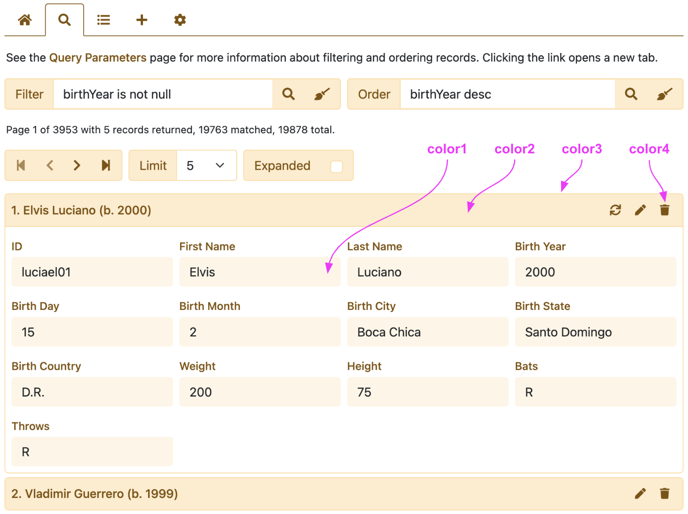

# HHDataList Guide

# User Interface

# Assistive Technology

# Authentication

# Error Messages

HHDataList passes *error* messages from underlying REST API responses to the specified website handler without processing the messages in any way. 

# Icons

# Information Messages

HHDataList generates an *information* message when a request returns successfully (200, 201, 204). The website specifies *for which method(s)* the website wants to receive *information* messages from HHDataList.

# Interfaces

# Internationalization

# Keyboard Usage

# Logging

# Tab Descriptions

# Tables vs Views

# Themes

