# HHDataList

HHDataList is a website UI component that interacts with REST APIs. The data list below, for example, is configured to interact with the [Hagenhaus REST API](/en/docs/hhrestapi/) which exposes the [Lahman Baseball Dataset](https://www.seanlahman.com/baseball-archive/statistics/):

You can incorporate HHDataList instances into your website and point them at REST APIs of your choosing. First, familiarize yourself with the user interface below, and then see the [Guide](/en/docs/hhdatalist/guide/).

# User interface

The HHDataList user interface is divided into four rows, and the Tabs Row is divided into five tabs. Note that the Tabs row appears above the other three rows which remain visible as the user clicks from tab to tab:

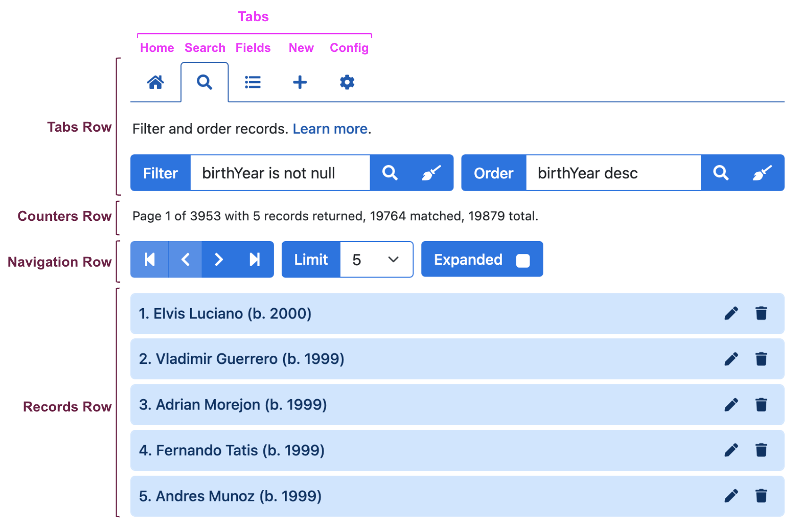

HHDataList [Options](/en/docs/hhdatalist/options/) influence the user interface. The *themes* option, for example, sets foreground, background, and border colors. And, the *queryParameters* option controls whether some UI tabs and/or items even appear. The sections below introduce the names of various UI items, and provide some sense of which options control which items. 

## Home tab

The Home tab, by default, is empty:

However, you can use the *tabDescriptions* option to display a description at the top of any tab:

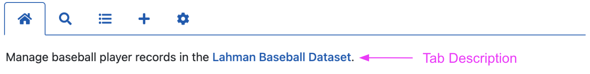

## Search tab

The Search tab, by default, does not appear:

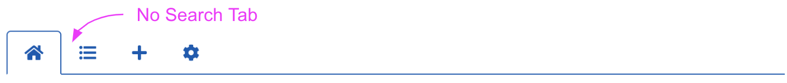

However, if you specify, in the *queryParameters* option, the *filter* property and/or the *order* property, then the Search tab appears with the Filter widget and/or the Order widget:

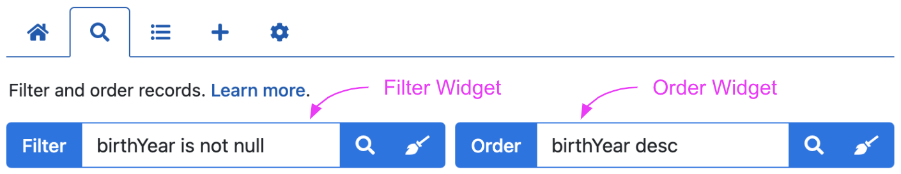

## Fields tab

The Fields tab, by default, does not appear:

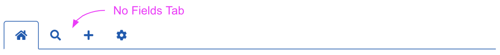

However, if you specify ...

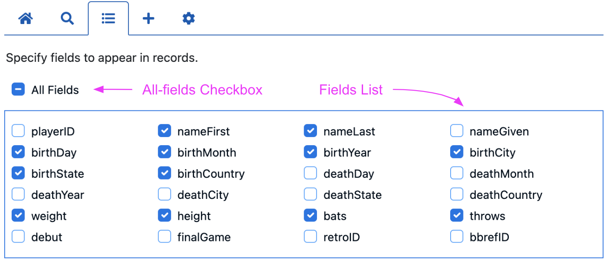

## New tab

The New tab ...

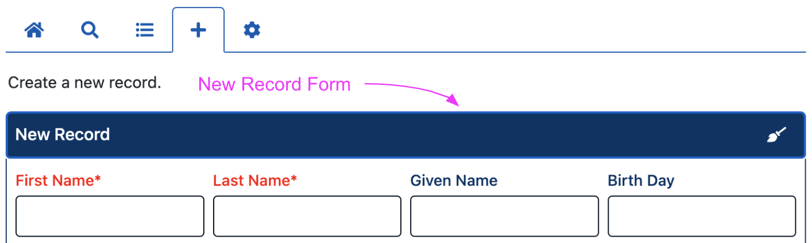

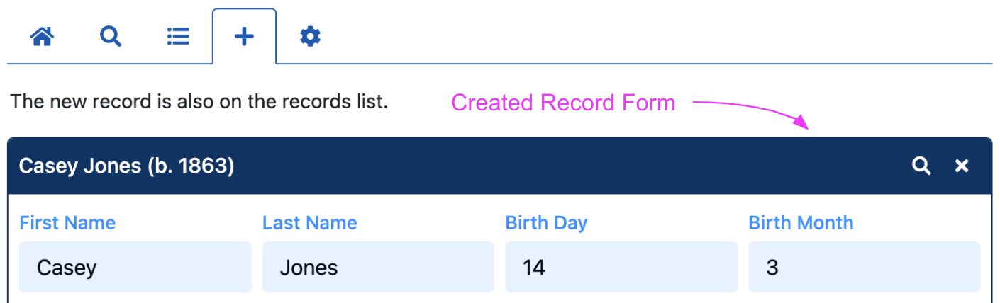

## Config tab

The Config tab ...

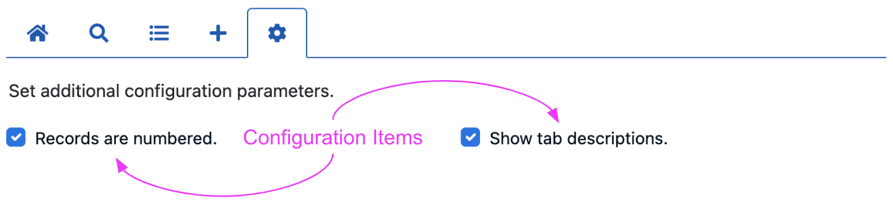

## Counters row

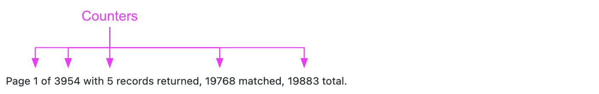

## Navigation row

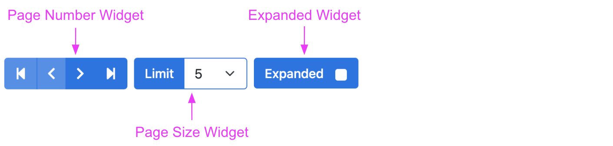

## Records row

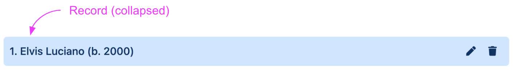

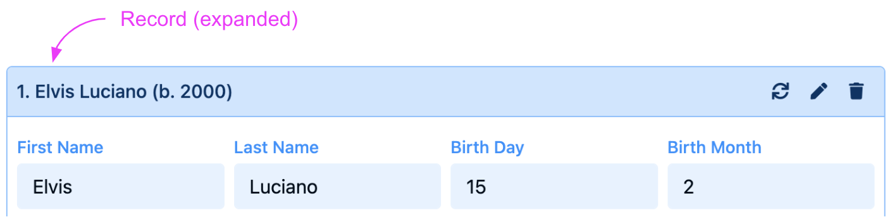

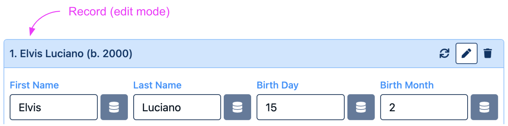

<!-- ## Player Stats

 -->