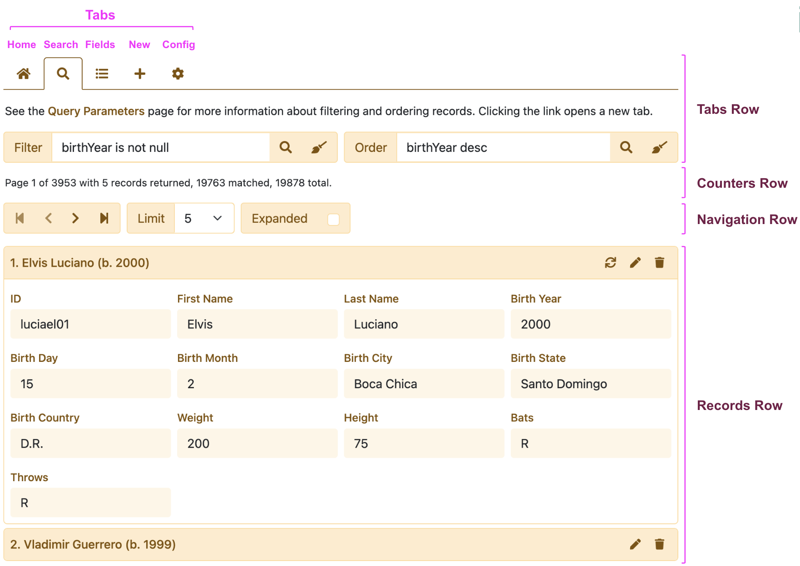

# HHDataList

HHDataList is a configurable website UI component that enables site visitors to access REST APIs.

# User Interface

# Releases

Each release should do the following:

1. Update dependencies to latest versions.