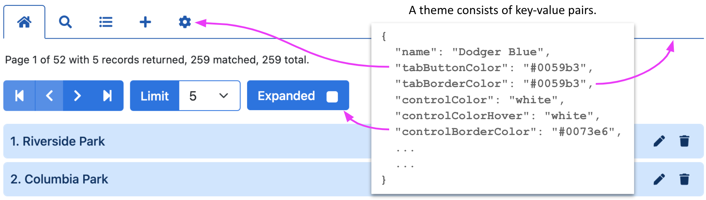
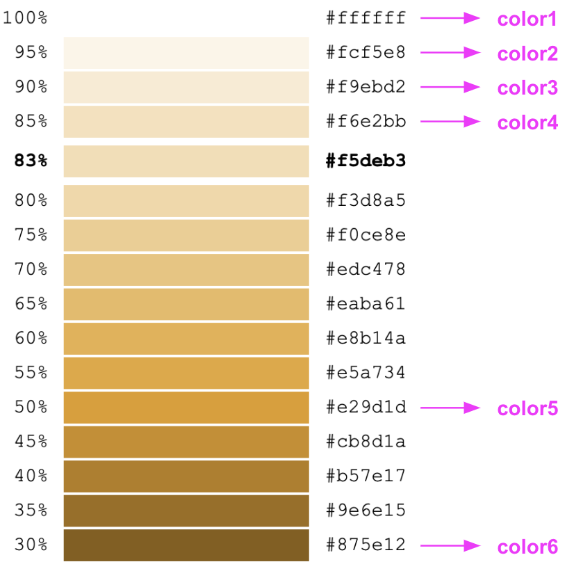
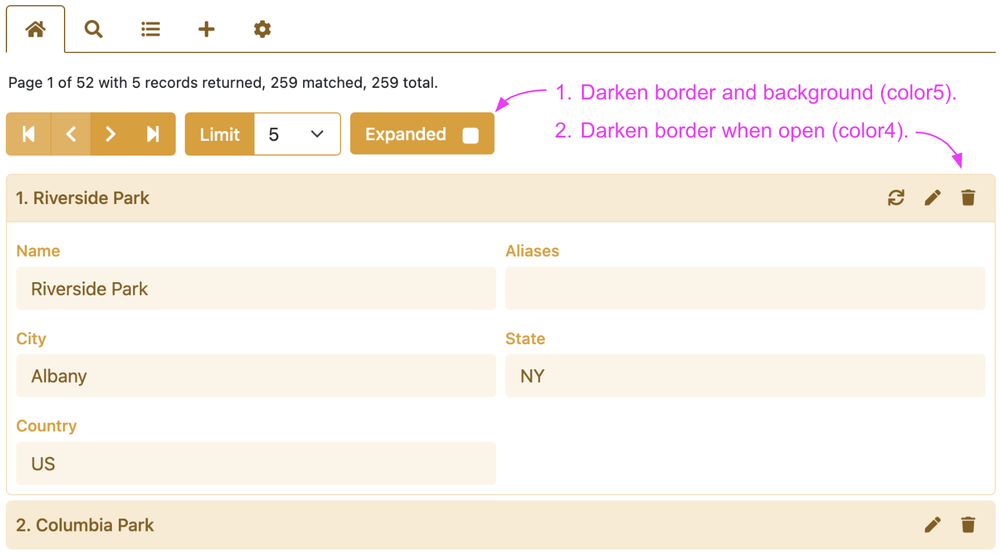
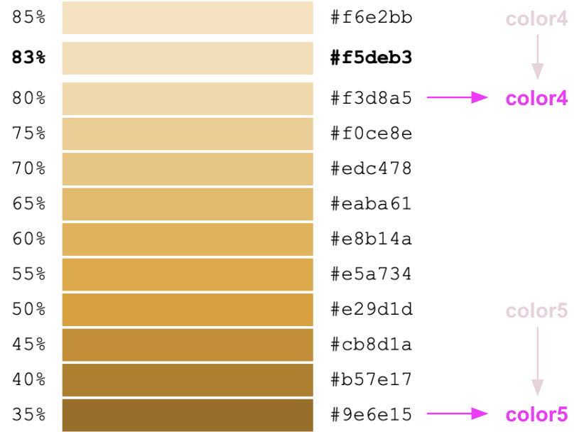
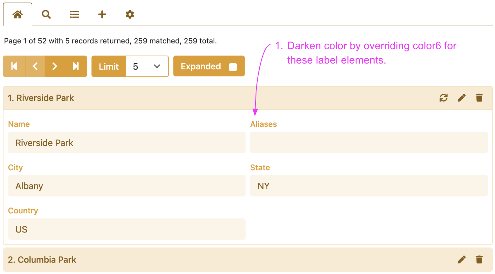
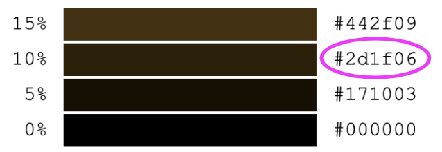
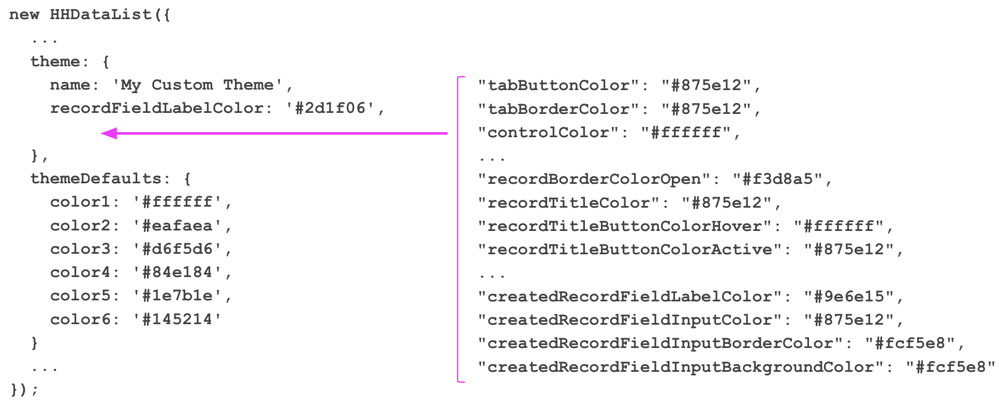

# HHDataList Themes

A theme consists of key-value pairs that specify colors for the HTML elements that make up an HHDataList instance:

<p></p>

HHDataList supports standard themes and custom themes. 

# Standard themes

You apply a standard theme to an HHDataList instance by setting the *theme* option equal to the theme name:

``` nonum
new HHDataList({
  theme: 'Silverberry',
});
```

Optionally, you can use the *themeOverrides* option to override one or more standard theme properties:

``` nonum
new HHDataList({
  theme: 'Silverberry',
  themeOverrides:{
    name: "My Silverberry Theme",
    tabButtonColor: 'maroon'
  },
});
```

You apply the default theme (i.e. *Dodger Blue*) by omitting the *theme* option:

``` nonum
new HHDataList({
  // No theme option.
});
```

HHDataList provides a set of standard themes reflected by the following list of HHDataList instances, all configured to access the same data about US baseball parks.

## Dodger Blue (default)

<div id="datalist-dodger-blue" class="hh-data-list"></div>

<script>
  new HHDataList({
    confirm: confirm,
    id: 'datalist-dodger-blue',
    recordFields: [
      { name: 'ID', label: 'ID', isChecked: false },
      { name: 'parkname', label: 'Name', isEditable: true, isRequired: true },
      { name: 'parkkey', label: 'Key', isEditable: true, isChecked: false },
      { name: 'parkalias', label: 'Aliases', isEditable: true },
      { name: 'city', label: 'City', isEditable: true },
      { name: 'state', label: 'State', isEditable: true },
      { name: 'country', label: 'Country', isEditable: true },
    ],
    recordIdField: 'ID',
    recordTitleFields: ['parkname'],
    reportError: (type, title, detail) => { reportError(type, title, detail); },
    reportInfo: (title, detail) => { reportInfo(title, detail); },
    reportWarning: (type, title, detail) => { reportWarning(type, title, detail); },
    url: 'http://localhost:8081/api/baseball/v1/parks',
  });
</script>

## Firebrick

<div id="datalist-firebrick" class="hh-data-list"></div>

<script>
  new HHDataList({
    confirm: confirm,
    id: 'datalist-firebrick',
    recordFields: [
      { name: 'ID', label: 'ID', isChecked: false },
      { name: 'parkname', label: 'Name', isEditable: true, isRequired: true },
      { name: 'parkkey', label: 'Key', isEditable: true, isChecked: false },
      { name: 'parkalias', label: 'Aliases', isEditable: true },
      { name: 'city', label: 'City', isEditable: true },
      { name: 'state', label: 'State', isEditable: true },
      { name: 'country', label: 'Country', isEditable: true },
    ],
    recordIdField: 'ID',
    recordTitleFields: ['parkname'],
    reportError: (type, title, detail) => { reportError(type, title, detail); },
    reportInfo: (title, detail) => { reportInfo(title, detail); },
    reportWarning: (type, title, detail) => { reportWarning(type, title, detail); },
    theme: {
      name: 'Firebrick'
    },
    themeDefaults: {
      color1: '#ffffff',
      color2: '#fbeaea',
      color3: '#f7d4d4',
      color4: '#f3bfbf',
      color5: '#da3e3e',
      color6: '#961d1d'
    },
    url: 'http://localhost:8081/api/baseball/v1/parks',
  });
</script>

## Forest Green

<div id="datalist-forest-green" class="hh-data-list"></div>

<script>
  new HHDataList({
    confirm: confirm,
    id: 'datalist-forest-green',
    recordFields: [
      { name: 'ID', label: 'ID', isChecked: false },
      { name: 'parkname', label: 'Name', isEditable: true, isRequired: true },
      { name: 'parkkey', label: 'Key', isEditable: true, isChecked: false },
      { name: 'parkalias', label: 'Aliases', isEditable: true },
      { name: 'city', label: 'City', isEditable: true },
      { name: 'state', label: 'State', isEditable: true },
      { name: 'country', label: 'Country', isEditable: true },
    ],
    recordIdField: 'ID',
    recordTitleFields: ['parkname'],
    reportError: (type, title, detail) => { reportError(type, title, detail); },
    reportInfo: (title, detail) => { reportInfo(title, detail); },
    reportWarning: (type, title, detail) => { reportWarning(type, title, detail); },
    theme: {
      name: 'Forest Green'
    },
    themeDefaults: {
      color1: '#ffffff',
      color2: '#eafaea',
      color3: '#d6f5d6',
      color4: '#c1f0c1',
      color5: '#239023',
      color6: '#145214'
    },
    url: 'http://localhost:8081/api/baseball/v1/parks',
  });
</script>

## Lemon Chiffon

<div id="datalist-lemon-chiffon" class="hh-data-list"></div>

<script>
  new HHDataList({
    confirm: confirm,
    id: 'datalist-lemon-chiffon',
    recordFields: [
      { name: 'ID', label: 'ID', isChecked: false },
      { name: 'parkname', label: 'Name', isEditable: true, isRequired: true },
      { name: 'parkkey', label: 'Key', isEditable: true, isChecked: false },
      { name: 'parkalias', label: 'Aliases', isEditable: true },
      { name: 'city', label: 'City', isEditable: true },
      { name: 'state', label: 'State', isEditable: true },
      { name: 'country', label: 'Country', isEditable: true },
    ],
    recordIdField: 'ID',
    recordTitleFields: ['parkname'],
    reportError: (type, title, detail) => { reportError(type, title, detail); },
    reportInfo: (title, detail) => { reportInfo(title, detail); },
    reportWarning: (type, title, detail) => { reportWarning(type, title, detail); },
    theme: {
      name: 'Lemon Chiffon'
    },
    themeDefaults: {
      color1: '#ffffff',
      color2: '#fffce6',
      color3: '#fff7b3',
      color4: '#fff280',
      color5: '#b3a100',
      color6: '#665c00'
    },
    url: 'http://localhost:8081/api/baseball/v1/parks',
  });
</script>

## Orangewood

<div id="datalist-orangewood" class="hh-data-list"></div>

<script>
  new HHDataList({
    confirm: confirm,
    id: 'datalist-orangewood',
    recordFields: [
      { name: 'ID', label: 'ID', isChecked: false },
      { name: 'parkname', label: 'Name', isEditable: true, isRequired: true },
      { name: 'parkkey', label: 'Key', isEditable: true, isChecked: false },
      { name: 'parkalias', label: 'Aliases', isEditable: true },
      { name: 'city', label: 'City', isEditable: true },
      { name: 'state', label: 'State', isEditable: true },
      { name: 'country', label: 'Country', isEditable: true },
    ],
    recordIdField: 'ID',
    recordTitleFields: ['parkname'],
    reportError: (type, title, detail) => { reportError(type, title, detail); },
    reportInfo: (title, detail) => { reportInfo(title, detail); },
    reportWarning: (type, title, detail) => { reportWarning(type, title, detail); },
    theme: {
      name: 'Orangewood'
    },
    themeDefaults: {
      color1: '#ffffff',
      color2: '#fff6e6',
      color3: '#ffedcc',
      color4: '#ffe4b3',
      color5: '#b37400',
      color6: '#805300'
    },
    url: 'http://localhost:8081/api/baseball/v1/parks',
  });
</script>

## Plum

<div id="datalist-plum" class="hh-data-list"></div>

<script>
  new HHDataList({
    confirm: confirm,
    id: 'datalist-plum',
    recordFields: [
      { name: 'ID', label: 'ID', isChecked: false },
      { name: 'parkname', label: 'Name', isEditable: true, isRequired: true },
      { name: 'parkkey', label: 'Key', isEditable: true, isChecked: false },
      { name: 'parkalias', label: 'Aliases', isEditable: true },
      { name: 'city', label: 'City', isEditable: true },
      { name: 'state', label: 'State', isEditable: true },
      { name: 'country', label: 'Country', isEditable: true },
    ],
    recordIdField: 'ID',
    recordTitleFields: ['parkname'],
    reportError: (type, title, detail) => { reportError(type, title, detail); },
    reportInfo: (title, detail) => { reportInfo(title, detail); },
    reportWarning: (type, title, detail) => { reportWarning(type, title, detail); },
    theme: {
      name: 'Plum'
    },
    themeDefaults: {
      color1: '#ffffff',
      color2: '#f8ecf8',
      color3: '#f1daf1',
      color4: '#ebc7eb',
      color5: '#963696',
      color6: '#702970'
    },
    url: 'http://localhost:8081/api/baseball/v1/parks',
  });
</script>

## Rainbow

<div id="datalist-rainbow" class="hh-data-list"></div>

<script>
  new HHDataList({
    confirm: confirm,
    id: 'datalist-rainbow',
    recordFields: [
      { name: 'ID', label: 'ID', isChecked: false },
      { name: 'parkname', label: 'Name', isEditable: true, isRequired: true },
      { name: 'parkkey', label: 'Key', isEditable: true, isChecked: false },
      { name: 'parkalias', label: 'Aliases', isEditable: true },
      { name: 'city', label: 'City', isEditable: true },
      { name: 'state', label: 'State', isEditable: true },
      { name: 'country', label: 'Country', isEditable: true },
    ],
    recordIdField: 'ID',
    recordTitleFields: ['parkname'],
    reportError: (type, title, detail) => { reportError(type, title, detail); },
    reportInfo: (title, detail) => { reportInfo(title, detail); },
    reportWarning: (type, title, detail) => { reportWarning(type, title, detail); },
    theme: {
      name: 'Rainbow',
      recordTitleColor: '#006600',
      recordTitleButtonColor: 'steelblue',
      recordBorderColorOpen: 'green',
      recordFieldLabelColor: '#006600',
      recordFieldInputColorDisabled: 'black',
      recordFieldInputBorderColorDisabled: '#fff0ff',
      recordFieldInputBackgroundColorDisabled: '#fff0ff'
    },
    themeDefaults: {
      color1: '#ffffff',
      color2: '#eafaea',
      color3: '#ffff99',
      color4: '#c1f0c1',
      color5: 'orange',
      color6: 'red'
    },
    url: 'http://localhost:8081/api/baseball/v1/parks',
  });
</script>

## Seagreen

<div id="datalist-seagreen" class="hh-data-list"></div>

<script>
  new HHDataList({
    confirm: confirm,
    id: 'datalist-seagreen',
    recordFields: [
      { name: 'ID', label: 'ID', isChecked: false },
      { name: 'parkname', label: 'Name', isEditable: true, isRequired: true },
      { name: 'parkkey', label: 'Key', isEditable: true, isChecked: false },
      { name: 'parkalias', label: 'Aliases', isEditable: true },
      { name: 'city', label: 'City', isEditable: true },
      { name: 'state', label: 'State', isEditable: true },
      { name: 'country', label: 'Country', isEditable: true },
    ],
    recordIdField: 'ID',
    recordTitleFields: ['parkname'],
    reportError: (type, title, detail) => { reportError(type, title, detail); },
    reportInfo: (title, detail) => { reportInfo(title, detail); },
    reportWarning: (type, title, detail) => { reportWarning(type, title, detail); },
    theme: {
      name: 'Seagreen'
    },
    themeDefaults: {
      color1: '#ffffff',
      color2: '#e6fff7',
      color3: '#ccffee',
      color4: '#b3ffe6',
      color5: '#00cc88',
      color6: '#008055'
    },
    url: 'http://localhost:8081/api/baseball/v1/parks',
  });
</script>

## Shadowbox

<div id="datalist-shadowbox" class="hh-data-list"></div>

<script>
  new HHDataList({
    confirm: confirm,
    id: 'datalist-shadowbox',
    recordFields: [
      { name: 'ID', label: 'ID', isChecked: false },
      { name: 'parkname', label: 'Name', isEditable: true, isRequired: true },
      { name: 'parkkey', label: 'Key', isEditable: true, isChecked: false },
      { name: 'parkalias', label: 'Aliases', isEditable: true },
      { name: 'city', label: 'City', isEditable: true },
      { name: 'state', label: 'State', isEditable: true },
      { name: 'country', label: 'Country', isEditable: true },
    ],
    recordIdField: 'ID',
    recordTitleFields: ['parkname'],
    reportError: (type, title, detail) => { reportError(type, title, detail); },
    reportInfo: (title, detail) => { reportInfo(title, detail); },
    reportWarning: (type, title, detail) => { reportWarning(type, title, detail); },
    theme: {
      name: 'Shadowbox',
      recordTitleButtonColor: 'white',
      recordTitleButtonColorHover: '#404040',
      recordTitleButtonBackgroundColorHover: 'white',
      recordTitleColor: 'white'
    },
    themeDefaults: {
      color1: '#ffffff',
      color2: '#f1f1f1',
      color3: '#404040',
      color4: '#404040',
      color5: '#404040',
      color6: '#262626'
    },
    url: 'http://localhost:8081/api/baseball/v1/parks',
  });
</script>

## Shoreline

<div id="datalist-showline" class="hh-data-list"></div>

<script>
  new HHDataList({
    confirm: confirm,
    id: 'datalist-showline',
    recordFields: [
      { name: 'ID', label: 'ID', isChecked: false },
      { name: 'parkname', label: 'Name', isEditable: true, isRequired: true },
      { name: 'parkkey', label: 'Key', isEditable: true, isChecked: false },
      { name: 'parkalias', label: 'Aliases', isEditable: true },
      { name: 'city', label: 'City', isEditable: true },
      { name: 'state', label: 'State', isEditable: true },
      { name: 'country', label: 'Country', isEditable: true },
    ],
    recordIdField: 'ID',
    recordTitleFields: ['parkname'],
    reportError: (type, title, detail) => { reportError(type, title, detail); },
    reportInfo: (title, detail) => { reportInfo(title, detail); },
    reportWarning: (type, title, detail) => { reportWarning(type, title, detail); },
    theme: {
      name: 'Shoreline',
      controlColor: '#008055',
      controlButtonColor: '',
      controlBackgroundColor: 'white',
      recordBorderColor: '#00b377',
      recordBorderColorHover: '#00b377'
    },
    themeDefaults: {
      color1: '#ffffff',
      color2: '#e6fff7',
      color3: 'white',
      color4: '#00b377',
      color5: '#008055',
      color6: '#008055'
    },
    url: 'http://localhost:8081/api/baseball/v1/parks',
  });
</script>

## Silverberry

<div id="datalist-silverberry" class="hh-data-list"></div>

<script>
  new HHDataList({
    confirm: confirm,
    id: 'datalist-silverberry',
    recordFields: [
      { name: 'ID', label: 'ID', isChecked: false },
      { name: 'parkname', label: 'Name', isEditable: true, isRequired: true },
      { name: 'parkkey', label: 'Key', isEditable: true, isChecked: false },
      { name: 'parkalias', label: 'Aliases', isEditable: true },
      { name: 'city', label: 'City', isEditable: true },
      { name: 'state', label: 'State', isEditable: true },
      { name: 'country', label: 'Country', isEditable: true },
    ],
    recordIdField: 'ID',
    recordTitleFields: ['parkname'],
    reportError: (type, title, detail) => { reportError(type, title, detail); },
    reportInfo: (title, detail) => { reportInfo(title, detail); },
    reportWarning: (type, title, detail) => { reportWarning(type, title, detail); },
    theme: {
      name: 'Silverberry'
    },
    themeDefaults: {
      color1: '#ffffff',
      color2: '#f1f1f1',
      color3: '#f2f2f2',
      color4: '#e6e6e6',
      color5: '#8c8c8c',
      color6: '#4d4d4d'
    },
    url: 'http://localhost:8081/api/baseball/v1/parks',
  });
</script>

## Teal Ribbon

<div id="datalist-teal-ribbon" class="hh-data-list"></div>

<script>
  new HHDataList({
    confirm: confirm,
    id: 'datalist-teal-ribbon',
    recordFields: [
      { name: 'ID', label: 'ID', isChecked: false },
      { name: 'parkname', label: 'Name', isEditable: true, isRequired: true },
      { name: 'parkkey', label: 'Key', isEditable: true, isChecked: false },
      { name: 'parkalias', label: 'Aliases', isEditable: true },
      { name: 'city', label: 'City', isEditable: true },
      { name: 'state', label: 'State', isEditable: true },
      { name: 'country', label: 'Country', isEditable: true },
    ],
    recordIdField: 'ID',
    recordTitleFields: ['parkname'],
    reportError: (type, title, detail) => { reportError(type, title, detail); },
    reportInfo: (title, detail) => { reportInfo(title, detail); },
    reportWarning: (type, title, detail) => { reportWarning(type, title, detail); },
    theme: {
      name: 'Teal Ribbon'
    },
    themeDefaults: {
      color1: '#ffffff',
      color2: '#e6ffff',
      color3: '#99ffff',
      color4: '#80ffff',
      color5: '#008080',
      color6: '#004d4d'
    },
    url: 'http://localhost:8081/api/baseball/v1/parks',
  });
</script>

## Thistle

<div id="datalist-thistle" class="hh-data-list"></div>

<script>
  new HHDataList({
    confirm: confirm,
    id: 'datalist-thistle',
    recordFields: [
      { name: 'ID', label: 'ID', isChecked: false },
      { name: 'parkname', label: 'Name', isEditable: true, isRequired: true },
      { name: 'parkkey', label: 'Key', isEditable: true, isChecked: false },
      { name: 'parkalias', label: 'Aliases', isEditable: true },
      { name: 'city', label: 'City', isEditable: true },
      { name: 'state', label: 'State', isEditable: true },
      { name: 'country', label: 'Country', isEditable: true },
    ],
    recordIdField: 'ID',
    recordTitleFields: ['parkname'],
    reportError: (type, title, detail) => { reportError(type, title, detail); },
    reportInfo: (title, detail) => { reportInfo(title, detail); },
    reportWarning: (type, title, detail) => { reportWarning(type, title, detail); },
    theme: {
      name: 'Thistle'
    },
    themeDefaults: {
      color1: '#ffffff',
      color2: '#f5eff5',
      color3: '#ecdfec',
      color4: '#e2d0e2',
      color5: '#7e4e7e',
      color6: '#5f3a5f'
    },
    url: 'http://localhost:8081/api/baseball/v1/parks',
  });
</script>

## Wheatgerm

<div id="datalist-wheatgerm" class="hh-data-list"></div>

<script>
  new HHDataList({
    confirm: confirm,
    id: 'datalist-wheatgerm',
    recordFields: [
      { name: 'ID', label: 'ID', isChecked: false },
      { name: 'parkname', label: 'Name', isEditable: true, isRequired: true },
      { name: 'parkkey', label: 'Key', isEditable: true, isChecked: false },
      { name: 'parkalias', label: 'Aliases', isEditable: true },
      { name: 'city', label: 'City', isEditable: true },
      { name: 'state', label: 'State', isEditable: true },
      { name: 'country', label: 'Country', isEditable: true },
    ],
    recordIdField: 'ID',
    recordTitleFields: ['parkname'],
    reportError: (type, title, detail) => { reportError(type, title, detail); },
    reportInfo: (title, detail) => { reportInfo(title, detail); },
    reportWarning: (type, title, detail) => { reportWarning(type, title, detail); },
    theme: {
      name: 'Wheatgerm'
    },
    themeDefaults: {
      color1: '#ffffff',
      color2: '#fcf5e8',
      color3: '#f9ebd2',
      color4: '#f6e2bb',
      color5: '#e29d1d',
      color6: '#875e12'
    },
    url: 'http://localhost:8081/api/baseball/v1/parks',
  });
</script>

# Custom themes

Typically, building a custom theme is an iterative process. Below is one approach.

## Establish defaults

1. Set the *theme* option equal to an object:

    ``` nonum
    new HHDataList({
      ...
      theme: {}
      ...
    });
    ```

1. Choose a name for your new custom theme:

    ``` nonum
    new HHDataList({
      ...
      theme: {
        name: 'My Custom Theme'
      }
      ...
    });
    ```

1. Choose a color family like [Wheat](https://www.w3schools.com/colors/colors_picker.asp?colorhex=F5DEB3), and choose six colors from the family. As a baseline, choose white for color1, light colors for color2, color3, and color4, a medium color for color5, and a somewhat darker color for color6:

    <p></p>

1. Pass these choices to the HHDataList constructor using the *themeDefaults* option:

    ``` nonum
    new HHDataList({
      ...
      theme: {
        name: 'My Custom Theme'
      },
      themeDefaults: {
        color1: '#ffffff',
        color2: '#fcf5e8',
        color3: '#f9ebd2',
        color4: '#f6e2bb',
        color5: '#e29d1d',
        color6: '#875e12'
      }
      ...
    });
    ```

    **Note**: If you omit the *themeDefaults* option, or if you omit any of the color properties, HHDataList makes up the difference with shades of blue.

1. Reload the page.

After completing these steps, the colors of your HHDataList instance should resemble the following:

<div id="datalist-custom-1" class="hh-data-list"></div>

<script>
  new HHDataList({
    confirm: confirm,
    id: 'datalist-custom-1',
    recordFields: [
      { name: 'ID', label: 'ID', isChecked: false },
      { name: 'parkname', label: 'Name', isEditable: true, isRequired: true },
      { name: 'parkkey', label: 'Key', isEditable: true, isChecked: false },
      { name: 'parkalias', label: 'Aliases', isEditable: true },
      { name: 'city', label: 'City', isEditable: true },
      { name: 'state', label: 'State', isEditable: true },
      { name: 'country', label: 'Country', isEditable: true },
    ],
    recordIdField: 'ID',
    recordTitleFields: ['parkname'],
    reportError: (type, title, detail) => { reportError(type, title, detail); },
    reportInfo: (title, detail) => { reportInfo(title, detail); },
    reportWarning: (type, title, detail) => { reportWarning(type, title, detail); },
    theme: {
      name: 'My Custom Theme'
    },
    themeDefaults: {
      color1: '#ffffff',
      color2: '#fcf5e8',
      color3: '#f9ebd2',
      color4: '#f6e2bb',
      color5: '#e29d1d',
      color6: '#875e12'
    },
    url: 'http://localhost:8081/api/baseball/v1/parks',
  });
</script>

## Modify defaults

1. Decide if you like the default colors. For the sake of the example, let's decide to make the following changes:

    <p></p>

1. Decide which new colors to use:

    <p></p>

1. Modify the color4 and color5 properties of the *themeDefaults* object:

    ``` nonum
    new HHDataList({
      ...
      theme: {
        name: 'My Custom Theme'
      },
      themeDefaults: {
        color1: '#ffffff',
        color2: '#eafaea',
        color3: '#d6f5d6',
        color4: '#84e184',
        color5: '#1e7b1e',
        color6: '#145214'
      }
      ...
    });
    ```

1. Reload the page.

After completing these steps, the colors of your HHDataList instance should resemble the instance below. Be sure to open a record and verify the darker border.

<div id="datalist-custom-2" class="hh-data-list"></div>

<script>
  new HHDataList({
    confirm: confirm,
    id: 'datalist-custom-2',
    recordFields: [
      { name: 'ID', label: 'ID', isChecked: false },
      { name: 'parkname', label: 'Name', isEditable: true, isRequired: true },
      { name: 'parkkey', label: 'Key', isEditable: true, isChecked: false },
      { name: 'parkalias', label: 'Aliases', isEditable: true },
      { name: 'city', label: 'City', isEditable: true },
      { name: 'state', label: 'State', isEditable: true },
      { name: 'country', label: 'Country', isEditable: true },
    ],
    recordIdField: 'ID',
    recordTitleFields: ['parkname'],
    reportError: (type, title, detail) => { reportError(type, title, detail); },
    reportInfo: (title, detail) => { reportInfo(title, detail); },
    reportWarning: (type, title, detail) => { reportWarning(type, title, detail); },
    theme: {
      name: 'My Custom Theme'
    },
    themeDefaults: {
      color1: '#ffffff',
      color2: '#fcf5e8',
      color3: '#f9ebd2',
      color4: '#f3d8a5',
      color5: '#9e6e15',
      color6: '#875e12'
    },
    url: 'http://localhost:8081/api/baseball/v1/parks',
  });
</script>

## Override defaults

1. Decide if you want to explicitly set the default foreground, background, or border color of any particular html elements, thereby overriding the defaults for those elements. For the sake of the example, let's decide to make the following change:

    <p></p>

1. Decide which new color to use:

    <p></p>

1. Explicitly set that color for *recordFieldLabelColor*, overriding color6:

    ``` nonum
    new HHDataList({
      ...
      theme: {
        name: 'My Custom Theme',
        recordFieldLabelColor: '#2d1f06'
      },
      themeDefaults: {
        color1: '#ffffff',
        color2: '#eafaea',
        color3: '#d6f5d6',
        color4: '#84e184',
        color5: '#1e7b1e',
        color6: '#145214'
      }
      ...
    });
    ```

1. Reload the page.

After completing these steps, open a record and verify that the field labels are darker as in the instance below:

<div id="datalist-custom-3" class="hh-data-list"></div>

<script>
  new HHDataList({
    confirm: confirm,
    id: 'datalist-custom-3',
    recordFields: [
      { name: 'ID', label: 'ID', isChecked: false },
      { name: 'parkname', label: 'Name', isEditable: true, isRequired: true },
      { name: 'parkkey', label: 'Key', isEditable: true, isChecked: false },
      { name: 'parkalias', label: 'Aliases', isEditable: true },
      { name: 'city', label: 'City', isEditable: true },
      { name: 'state', label: 'State', isEditable: true },
      { name: 'country', label: 'Country', isEditable: true },
    ],
    recordIdField: 'ID',
    recordTitleFields: ['parkname'],
    reportError: (type, title, detail) => { reportError(type, title, detail); },
    reportInfo: (title, detail) => { reportInfo(title, detail); },
    reportWarning: (type, title, detail) => { reportWarning(type, title, detail); },
    // reportTheme: (theme) => {console.log(JSON.stringify(theme, null, 2));},
    theme: {
      name: 'My Custom Theme',
      recordFieldLabelColor: '#2d1f06'
    },
    themeDefaults: {
      color1: '#ffffff',
      color2: '#fcf5e8',
      color3: '#f9ebd2',
      color4: '#f3d8a5',
      color5: '#9e6e15',
      color6: '#875e12'
    },
    url: 'http://localhost:8081/api/baseball/v1/parks',
  });
</script>

## Generate a theme

Perhaps you plan to explicitly set the colors of all (or a significant number of) html elements:

<p></p>

In this case, you can do the following:

1. Use the *reportTheme* option to generate the theme, and output it to the console:

    ``` nonum
    new HHDataList({
      reportTheme: (theme) => {console.log(JSON.stringify(theme, null, 2));},
      theme: {
        name: 'My Custom Theme',
        recordFieldLabelColor: '#2d1f06'
      },
      themeDefaults: {
        color1: '#ffffff',
        color2: '#fcf5e8',
        color3: '#f9ebd2',
        color4: '#f3d8a5',
        color5: '#9e6e15',
        color6: '#875e12'
      },
    });
    ```

    Here is an example:

    ``` nonum
    {
      "name": "My Custom Theme",
      "recordFieldLabelColor": "#2d1f06",
      "tabButtonColor": "#875e12",
      "tabBorderColor": "#875e12",
      "controlColor": "#ffffff",
      "controlColorHover": "#ffffff",
      "controlBorderColor": "#9e6e15",
      "controlBorderColorHover": "#875e12",
      "controlBackgroundColor": "#9e6e15",
      "controlBackgroundColorHover": "#875e12",
      "controlOpacityDisabled": "80%",
      "descriptionLinkColor": "#875e12",
      "descriptionLinkColorHover": "#9e6e15",
      "checkboxLabelColor": "#875e12",
      "checkboxBorderColor": "#f3d8a5",
      "checkboxBorderColorChecked": "#875e12",
      "checkboxBackgroundColor": "#ffffff",
      "checkboxBackgroundColorChecked": "#875e12",
      "expanderCheckboxBorderColor": "#9e6e15",
      "expanderCheckboxBorderColorChecked": "#ffffff",
      "expanderCheckboxBackgroundColor": "#ffffff",
      "expanderCheckboxBackgroundColorChecked": "#875e12",
      "recordBorderColor": "#f9ebd2",
      "recordBorderColorHover": "#f9ebd2",
      "recordBorderColorOpen": "#f3d8a5",
      "recordTitleColor": "#875e12",
      "recordTitleBackgroundColor": "#f9ebd2",
      "recordTitleButtonColor": "#875e12",
      "recordTitleButtonColorHover": "#ffffff",
      "recordTitleButtonColorActive": "#875e12",
      "recordTitleButtonBorderColor": "transparent",
      "recordTitleButtonBorderColorHover": "#875e12",
      "recordTitleButtonBorderColorActive": "#875e12",
      "recordTitleButtonBackgroundColor": "transparent",
      "recordTitleButtonBackgroundColorHover": "#875e12",
      "recordTitleButtonBackgroundColorActive": "#ffffff",
      "recordFieldInputColor": "#875e12",
      "recordFieldInputColorDisabled": "#875e12",
      "recordFieldInputBorderColor": "#875e12",
      "recordFieldInputBorderColorDisabled": "#fcf5e8",
      "recordFieldInputBackgroundColor": "#ffffff",
      "recordFieldInputBackgroundColorDisabled": "#fcf5e8",
      "recordFieldButtonColor": "#ffffff",
      "recordFieldButtonBorderColor": "#875e12",
      "recordFieldButtonBackgroundColor": "#875e12",
      "recordFieldButtonOpacityDisabled": "65%",
      "newRecordBorderColor": "#875e12",
      "newRecordBorderColorHover": "#875e12",
      "newRecordBorderColorOpen": "#875e12",
      "newRecordTitleColor": "#ffffff",
      "newRecordTitleBackgroundColor": "#875e12",
      "newRecordTitleButtonColor": "#ffffff",
      "newRecordTitleButtonColorHover": "#875e12",
      "newRecordTitleButtonBorderColor": "transparent",
      "newRecordTitleButtonBorderColorHover": "#ffffff",
      "newRecordTitleButtonBackgroundColor": "transparent",
      "newRecordTitleButtonBackgroundColorHover": "#ffffff",
      "newRecordFieldLabelColor": "#875e12",
      "newRecordFieldLabelColorRequired": "#9e6e15",
      "newRecordFieldInputColor": "#875e12",
      "newRecordFieldInputBorderColor": "#875e12",
      "newRecordFieldInputBackgroundColor": "#ffffff",
      "newRecordSubmitButtonColor": "#ffffff",
      "newRecordSubmitButtonColorHover": "#ffffff",
      "newRecordSubmitButtonBorderColor": "#9e6e15",
      "newRecordSubmitButtonBorderColorHover": "#875e12",
      "newRecordSubmitButtonBackgroundColor": "#9e6e15",
      "newRecordSubmitButtonBackgroundColorHover": "#875e12",
      "createdRecordBorderColor": "#875e12",
      "createdRecordBorderColorHover": "#875e12",
      "createdRecordBorderColorOpen": "#875e12",
      "createdRecordTitleColor": "#ffffff",
      "createdRecordTitleBackgroundColor": "#875e12",
      "createdRecordTitleButtonColor": "#ffffff",
      "createdRecordTitleButtonColorHover": "#875e12",
      "createdRecordTitleButtonBorderColor": "transparent",
      "createdRecordTitleButtonBorderColorHover": "#ffffff",
      "createdRecordTitleButtonBackgroundColor": "transparent",
      "createdRecordTitleButtonBackgroundColorHover": "#ffffff",
      "createdRecordFieldLabelColor": "#9e6e15",
      "createdRecordFieldInputColor": "#875e12",
      "createdRecordFieldInputBorderColor": "#fcf5e8",
      "createdRecordFieldInputBackgroundColor": "#fcf5e8"
    }
    ```

1. Copy the theme from the console, and paste it, or portions of it, into the *theme* option object:

    ``` nonum
    new HHDataList({
      // reportTheme: (theme) => {console.log(JSON.stringify(theme, null, 2));},
      theme: {
        name: 'My Custom Theme',
        recordFieldLabelColor: '#2d1f06'
        tabButtonColor: '#875e12',
        tabBorderColor: '#875e12',
        controlColor: '#ffffff',
        recordBorderColorOpen: '#f3d8a5',
        recordTitleColor: '#875e12',
        recordTitleButtonColorHover: '#ffffff',
        recordTitleButtonColorActive: '#875e12',
        createdRecordFieldLabelColor: '#9e6e15',
        createdRecordFieldInputColor: '#875e12',
        createdRecordFieldInputBorderColor: '#fcf5e8',
        createdRecordFieldInputBackgroundColor: '#fcf5e8
      },
      themeDefaults: {
        color1: '#ffffff',
        color2: '#fcf5e8',
        color3: '#f9ebd2',
        color4: '#f3d8a5',
        color5: '#9e6e15',
        color6: '#875e12'
      },
    });
    ```

1. Modify the values for the new theme properties (and reload) iteratively as you fine-tune your theme.

1. If you delete your *themeDefaults* option, HHDataList will use its default *themeDefaults* option consisting of blue shades for any non-overridden colors:

    ``` nonum
    new HHDataList({
      theme: {
        name: 'My Custom Theme',
        recordFieldLabelColor: '#2d1f06',
        tabButtonColor: '#875e12',
        tabBorderColor: '#875e12',
        ...
        ...
        createdRecordFieldInputColor: '#875e12',
        createdRecordFieldInputBorderColor: '#fcf5e8',
        createdRecordFieldInputBackgroundColor: '#fcf5e8'
      },
    });
    ```

# Color domains

## color1

## color2

## color3

## color4

## color5

## color6

|Theme Object Key|Default Value|
|-|-|
|tabButtonColor|color6|
|tabBorderColor|color6|
|controlColor|color1|
|controlColorHover|color1|
|controlBorderColor|color5|
|controlBorderColorHover|color6|
|controlBackgroundColor|color5|
|controlBackgroundColorHover|color6|
|controlOpacityDisabled|80%|
|descriptionLinkColor|color6|
|descriptionLinkColorHover|color5|
|checkboxLabelColor|color6|
|checkboxBorderColor|color4|
|checkboxBorderColorChecked|color6|
|checkboxBackgroundColor|color1|
|checkboxBackgroundColorChecked|color6|
|expanderCheckboxBorderColor|color5|
|expanderCheckboxBorderColorChecked|color1|
|expanderCheckboxBackgroundColor|color1|
|expanderCheckboxBackgroundColorChecked|color6|
|recordBorderColor|color3|
|recordBorderColorHover|color3|
|recordBorderColorOpen|color4|
|recordTitleColor|color6|
|recordTitleBackgroundColor|color3|
|recordTitleButtonColor|color6|
|recordTitleButtonColorHover|color1|
|recordTitleButtonColorActive|color6|
|recordTitleButtonBorderColor|transparent|
|recordTitleButtonBorderColorHover|color6|
|recordTitleButtonBorderColorActive|color6|
|recordTitleButtonBackgroundColor|transparent|
|recordTitleButtonBackgroundColorHover|color6|
|recordTitleButtonBackgroundColorActive|color1|
|recordFieldLabelColor|color5|
|recordFieldInputColor|color6|
|recordFieldInputColorDisabled|color6|
|recordFieldInputBorderColor|color6|
|recordFieldInputBorderColorDisabled|color2|
|recordFieldInputBackgroundColor|color1|
|recordFieldInputBackgroundColorDisabled|color2|
|recordFieldButtonColor|color1|
|recordFieldButtonBorderColor|color6|
|recordFieldButtonBackgroundColor|color6|
|recordFieldButtonOpacityDisabled|65%|
|newRecordBorderColor|color6|
|newRecordBorderColorHover|color6|
|newRecordBorderColorOpen|color6|
|newRecordTitleColor|color1|
|newRecordTitleBackgroundColor|color6|
|newRecordTitleButtonColor|color1|
|newRecordTitleButtonColorHover|color6|
|newRecordTitleButtonBorderColor|transparent|
|newRecordTitleButtonBorderColorHover|color1|
|newRecordTitleButtonBackgroundColor|transparent|
|newRecordTitleButtonBackgroundColorHover|color1|
|newRecordFieldLabelColor|color6|
|newRecordFieldLabelColorRequired|color5|
|newRecordFieldInputColor|color6|
|newRecordFieldInputBorderColor|color6|
|newRecordFieldInputBackgroundColor|color1|
|newRecordSubmitButtonColor|color1|
|newRecordSubmitButtonColorHover|color1|
|newRecordSubmitButtonBorderColor|color5|
|newRecordSubmitButtonBorderColorHover|color6|
|newRecordSubmitButtonBackgroundColor|color5|
|newRecordSubmitButtonBackgroundColorHover|color6|
|createdRecordBorderColor|color6|
|createdRecordBorderColorHover|color6|
|createdRecordBorderColorOpen|color6|
|createdRecordTitleColor|color1|
|createdRecordTitleBackgroundColor|color6|
|createdRecordTitleButtonColor|color1|
|createdRecordTitleButtonColorHover|color6|
|createdRecordTitleButtonBorderColor|transparent|
|createdRecordTitleButtonBorderColorHover|color1|
|createdRecordTitleButtonBackgroundColor|transparent|
|createdRecordTitleButtonBackgroundColorHover|color1|
|createdRecordFieldLabelColor|color5|
|createdRecordFieldInputColor|color6|
|createdRecordFieldInputBorderColor|color2|
|createdRecordFieldInputBackgroundColor|color2|

# Notes

1. State is tacked onto the end of a theme object property name.
1. Checks in checkboxes are always white.
1. Use the *themes* option to build a select element for the user.
1. See [Programmatically Lighten or Darken a hex color](https://stackoverflow.com/questions/5560248/programmatically-lighten-or-darken-a-hex-color-or-rgb-and-blend-colors).
1. See [How to Calculate Lighter or Darker Hex Colors in JavaScript](https://www.sitepoint.com/javascript-generate-lighter-darker-color/).

