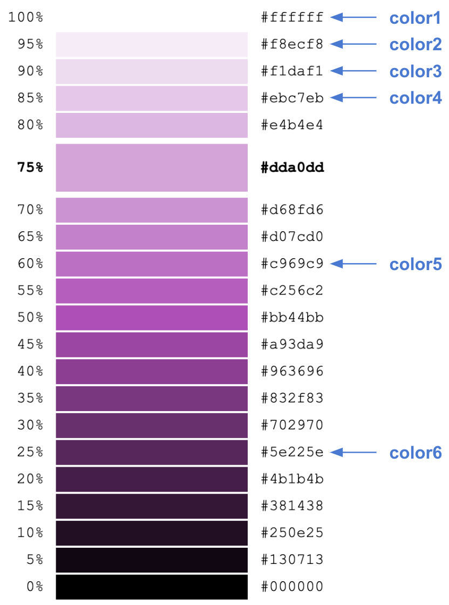

# HHDataList Themes

A theme consists of key-value pairs that specify colors for the HTML elements that make up an HHDataList instance:

<p></p>

HHDataList supports standard themes and custom themes. 

# Standard themes

You apply a standard theme to an HHDataList instance by setting the *theme* option equal to the theme name:

``` nonum
new HHDataList({
  theme: 'Silverberry',
});
```

Optionally, you can use the *themeOverrides* option to override one or more standard theme properties:

``` nonum
new HHDataList({
  theme: 'Silverberry',
  themeOverrides:{
    name: "My Silverberry Theme",
    tabButtonColor: 'maroon'
  },
});
```

Omitting the *theme* option applies the standard theme (i.e. *Dodger Blue*):

``` nonum
new HHDataList({
  // No theme option.
});
```

HHDataList provides a set of standard themes reflected by the following HHDataList instances configured to access data about US baseball parks.

## Dodger Blue (default)

<div id="datalist-dodger-blue" class="hh-data-list"></div>

<script>
  new HHDataList({
    confirm: confirm,
    id: 'datalist-dodger-blue',
    recordFields: [
      { name: 'ID', label: 'ID', isChecked: false },
      { name: 'parkname', label: 'Name', isEditable: true, isRequired: true },
      { name: 'parkkey', label: 'Key', isEditable: true, isChecked: false },
      { name: 'parkalias', label: 'Aliases', isEditable: true },
      { name: 'city', label: 'City', isEditable: true },
      { name: 'state', label: 'State', isEditable: true },
      { name: 'country', label: 'Country', isEditable: true },
    ],
    recordIdField: 'ID',
    recordTitleFields: ['parkname'],
    reportError: (type, title, detail) => { reportError(type, title, detail); },
    reportInfo: (title, detail) => { reportInfo(title, detail); },
    url: 'http://localhost:8081/api/baseball/v1/parks',
  });
</script>

## Firebrick

<div id="datalist-firebrick" class="hh-data-list"></div>

<script>
  new HHDataList({
    confirm: confirm,
    id: 'datalist-firebrick',
    recordFields: [
      { name: 'ID', label: 'ID', isChecked: false },
      { name: 'parkname', label: 'Name', isEditable: true, isRequired: true },
      { name: 'parkkey', label: 'Key', isEditable: true, isChecked: false },
      { name: 'parkalias', label: 'Aliases', isEditable: true },
      { name: 'city', label: 'City', isEditable: true },
      { name: 'state', label: 'State', isEditable: true },
      { name: 'country', label: 'Country', isEditable: true },
    ],
    recordIdField: 'ID',
    recordTitleFields: ['parkname'],
    reportError: (type, title, detail) => { reportError(type, title, detail); },
    reportInfo: (title, detail) => { reportInfo(title, detail); },
    theme: {
      name: 'Firebrick'
    },
    themeDefaults: {
      color1: '#ffffff',
      color2: '#fbeaea',
      color3: '#f7d4d4',
      color4: '#f3bfbf',
      color5: '#da3e3e',
      color6: '#961d1d'
    },
    url: 'http://localhost:8081/api/baseball/v1/parks',
  });
</script>

## Forest Green

<div id="datalist-forest-green" class="hh-data-list"></div>

<script>
  new HHDataList({
    confirm: confirm,
    id: 'datalist-forest-green',
    recordFields: [
      { name: 'ID', label: 'ID', isChecked: false },
      { name: 'parkname', label: 'Name', isEditable: true, isRequired: true },
      { name: 'parkkey', label: 'Key', isEditable: true, isChecked: false },
      { name: 'parkalias', label: 'Aliases', isEditable: true },
      { name: 'city', label: 'City', isEditable: true },
      { name: 'state', label: 'State', isEditable: true },
      { name: 'country', label: 'Country', isEditable: true },
    ],
    recordIdField: 'ID',
    recordTitleFields: ['parkname'],
    reportError: (type, title, detail) => { reportError(type, title, detail); },
    reportInfo: (title, detail) => { reportInfo(title, detail); },
    theme: {
      name: 'Forest Green'
    },
    themeDefaults: {
      color1: '#ffffff',
      color2: '#eafaea',
      color3: '#d6f5d6',
      color4: '#c1f0c1',
      color5: '#239023',
      color6: '#145214'
    },
    url: 'http://localhost:8081/api/baseball/v1/parks',
  });
</script>

## Lemon Chiffon

<div id="datalist-lemon-chiffon" class="hh-data-list"></div>

<script>
  new HHDataList({
    confirm: confirm,
    id: 'datalist-lemon-chiffon',
    recordFields: [
      { name: 'ID', label: 'ID', isChecked: false },
      { name: 'parkname', label: 'Name', isEditable: true, isRequired: true },
      { name: 'parkkey', label: 'Key', isEditable: true, isChecked: false },
      { name: 'parkalias', label: 'Aliases', isEditable: true },
      { name: 'city', label: 'City', isEditable: true },
      { name: 'state', label: 'State', isEditable: true },
      { name: 'country', label: 'Country', isEditable: true },
    ],
    recordIdField: 'ID',
    recordTitleFields: ['parkname'],
    reportError: (type, title, detail) => { reportError(type, title, detail); },
    reportInfo: (title, detail) => { reportInfo(title, detail); },
    theme: {
      name: 'Lemon Chiffon'
    },
    themeDefaults: {
      color1: '#ffffff',
      color2: '#fffce6',
      color3: '#fff7b3',
      color4: '#fff280',
      color5: '#b3a100',
      color6: '#665c00'
    },
    url: 'http://localhost:8081/api/baseball/v1/parks',
  });
</script>

## Orangewood

<div id="datalist-orangewood" class="hh-data-list"></div>

<script>
  new HHDataList({
    confirm: confirm,
    id: 'datalist-orangewood',
    recordFields: [
      { name: 'ID', label: 'ID', isChecked: false },
      { name: 'parkname', label: 'Name', isEditable: true, isRequired: true },
      { name: 'parkkey', label: 'Key', isEditable: true, isChecked: false },
      { name: 'parkalias', label: 'Aliases', isEditable: true },
      { name: 'city', label: 'City', isEditable: true },
      { name: 'state', label: 'State', isEditable: true },
      { name: 'country', label: 'Country', isEditable: true },
    ],
    recordIdField: 'ID',
    recordTitleFields: ['parkname'],
    reportError: (type, title, detail) => { reportError(type, title, detail); },
    reportInfo: (title, detail) => { reportInfo(title, detail); },
    theme: {
      name: 'Orangewood'
    },
    themeDefaults: {
      color1: '#ffffff',
      color2: '#fff6e6',
      color3: '#ffedcc',
      color4: '#ffe4b3',
      color5: '#b37400',
      color6: '#805300'
    },
    url: 'http://localhost:8081/api/baseball/v1/parks',
  });
</script>

## Plum

<div id="datalist-plum" class="hh-data-list"></div>

<script>
  new HHDataList({
    confirm: confirm,
    id: 'datalist-plum',
    recordFields: [
      { name: 'ID', label: 'ID', isChecked: false },
      { name: 'parkname', label: 'Name', isEditable: true, isRequired: true },
      { name: 'parkkey', label: 'Key', isEditable: true, isChecked: false },
      { name: 'parkalias', label: 'Aliases', isEditable: true },
      { name: 'city', label: 'City', isEditable: true },
      { name: 'state', label: 'State', isEditable: true },
      { name: 'country', label: 'Country', isEditable: true },
    ],
    recordIdField: 'ID',
    recordTitleFields: ['parkname'],
    reportError: (type, title, detail) => { reportError(type, title, detail); },
    reportInfo: (title, detail) => { reportInfo(title, detail); },
    theme: {
      name: 'Plum'
    },
    themeDefaults: {
      color1: '#ffffff',
      color2: '#f8ecf8',
      color3: '#f1daf1',
      color4: '#ebc7eb',
      color5: '#c256c2',
      color6: '#5e225e'
    },
    url: 'http://localhost:8081/api/baseball/v1/parks',
  });
</script>

## Seagreen

<div id="datalist-seagreen" class="hh-data-list"></div>

<script>
  new HHDataList({
    confirm: confirm,
    id: 'datalist-seagreen',
    recordFields: [
      { name: 'ID', label: 'ID', isChecked: false },
      { name: 'parkname', label: 'Name', isEditable: true, isRequired: true },
      { name: 'parkkey', label: 'Key', isEditable: true, isChecked: false },
      { name: 'parkalias', label: 'Aliases', isEditable: true },
      { name: 'city', label: 'City', isEditable: true },
      { name: 'state', label: 'State', isEditable: true },
      { name: 'country', label: 'Country', isEditable: true },
    ],
    recordIdField: 'ID',
    recordTitleFields: ['parkname'],
    reportError: (type, title, detail) => { reportError(type, title, detail); },
    reportInfo: (title, detail) => { reportInfo(title, detail); },
    theme: {
      name: 'Seagreen'
    },
    themeDefaults: {
      color1: '#ffffff',
      color2: '#e6fff7',
      color3: '#ccffee',
      color4: '#b3ffe6',
      color5: '#00cc88',
      color6: '#008055'
    },
    url: 'http://localhost:8081/api/baseball/v1/parks',
  });
</script>

## Shadowbox

<div id="datalist-shadowbox" class="hh-data-list"></div>

<script>
  new HHDataList({
    confirm: confirm,
    id: 'datalist-shadowbox',
    recordFields: [
      { name: 'ID', label: 'ID', isChecked: false },
      { name: 'parkname', label: 'Name', isEditable: true, isRequired: true },
      { name: 'parkkey', label: 'Key', isEditable: true, isChecked: false },
      { name: 'parkalias', label: 'Aliases', isEditable: true },
      { name: 'city', label: 'City', isEditable: true },
      { name: 'state', label: 'State', isEditable: true },
      { name: 'country', label: 'Country', isEditable: true },
    ],
    recordIdField: 'ID',
    recordTitleFields: ['parkname'],
    reportError: (type, title, detail) => { reportError(type, title, detail); },
    reportInfo: (title, detail) => { reportInfo(title, detail); },
    theme: {
      name: 'Shadowbox',
      recordTitleButtonColor: 'white',
      recordTitleButtonColorHover: '#404040',
      recordTitleButtonBackgroundColorHover: 'white',
      recordTitleColor: 'white'
    },
    themeDefaults: {
      color1: '#ffffff',
      color2: '#f1f1f1',
      color3: '#404040',
      color4: '#404040',
      color5: '#404040',
      color6: '#262626'
    },
    url: 'http://localhost:8081/api/baseball/v1/parks',
  });
</script>

## Shoreline

<div id="datalist-showline" class="hh-data-list"></div>

<script>
  new HHDataList({
    confirm: confirm,
    id: 'datalist-showline',
    recordFields: [
      { name: 'ID', label: 'ID', isChecked: false },
      { name: 'parkname', label: 'Name', isEditable: true, isRequired: true },
      { name: 'parkkey', label: 'Key', isEditable: true, isChecked: false },
      { name: 'parkalias', label: 'Aliases', isEditable: true },
      { name: 'city', label: 'City', isEditable: true },
      { name: 'state', label: 'State', isEditable: true },
      { name: 'country', label: 'Country', isEditable: true },
    ],
    recordIdField: 'ID',
    recordTitleFields: ['parkname'],
    reportError: (type, title, detail) => { reportError(type, title, detail); },
    reportInfo: (title, detail) => { reportInfo(title, detail); },
    theme: {
      name: 'Shoreline',
      controlColor: '#008055',
      controlButtonColor: '',
      controlBackgroundColor: 'white',
      recordBorderColor: '#00b377',
      recordBorderColorHover: '#00b377'
    },
    themeDefaults: {
      color1: '#ffffff',
      color2: '#e6fff7',
      color3: 'white',
      color4: '#00b377',
      color5: '#008055',
      color6: '#008055'
    },
    url: 'http://localhost:8081/api/baseball/v1/parks',
  });
</script>

## Silverberry

<div id="datalist-silverberry" class="hh-data-list"></div>

<script>
  new HHDataList({
    confirm: confirm,
    id: 'datalist-silverberry',
    recordFields: [
      { name: 'ID', label: 'ID', isChecked: false },
      { name: 'parkname', label: 'Name', isEditable: true, isRequired: true },
      { name: 'parkkey', label: 'Key', isEditable: true, isChecked: false },
      { name: 'parkalias', label: 'Aliases', isEditable: true },
      { name: 'city', label: 'City', isEditable: true },
      { name: 'state', label: 'State', isEditable: true },
      { name: 'country', label: 'Country', isEditable: true },
    ],
    recordIdField: 'ID',
    recordTitleFields: ['parkname'],
    reportError: (type, title, detail) => { reportError(type, title, detail); },
    reportInfo: (title, detail) => { reportInfo(title, detail); },
    theme: {
      name: 'Silverberry'
    },
    themeDefaults: {
      color1: '#ffffff',
      color2: '#f1f1f1',
      color3: '#f2f2f2',
      color4: '#e6e6e6',
      color5: '#8c8c8c',
      color6: '#4d4d4d'
    },
    url: 'http://localhost:8081/api/baseball/v1/parks',
  });
</script>

## Teal Ribbon

<div id="datalist-teal-ribbon" class="hh-data-list"></div>

<script>
  new HHDataList({
    confirm: confirm,
    id: 'datalist-teal-ribbon',
    recordFields: [
      { name: 'ID', label: 'ID', isChecked: false },
      { name: 'parkname', label: 'Name', isEditable: true, isRequired: true },
      { name: 'parkkey', label: 'Key', isEditable: true, isChecked: false },
      { name: 'parkalias', label: 'Aliases', isEditable: true },
      { name: 'city', label: 'City', isEditable: true },
      { name: 'state', label: 'State', isEditable: true },
      { name: 'country', label: 'Country', isEditable: true },
    ],
    recordIdField: 'ID',
    recordTitleFields: ['parkname'],
    reportError: (type, title, detail) => { reportError(type, title, detail); },
    reportInfo: (title, detail) => { reportInfo(title, detail); },
    theme: {
      name: 'Teal Ribbon'
    },
    themeDefaults: {
      color1: '#ffffff',
      color2: '#e6ffff',
      color3: '#99ffff',
      color4: '#80ffff',
      color5: '#008080',
      color6: '#004d4d'
    },
    url: 'http://localhost:8081/api/baseball/v1/parks',
  });
</script>

## Thistle

<div id="datalist-thistle" class="hh-data-list"></div>

<script>
  new HHDataList({
    confirm: confirm,
    id: 'datalist-thistle',
    recordFields: [
      { name: 'ID', label: 'ID', isChecked: false },
      { name: 'parkname', label: 'Name', isEditable: true, isRequired: true },
      { name: 'parkkey', label: 'Key', isEditable: true, isChecked: false },
      { name: 'parkalias', label: 'Aliases', isEditable: true },
      { name: 'city', label: 'City', isEditable: true },
      { name: 'state', label: 'State', isEditable: true },
      { name: 'country', label: 'Country', isEditable: true },
    ],
    recordIdField: 'ID',
    recordTitleFields: ['parkname'],
    reportError: (type, title, detail) => { reportError(type, title, detail); },
    reportInfo: (title, detail) => { reportInfo(title, detail); },
    theme: {
      name: 'Thistle'
    },
    themeDefaults: {
      color1: '#ffffff',
      color2: '#f5eff5',
      color3: '#ecdfec',
      color4: '#e2d0e2',
      color5: '#7e4e7e',
      color6: '#5f3a5f'
    },
    url: 'http://localhost:8081/api/baseball/v1/parks',
  });
</script>

## Wheatgerm

<div id="datalist-wheatgerm" class="hh-data-list"></div>

<script>
  new HHDataList({
    confirm: confirm,
    id: 'datalist-wheatgerm',
    recordFields: [
      { name: 'ID', label: 'ID', isChecked: false },
      { name: 'parkname', label: 'Name', isEditable: true, isRequired: true },
      { name: 'parkkey', label: 'Key', isEditable: true, isChecked: false },
      { name: 'parkalias', label: 'Aliases', isEditable: true },
      { name: 'city', label: 'City', isEditable: true },
      { name: 'state', label: 'State', isEditable: true },
      { name: 'country', label: 'Country', isEditable: true },
    ],
    recordIdField: 'ID',
    recordTitleFields: ['parkname'],
    reportError: (type, title, detail) => { reportError(type, title, detail); },
    reportInfo: (title, detail) => { reportInfo(title, detail); },
    theme: {
      name: 'Wheatgerm'
    },
    themeDefaults: {
      color1: '#ffffff',
      color2: '#fcf5e8',
      color3: '#f9ebd2',
      color4: '#f6e2bb',
      color5: '#e29d1d',
      color6: '#875e12'
    },
    url: 'http://localhost:8081/api/baseball/v1/parks',
  });
</script>

# Custom themes

You apply a custom theme to an HHDataList instance using the *theme* and *themeDefaults* options:

``` nonum
new HHDataList({
  theme: {
    name: 'My Plum Theme'
  },
  themeDefaults: {
    color1: '#ffffff',
    color2: '#f8ecf8',
    color3: '#f1daf1',
    color4: '#ebc7eb',
    color5: '#c256c2',
    color6: '#5e225e'
  },
});
```

Building a custom theme is an iterative process. For the first iteration, follow these guidelines:

1. Include only the *name* property in the *theme* object.

1. Choose a color family like [Plum](https://www.w3schools.com/colors/colors_picker.asp?colorhex=DDA0DD).

1. Assign color values to *themeDefaults* properties using a pattern similar to the following:

    <p></p>

1. sss

# Applying themes

This section demonstrates various ways to apply a theme to an HHDataList instance.

## Default theme

You apply the default theme (i.e. "Dodger Blue") by omitting the *theme* option:

``` nonum
new HHDataList({
  // No theme option.
});
```

## Standard theme

You apply a standard theme by setting *theme* equal to the standard theme name:

``` nonum
new HHDataList({
  theme: 'Silverado',
});
```

HHDataList supports the following standard themes:

* Dodger Blue
* Silverado
* sss
* sss

Optionally, override one or more standard theme properties:

``` nonum
new HHDataList({
  theme: 'Dodger Blue',
  themeOverrides:{
    name: "My Dodger Blue",
    tabButtonColor: 'maroon'
  },
});
```

## Custom theme

Create and apply a custom theme:

``` nonum
new HHDataList({
  theme: {
    name: 'My Theme',
    descriptionLinkColor: '#145214',
    newRecordFieldLabelColorRequired: 'pink'
  },
  themeDefaults: {
    color1: '#ffffff',
    color2: '#e6f2ff',
    color3: '#cce6ff',
    color4: '#80bfff',
    color5: '#0073e6',
    color6: '#0059b3'
  },
});
```

# Theme map

|Key|Default Value|
|-|-|
|tabButtonColor|color6|
|tabBorderColor|color6|
|controlColor|color1|
|controlColorHover|color1|
|controlBorderColor|color5|
|controlBorderColorHover|color6|
|controlBackgroundColor|color5|
|controlBackgroundColorHover|color6|
|controlOpacityDisabled|80%|
|descriptionLinkColor|color6|
|descriptionLinkColorHover|color5|
|checkboxLabelColor|color6|
|checkboxBorderColor|color4|
|checkboxBorderColorChecked|color6|
|checkboxBackgroundColor|color1|
|checkboxBackgroundColorChecked|color6|
|expanderCheckboxBorderColor|color5|
|expanderCheckboxBorderColorChecked|color1|
|expanderCheckboxBackgroundColor|color1|
|expanderCheckboxBackgroundColorChecked|color6|
|recordBorderColor|color3|
|recordBorderColorHover|color3|
|recordBorderColorOpen|color4|
|recordTitleColor|color6|
|recordTitleBackgroundColor|color3|
|recordTitleButtonColor|color6|
|recordTitleButtonColorHover|color1|
|recordTitleButtonColorActive|color6|
|recordTitleButtonBorderColor|transparent|
|recordTitleButtonBorderColorHover|color6|
|recordTitleButtonBorderColorActive|color6|
|recordTitleButtonBackgroundColor|transparent|
|recordTitleButtonBackgroundColorHover|color6|
|recordTitleButtonBackgroundColorActive|color1|
|recordFieldLabelColor|color5|
|recordFieldInputColor|color6|
|recordFieldInputColorDisabled|color6|
|recordFieldInputBorderColor|color6|
|recordFieldInputBorderColorDisabled|color2|
|recordFieldInputBackgroundColor|color1|
|recordFieldInputBackgroundColorDisabled|color2|
|recordFieldButtonColor|color1|
|recordFieldButtonBorderColor|color6|
|recordFieldButtonBackgroundColor|color6|
|recordFieldButtonOpacityDisabled|65%|
|newRecordBorderColor|color6|
|newRecordBorderColorHover|color6|
|newRecordBorderColorOpen|color6|
|newRecordTitleColor|color1|
|newRecordTitleBackgroundColor|color6|
|newRecordTitleButtonColor|color1|
|newRecordTitleButtonColorHover|color6|
|newRecordTitleButtonBorderColor|transparent|
|newRecordTitleButtonBorderColorHover|color1|
|newRecordTitleButtonBackgroundColor|transparent|
|newRecordTitleButtonBackgroundColorHover|color1|
|newRecordFieldLabelColor|color6|
|newRecordFieldLabelColorRequired|color5|
|newRecordFieldInputColor|color6|
|newRecordFieldInputBorderColor|color6|
|newRecordFieldInputBackgroundColor|color1|
|newRecordSubmitButtonColor|color1|
|newRecordSubmitButtonColorHover|color1|
|newRecordSubmitButtonBorderColor|color5|
|newRecordSubmitButtonBorderColorHover|color6|
|newRecordSubmitButtonBackgroundColor|color5|
|newRecordSubmitButtonBackgroundColorHover|color6|
|createdRecordBorderColor|color6|
|createdRecordBorderColorHover|color6|
|createdRecordBorderColorOpen|color6|
|createdRecordTitleColor|color1|
|createdRecordTitleBackgroundColor|color6|
|createdRecordTitleButtonColor|color1|
|createdRecordTitleButtonColorHover|color6|
|createdRecordTitleButtonBorderColor|transparent|
|createdRecordTitleButtonBorderColorHover|color1|
|createdRecordTitleButtonBackgroundColor|transparent|
|createdRecordTitleButtonBackgroundColorHover|color1|
|createdRecordFieldLabelColor|color5|
|createdRecordFieldInputColor|color6|
|createdRecordFieldInputBorderColor|color2|
|createdRecordFieldInputBackgroundColor|color2|

# Example theme

``` nonum
{
  "name": "Dodger Blue",
  "tabButtonColor": "#0059b3",
  "tabBorderColor": "#0059b3",
  "controlColor": "white",
  "controlColorHover": "white",
  "controlBorderColor": "#0073e6",
  "controlBorderColorHover": "#0059b3",
  "controlBackgroundColor": "#0073e6",
  "controlBackgroundColorHover": "#0059b3",
  "controlOpacityDisabled": "80%",
  "descriptionLinkColor": "forestgreen",
  "descriptionLinkColorHover": "pink",
  "checkboxLabelColor": "#000d1a",
  "checkboxBorderColor": "#4da6ff",
  "checkboxBorderColorChecked": "#0073e6",
  "checkboxBackgroundColor": "white",
  "checkboxBackgroundColorChecked": "#0073e6",
  "expanderCheckboxBorderColor": "#0073e6",
  "expanderCheckboxBorderColorChecked": "white",
  "expanderCheckboxBackgroundColor": "white",
  "expanderCheckboxBackgroundColorChecked": "#0073e6",
  "recordBorderColor": "#cce6ff",
  "recordBorderColorHover": "#cce6ff",
  "recordBorderColorOpen": "#80bfff",
  "recordTitleColor": "#003366",
  "recordTitleBackgroundColor": "#cce6ff",
  "recordTitleButtonColor": "#003366",
  "recordTitleButtonColorHover": "white",
  "recordTitleButtonColorActive": "#003366",
  "recordTitleButtonBorderColor": "transparent",
  "recordTitleButtonBorderColorHover": "#003366",
  "recordTitleButtonBorderColorActive": "#003366",
  "recordTitleButtonBackgroundColor": "transparent",
  "recordTitleButtonBackgroundColorHover": "#003366",
  "recordTitleButtonBackgroundColorActive": "white",
  "recordFieldLabelColor": "#1e90ff",
  "recordFieldInputColor": "#000d1a",
  "recordFieldInputColorDisabled": "#000d1a",
  "recordFieldInputBorderColor": "#00264d",
  "recordFieldInputBorderColorDisabled": "#e6f2ff",
  "recordFieldInputBackgroundColor": "white",
  "recordFieldInputBackgroundColorDisabled": "#e6f2ff",
  "recordFieldButtonColor": "white",
  "recordFieldButtonBorderColor": "#003366",
  "recordFieldButtonBackgroundColor": "#003366",
  "recordFieldButtonOpacityDisabled": "65%",
  "newRecordBorderColor": "#003366",
  "newRecordBorderColorHover": "#003366",
  "newRecordBorderColorOpen": "#003366",
  "newRecordTitleColor": "white",
  "newRecordTitleBackgroundColor": "#003366",
  "newRecordTitleButtonColor": "white",
  "newRecordTitleButtonColorHover": "#003366",
  "newRecordTitleButtonBorderColor": "transparent",
  "newRecordTitleButtonBorderColorHover": "white",
  "newRecordTitleButtonBackgroundColor": "transparent",
  "newRecordTitleButtonBackgroundColorHover": "white",
  "newRecordFieldLabelColor": "#003366",
  "newRecordFieldLabelColorRequired": "red",
  "newRecordFieldInputColor": "#000d1a",
  "newRecordFieldInputBorderColor": "#000d1a",
  "newRecordFieldInputBackgroundColor": "white",
  "newRecordSubmitButtonColor": "white",
  "newRecordSubmitButtonColorHover": "white",
  "newRecordSubmitButtonBorderColor": "#0073e6",
  "newRecordSubmitButtonBorderColorHover": "#0059b3",
  "newRecordSubmitButtonBackgroundColor": "#0073e6",
  "newRecordSubmitButtonBackgroundColorHover": "#0059b3",
  "createdRecordBorderColor": "#003366",
  "createdRecordBorderColorHover": "#003366",
  "createdRecordBorderColorOpen": "#003366",
  "createdRecordTitleColor": "white",
  "createdRecordTitleBackgroundColor": "#003366",
  "createdRecordTitleButtonColor": "white",
  "createdRecordTitleButtonColorHover": "#003366",
  "createdRecordTitleButtonBorderColor": "transparent",
  "createdRecordTitleButtonBorderColorHover": "white",
  "createdRecordTitleButtonBackgroundColor": "transparent",
  "createdRecordTitleButtonBackgroundColorHover": "white",
  "createdRecordFieldLabelColor": "#1e90ff",
  "createdRecordFieldInputColor": "#000d1a",
  "createdRecordFieldInputBorderColor": "#e6f2ff",
  "createdRecordFieldInputBackgroundColor": "#e6f2ff"
}
```

# Notes

1. State is tacked onto the end of a theme object property name.
1. Checks in checkboxes are always white.
1. Use the *themes* option to build a select element for the user.
1. See [Programmatically Lighten or Darken a hex color](https://stackoverflow.com/questions/5560248/programmatically-lighten-or-darken-a-hex-color-or-rgb-and-blend-colors).
1. See [How to Calculate Lighter or Darker Hex Colors in JavaScript](https://www.sitepoint.com/javascript-generate-lighter-darker-color/).

