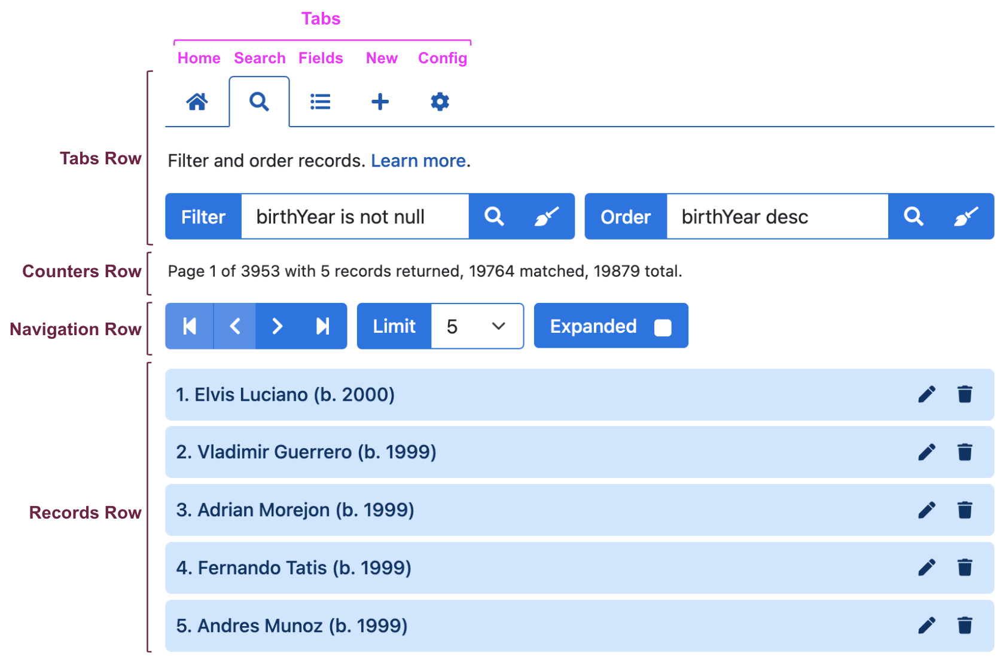

# User Interface

The following video demonstrates the HHDataList user interface:

# Rows

## Tabs row

## Counters row

## Navigation row

## Records row

# Tabs

## Home tab

1. Paginator: forward, end, backward, beginning.
1. Limiter: change to 10.
1. Expander: set to true.
1. Paginator: forward, end, backward, beginning.

## Search tab

1. Filter: syntax is specific to implementation.
1. Order: also specific to implementation.

## Fields tab

1. Uncheck Bats and Throws.
1. Check playerID.
1. Paginator: forward.

## New tab

1. Click Create btn to show required fields.
1. Create a record: Casey Jones, March 14, 1863, Cayce KY USA.
1. Filter to find the new record.
1. Clear filter.

## Config tab

1. Un-number and re-number records.
1. Hide and show descriptions.
1. Explain the purpose of descriptions.
