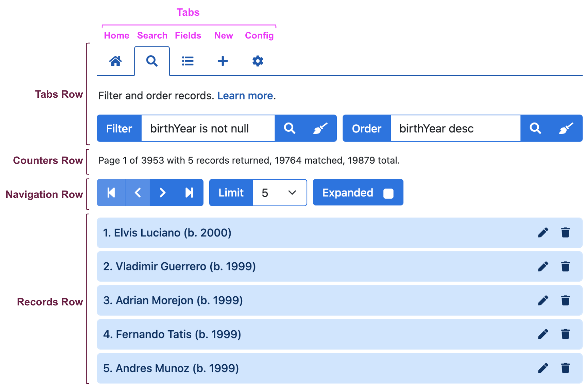

# User Interface

The following video demonstrates the HHDataList UI:

As described in the video, the UI is divided into four rows, and the Tabs Row is divided into five tabs:

# Rows

## Tabs row

The Tabs row includes the Home, Search, Fields, New, and Config tabs (described in the next section).

## Counters row

 The Counters row indicates current page number, total number of pages, number of records returned, number of records matched, and total number of records.

## Navigation row

The Navigation row includes the Paginator for scrolling through records, the Limiter for controlling the maximum number of records to display at one time, and the Expander for controlling whether records are displayed in collapsed or expanded form. 

## Records row

The records row displays collapsed or expanded records, and allows users to modify or delete records. Ultimately, HHDataList capabilities rely, to some degree, on the functionality and flexibility of the underlying API.

# Tabs

## Home tab

1. Paginator: forward, end, backward, beginning.
1. Limiter: change to 10.
1. Expander: set to true.
1. Paginator: forward, end, backward, beginning.

## Search tab

1. Filter: syntax is specific to implementation.
1. Order: also specific to implementation.

## Fields tab

1. Uncheck Bats and Throws.
1. Check playerID.
1. Paginator: forward.

## New tab

1. Click Create btn to show required fields.
1. Create a record: Casey Jones, March 14, 1863, Cayce KY USA.
1. Filter to find the new record.
1. Clear filter.

## Config tab

1. Un-number and re-number records.
1. Hide and show descriptions.
1. Explain the purpose of descriptions.
