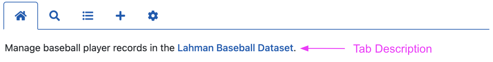
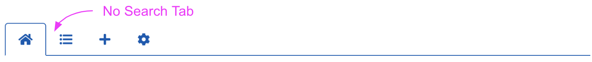
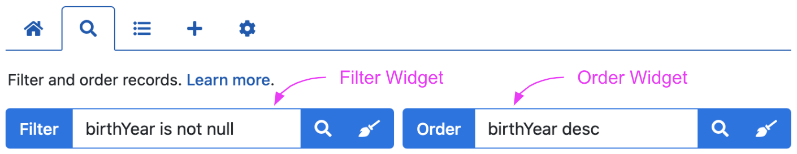
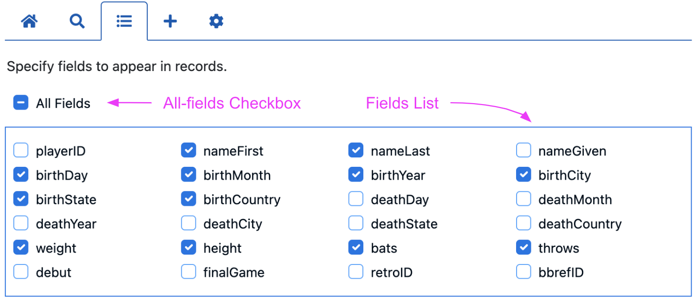
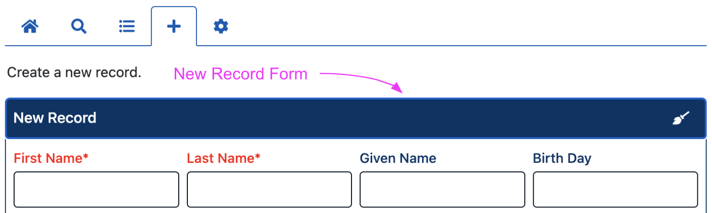
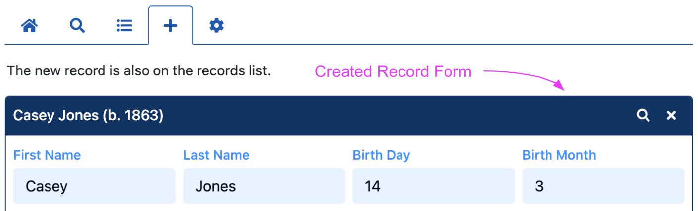
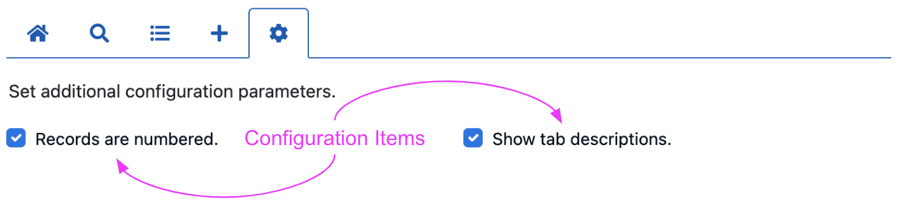
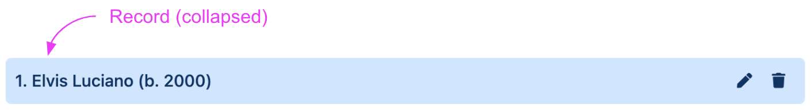
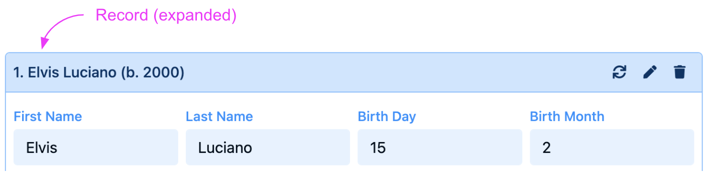
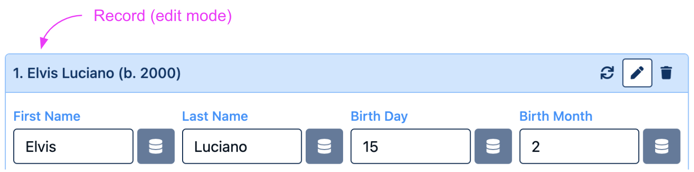

# User Interface

The HHDataList user interface is divided into four rows, and the Tabs Row is divided into five tabs. Note that the Tabs row appears above the other three rows which remain visible as the user clicks from tab to tab:

HHDataList [Options](/en/docs/hhdatalist/options/) influence the user interface. The *themes* option, for example, sets foreground, background, and border colors. And, the *queryParameters* option controls whether some UI tabs and/or items even appear. The sections below introduce the names of various UI items, and provide some sense of which options control which items. 

## Home tab

By default, the Home tab is empty:

However, you can use the *tabDescriptions* option to display a description at the top of any tab:

## Search tab

By default, there is no Search tab:

However, if you specify the *filter* property and/or the *order* property in the *queryParameters* option (an object), then the Search tab appears with the Filter widget and/or the Order widget:

## Fields tab

By default, there is no Fields tab:

However, if you specify ...

## New tab

The New tab ...

## Config tab

The Config tab ...

## Counters row

## Navigation row

## Records row

