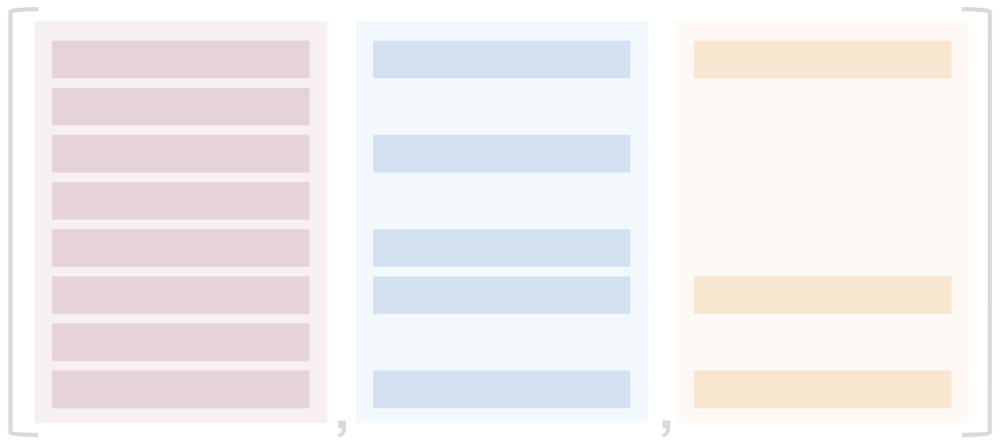

# Applying Uniformity to variable REST API records

This article demonstrates how [HHDataList](/en/hhdatalist/v0.0.2/) UI components accommodate REST APIs that return records with variable sets of fields:

<p></p>

The [Open Library API](https://openlibrary.org/developers) is one such REST API. Each of the following `GET` operations, for example, returns a different set of fields:

``` nonum
Record 1: <a href="https://openlibrary.org/works/OL15049616W.json">https://openlibrary.org/works/OL15049616W.json</a>
Record 2: <a href="https://openlibrary.org/works/OL18238258W.json">https://openlibrary.org/works/OL18238258W.json</a>
Record 3: <a href="https://openlibrary.org/works/OL27863033W.json">https://openlibrary.org/works/OL27863033W.json</a>
```

The table below illustrates the differences:

<p></p>

Suppose we want to enable users to view the following subset of fields while paging through records one at a time:

<p></p>

Record 1 returns all these fields, but Records 2 and 3 do not:

<p></p>

This can lead to a less-than-optimal user experience. Click the forward arrow a few times to see:

<div id="works-datalist" class="hh-data-list mt-4"></div>
<script>
  var worksOptions = new DLWorksOptions002('works-datalist');
  worksOptions.expand.showTool = false;
  worksOptions.expand.value = true;
  worksOptions.queryParams.limit.default = 1;
  worksOptions.queryParams.limit.showTool = false;
  worksOptions.uniformity.showTool = true;
  worksOptions.uniformity.value = false;
  new HHDataList(worksOptions);
</script>

To improve the experience, click the Uniformity button, and page through more records. The Uniformity feature adds missing fields to an expanded record and, if desired, writes a string (e.g. "No data") into the field. The [uniformity](/en/hhdatalist/v0.0.2/options/uniformity/) option is one of many [Options](/en/hhdatalist/v0.0.2/options/) that developers can pass to an HHDataList constructor:

``` js nonum
new HHDataList({
  uniformity: {
    value: false,
    fieldValue: '',
    hasTool: true,
    showTool: false,
    toolLabel: 'Uniformity',
  },
});
```

# Feedback

> Please submit comments on [Gitter](https://gitter.im/hagenhaus/hhdatalist). Thanks.