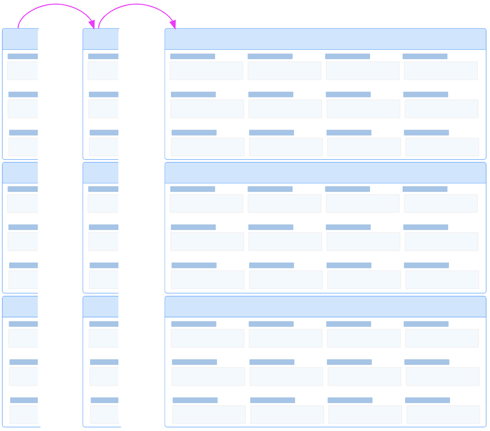
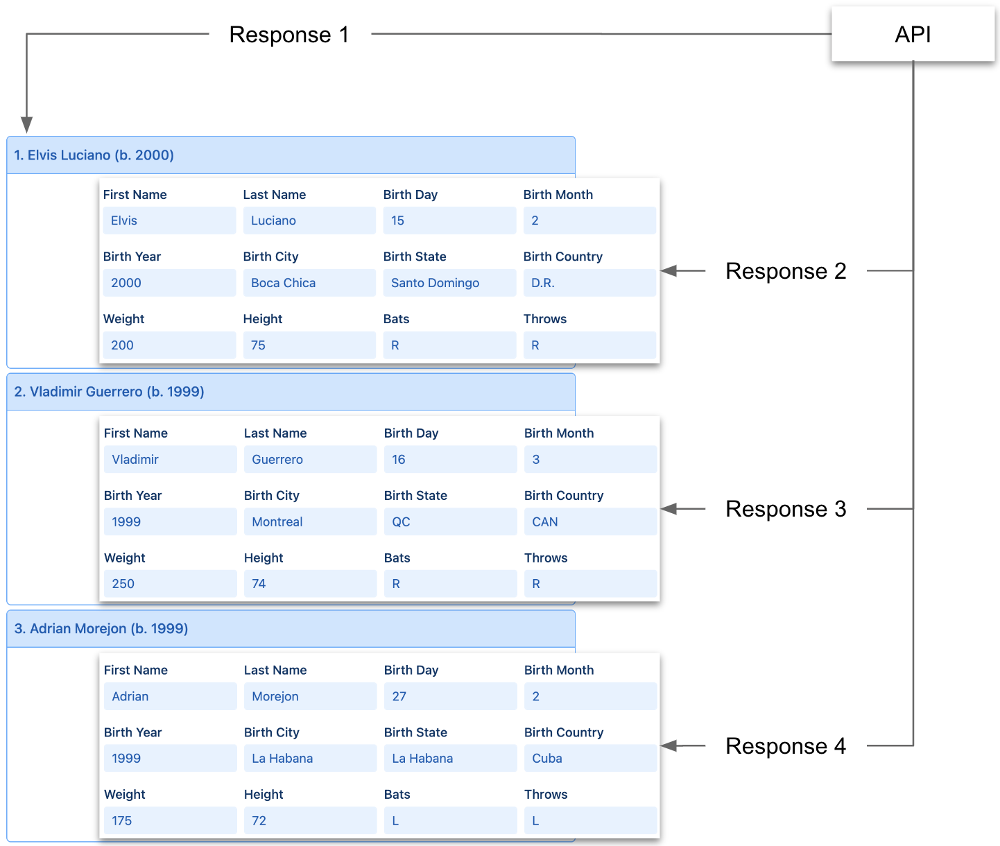

# Hey REST API, Got Parity?

Some REST APIs include a subtle feature that enables frontend UI components to optimize the paging of expanded records, a feature that I call <span style="font-size:92%;font-weight:600;">GET Parity</span>:

<p></p>

A REST API has <span style="font-size:92%;font-weight:600;">GET Parity</span> if its `getRecords` operation can (not must) return all the fields that its `getRecord` operation can. This one simple capability enables frontend UI components to populate a page of expanded records with a single call to `getRecords` rather than with iterative calls to `getRecord`. 

# Demo

You can experiment with <span style="font-size:92%;font-weight:600;">GET Parity</span> using the [HHDataList](/en/hhdatalist/v0.0.2/) instance below. Note that the Get Parity tool is initially disabled. Note also that the Requests Reporter tool is enabled which means the datalist will output all request URLs to your browser console for inspection. Refer to the steps under the datalist.

<div id="collapsed-datalist" class="hh-data-list"></div>
<script>
  var collapsedOptions = new DLPlayersOptions002('collapsed-datalist');
  collapsedOptions.parity.get.showTool = true;
  collapsedOptions.parity.get.value = false;
  collapsedOptions.reporters.requests.showTool = true;
  collapsedOptions.reporters.requests.value = true;
  new HHDataList(collapsedOptions);
</script>

## Step 1: Open your console

Open your browser console so that you can view request URLs. (Close and open as needed.)

## Step 2: Paginate

Click the Paginator tool a few times. Each click generates a single request that returns all the data needed to build the next page of collapsed records. Here is an example request URL:

``` nonum
GET: https://hagenhaus.com:3002/api/baseball/v1/players? ...
```

It may be helpful to clear your browser console from time to time.

## Step 3: Expand and paginate

Click the Expand button which displays a page of expanded records. Then, click the Paginator tool a few times. With Limit set to 3, each click generates a set of four requests. Here is an example:

``` nonum
GET: https://hagenhaus.com:3002/api/baseball/v1/players? ...
GET: https://hagenhaus.com:3002/api/baseball/v1/players/luciael01? ...
GET: https://hagenhaus.com:3002/api/baseball/v1/players/guerrvl02? ...
GET: https://hagenhaus.com:3002/api/baseball/v1/players/morejad01? ...
````

The first request returns an array of three records each containing just enough fields (1) to build and display the record titles and (2) to make subsequent calls to `getRecord`:

``` json nonum
[
  {
    "playerID": "luciael01",
    "nameFirst": "Elvis",
    "nameLast": "Luciano",
    "birthYear": 2000
  },
  {
    "playerID": "guerrvl02",
    "nameFirst": "Vladimir",
    "nameLast": "Guerrero",
    "birthYear": 1999
  },
  {
    "playerID": "morejad01",
    "nameFirst": "Adrian",
    "nameLast": "Morejon",
    "birthYear": 1999
  }
]
```

Each of the three remaining requests returns the fields needed to populate each expanded record. Here is an example:

``` json nonum
{
  "nameFirst": "Elvis",
  "nameLast": "Luciano",
  "birthDay": 15,
  "birthMonth": 2,
  "birthYear": 2000,
  "birthCity": "Boca Chica",
  "birthState": "Santo Domingo",
  "birthCountry": "D.R.",
  "weight": 200,
  "height": 75,
  "bats": "R",
  "throws": "R",
  "playerID": "luciael01"
}
```

The following diagram illustrates the four responses:

<p></p>

This is one way for frontends to page expanded records sourced from REST APIs that lack <span style="font-size:92%;font-weight:600;">GET Parity</span>. The REST API used in the example does, indeed, possess <span style="font-size:92%;font-weight:600;">GET Parity</span>, so all that remains is to configure the datalist to leverage it.

## Step 4: Enable GET Parity

Click the Get Parity button to enable the <span style="font-size:92%;font-weight:600;">GET Parity</span> feature. Then, click the Paginator tool a few times. Each click, again, generates a single request that returns all the data needed to build the next page of expanded records. Here is an example request URL:

``` nonum
GET: https://hagenhaus.com:3002/api/baseball/v1/players? ...
```

# Feedback

> Please submit comments on [Gitter](https://gitter.im/hagenhaus/hhdatalist). Thanks.