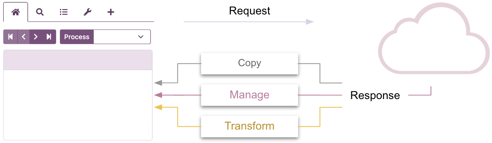
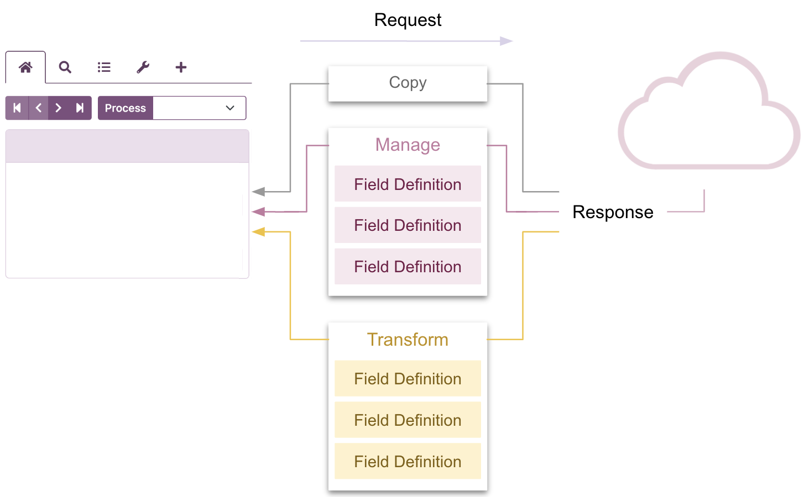
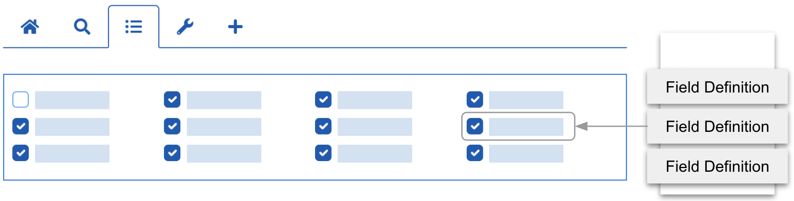
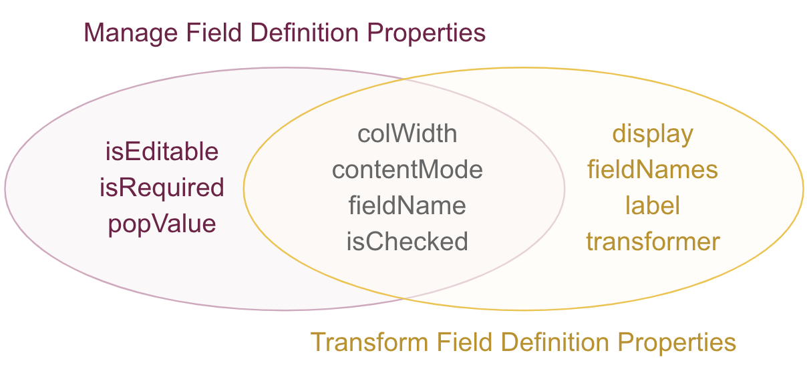
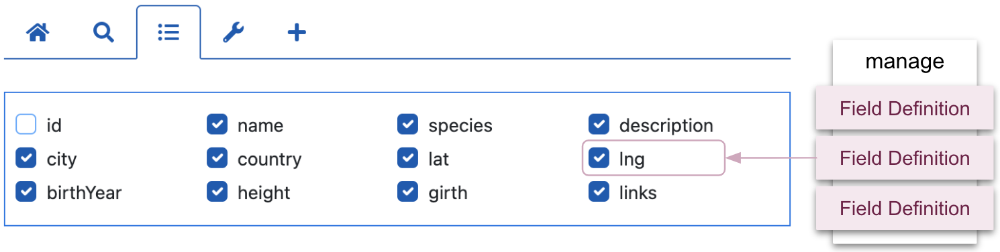
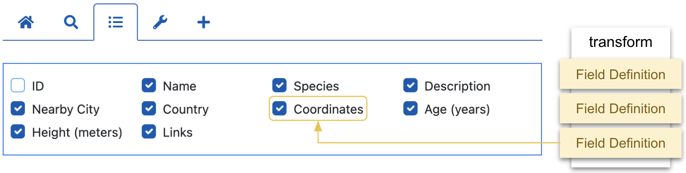

# Three ways to process REST API responses

[HHDataList](/en/hhdatalist/v0.0.2/) supports three pipelines that channel data between REST API responses and expanded records with Process Mode controlling which pipeline (Copy, Manage, Transform) is active:

<p></p>

The Copy pipeline allows the API response record to dictate the order and appearance of record properties in expanded records. The Manage and Transform pipelines, however, contain field definitions that process API response record fields and control the order, appearance, and various other aspects of the labels and values in expanded records.

<p></p>

# Demonstration

Before learning more about field definitions, toggle the Content and Process tools in the datalist below to explore the effects. The Process mode specifies the pipeline. The Content mode specifies how field values are interpreted:

<div id="famous-trees-datalist" class="hh-data-list my-4"></div>
<script>
  var options = new DLTreesOptions002('famous-trees-datalist');
  options.contentMode.showTool = true;
  options.descriptions.value = false;
  options.expand.showTool = false;
  options.expand.value = true;
  options.processMode.showTool = true;
  options.queryParams.limit.default = 1;
  options.queryParams.limit.showTool = false;
  new HHDataList(options);
</script>

A few fun things to notice:

* In copy mode there is no Fields tab.
* In manage mode the record fields are editable.
* In transform mode the Coordinates record field replaces the lat and lng fields.
* Content mode is controlled by the [contentMode](/en/hhdatalist/v0.0.2/options/contentmode/) option.

# Field definitions

> The field definitions discussed in this section are controlled by the [fieldDefinitions](/en/hhdatalist/v0.0.2/options/fielddefinitions/) option.

The Fields tab is absent in copy mode because the Copy pipeline does not include field definitions:

<p></p>

But, the Fields tab is visible in manage and transform modes because the respective pipelines utilize field definitions. In fact, each field definition corresponds to a particular checkbox on the Fields tab:

<p></p>

From an implementation perspective, a set of field definitions is an array, and each field definition is an object comprised of properties: 

``` js nonum
[
  { fieldName: 'id', isChecked: false },
  { fieldName: 'name', isEditable: true, isRequired: true, colWidth: 'medium' },
  { fieldName: 'species', isEditable: true, colWidth: 'medium' },
  { fieldName: 'description', isEditable: true }
]
```

Some properties are available only to Manage Field Definitions, some to Transform Field Definitions, and some to both:

<p></p>

## Manage array

Here is an example of a Fields tab for manage mode:

<p></p>

The manage pipeline contains field definitions that map API response fields to expanded record fields. Here is an example of the field definition for the `lng` (i.e. `longitude`) field:

``` js nonum
new HHDataList({
  fieldDefinitions: {
    manage: [
      { 
        fieldName: 'lng', 
        isChecked: true,
        isEditable: true, 
        isRequired: false,
        colWidth: null,
        contentMode: null,
        popValue: null
      }
    ]
  }
});
```

This table describes each field definition property:

|Property|Description|
|-|-|
|fieldName|This property identifies both the API response record field name and the expanded record field label. A Manage field definition cannot rename the field name.|
|isChecked|This property determines whether the Fields tab checkbox is checked for this field and whether the field appears in expanded records.|
|isEditable|This property determines whether this field is editable when the expanded record is in edit mode.|
|isRequired|This property determines whether this field is required in the New Record form.|
|colWidth|This property specifies the column width of this field in expanded records, overriding the [colWidths](/en/hhdatalist/v0.0.2/options/colwidths/) setting.|
|contentMode|This property specifies the content mode (`string` or `type`) for this field in expanded records, overriding the [contentMode](/en/hhdatalist/v0.0.2/options/contentmode/) setting.|
|popValue|This property specifies the auto-populate value for this field in the New Record form, overriding the [populate](/en/hhdatalist/v0.0.2/options/populate/) value.|

## Transform array

Here is an example of a Fields tab for transform mode:

<p></p>

The transform pipeline contains field definitions that map API response fields to expanded record fields. Here is an example of a field definition that maps the `lat` and `lng` fields in API response records to the `Coordinates` field in expanded records:

``` js nonum
new HHDataList({
  fieldDefinitions: {
    transform: [
      { 
        label: 'Coordinates',
        fieldNames: ['lat', 'lng'], 
        isChecked: true,
        colWidth: null,
        contentMode: null,
        transformer: (lat, lng) => ({
            url: `https://www.google.com/maps/search/?api=1&query=${lat},${lng}`,
            title: `${lat}, ${lng}`
          }),
        display: { type: 'link' }
      }
    ]
  }
});
```

This table describes each field definition property:

|Property|Description|
|-|-|
|label|This property the field label in expanded records.|
|fieldNames|This property contains the names of the fields in the API response records that are passed to the transformer.|
|isChecked|This property determines whether the Fields tab checkbox is checked for this field and whether the field appears in expanded records.|
|colWidth|This property specifies the column width of this field in expanded records, overriding the [colWidths](/en/hhdatalist/v0.0.2/options/colwidths/) setting.|
|contentMode|This property specifies the content mode (`string` or `type`) for this field in expanded records, overriding the [contentMode](/en/hhdatalist/v0.0.2/options/contentmode/) setting.|
|transformer|This property creates the value for this field.|
|display|This property specifies how the new value is displayed in expanded records.|

# Process modes

> The process modes discussed in this section are controlled by the [processMode](/en/hhdatalist/v0.0.2/options/processmode/) option.

Each process mode targets a set of use cases. 

## Copy mode

Adding HHDataList instances to your website is usually an iterative process demonstrated in the [Tutorial](/en/hhdatalist/v0.0.2/tutorial/). Copy mode is useful in the early stages before you define any field definitions. Copy mode enables API response records to dictate the order and appearance of labels and values in expanded records thus allowing you to inspect the data and begin to design Manage and Transform field definitions.

## Manage mode

Manage mode enforces a one-to-one correspondence between API response record field names and expanded record field labels in order to support (1) edit mode in expanded records, (2) record creation via the New Record form on the New tab, and (3) the Filter and Order tools, all of which require exact field names.  

## Transform mode

Focused on the end user, transform mode can rename record labels, perform a variety of transformations on field values, merge fields, create new fields, and display fields using input, textarea, and select HTML elements. To see the results of various transformations, try switching between manage and transform modes for the following fields in the datalist near the top of the page. You might also try switching content mode.

|Manage field|Transform field|
|-|-|
|species|Species|
|country|Country|
|lat, lng|Coordinates|
|birthYear|Age|
|links|Links|
