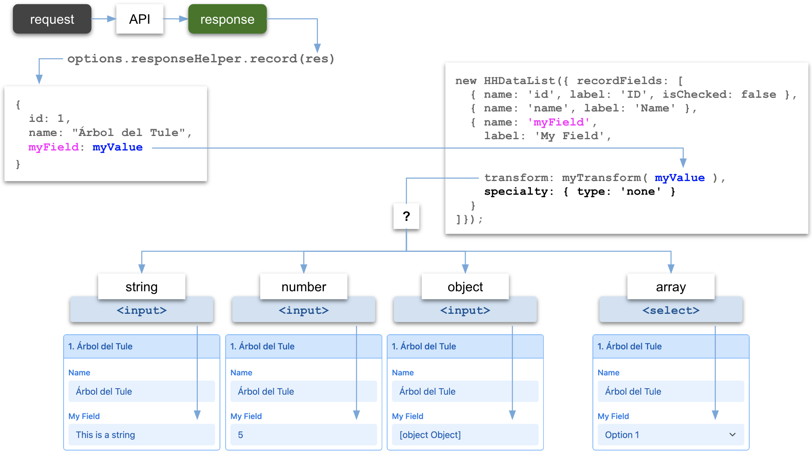

# Guide

# How to use field.specialty

## type: none

<p></p>

## type: text

<p></p>

## type: link

Specifying *field.specialty.type: 'link'* tells HHDataList to build *input* element 

The *link* specialty type requires the data type (returned from the *transform* function) to be an object with a *url* property and a *title* property:

``` nonum
{ 
  url: "https://domain.com/some/path", 
  title: "Some title"
}
```

<p></p>

## type: key

