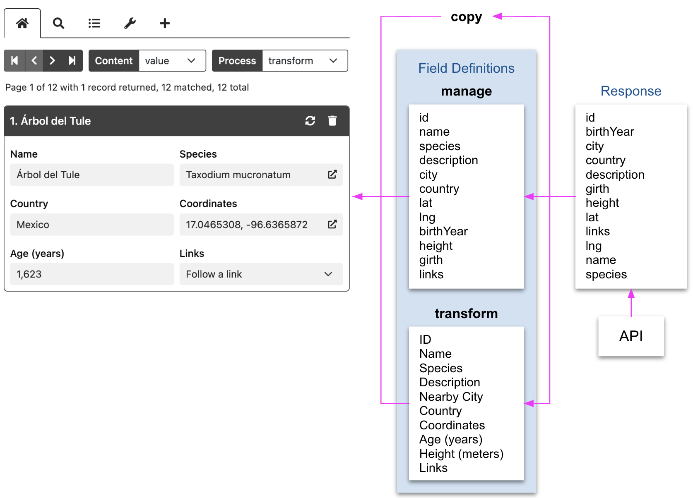
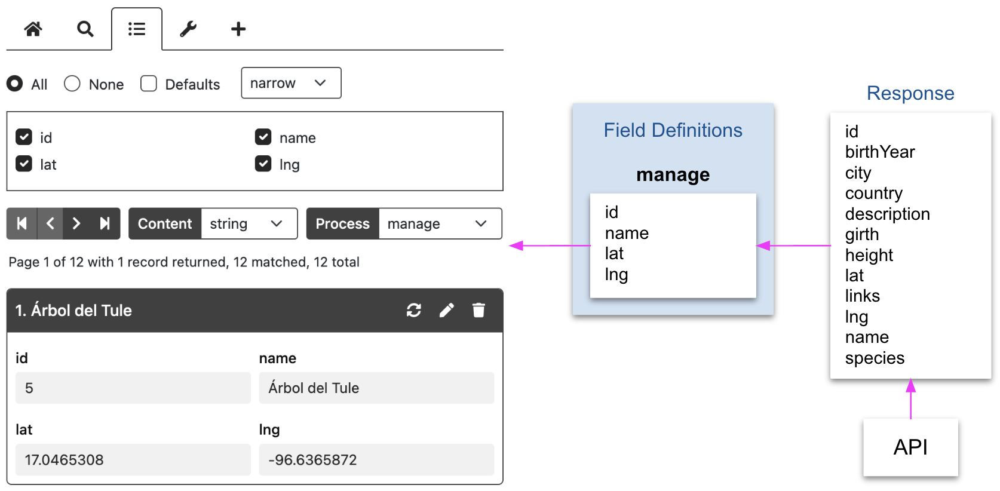

# Process Mode

When moving data from REST API responses to expanded records, HHDataList operates in one of three process modes: copy, manage, or transform. Try changing the *Process* dropdown in the HHDataList instance below:

With the *Árbol del Tule* record displayed, note the following sampling of differences among the modes:

1. In **copy** mode, the *Fields* tab is absent because *copy* mode does not have any [fieldDefinitions](/en/hhdatalist/v0.0.2/options/fielddefinitions/) as illustrated in the [Process Mode Diagram](#process-mode-diagram) below.

1. In **manage** mode, the *Fields* tab is present because *manage* mode has [fieldDefinitions](/en/hhdatalist/v0.0.2/options/fielddefinitions/) which control the appearance and order of record fields. So, the *id* record field can be unchecked, and, compared to *copy* mode, the order of the record fields can be different.  Also, the *Edit* button is present in the record header. Note that the *country* record field value is `MEX`. Note also the presence of the *lat* and *lng* record fields.

1. In **transform** mode, the *Fields* tab is also present because *transform* mode has [fieldDefinitions](/en/hhdatalist/v0.0.2/options/fielddefinitions/), too, ones with different capabilities. The record field labels are uppercased. The *Country* record field value is now `Mexico` because the corresponding *fieldDefinition* performed an additional GET operation. The *Coordinates* field has replace the *lat* and *lng* record fields, and the field value is a link. 

# Process Mode Diagram

The diagram below illustrates how data flows from a REST API response to an expanded record via the three process modes. **copy** mode lacks [fieldDefinitions](/en/hhdatalist/v0.0.2/options/fielddefinitions/). **manage** mode uses *manage* [fieldDefinitions](/en/hhdatalist/v0.0.2/options/fielddefinitions/). **transform** mode uses *transform* [fieldDefinitions](/en/hhdatalist/v0.0.2/options/fielddefinitions/):

# Capabilities per mode

## Copy fields

All process modes copy (in some fashion) fields from REST API response records to expanded records. 

## Filter fields

Only *manage* and *transform* modes can, by omitting certain fieldDefinitions, prevent HHDataList from copying fields from a REST API response record to an expanded record. Below is a *manage* mode example:

## Reorder fields

Only *manage* and *transform* modes can, by defining fieldDefinitions in a particular order, direct HHDataList to reorder fields. See the [Process Mode Diagram](#process-mode-diagram).

## Rename fields

Only *transform* mode can direct HHDataList to rename fields. See the [Process Mode Diagram](#process-mode-diagram).

## Edit fields

Only *manage* mode can display Edit icons in record headers. See the diagram in the [Filter fields](#filter-fields) section.

## Add fields

Only *manage* and *transform* modes can direct HHDataList to add fields to an expanded record. 

## Merge fields

Only *transform* mode can direct HHDataList to merge fields. See the [Process Mode Diagram](#process-mode-diagram), and note that a *transform* fieldDefinition merges the `lat` and `lng` fields into the `Coordinates` field.

## Transform fields

## Transform display

## Create records

## Delete records

No process mode prevents users from deleting records. Other factors, however, may. See [url](/en/hhdatalist/v0.0.2/options/url/) and [urls](/en/hhdatalist/v0.0.2/options/urls/).

# Comparison Table

The following table summarizes and compares process-mode capabilities:

|&nbsp;|Copy|Manage|Transform|
|---|:-:|:-:|:-:|
|Copy fields|<i class="fas fa-check"></i>|<i class="fas fa-check"></i>|<i class="fas fa-check"></i>|