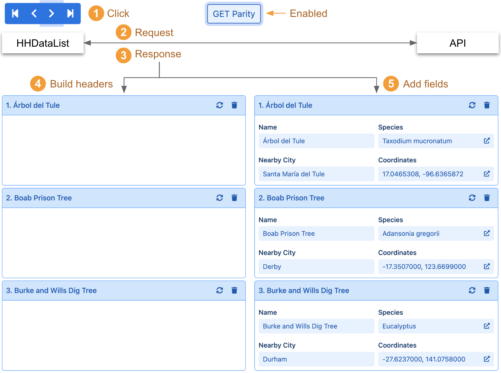
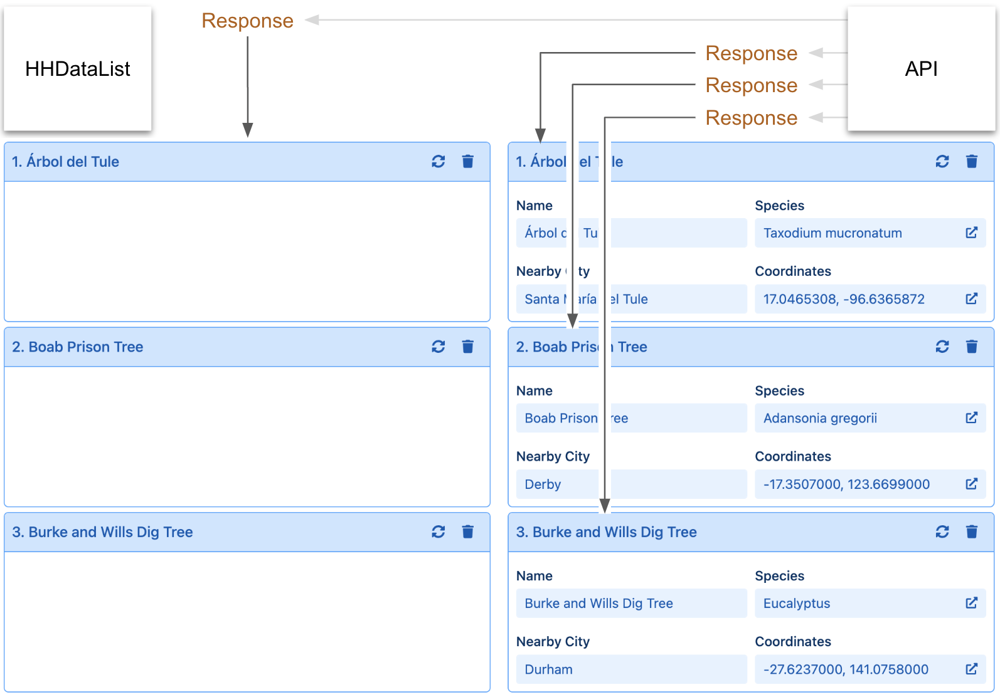

# Record Parity

This page explains and demonstrates record parity.

# What is record parity?

When, to scroll **expanded** records, a user clicks on any of the *Paginator* arrows, HHDataList, with [`GET` parity](/en/hhdatalist/v0.0.2/options/parity/) enabled, assumes that it can return, with one efficient `GET` operation, all data needed to build the expanded record headers **and** add all record fields. The diagram illustrates:

Record parity is a capability that the *getRecords* operations of some APIs possess, the ability to return all (not just a subset of) the record fields that their *getRecord* counterparts can. If an underlying API possesses Record Parity, and if HHDataList knows it, HHDataList scrolls expanded records with one `GET` operation per page. Otherwise, it must call `getRecords` to build the record headers, and `getRecord` repeatedly, once for each record, to add fields:

So, if an underlying API possesses record parity, developers can, via the [`GET` parity](/en/hhdatalist/v0.0.2/options/parity/) option, tell HHDataList to take advantage of this capability.

# Demonstrate record parity

You can demo record parity to yourself using the HHDataList instance below. Note that the Famous Trees API possesses Record Parity. Note also that `GET` Parity is enabled. Follow these steps:

1. Open your browser's Developer Tools to view the Console (and consider clearing the console).
1. Click one of the Paginator arrows once to scroll. This causes HHDataList to issue a single `GET` request that returns all data needed to build the record headers and add the record fields.
1. Click the `GET Parity` toggle to turn off parity.
1. Click one of the Paginator arrows again. Now, this causes HHDataList to issue four `GET` requests, one to build the record headers, and three to add record fields.

