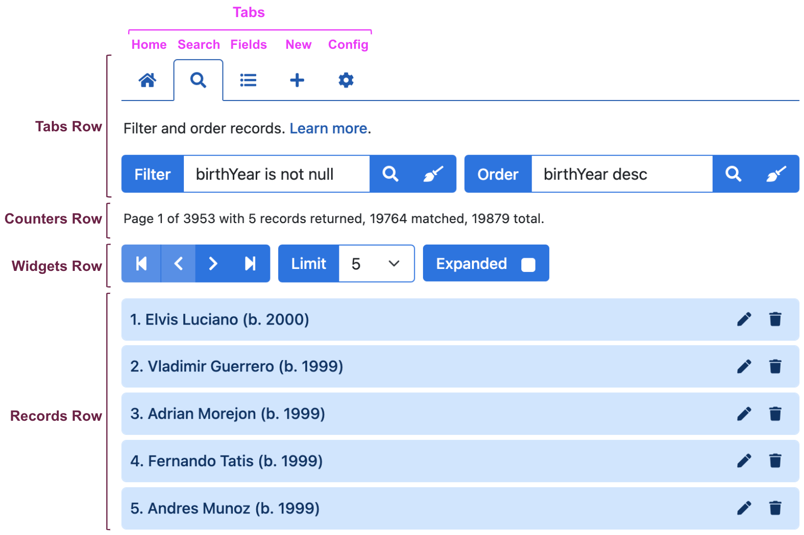

# User Interface

The HHDataList user interface is divided into four rows, and the Tabs Row is divided into five tabs. Note that the Tabs row appears above the other three rows which remain visible as the user clicks from tab to tab:

