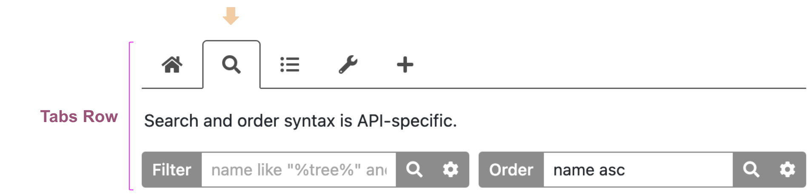
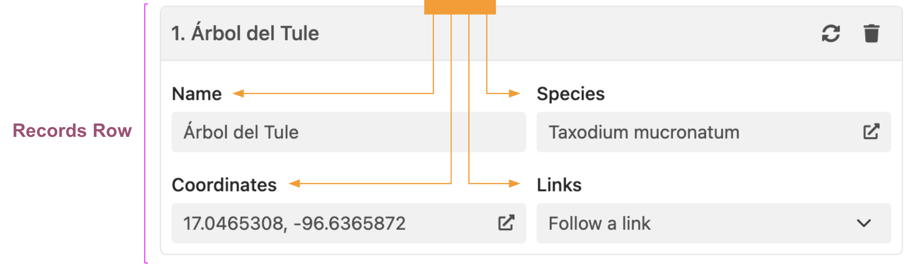
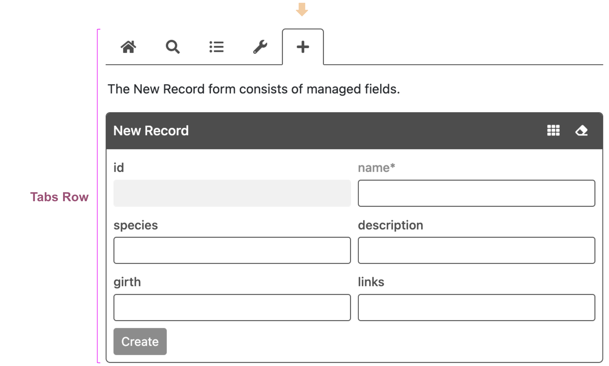
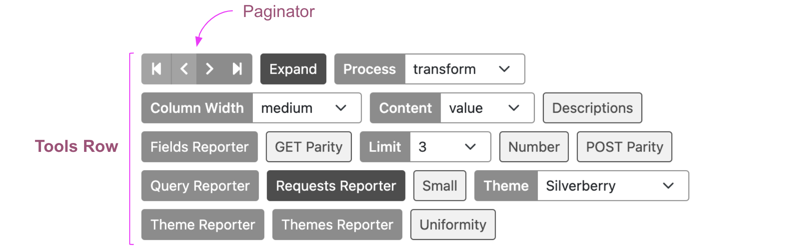

# HHDataList

Welcome! HHDataList is a UI component that enables websites to interact with REST APIs. This page examines the [User Interface](#user-interface). The [Tutorial](/en/hhdatalist/v0.0.2/tutorial/) shows how to use [Options](/en/hhdatalist/v0.0.2/options/) to configure datalists. The [Gallery](/en/hhdatalist/v0.0.2/gallery/) provides examples. The [Roadmap](/en/hhdatalist/v0.0.2/roadmap/) lists future fixes and enhancement.

# User Interface

The UI of a fully configured datalist is divided into four rows, and the Tabs Row is divided into five tabs: 

[Options](/en/hhdatalist/v0.0.2/options/) control the initial appearance of a datalist, so the initial state of a datalist may exhibit less tabs, less rows, various tools, small or large controls, and a different number of collapsed or expanded records.

## Home tab

The Home tab is always visible. The [descriptions](/en/hhdatalist/v0.0.2/options/descriptions/) option controls whether a description is visible:

## Search tab

The Search tab is visible if either [queryParams](/en/hhdatalist/v0.0.2/options/queryparams/).`filter` or [queryParams](/en/hhdatalist/v0.0.2/options/queryparams/).`order` is defined. The [descriptions](/en/hhdatalist/v0.0.2/options/descriptions/) option controls whether a description is visible:

## Fields tab

The Fields tab is visible if [processMode](/en/hhdatalist/v0.0.2/options/processmode/) is set to `manage` or `transform`. Checkboxes control which fields appear in expanded records. The [descriptions](/en/hhdatalist/v0.0.2/options/descriptions/) option controls whether a description is visible:

## Tools tab

The Tools tab is always visible. Checkboxes control which tools appear in the Tools row. The [descriptions](/en/hhdatalist/v0.0.2/options/descriptions/) option controls whether a description is visible:

## New tab

The New tab is visible only if [fieldDefinitions](/en/hhdatalist/v0.0.2/options/fielddefinitions/).`manage` is defined. The [descriptions](/en/hhdatalist/v0.0.2/options/descriptions/) option controls whether a description is visible:

## Tools row

The Tools row is visible if at least one tool is enabled. Users enable/disable tools by checking/unchecking checkboxes on the Tools tab. Developers enable/disable tools by setting the `showTool` property of the corresponding option to `true` or `false`. The Paginator is an exception. Users cannot enable/disable the Paginator tool, and developers enable this tool by defining [queryParams](/en/hhdatalist/v0.0.2/options/queryparams/).`page`. 

### Tool types

Aside from the Paginator, there are three types of tools:

* A Push Button performs an action and immediately returns to its initial state.

    

* A Toggle Button switches its appearance, and some underlying variable, between two states.

    

* A Dropdown selects among many states.

    

### Tool options

The follow table maps tools to types and options:

|Tool Default Name|Type|Option|
|-|-|-|
|Column Width|Dropdown|[colWidths](/en/hhdatalist/v0.0.2/options/colwidths/)|
|Content|Dropdown|[contentMode](/en/hhdatalist/v0.0.2/options/confirm/)|
|Descriptions|Toggle Button|[descriptions](/en/hhdatalist/v0.0.2/options/descriptions/)|
|Expand|Toggle Button|[expand](/en/hhdatalist/v0.0.2/options/expand/)|
|Fields Reporter|Push Button|[reporters](/en/hhdatalist/v0.0.2/options/reporters/)|
|GET Parity|Toggle Button|[parity](/en/hhdatalist/v0.0.2/options/parity/)|
|Limit|Dropdown|[queryparams](/en/hhdatalist/v0.0.2/options/queryparams/)|
|Number|Toggle Button|[number](/en/hhdatalist/v0.0.2/options/number/)|
|POST Parity|Toggle Button|[parity](/en/hhdatalist/v0.0.2/options/parity/)|
|Process|Dropdown|[processmode](/en/hhdatalist/v0.0.2/options/processmode/)|
|Query Reporter|Push Button|[reporters](/en/hhdatalist/v0.0.2/options/reporters/)|
|Requests Reporter|Toggle Button|[reporters](/en/hhdatalist/v0.0.2/options/reporters/)|
|Small|Toggle Button|[small](/en/hhdatalist/v0.0.2/options/small/)|
|Theme|Dropdown|[themedefinition](/en/hhdatalist/v0.0.2/options/themedefinition/)|
|Theme Reporter|Push Button|[reporters](/en/hhdatalist/v0.0.2/options/reporters/)|
|Themes Reporter|Push Button|[reporters](/en/hhdatalist/v0.0.2/options/reporters/)|
|Uniformity|Toggle Button|[uniformity](/en/hhdatalist/v0.0.2/options/uniformity/)|

## Counters row

The Page portion of the Counters row relies on the `page` and `limit` properties of the [queryParams](/en/hhdatalist/v0.0.2/options/queryparams/) option. The Matched portion relies on the `filter` property of the same option. And, the Total portion relies on the capabilities of the underlying API:

## Records row

The Records row is always visible. The `limit` property of the [queryParams](/en/hhdatalist/v0.0.2/options/queryparams/) option controls the maximum number of record in the row. The [expand](/en/hhdatalist/v0.0.2/options/expand/) option controls whether records are initially expanded. If [processMode](/en/hhdatalist/v0.0.2/options/processmode/) is `manage` or `transform`, the checkboxes on the Fields tab determine which fields are visible in expanded records and the order of the fields:

