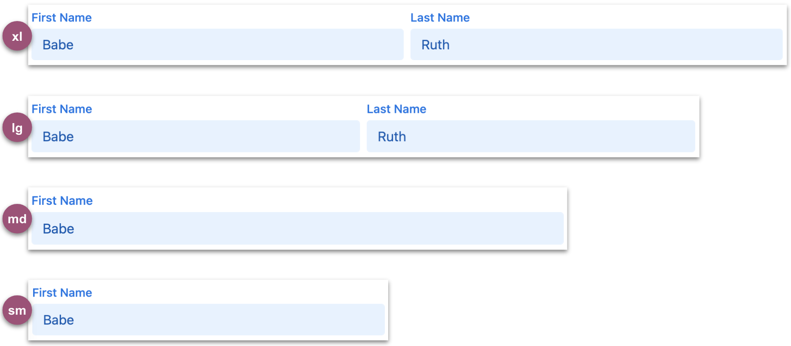
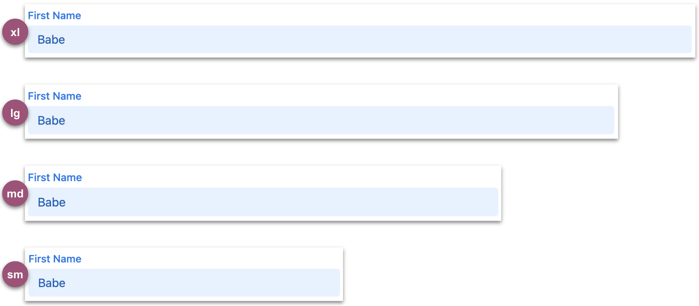

# colWidths

<table class="options-table">
  <tr><th>Optional</th></tr>
</table>

The `colWidths` option controls the initial column widths associated with the Fields tab, Tools tab, and expanded records.

# Examples

## Example with defaults

This example shows the default values for this option.

``` js nonum
new HHDataList({
  colWidths: {
    fields: { value: 'narrow', showTool: true },
    records: { value: 'narrow', hasTool: true, showTool: false, toolLabel: 'Column Width' },
    tools: { value: 'narrow', showTool: true }
  },
});
```

* Valid `width` values are `['narrow','medium','wide']`.

# Old Stuff

**narrow**

<p></p>

**medium**

<p></p>

**wide**

<p></p>

