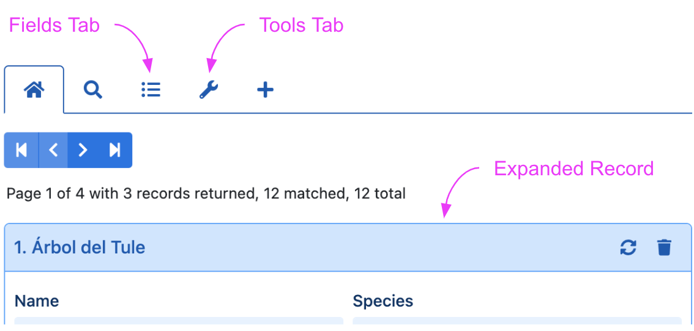
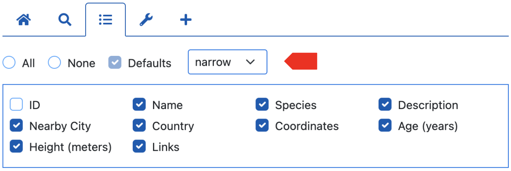
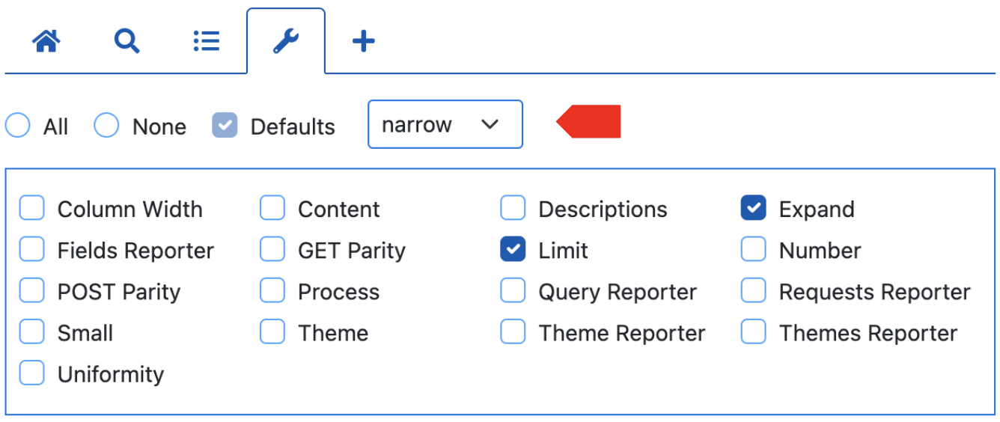
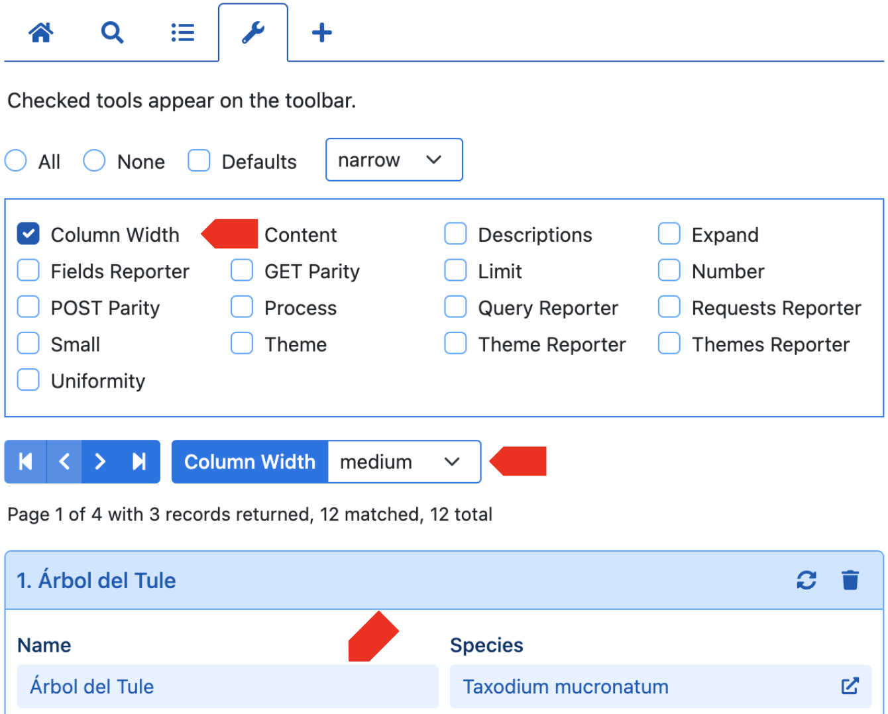

# colWidths

<table class="options-table"><tr><th>Optional</th></tr></table>

The `colWidths` option plays a part in controlling the column widths associated with the Fields tab, Tools tab, and expanded records:

<p></p>

# Examples

## Example 1

This example shows the default values for this option.

``` js nonum
new HHDataList({
  colWidths: {
    fields: { value: 'narrow', showTool: true },
    tools: { value: 'narrow', showTool: true },
    records: { value: 'narrow', hasTool: true, showTool: false, toolLabel: 'Column Width' }
  },
});
```

The option value is an object with three properties: `fields`, `tools`, and `records`. Each property controls the column widths of the Fields tab, Tools tab, and expanded records respectively and an associated tool.

## Example 2

This example shows a typical setting that relies on most of the defaults:

``` js nonum
new HHDataList({
  colWidths: {
    records: { value: 'medium', showTool: true }
  },
});
```

# Valid values

 Valid settings for `colWidths.fields.value`, `colWidths.tools.value`, and `colWidths.records.value` are `narrow` , `medium`, and `wide`. A `narrow` setting does not mean the field remains narrow for all screen sizes, however. Each of these settings is responsive to screen size. The diagrams below illustrate (using record fields as an example):

**narrow**

<p></p>

**medium**

<p></p>

**wide**

<p></p>

# Tools

## Fields Tab ColWidth tool

`colWidths.fields` controls the tool on the Fields tab:

<p></p>

## Tools Tab ColWidth tool

`colWidths.tools` controls the tool on the Tools tab:

<p></p>

## Record Field ColWidth tool

`colWidths.records` controls the *Column Widths* tool on the Tools tab:

<p></p>

> Note: `colWidths.records` sets the default width for record fields. Field definitions can override this setting for individual record fields. See the [fieldDefinitions](/en/hhdatalist/v0.0.2/options/fielddefinitions/) option.
