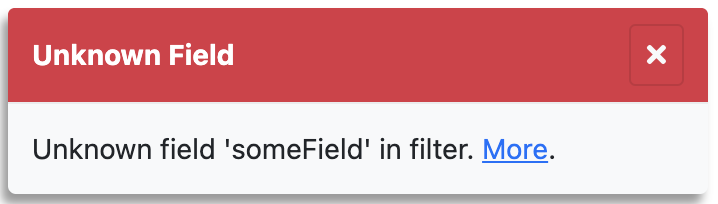

# error

<table class="options-table">
  <tr><th>Necessity:</th><td>Recommended</td></tr>
</table>

The `error` option specifies a function for HHDataList to call when reporting errors.

# Primary Example

``` js nonum
const reportError = (error) => {
  showToast('error', error.message, error.response.data);
};
 
new HHDataList({
  error: reportError,
});
```

# Old Stuff

HHDataList invokes the client-defined *reportError* function (if specified) when HHDataList encounters an error:

``` js nonum
const dataList = new HHDataList({
  reportError: (title, detail) => { reportError(title, detail); },
});
```

`reportError(title, detail)` is a client-defined error handler that might, for example, display a *toast* component like this:

<p></p>

The *More* link is not part of the *detail* string. It is, rather, built by this particular client-defined function.

# reportRecordFieldDefinitions

``` nonum
const dataList = new HHDataList({
  reportRecordFieldDefinitions: {
    function: (fieldDefs) => { console.log(JSON.stringify(fieldDefs, null, 2)); },
    hasUI: true
  },
});
```