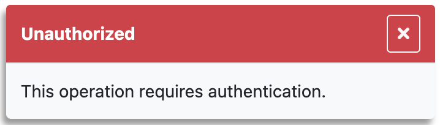

# error

<table class="options-table"><tr><th>Optional, but recommended</th></tr></table>

The `error` option specifies a function for HHDataList to call when reporting API errors.

# Example

HHDataList passes the [Axios](https://axios-http.com/) `error` argument to the `error` function.

``` js nonum
// developer-defined
const reportError = (error) => {
  let tm = getTitleAndMessage(error);
  showToast('error', tm.title, tm.message);
};
 
new HHDataList({
  error: reportError,
});
```

It is up to the website to interpret the `error` argument and decide how to display the information. Below is an example:

``` js nonum
function getTitleAndMessage(error) {
  let tm = { title: 'Unknown Error', message: 'Unknown Message' };
  if ('response' in error && 'statusText' in error.response && error.response.statusText) { tm.title = `${error.response.statusText}`; }
  else if ('message' in error && error.message) { tm.title = error.message; }
  if ('response' in error && 'data' in error.response && error.response.data) { tm.message = error.response.data; }
  else if ('name' in error && error.name) { tm.message = error.name; }
  return tm;
}
```

<p></p>

If the website does not provide an *error* option to the HHDataList constructor, HHDataList does not report the error.

# Demonstration

To see this option in action, try deleting one of the records below:

<div id="datalist" class="hh-data-list"></div>
<script>
  var options = new DLTreesOptions002('datalist');
  options.expand.showTool = false;
  options.methods.deleteRecord = null;
  options.queryParams.limit.showTool = false;
  new HHDataList(options);
</script>
