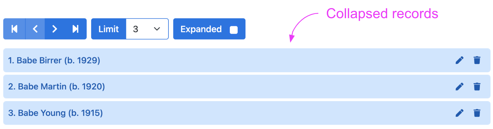

# expand

<table class="options-table">
  <tr><th>Necessity:</th><td>Optional</td></tr>
</table>

The `expand` option specifies whether records on the records list are initially expanded or collapsed.

# Primary Example

``` js nonum
new HHDataList({
  expand: {
    value: false,
    hasTool: true,
    showTool: false,
    toolLabel: 'Expand'
  },
});
```

# Old Stuff

These records are collapsed:

<p></p>

These records are expanded:

<p></p>