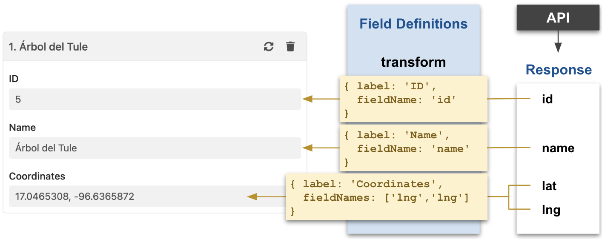

# fieldDefinitions

<table class="options-table"><tr><th>Optional</th></tr></table>

The `fieldDefinitions` option, a companion to the [processMode](/en/hhdatalist/v0.0.2/options/processmode/) option, helps define what HHDataList displays in expanded records. The option value is an object containing a `manage` and/or a `transform` array of field definitions. With *processMode* set to *manage*, HHDataList uses *manage* field definitions to process API response fields into expanded record fields:

<p></p>

With *processMode* set to *transform*, HHDataList uses *transform* field definitions to process API response fields into expanded record fields:

<p></p>

# Examples

## Example 1

This example shows the default values for the field definition objects. The default value for the *isChecked* property, for example, is `true`. Normally, a field definition would not specify a default value. See [Example 2](#example-2) for the normal way to define these same field definitions. See [Field definition properties](#field-definition-properties) for a description of each property.

``` js nonum
new HHDataList({
  fieldDefinitions: {
    manage: [
      { 
        fieldName: 'id', 
        isChecked: false,
        isEditable: false, 
        isRequired: false,
        colWidth: null,
        contentMode: null
      },
      { 
        fieldName: 'name',
        isChecked: true,
        isEditable: true, 
        isRequired: true, 
        colWidth: 'medium',
        contentMode: null,
        popValue: 'Koiwai Farm Ipponzakura'
      },
      { 
        fieldName: 'lat', 
        isChecked: true,
        isEditable: true,
        isRequired: false,
        colWidth: null,
        contentMode: null,
        popValue: '39.7560461061616'
      },
      { 
        fieldName: 'lng', 
        isChecked: true,
        isEditable: true,
        isRequired: false,
        colWidth: null,
        contentMode: null,
        popValue: '141.004011260734'
      }
    ],
    transform: [
      { 
        label: 'ID', 
        fieldName: 'id', 
        isChecked: false,
        colWidth: null,
        transformer: (v) => v,
        contentMode: null,
        display: { type: 'normal' }
      }, 
      { 
        label: 'Name', 
        fieldName: 'name',
        isChecked: true,
        colWidth: null,
        transformer: (v) => v,
        contentMode: null,
        display: { type: 'normal' }
      }, 
      { 
        label: 'Coordinates', 
        fieldNames: ['lat', 'lng'],
        isChecked: true,
        colWidth: null,
        transformer: (lat, lng) => ({ 
          url: `https://www.google.com/maps/search/?api=1&query=${lat},${lng}`, 
          title: `${lat}, ${lng}` 
        }),
        contentMode: null,
        display: { type: 'link' }
      }
    ]
  }
});
```

## Example 2

This example takes advantage of default values.

``` js nonum
new HHDataList({
  fieldDefinitions: {
    manage: [
      { fieldName: 'id', isChecked: false },
      { fieldName: 'name', isEditable: true, isRequired: true, colWidth: 'medium' },
      { fieldName: 'lat', isEditable: true },
      { fieldName: 'lng', isEditable: true, isRequired: false }
    ],
    transform: [
      { label: 'ID', fieldName: 'id', isChecked: false },
      { label: 'Name', fieldName: 'name' },
      { label: 'Coordinates',
        fieldNames: ['lat', 'lng'],
        transformer: (lat, lng) => ({
          url: `https://www.google.com/maps/search/?api=1&query=${lat},${lng}`,
          title: `${lat}, ${lng}`
        }),
        display: { type: 'link' }
      }
    ]
  }
});
```

# Demonstration

This demo datalist may be helpful while exploring the field definition properties below.

<div id="datalist" class="hh-data-list"></div>
<script>
  var options = new DLTreesOptions002('datalist');
  options.colWidths.records.showTool = true;
  options.descriptions.value = false;
  options.expand.showTool = false;
  options.expand.value = true;
  for(field of options.fieldDefinitions.manage) {
    if(field.fieldName === 'name') { field.popValue = 'My Magnificent Tree'; }
  }
  options.processMode.showTool = true;
  options.queryParams.limit.default = 1;
  options.queryParams.limit.showTool = false;
  new HHDataList(options);
</script>

# Field definition properties

Field definitions are composed of properties. Some properties are relevant to both `manage` and `transform` field definitions. Others are relevant to only one type as indicated by the check icons below.

## colWidth

<table class="options-table">
  <tr>
  <th style="padding-right:0;"><i class="fas fa-check-circle"></i></th><th style="padding-left:3px;">manage</th>
  <th style="padding-right:0;"><i class="fas fa-check-circle"></i></th><td style="padding-left:3px;">transform</td>
  </tr>
</table>

The `colWidth` property sets the column width to `narrow`, `medium`, or `wide` for the expanded record field, overriding the `value` setting of the global `colWidths.records` option. Omitting this property, or setting the property value to `null`, allows the global setting to govern the column width. See also [colWidths](/en/hhdatalist/v0.0.2/options/colwidths/). In the demo datalist above, the *Description* field column width is set to `wide`, so changing the *Column Width* dropdown will not affect it:

``` js nonum
{
  label: 'Description', 
  fieldName: 'description', 
  colWidth: 'wide', 
  display: { type: 'text', rows: 3 }
}
```

## contentMode

<table class="options-table">
  <tr>
  <th style="padding-right:0;"><i class="fas fa-check-circle"></i></th><th style="padding-left:3px;">manage</th>
  <th style="padding-right:0;"><i class="fas fa-check-circle"></i></th><td style="padding-left:3px;">transform</td>
  </tr>
</table>

The `contentMode` property sets the content mode to `type`, `string`, or `value` for the expanded record field, overriding the `value` setting of the global `contentMode` option. Omitting this property, or setting the property value to `null`, allows the global setting to govern the content mode. See also [contentMode](#contentmode).

## display

<table class="options-table">
  <tr>
  <th style="padding-right:0;"><i class="far fa-circle"></i></th><th style="padding-left:3px;">manage</th>
  <th style="padding-right:0;"><i class="fas fa-check-circle"></i></th><td style="padding-left:3px;">transform</td>
  </tr>
</table>

The `display` property tells HHDataList to display the field value in a special way. In the demo datalist above, the `display` property of the field definition below causes HHDataList to display the *Description* field in a *textarea* HTML element with 3 rows:

``` js nonum
{
  label: 'Description', 
  fieldName: 'description', 
  colWidth: 'wide', 
  display: { type: 'text', rows: 3 }
}
```

And, the `display` property of the field definition below causes HHDataList to display the *Species* field using an *anchor* HTML element:

``` js nonum
{
  label: 'Species', fieldName: 'species',
  transformer: (v) => ({ url: v.link, title: v.text }),
  display: { type: 'link' }
}
```

The `link` property requires the following value format:

``` js nonum
{
  url: 'https://domain.com/some/endpoint', 
  title: 'Label for Link'
}
```

Omitting this property, or setting the property value to `normal`, negates any affect.

## fieldName

<table class="options-table">
  <tr>
  <th style="padding-right:0;"><i class="fas fa-check-circle"></i></th><th style="padding-left:3px;">manage</th>
  <th style="padding-right:0;"><i class="fas fa-check-circle"></i></th><td style="padding-left:3px;">transform</td>
  </tr>
</table>

For `manage` field definitions, `fieldName`, the name of the field in both the source API response record and the target expanded record, is required:

<p></p>

In contrast, `transform` field definitions require a `fieldName` property for one-to-one mapping or a `fieldNames` property for field merges, and the `label` property specifies the field label in expanded records:

<p></p>

## fieldNames

<table class="options-table">
  <tr>
  <th style="padding-right:0;"><i class="far fa-circle"></i></th><th style="padding-left:3px;">manage</th>
  <th style="padding-right:0;"><i class="fas fa-check-circle"></i></th><td style="padding-left:3px;">transform</td>
  </tr>
</table>

See [fieldName](#fieldname).

## isChecked

<table class="options-table">
  <tr>
  <th style="padding-right:0;"><i class="fas fa-check-circle"></i></th><th style="padding-left:3px;">manage</th>
  <th style="padding-right:0;"><i class="fas fa-check-circle"></i></th><td style="padding-left:3px;">transform</td>
  </tr>
</table>

The `isChecked` property determines (1) whether a checkmark appears next to the field on the Fields tab and (2) whether the field appears in expanded records. For example, consider the following field definitions:

``` js nonum
transform: [
  { label: 'ID', fieldName: 'id', isChecked: false },
  { label: 'Name', fieldName: 'name', isChecked: true }
]
```

`ID` is unchecked and does not appear in expanded records, and `Name` is checked and does appear:

<p></p>

The default is `true`.

## isEditable

<table class="options-table">
  <tr>
  <th style="padding-right:0;"><i class="fas fa-check-circle"></i></th><th style="padding-left:3px;">manage</th>
  <th style="padding-right:0;"><i class="far fa-circle"></i></th><td style="padding-left:3px;">transform</td>
  </tr>
</table>

The `isEditable` property determines (1) whether the field becomes editable when the user clicks the pencil icon and (2) whether the field is editable on the New Record form. For example, consider the following field definitions:

``` js nonum
manage: [
  { fieldName: 'id', isChecked: true },
  { fieldName: 'name', isEditable: true, isRequired: true, colWidth: 'medium' }
]
```

`id` is not editable, and `name` is editable:

<p></p>

## isRequired

<table class="options-table">
  <tr>
  <th style="padding-right:0;"><i class="fas fa-check-circle"></i></th><th style="padding-left:3px;">manage</th>
  <th style="padding-right:0;"><i class="far fa-circle"></i></th><td style="padding-left:3px;">transform</td>
  </tr>
</table>

The `isRequired` option determines (1) whether an asterisk appears next to the field name on the New Records form and (2) whether a warning appears by the empty field when the user clicks the *Create* button. For example, consider the following field definitions:

``` js nonum
manage: [
  { fieldName: 'name', isEditable: true, isRequired: true, colWidth: 'medium' }
  { fieldName: 'species', isEditable: true, colWidth: 'medium' },
]
```

`name` is required, and `species` is not required:

<p></p>

## label

<table class="options-table">
  <tr>
  <th style="padding-right:0;"><i class="far fa-circle"></i></th><th style="padding-left:3px;">manage</th>
  <th style="padding-right:0;"><i class="fas fa-check-circle"></i></th><td style="padding-left:3px;">transform</td>
  </tr>
</table>

The `label` property specifies the string to appear as the expanded record field label for `transform` field definitions:

``` js nonum
transform: [
  { label: 'ID', fieldName: 'id', isChecked: false },
  { label: 'Name', fieldName: 'name' },
  { label: 'Coordinates', fieldNames: ['lat', 'lng'],
    transformer: (lat, lng) => ({
      url: `https://www.google.com/maps/search/?api=1&query=${lat},${lng}`,
      title: `${lat}, ${lng}`
    }),
    display: { type: 'link' }
  }
]
```

Below is an illustration:

<p></p>

## popValue

<table class="options-table">
  <tr>
  <th style="padding-right:0;"><i class="fas fa-check-circle"></i></th><th style="padding-left:3px;">manage</th>
  <th style="padding-right:0;"><i class="far fa-circle"></i></th><td style="padding-left:3px;">transform</td>
  </tr>
</table>

The `popValue` property sets the auto-populate value for the field in the New Record form, overriding the setting of the global [populate](/en/hhdatalist/v0.0.2/options/populate/) option. Omitting this property, or setting the property value to null, allows the global setting to govern the auto-populate value:

``` js nonum
manage: [
  { fieldName: 'name', isEditable: true, isRequired: true, popValue: "My Magnificent Tree" }
]
```

Below is an illustration:

<p></p>

## transformer

<table class="options-table">
  <tr>
  <th style="padding-right:0;"><i class="far fa-circle"></i></th><th style="padding-left:3px;">manage</th>
  <th style="padding-right:0;"><i class="fas fa-check-circle"></i></th><td style="padding-left:3px;">transform</td>
  </tr>
</table>

The `transformer` option specifies a developer-defined function that HHDataList calls to transform the field value before displaying it. HHDataList passes the fieldName(s) to the function, and the function returns the value to be displayed. Below are examples.

### Example 1

Input to the transformer function:

``` js nonum
{
  link: 'https://en.wikipedia.org/wiki/Taxodium_mucronatum', 
  text: 'Taxodium mucronatum'
}
```

Field Definition with the transformer function:

``` js nonum
transform: [
  {
    label: 'Species', fieldName: 'species',
    transformer: (species) => ({ url: species.link, title: species.text }),
    display: { type: 'link' }
  }
]
```

Output from the transformer function in a format acceptable to a *display* property of type *link*:

``` js nonum
{
  url: 'https://en.wikipedia.org/wiki/Taxodium_mucronatum', 
  title: 'Taxodium mucronatum'
}
```

### Example 2

Input to the transformer function:

``` js nonum
MEX
```

Field Definition with the transformer function:

``` js nonum
{
  label: 'Country', fieldName: 'country',
  transformer: async (country) => (await HHDataList.get(`https://hagenhaus.com/api/countries/${country}`)).data.name
}
```

Output from the transformer function:

``` js nonum
Mexico
```

### Example 3

Input to the transformer function:

``` js nonum
17.0465308, -96.6365872
```

Field Definition with the transformer function:

``` js nonum
{
  label: 'Coordinates', fieldNames: ['lat', 'lng'],
  transformer: (lat, lng) => ({
    url: `https://www.google.com/maps/search/?api=1&query=${lat},${lng}`,
    title: `${lat}, ${lng}`
  }),
  display: { type: 'link' }
}
```

Output from the transformer function in a format acceptable to a *display* property of type *link*:

``` js nonum
{
  url: 'https://www.google.com/maps/search/?api=1&query=17.0465308,-96.6365872,
  title: '17.0465308, -96.6365872'
}
```

### Example 4

Input to the transformer function:

``` js nonum
400
```

Field Definition with the transformer function:

``` js nonum
{
  label: 'Age (years)', fieldName: 'birthYear',
  transformer: (birthYear) => `${(new Date().getFullYear() - birthYear).toLocaleString()}`
}
```

Output from the transformer function:

``` js nonum
1,623
```

### Example 5

Input to the transformer function:

``` js nonum
116
```

Field Definition with the transformer function:

``` js nonum
{
  label: 'Height (meters)', fieldName: 'height',
  transformer: (height) => height > 0 ? Math.round(height * 0.3048) : 'Unknown'
}
```

Output from the transformer function:

``` js nonum
35
```

### Example 6

Input to the transformer function:

``` js nonum
[
  {
    "link": "https://en.wikipedia.org/wiki/%C3%81rbol_del_Tule",
    "text": "Wikipedia"
  },
  {
    "link": "https://www.tripadvisor.com/Attraction_Review-g7158692-d155101-Reviews-Tule_Tree-Santa_Maria_del_Tule_Southern_Mexico.html",
    "text": "TripAdvisor"
  }
]
```

Field Definition with the transformer function:

``` js nonum
{
  label: 'Links', fieldName: 'links',
  transformer: (links) => {
    const a = [];
    for (let i of links) { a.push({ url: i.link, title: i.text }); }
    return a;
  },
  display: { type: 'link' }
}
```

Output from the transformer function:

``` js nonum
[
  {
    "url": "https://en.wikipedia.org/wiki/%C3%81rbol_del_Tule",
    "title": "Wikipedia"
  },
  {
    "url": "https://www.tripadvisor.com/Attraction_Review-g7158692-d155101-Reviews-Tule_Tree-Santa_Maria_del_Tule_Southern_Mexico.html",
    "title": "TripAdvisor"
  }
]
```

### Example 7

Input to the transformer function:

``` js nonum
[
  {
    "type": {
      "key": "/type/author_role"
    },
    "author": {
      "key": "/authors/OL18933A"
    }
  },
  {
    "type": {
      "key": "/type/author_role"
    },
    "author": {
      "key": "/authors/OL2853376A"
    }
  }
]
```

Field Definition with the transformer function:

``` js nonum
{
  label: 'Authors', fieldName: 'authors', isChecked: true, colWidth: 'medium',
  transformer: async (authors) => {
    let responses = [];
    for (let i of authors) {
      responses.push(HHDataList.get(`https://openlibrary.org${i.author.key}.json`));
    }
    await Promise.all(responses);
    let names = [];
    responses.forEach(p => {
      p.then(res => { names.push(res.data.name); });
    });
    return names;
  }
}
```

Output from the transformer function:

``` js nonum
["Flavia Weedn", "Lisa Weedn"]
```

### Example 8

Input to the transformer function:

``` js nonum
{
  "type": "/type/text",
  "value": "When Kay did not come home that evening or the next, Gerda was in despair."
}
```

Field Definition with the transformer function:

``` js nonum
{
  label: 'First Sentence', fieldName: 'first_sentence', isChecked: true, colWidth: 'wide',
  transformer: (v) => v.value,
  display: { type: 'text' }
}
```

Output from the transformer function:

``` js nonum
When Kay did not come home that evening or the next, Gerda was in despair.
```

### Example 9

Input to the transformer function. Either of these input types is possible:

``` js nonum
// Type 1: object
{
  "type": "/type/text",
  "value": "After the Snow Queen abducts her friend Kai, Gerda sets out on a perilous and magical journey to find him."
}
 
// Type 2: string
A big-game hunter from New York is shipwrecked on an isolated island in the Caribbean, and is hunted by a Russian aristocrat. The story is an inversion of the big-game hunting safaris in Africa and South America that were fashionable among wealthy Americans in the 1920s.
```

Field Definition with the transformer function:

``` js nonum
{
  label: 'Description', fieldName: 'description', isChecked: true, colWidth: 'wide',
  transformer: (v) => typeof v === 'object' ? v.value : v,
  display: { type: 'text', rows: 3 },
}
```

Output from the transformer function:

``` js nonum
// Type 1: object
After the Snow Queen abducts her friend Kai, Gerda sets out on a perilous and magical journey to find him.
 
// Type 2: string
A big-game hunter from New York is shipwrecked on an isolated island in the Caribbean, and is hunted by a Russian aristocrat. The story is an inversion of the big-game hunting safaris in Africa and South America that were fashionable among wealthy Americans in the 1920s.
```

