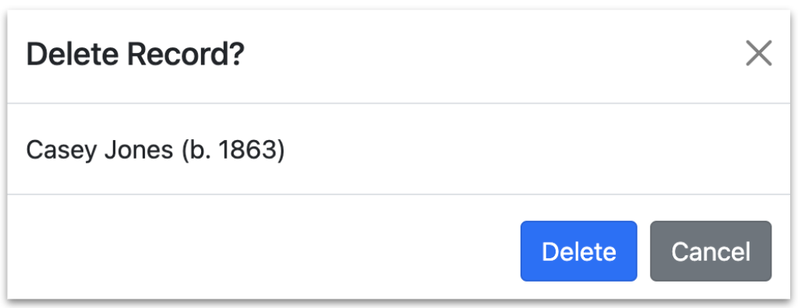
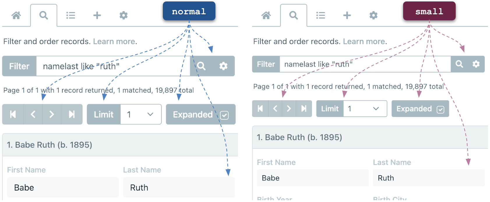

# Options

# colWidths

The `colWidths` option specifies the initial widths of columns associated with the Fields Tab, expanded records, and the Tools Tab. Valid values for the `value` property are `['narrow','medium','wide']`. Below are default values:

``` js nonum
new HHDataList({
  colWidths: {
    fields: { value: 'narrow', hasTool: true, showTool: false },
    records: { value: 'narrow', hasTool: true, showTool: false },
    tools: { value: 'narrow', hasTool: true, showTool: false }
  },
});
```

# confirm

The `confirm` option must be a function with four parameters:

``` js nonum
new HHDataList({
  confirm: (title, body, yesLabel, yesCb) => { ... },
});
```

Before performing certain actions like deleting a record, HHDataList invokes this function to enable the website to ask the user to confirm the action. HHDataList passes action-specific arguments to the function. For example, before deleting a record for a baseball player named *Casey Jones*, HHDataList might pass the following arguments to the function:

|Parameter|Argument|
|-|-|
|*title*|"Delete Record?"|
|*body*|"Casey Jones (b. 1863)"|
|*yesLabel*|"Delete"|
|*yesCb*|HHDataList internal `DELETE` function|

The job of the *confirm* function is to present the *yesLabel* to the user, obtain a response, and, if the response is affirmative, call *yesCb* with no arguments. For example, a website might display a modal:

<p></p>

If the website does not provide a *confirm* option to the HHDataList constructor, HHDataList performs all actions without pausing to ask the user for confirmations.

# contentMode

The `contentMode` option specifies the type of content displayed in the fields of expanded records. Valid values are `['type', 'string', 'value']`. Below is the default value:

``` js nonum
new HHDataList({
  contentMode: 'value,
});
```

# descriptions

The `descriptions` option specifies strings that may appear at the top of one or more tabs. Below are default values:

``` js nonum
new HHDataList({
  descriptions: {
    home: 'This is the Home Tab description.',
    search: 'This is the Search Tab description.',
    fields: 'This is the Fields Tab description.',
    tools: 'This is the Tools Tab description.',
    new: 'This is the New Tab Create Form description.',
    created: 'This is New Tab Created Form description.',
    value: false,
    hasTool: true,
    showTool: false
  },
});
```

# error

The `sss` option ...

``` js nonum
new HHDataList({
  sss: null,
});
```

# expand

The `sss` option ...

``` js nonum
new HHDataList({
  expand: {
    value: false,
    hasTool: true,
    showTool: false,
    toolLabel: 'Expand'
  },
});
```

# fieldDefinitions

The `sss` option ...

``` js nonum
new HHDataList({
  sss: null,
});
```

### manage

* popValue

### transform

# id

The `id` option specifies the id of the html element to which the HHDataList constructor should append the HHDataList component:

``` html nonum
<div id="my-datalist" class="hh-data-list"></div>
```

``` js nonum
new HHDataList({
  id: 'my-datalist',
});
```

If the option is missing, the HHDataList constructor writes the following to `console.log`:

``` nonum
HHDataList Error: The constructor requires an id option.
```

If the html element is missing, the HHDataList constructor writes the following to `console.log`:

``` nonum
HHDataList Error: The id option does not correspond to an html element on the page.
```

# info

The `sss` option ...

``` js nonum
new HHDataList({
  sss: null,
});
```

# number

The `sss` option ...

``` js nonum
new HHDataList({
  sss: null,
});
```

# parity

The `sss` option ...

``` js nonum
new HHDataList({
  sss: null,
});
```

# processMode

The `processMode` option specifies how HHDataList processes and displays REST API response record fields. Valid values for the `value` property are `['copy', 'manage', 'transform']`. Below are default values for the `hasTool` and `showTool` properties:

``` js nonum
new HHDataList({
  processMode: { value: 'copy', hasTool: true, showTool: false },
});
```

The default value for the `value` property depends on other options. If the `fieldDefinitions` option is absent, the default value is `copy`. If `fieldDefinitions.manage` is defined, the default value is `manage`. If `fieldDefinitions.transform` is defined, the default value is `transform`.

Notes about `processMode`:

1. In `copy` mode, `queryParams.fields` is never included in the request url.
1. Changing process mode from `transform` sets content mode to `string`.
1. Changing process mode to `transform` sets content mode to `value`.

# queryParams

The `sss` option ...

``` js nonum
new HHDataList({
  sss: null,
});
```

# recordIdField

The `sss` option ...

``` js nonum
new HHDataList({
  sss: null,
});
```

# recordTitle

The `sss` option ...

``` js nonum
new HHDataList({
  sss: null,
});
```

# reporters

The `sss` option ...

``` js nonum
new HHDataList({
  sss: null,
});
```

# responseHelper

The `sss` option ...

``` js nonum
new HHDataList({
  sss: null,
});
```

# small

The `small` option specifies whether HHDataList displays small controls on page load:

``` js nonum
new HHDataList({ // defaults
  small: { value: true, hasTool: true, showTool: false },
});
```

The diagram illustrates the effect of this option:

<p></p>

# themeDefinition

The `sss` option ...

``` js nonum
new HHDataList({
  sss: null,
});
```

# uniformity

The `sss` option ...

``` js nonum
new HHDataList({
  sss: null,
});
```

# url

The `sss` option ...

``` js nonum
new HHDataList({
  sss: null,
});
```

# urls

The `sss` option ...

``` js nonum
new HHDataList({
  sss: null,
});
```
