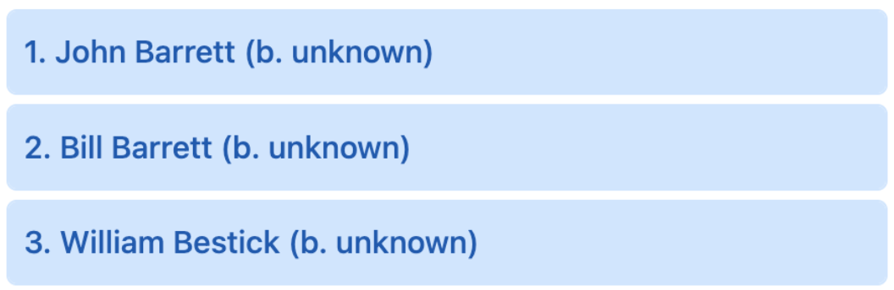

# Options

The HHDataList constructor requires an *options* argument of type *object*. Below is an example of an *options* argument:

``` js nonum
new HHDataList({
  id: 'my-data-list',
  url: `https://domain.com/api/v1/records`,
});
```

This chapter describes all possible options.

# confirm

<table class="options-table">
<tr><th>Required:</th><td><code>false</code></td></tr>
<tr><th>Type:</th><td><code>function</code></td></tr>
<tr><th>Default:</th><td><code>(title, body, yesLabel, yesCb) => { yesCb(); }</code></td></tr>
</table>

The *confirm* value must be a function with four parameters:

``` js nonum
new HHDataList({
  confirm: (title, body, yesLabel, yesCb) => { ... },
});
```

Before performing certain actions like deleting a record, HHDataList invokes this function to enable the website to ask the user to confirm the action. HHDataList passes action-specific arguments to the function. For example, before deleting a record for a baseball player named *Casey Jones*, HHDataList passes the following arguments to the function:

|Parameter|Argument|
|-|-|
|*title*|"Delete Record?"|
|*body*|"Casey Jones (b. 1863)"|
|*yesLabel*|"Delete"|
|*yesCb*|HHDataList internal `DELETE` function|

The job of the *confirm* function is to call the *yesCb* callback function if the user selects the *yesLabel*. The website can leverage its own technique for presenting the *yesLabel* to the user and obtaining a response. For example, a website might display a modal:

<p></p>

If the website does not provide a *confirm* option to the HHDataList constructor, HHDataList performs all actions without pausing to ask the user for final confirmations.

# controlsAreSmall

<table class="options-table">
<tr><th>Required:</th><td><code>false</code></td></tr>
<tr><th>Type:</th><td><code>object</code></td></tr>
<tr><th>Default:</th><td><code>{ value: false, hasUI: false }</code></td></tr>
</table>

The `controlsAreSmall` option specifies whether HHDataList displays (1) small controls on page load and (2) a checkbox on the Config Tab allowing the user to change `controlsAreSmall.value`.

``` js nonum
new HHDataList({
  controlsAreSmall: { value: false, hasUI: true }
});
```

The diagram illustrates the effect of this option:

<p></p>

The checkbox on the Config Tab looks like this:

<p></p>

# id

<table class="options-table">
<tr><th>Required:</th><td><code>true</code></td></tr>
<tr><th>Type:</th><td><code>string</code></td></tr>
</table>

The *id* value specifies the id of the html element into which the HHDataList constructor should append the HHDataList component:

``` html nonum
<div id="my-datalist" class="hh-data-list mt-4"></div>
```

``` js nonum
new HHDataList({
  id: 'my-datalist',
});
```

# queryParams

See [queryParams](/en/hhdatalist/v0.0.2/options/query-params/).

# recordColWidth

<table class="options-table">
<tr><th>Required:</th><td><code>false</code></td></tr>
<tr><th>Type:</th><td><code>string</code></td></tr>
<tr><th>Default:</th><td><code>narrow</code></td></tr>
<tr><th>Choices:</th><td><code>narrow, medium, wide</code></td></tr>
</table>

The *recordColWidth* option controls the *default* width of expanded record columns:

<p></p>

The choices are narrow, medium, and wide. The diagram above reflects a *narrow* column width as specified in this code snippet:

``` js nonum
new HHDataList({
  recordColWidth: 'narrow',
});
```

Each of the three choices accommodates responsive screen widths:

**narrow**

<p></p>

**medium**

<p></p>

**wide**

<p></p>

# recordFieldContentMode

<table class="options-table">
<tr><th>Required:</th><td><code>false</code></td></tr>
<tr><th>Type:</th><td><code>string</code></td></tr>
<tr><th>Default:</th><td><code>values</code></td></tr>
</table>

# recordFieldDefinitions

See [recordFieldDefinitions](/en/hhdatalist/v0.0.2/options/record-field-definitions/).

# recordIdField

<table class="options-table">
<tr><th>Required:</th><td><code>false</code></td></tr>
<tr><th>Type:</th><td><code>string</code></td></tr>
<tr><th>Default:</th><td><code>id</code></td></tr>
</table>

The *recordIdField* value is the field name of the unique identifier field for the records:

``` js nonum
new HHDataList({
  recordIdField: 'key',
});
```

The example above is appropriate for the following record:

``` js nonum
{
  key: '/authors/OL24638A',
  name: 'Charles Dickens',
  birth_date: '7 February 1812',
  death_date: '9 June 1870',
  alternate_names: [
    'Charles John Huffam Dickens',
    '\u30c7\u30a3\u30b1\u30f3\u30ba,\u30c1\u30e3\u30fc\u30eb\u30ba',
    'Charles Dickens, Jr.',
    'Charles Culliford Boz Dickens',
    '(ying) Digengsi',
    '(ying) Di, geng si'
  ],
  wikipedia: 'http://en.wikipedia.org/wiki/Charles_Dickens'
}
```

# recordParity

<table class="options-table">
<tr><th>Required:</th><td><code>false</code></td></tr>
<tr><th>Type:</th><td><code>object</code></td></tr>
<tr><th>Default:</th><td><code>{ value: false, hasUI: false }</code></td></tr>
</table>

``` js nonum
new HHDataList({
  recordParity: { value: true, hasUI: true },
});
```

Record parity is a characteristic of a *getRecords* operation. If a particular *getRecords* operation can return all the record properties for all records that the corresponding *getRecord* operation can for a single record, then *recordParity* is *true* for that *getRecords* operation. Here, for example, is the response data from a *getRecords* operation possessing record parity:

``` json nonum
{
  "records": [
    { /* any or all record properties */ },
    { /* any or all record properties */ },
    { /* any or all record properties */ },
    { /* any or all record properties */ },
    { /* any or all record properties */ }
  ]
}
```

And, here is the response data from the corresponding *getRecord* operation:

``` json nonum
{ /* any or all record properties */ }
```

HHDataList displays a page of expanded records differently depending on whether the underlying *getRecords* operation possesses record parity. If so, HHDataList, through a single call to *getRecords*, obtains all the data it needs to display a page of expanded records. If not, HHDataList calls *getRecords* to return an array of barebones records, and then it calls *getRecord* for each record in the array to return and display record properties.

So, if you know that the *getRecords* operation of the underlying API can return all the record properties that the *getRecord* operation can, then you can set this option to *true* thus enabling HHDataList to use a more efficient technique for scrolling expanded pages of records.

# recordProcessingMode

<table class="options-table">
<tr><th>Required:</th><td><code>false</code></td></tr>
<tr><th>Type:</th><td><code>string</code></td></tr>
<tr><th>Default:</th><td><code>transformed</code></td></tr>
</table>

If the `options` argument does not include `recordProcessingMode`, or if `recordProcessingMode` does not include a `value` property, then HHDataList uses the following criteria to determine `recordProcessingMode.value`:

1. If `fieldDefinitions` includes a `transform` array, then `recordProcessingMode.value = 'transform'`. 
1. Else if `fieldDefinitions` includes a `manage` array, then `recordProcessingMode.value = 'manage'`.
1. Else `recordProcessingMode.value = 'copy'`.

If the `options` argument does not include `recordProcessingMode`, or if `recordProcessingMode` does not include a `hasUI` property, then HHDataList sets `recordProcessingMode.hasUI = false`.

``` js nonum
new HHDataList({
  recordProcessingMode: { value: 'transform', hasUI: true },
});
```

# recordsAreExpanded

<table class="options-table">
<tr><th>Required:</th><td><code>false</code></td></tr>
<tr><th>Type:</th><td><code>object</code></td></tr>
<tr><th>Default:</th><td><code>{ value: false, hasUI: true }</code></td></tr>
</table>

The *recordsAreExpanded* option specifies whether records are collapsed or expanded on page load:

``` js nonum
new HHDataList({
  recordsAreExpanded: { value: false, hasUI: true },
});
```

These records are collapsed:

<p></p>

These records are expanded:

<p></p>

The user can check or uncheck the *Expander* button to alter this setting.

# recordsAreNumbered

<table class="options-table">
<tr><th>Required:</th><td><code>false</code></td></tr>
<tr><th>Type:</th><td><code>object</code></td></tr>
<tr><th>Default:</th><td><code>{ value: true, hasUI: true }</code></td></tr>
</table>

The `recordsAreNumbered` option specifies whether HHDataList displays (1) record numbers on page load and (2) a checkbox on the Config Tab allowing the user to change `recordsAreNumbered.value`.

``` js nonum
new HHDataList({
  recordsAreNumbered: {
    value: true,
    hasUI: true
  },
});
```

These records are numbered:

<p></p>

These records are unnumbered:

<p></p>

The checkbox on the Config Tab looks like this:

<p></p>

# recordsHaveAllFields

<table class="options-table">
<tr><th>Required:</th><td><code>false</code></td></tr>
<tr><th>Type:</th><td><code>object</code></td></tr>
<tr><th>Default:</th><td><code>{ value: true, hasUI: true, fieldValue: '' }</code></td></tr>
</table>

Checked fields on the *Fields* tab dictate which fields to return for expanded records:

<p></p>

However, some APIs do not return all fields for all records, even if the fields are checked on the Fields tab:

<p></p>

The *recordsHaveAllFields* option provides a means of instructing HHDataList to display a field label and a field value for each field that, though checked on the Fields tab, does not exist in a particular returned record:

``` js nonum
new HHDataList({
  recordsHaveAllFields: { value: true, hasUI: true, fieldValue: 'No data' },
});
```

An included missing field might look like this:

<p></p>

# recordTitle

<table class="options-table">
<tr><th>Required:</th><td><code>false</code></td></tr>
<tr><th>Type:</th><td><code>object</code></td></tr>
<tr><th>Default:</th><td><code>{ fields: [options.recordIdField],  format: (fields, record) => { return record[fields[0]]; }}</code></td></tr>
</table>

The *recordTitle* object specifies the list and arrangement of record fields that compose record titles:

``` js nonum
new HHDataList({
  recordTitle: {
    fields: ['nameFirst', 'nameLast', 'birthYear'],
    format: (fields, record) => `${record[fields[0]]} ${record[fields[1]]} (b. ${record[fields[2]]})`
  },
});
```

The example above arranges the *namefirst*, *namelast*, and *birthyear* record fields to produce the following titles:

<p></p>

You can support `null` field values with conditionals:

``` js nonum
`(b. ${record[fields[2]] ? record[fields[2]] : 'unknown'})`
```

<p></p>

If you do not specify a *recordTitle* option, HHDataList uses the `options.recordIdField` field for the record title:

<p></p>

# reportError

<table class="options-table">
<tr><th>Required:</th><td><code>false</code></td></tr>
<tr><th>Type:</th><td><code>function</code></td></tr>
<tr><th>Default:</th><td><code>(title, detail) => { }</code></td></tr>
</table>

HHDataList invokes the client-defined *reportError* function (if specified) when HHDataList encounters an error:

``` js nonum
const dataList = new HHDataList({
  reportError: (title, detail) => { reportError(title, detail); },
});
```

`reportError(title, detail)` is a client-defined error handler that might, for example, display a *toast* component like this:

<p></p>

The *More* link is not part of the *detail* string. It is, rather, built by this particular client-defined function.

# reportRecordFieldDefinitions

``` nonum
const dataList = new HHDataList({
  reportRecordFieldDefinitions: {
    function: (fieldDefs) => { console.log(JSON.stringify(fieldDefs, null, 2)); },
    hasUI: true
  },
});
```

# reportInfo

<table class="options-table">
<tr><th>Required:</th><td><code>false</code></td></tr>
<tr><th>Type:</th><td><code>function</code></td></tr>
<tr><th>Default:</th><td><code>(title, detail) => { }</code></td></tr>
</table>

HHDataList invokes the client-defined *reportInfo* function (if specified) when HHDataList completes certain tasks:

``` js nonum
const dataList = new HHDataList({
  reportInfo: (title, detail) => { reportInfo(title, detail); },
});
```

`reportInfo(title, detail)` is a client-defined message handler that might, for example, display a *toast* component like this:

<p></p>

# reportTheme

<table class="options-table">
<tr><th>Required:</th><td><code>false</code></td></tr>
<tr><th>Type:</th><td><code>function</code></td></tr>
<tr><th>Default:</th><td><code>(theme) => { }</code></td></tr>
</table>

The *reportTheme* option is a debugging tool. If you specify a *reportTheme* function, the HHDataList constructor calls the function, passing the theme object of the HHDataList instance. Usually, a *reportTheme* function calls `console.log`:

``` nonum
const dataList = new HHDataList({
  reportTheme: {
    function: (theme) => { 
      const t1 = JSON.stringify(theme, null, 2);
      const t2 = t1.replace(/"([^"]+)":/g, '$1:');
      const t3 = t2.replace(/"/g, "'");      
      console.log(t3);
    },
    hasUI: true
  },
});
```

Output is a full theme object. The following snippet shows only the first few properties of a theme object:

``` nonum
{
  name: 'My Theme',
  tabButtonColor: 'red',
  tabBorderColor: '#0059b3',
  controlColor: '#ffffff',
  controlColorHover: '#ffffff',
  controlBorderColor: '#0073e6',
  controlBorderColorHover: '#0059b3',
  ...
  ...
}
```

To learn more, see [Themes](/en/hhdatalist/v0.0.2/reference/themes/).

# responseHelper

See [responseHelper](/en/hhdatalist/v0.0.2/options/response-helper/).

# selectableFieldColWidth

<table class="options-table">
<tr><th>Required:</th><td><code>false</code></td></tr>
<tr><th>Type:</th><td><code>string</code></td></tr>
<tr><th>Default:</th><td><code>narrow</code></td></tr>
<tr><th>Choices:</th><td><code>narrow, medium, wide</code></td></tr>
</table>

The *selectableFieldColWidth* option controls the width of the fields on the Fields tab:

<p></p>

The choices are *narrow*, *medium*, and *wide*. The diagram above reflects a *narrow* field column width as specified in this code snippet:

``` js nonum
new HHDataList({
  selectableFieldColWidth: 'narrow',
});
```

Each of the three choices accommodates responsive screen widths:

**narrow**

<p></p>

**medium**

<p></p>

**wide**

<p></p>

# tabDescriptions

<table class="options-table">
<tr><th>Required:</th><td><code>false</code></td></tr>
<tr><th>Type:</th><td><code>object</code></td></tr>
<tr><th>Default:</th><td><code>null</code></td></tr>
</table>

The *tabDescriptions* object specifies custom descriptions for one or more tabs:

``` js nonum
const dataList = new HHDataList({
  tabDescriptions: {
      home: 'These words appear on the Home tab.',
      search: 'These words appear on the Search tab.',
      fields: 'These words appear on the Fields tab.',
      new: 'These words appear on the New tab above the New Form.',
      created: 'These words appear on the New tab above the Created Form.',
      config: 'These words appear on the Config tab.'
    },
});
```

The following diagram shows a tab description:

<p></p>

The *tabDescriptions* object can include only one or a few properties, and descriptions can include HTML:

``` js nonum
const dataList = new HHDataList({
  tabDescriptions: {
      home: 'Manage baseball player records in the <a href="https://www.seanlahman.com/baseball-archive/statistics/">Lahman Baseball Dataset</a>.'
    },
});
```

The *tabDescription* object above might render like this:

<p></p>

# tabsHaveDescriptions

<table class="options-table">
<tr><th>Required:</th><td><code>false</code></td></tr>
<tr><th>Type:</th><td><code>object</code></td></tr>
<tr><th>Default:</th><td><code>{ value: true, hasUI: true }</code></td></tr>
</table>

The `tabsHaveDescriptions` option specifies whether HHDataList displays (1) tab descriptions on page load and (2) a checkbox on the Config Tab allowing the user to change `tabsHaveDescriptions.value`.

``` js nonum
new HHDataList({
  tabsHaveDescriptions: {
    value: true,
    hasUI: true
  },
});
```

The following diagram shows a tab description:

<p></p>

The checkbox on the Config Tab looks like this:

<p></p>

# theme

<table class="options-table">
<tr><th>Required:</th><td><code>false</code></td></tr>
<tr><th>Type:</th><td><code>object</code></td></tr>
</table>

The *theme* option is one of many ways to apply a theme to an HHDataList instance (see [Themes](/en/hhdatalist/v0.0.2/reference/themes/)):

``` js nonum
new HHDataList({
  theme: {
    name: 'My Red Theme',
    tabButtonColor: '#961d1d',
    tabBorderColor: '#961d1d',
    controlColor: '#ffffff',
    controlColorHover: '#ffffff',
    controlBorderColor: '#da3e3e',
    ...
  },
});
```

# themeName

<table class="options-table">
<tr><th>Required:</th><td><code>false</code></td></tr>
<tr><th>Type:</th><td><code>object</code></td></tr>
</table>

The *themeName* option is one of many ways to apply a theme to an HHDataList instance (see [Themes](/en/hhdatalist/v0.0.2/reference/themes/)):

``` js nonum
new HHDataList({
  themeName: { value: 'firebrick', hasUI: true },
});
```

# themeFromThemeName

<table class="options-table">
<tr><th>Required:</th><td><code>false</code></td></tr>
<tr><th>Type:</th><td><code>object</code></td></tr>
</table>

The *themeFromThemeName* option is one of many ways to apply a theme to an HHDataList instance (see [Themes](/en/hhdatalist/v0.0.2/reference/themes/)):

``` js nonum
new HHDataList({
  themeFromThemeName: {
    themeName: 'Silverberry',
    newThemeName: 'My Silverberry Theme',
    overrides: {
      tabButtonColor: 'red'
    }
  },
});
```

# themeFromPaletteName

<table class="options-table">
<tr><th>Required:</th><td><code>false</code></td></tr>
<tr><th>Type:</th><td><code>object</code></td></tr>
</table>

The *themeFromPaletteName* option is one of many ways to apply a theme to an HHDataList instance (see [Themes](/en/hhdatalist/v0.0.2/reference/themes/)):

``` js nonum
new HHDataList({
  themeFromPaletteName: {
    paletteName: 'Silverberry',
    newThemeName: 'My Silverberry Theme',
    overrides: {
      tabButtonColor: 'blue'
    }
  },
});
```

# themeFromPalette

<table class="options-table">
<tr><th>Required:</th><td><code>false</code></td></tr>
<tr><th>Type:</th><td><code>object</code></td></tr>
</table>

The *themeFromPalette* option is one of many ways to apply a theme to an HHDataList instance (see [Themes](/en/hhdatalist/v0.0.2/reference/themes/)):

``` js nonum
new HHDataList({
  themeFromPalette: {
    palette: {
      color1: '#ffffff',
      color2: '#fcf5e8',
      color3: '#f9ebd2',
      color4: '#f6e2bb',
      color5: '#e29d1d',
      color6: '#875e12'
    },
    newThemeName: 'My Silverberry',
    overrides: {
      tabButtonColor: 'green'
    }
  },
});
```

# url

<table class="options-table">
<tr><th>Required:</th><td><code>false</code></td></tr>
<tr><th>Type:</th><td><code>string</code></td></tr>
</table>

The *url* option specifies the base endpoint for all API operations. While the *url* option is not required, the *options* argument passed to the HHDataList constructor must specify either a *url* or a *urls* option:

``` js nonum
new HHDataList({
  url: `https://domain.com/api/v1/records`,
});
```

The HHDataList constructor, making certain assumptions, uses the *url* option to build operation-specific endpoints. Here are examples (using the url specified above):

|Operation|Endpoint|
|-|-|
|`DELETE`|`https://domain.com/api/v1/records/${options.recordIdField}`|
|`GET ONE`|`https://domain.com/api/v1/records/${options.recordIdField}`|
|`GET MANY`|`https://domain.com/api/v1/records`|
|`PATCH`|`https://domain.com/api/v1/records/${options.recordIdField}`|
|`POST`|`https://domain.com/api/v1/records`|
|`PUT`|`https://domain.com/api/v1/records/${options.recordIdField}`|

# urls

<table class="options-table">
<tr><th>Required:</th><td><code>false</code></td></tr>
<tr><th>Type:</th><td><code>object</code></td></tr>
</table>

The *urls* object specifies the endpoints for all API operations. While the *urls* option is not required, the *options* argument passed to the HHDataList constructor must specify either a *url* or a *urls* option:

``` js nonum
new HHDataList({
  urls: {
    deleteRecord: (id) => `https://domain.com/api/v1/records/${id}`,
    getRecord: (id) => `https://domain.com/api/v1/records/${id}`,
    getRecords: `https://domain.com/api/v1/records`,
    patchRecord: (id) => `https://domain.com/api/v1/records/${id}`,
    postRecord: `https://domain.com/api/v1/records`,
    putRecord: (id) => `https://domain.com/api/v1/records/${id}`
  },
});
```

HHDataList passes `options.recordIdField` as the `id` argument to the client-defined functions in the `urls` object.

If the HHDataList instance supports only `GET` operations, the `urls` object need only specify `GET` properties:

``` js nonum
new HHDataList({
  urls: {
    getRecord: (id) => `https://openlibrary.org${id}.json`,
    getRecords: `https://openlibrary.org/search.json`
  },
});
```
