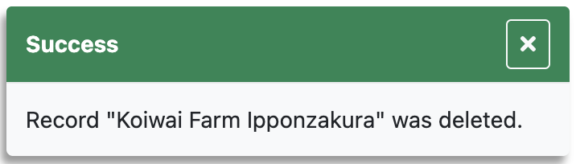

# info

<table class="options-table"><tr><th>Optional, but recommended</th></tr></table>

The `info` option specifies a function for HHDataList to call when reporting successes and warnings.

# Example

HHDataList passes three action-specific arguments to the `info` function: `code`, `title`, and `message`. HHDataList uses `code` to pass `0` for success and `1` for warning. `info` functions can use `code` to make display decisions (e.g. green for success and orange for warning).

``` js nonum
// developer-defined
const reportInfo = (code, title, message) => {
  showToast(code === 0 ? 'info' : 'warning', title, detail);
};
 
new HHDataList({
  info: reportInfo,
});
```

For example, after deleting a record for a baseball player named *Casey Jones*, HHDataList might pass the following arguments to the function:

|Parameter|Argument|
|-|-|
|*code*|0|
|*title*|Success|
|*message*|Record "Koiwai Farm Ipponzakura" was deleted.|

It is up to the website to decide how to display the information. Below is an example:

<p></p>

If the website does not provide an *info* option to the HHDataList constructor, HHDataList does not report the information.