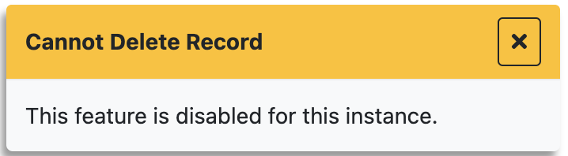

# methods

<table class="options-table"><tr><th>Optional</th></tr></table>

The `methods` option enables a website to replace one, two, or three native HHDataList functions with user-defined functions that do not accept arguments.

# Examples

## Example 1

This is a generic example.

``` js nonum
new HHDataList({
  deleteRecord: () => { /* Replace HHDataList native functionality. */ },
  patchRecord: () => { /* Replace HHDataList native functionality. */ },
  postRecord: () => { /* Replace HHDataList native functionality. */ }
});
```

## Example 2

The hagenhaus.com website uses the `methods` option to replace core functionality with warnings for some HHDataList instances:

``` js nonum
new HHDataList({
  deleteRecord: () => { reportWarning('Cannot Delete Record', 'This feature is disabled for this instance.'); },
  patchRecord: () => { reportWarning('Cannot Modify Record Field', 'This feature is disabled for this instance.'); },
  postRecord: () => { reportWarning('Cannot Create Record', 'This feature is disabled for this instance.'); }
});
```

So, attempting to create or delete a record, or modify a record field, produces a message similar to the following:

<p></p>