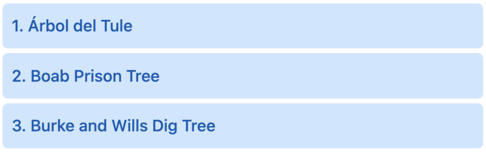
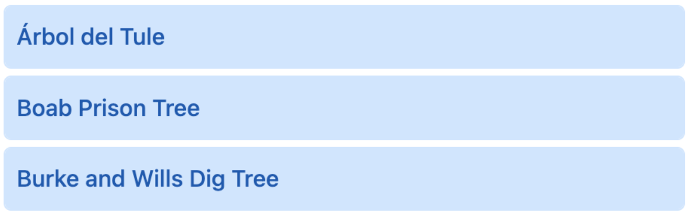

# number

<table class="options-table">
  <tr>
    <th>Necessity:</th>
    <td>Optional</td>
  </tr>
</table>

The `number` option ...

``` js nonum
new HHDataList({
  number: '',
});
```

# Old Stuff

These records are numbered:

<p></p>

These records are unnumbered:

<p></p>