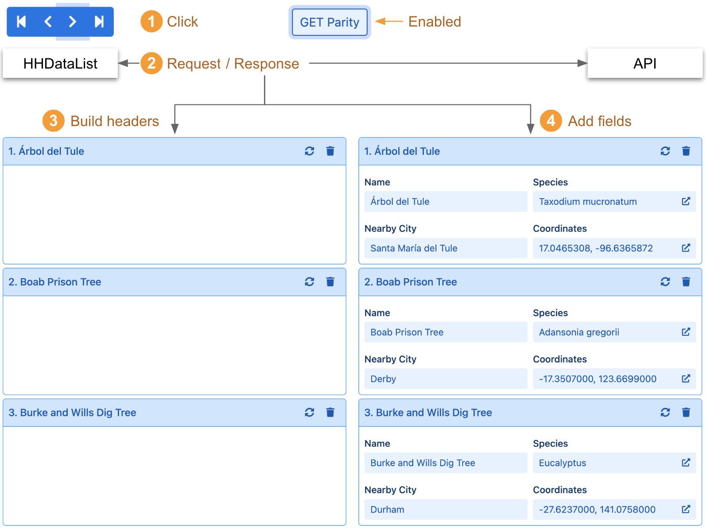
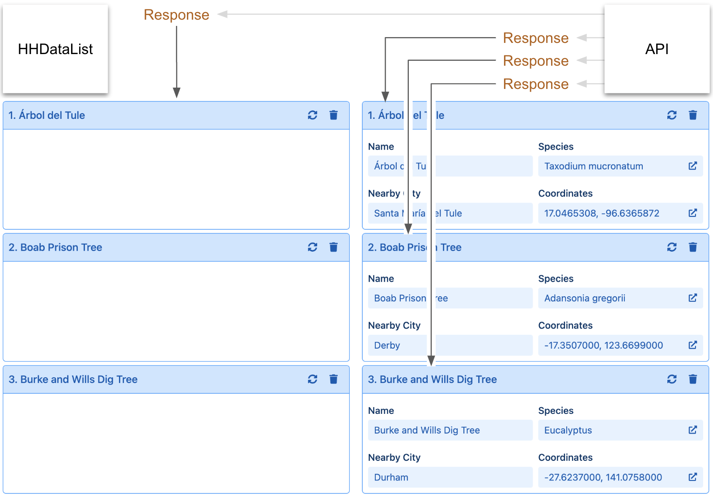

# parity

<table class="options-table"><tr><th>optional</th></tr></table>

The `parity` option provides websites with a way of informing HHDataList whether the underlying API possesses certain capabilities that HHDataList can leverage to operate more efficiently when scrolling expanded records and/or displaying created records. The option also controls the existence, visibility, and label of the corresponding `GET Parity` and `POST Parity` tools. 

# Example

The following example shows the default values:

``` js nonum
new HHDataList({
  parity: { 
    get: { value: false, hasTool: true, showTool: false, toolLabel: 'GET Parity' }, 
    post: { value: false, hasTool: true, showTool: false, toolLabel: 'POST Parity' } 
  },
});
```

# What is record parity?

With `parity.get.value` set to `true`, when a user (1) clicks on any of the *Paginator* arrows to scroll **expanded** records, HHDataList assumes that a single call to (2) `getRecords` will return all the data needed to (3) build the expanded record headers **and** (4) add all record fields. The diagram illustrates:

<p></p>

The *getRecords* operations of some APIs possess the capability to return all (not just a subset of) the record fields that their *getRecord* counterparts can. This capability is called `GET` record parity. If an underlying API possesses record parity, and if HHDataList knows it, HHDataList scrolls expanded records with one `getRecords` operation per page as in the diagram above. Otherwise, it must call `getRecords` to build the record headers, and `getRecord` repeatedly, once for each record, to add fields as in the diagram below:

<p></p>

So, if an underlying API possesses record parity, developers can, via the `parity` option, tell HHDataList to take advantage of this capability.

# Demonstration

You can demo record parity to yourself using the HHDataList instance below. Note that the Famous Trees API possesses record parity. Note also that `GET` Parity is enabled. Follow these steps:

1. Open your browser's Developer Tools to view the Console (and consider clearing the console).
1. Click one of the Paginator arrows once to scroll. This causes HHDataList to issue a single `GET` request that returns all data needed to build the record headers and add the record fields.
1. Click the `GET Parity` toggle to turn off parity.
1. Click one of the Paginator arrows again. This time, ignoring the fact that the underlying API possesses record parity, HHDataList issues four `GET` requests, one to build the record headers, and three (one for each record) to add record fields.

<div id="record-parity-datalist" class="hh-data-list my-4"></div>
<script>
  var options = new DLTreesOptions002('record-parity-datalist');
  options.expand.showTool = false;
  options.expand.value = true;
  var show = ['Name', 'Species', 'Nearby City', 'Coordinates'];
  for(fd of options.fieldDefinitions.transform) {
    if(show.includes(fd.label)) { fd.isChecked = true; }
    else { fd.isChecked = false; }
  }
  options.parity.get.showTool = true;
  options.queryParams.limit.showTool = false;
  options.reporters.requests.showTool = true;
  options.reporters.requests.value = true;
  options.themeDefinition.name = 'shadowbox';
  new HHDataList(options);
</script>