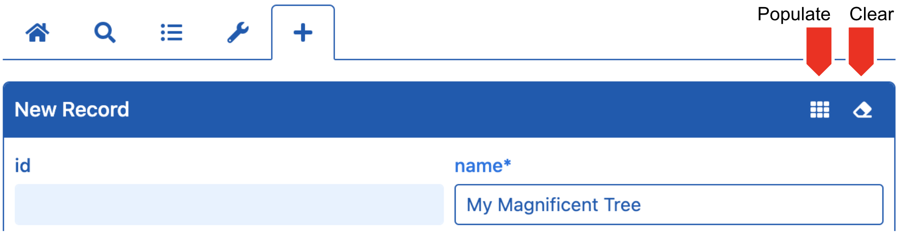

# populate

<table class="options-table"><tr><th>Optional</th></tr></table>

The HHDataList *New Record* form includes *Populate* and *Clear* buttons:

<p></p>

When a user clicks the *Populate* button, HHDataList attempts to populate the field in two ways: 

1. It checks to see if the corresponding `manage` field definition has a `popValue` property and, if so, it uses the property value to populate the field (see the [fieldDefinitions](/en/hhdatalist/v0.0.2/options/fielddefinitions/) option).

1. Else, it checks to see if a `populate` developer-defined function exists and, if so, it passes the `fieldName` to the function which returns a populate value. 

The `populate` option, then, specifies a function that accepts a record field name, and returns a populate value.

# Examples

## Example 1

This is a generic example:

``` js nonum
new HHDataList({
  populate: (fieldName) => // return a populate value
});
```

## Example 2

This example shows how hagenhaus.com populates the Famous Trees *New Record* form:

``` js nonum
popValues = new Map()
  .set('name', 'Koiwai Farm Ipponzakura')
  .set('species', `{"link":"https://en.wikipedia.org/wiki/Prunus_serrulata","text":"Prunus serrulata"}`)
  .set('description', `The solitary cherry tree stands in Koiwai Farm, a privately owned farm not far from Iwate's capital city Morioka (盛岡市 Morioka-shi). With over 500,000 visitors annually, the farm is immensely popular among the locals, and has been around since its establishment in 1891. In fact, the tree was said to be planted over 100 years ago too, and since then many people have visited the farm during different seasons just to see it. But among all the seasons, spring is often considered the best to see the tree in its full glory.`)
  .set('city', 'Morioka')
  .set('country', 'JPN')
  .set('lat', '39.7560461061616')
  .set('lng', '141.004011260734')
  .set('birthYear', '1922')
  .set('height', '0')
  .set('girth', '0')
  .set('links', `[{"link":"https://japanrailtimes.japanrailcafe.com.sg/web/article/seasons/sakura-series-4","text":"Japan Rail Cafe"},{"link":"https://www.koiwai.co.jp/makiba/","text":"Koiwai Farm"}]`);
 
new HHDataList({
  populate: (fieldName) => this.popValues.get(fieldName);
});
```

To see this in action, click the *New* tab, and then click the *Populate* button:

<div id="famous-trees-datalist" class="hh-data-list"></div>
<script>
  var options = new DLTreesOptions002('famous-trees-datalist');
  options.expand.showTool = false;
  options.queryParams.limit.showTool = false;
  new HHDataList(options);
</script>