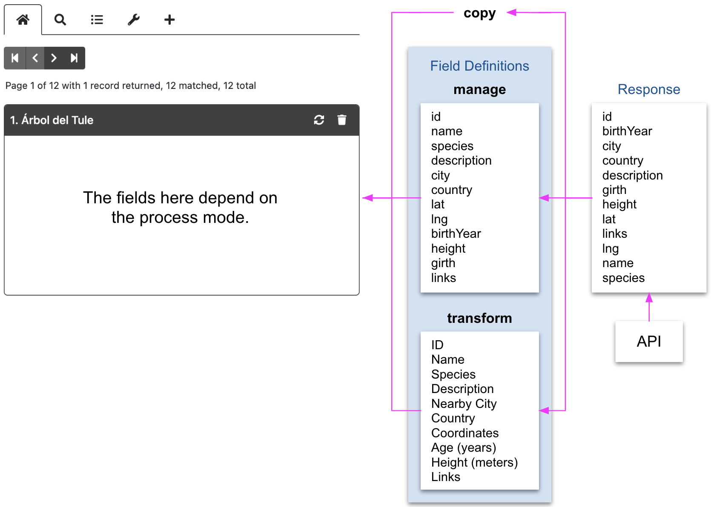
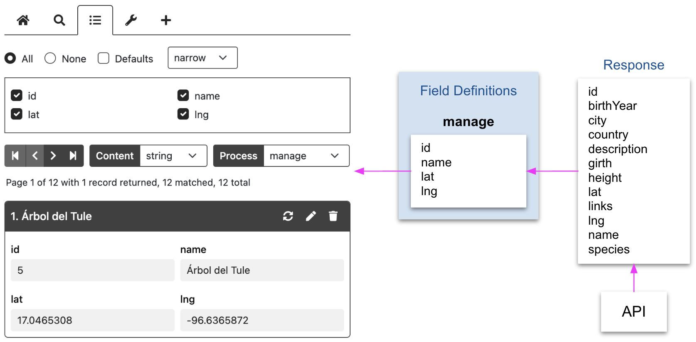

# processMode

<table class="options-table"><tr><th>Optional</th></tr></table>

The `processMode` option controls which data pipeline HHDataList uses to move record data from an API response to expanded records. The option also controls the existence, visibility, and label of the corresponding `Process` tool. 

# Example

The following example shows the defaults:

``` js nonum
new HHDataList({
  processMode: { value: 'copy', hasTool: true, showTool: false, toolLabel: 'Process' },
});
```

`processMode.value` can be `copy`, `manage`, or `transform`. The default value for `processMode.value` depends on the [fieldDefinitions](/en/hhdatalist/v0.0.2/options/fielddefinitions/) option. If `fieldDefinitions` is absent, the `processMode.value` default value is `copy`. If `fieldDefinitions.manage` is defined, the `processMode.value` default value is `manage`. If `fieldDefinitions.transform` is defined, the `processMode.value` default value is `tranform`. 

Additional notes:

1. In `copy` mode, `queryParams.fields` is never included in the request url.
1. Changing process mode from `transform` sets content mode to `string`.
1. Changing process mode to `transform` sets content mode to `value`.

# Demonstration

To view these modes in action, try changing the *Process* dropdown in the HHDataList instance below:

<div id="datalist" class="hh-data-list my-4"></div>
<script>
  var options = new DLTreesOptions002('datalist');
  options.contentMode.showTool = true;
  options.descriptions.value = false;
  options.expand.showTool = false;
  options.expand.value = true;
  options.processMode.showTool = true;
  options.processMode.value = 'copy';
  options.queryParams.limit.default = 1;
  options.queryParams.limit.showTool = false;
  options.themeDefinition.name = 'shadowbox';
  new HHDataList(options);
</script>

With the *Árbol del Tule* record displayed, note the following:

1. In **copy** mode, the *Fields* tab is absent because, as illustrated in the [Diagrams](#diagrams) below, *copy* mode does not have any [fieldDefinitions](/en/hhdatalist/v0.0.2/options/fielddefinitions/).

1. In **manage** mode, the *Fields* tab is present because *manage* mode has [fieldDefinitions](/en/hhdatalist/v0.0.2/options/fielddefinitions/) to control the appearance and order of record fields. Also, the *Edit* button is present in the record header. Note that the *country* record field value is `MEX`. Note also the presence of the *lat* and *lng* record fields.

1. In **transform** mode, the *Fields* tab is also present because *transform* mode has [fieldDefinitions](/en/hhdatalist/v0.0.2/options/fielddefinitions/), too, ones with different capabilities. The record field labels are uppercased. The *Country* record field value is now `Mexico` because the corresponding *fieldDefinition* performed a GET operation. The *Coordinates* field has replace the *lat* and *lng* record fields, and the field value is a link. 

# Process Mode Diagram

In *copy* mode, HHDataList moves data from an API response to an expanded record unchanged. In *manage* mode, HHDataList uses *manage* [fieldDefinitions](/en/hhdatalist/v0.0.2/options/fielddefinitions/) to order and filter fields. In *transform* mode, HHDataList uses *transform* [fieldDefinitions](/en/hhdatalist/v0.0.2/options/fielddefinitions/) to order, filter, rename, merge, and transform fields:

<p></p>

# Capabilities

The sections below describe which HHDataList capabilities (related to the processing of API responses) are available with each of the three processing modes.

## Process fields

<table class="options-table">
  <tr>
  <th style="padding-right:0;"><i class="fas fa-check-circle"></i></th><th style="padding-left:3px;">copy</th>
  <th style="padding-right:0;"><i class="fas fa-check-circle"></i></th><th style="padding-left:3px;">manage</th>
  <th style="padding-right:0;"><i class="fas fa-check-circle"></i></th><td style="padding-left:3px;">transform</td>
  </tr>
</table>

To process fields means to obtain the names and values of API record fields, optionally apply changes, and then display the results in an HHDataList expanded record. All modes exhibit this capability. 

## Filter fields

<table class="options-table">
  <tr>
  <th style="padding-right:0;"><i class="far fa-circle"></i></th><th style="padding-left:3px;">copy</th>
  <th style="padding-right:0;"><i class="fas fa-check-circle"></i></th><th style="padding-left:3px;">manage</th>
  <th style="padding-right:0;"><i class="fas fa-check-circle"></i></th><td style="padding-left:3px;">transform</td>
  </tr>
</table>

To filter fields means to remove certain fields from the processing pipeline. Both *manage* and *transform* modes can, by omitting certain fieldDefinitions, cause HHDataList to filter fields. In the diagram below, the `manage` field definitions array filters out all source API response record fields except four:

<p></p>

## Reorder fields

<table class="options-table">
  <tr>
  <th style="padding-right:0;"><i class="far fa-circle"></i></th><th style="padding-left:3px;">copy</th>
  <th style="padding-right:0;"><i class="fas fa-check-circle"></i></th><th style="padding-left:3px;">manage</th>
  <th style="padding-right:0;"><i class="fas fa-check-circle"></i></th><td style="padding-left:3px;">transform</td>
  </tr>
</table>

To reorder fields means to display expanded record fields in a different order than they appeared in API records. Both *manage* and *transform* modes can, by defining fieldDefinitions in a particular order, direct HHDataList to reorder fields.

## Rename fields

<table class="options-table">
  <tr>
  <th style="padding-right:0;"><i class="far fa-circle"></i></th><th style="padding-left:3px;">copy</th>
  <th style="padding-right:0;"><i class="far fa-circle"></i></th><th style="padding-left:3px;">manage</th>
  <th style="padding-right:0;"><i class="fas fa-check-circle"></i></th><td style="padding-left:3px;">transform</td>
  </tr>
</table>

To rename fields means to replace API field names with different names in expanded records. Only *transform* mode can cause HHDataList to rename fields. 

## Edit fields

<table class="options-table">
  <tr>
  <th style="padding-right:0;"><i class="far fa-circle"></i></th><th style="padding-left:3px;">copy</th>
  <th style="padding-right:0;"><i class="fas fa-check-circle"></i></th><th style="padding-left:3px;">manage</th>
  <th style="padding-right:0;"><i class="far fa-circle"></i></th><td style="padding-left:3px;">transform</td>
  </tr>
</table>

To edit a field means to display, in an expanded record header, a pencil icon that, when clicked, changes the appearance of *editable* expanded record fields and adds a save button next to each. Only *manage* mode exhibits this capability.

## Add fields

<table class="options-table">
  <tr>
  <th style="padding-right:0;"><i class="far fa-circle"></i></th><th style="padding-left:3px;">copy</th>
  <th style="padding-right:0;"><i class="fas fa-check-circle"></i></th><th style="padding-left:3px;">manage</th>
  <th style="padding-right:0;"><i class="fas fa-check-circle"></i></th><td style="padding-left:3px;">transform</td>
  </tr>
</table>

To add fields means to display fields in an expanded record that did not exist in the API response. See the [uniformity](/en/hhdatalist/v0.0.2/options/uniformity/) option. Both *manage* and *transform* modes exhibit this capability. 

## Merge fields

<table class="options-table">
  <tr>
  <th style="padding-right:0;"><i class="far fa-circle"></i></th><th style="padding-left:3px;">copy</th>
  <th style="padding-right:0;"><i class="far fa-circle"></i></th><th style="padding-left:3px;">manage</th>
  <th style="padding-right:0;"><i class="fas fa-check-circle"></i></th><td style="padding-left:3px;">transform</td>
  </tr>
</table>

To merge fields means to create an expanded record field that represents two or more API record fields (e.g. *Coordinates* field from the *lat* and *lng* fields). Only *transform* mode can direct HHDataList to do this. 

## Transform fields

<table class="options-table">
  <tr>
  <th style="padding-right:0;"><i class="far fa-circle"></i></th><th style="padding-left:3px;">copy</th>
  <th style="padding-right:0;"><i class="far fa-circle"></i></th><th style="padding-left:3px;">manage</th>
  <th style="padding-right:0;"><i class="fas fa-check-circle"></i></th><td style="padding-left:3px;">transform</td>
  </tr>
</table>

To transform fields means to change field values. Changing `MEX` to `Mexico` via an API GET operation to a *Country Codes* API is an example. Only *transform* mode can direct HHDataList to do this. 

## Specify displays

<table class="options-table">
  <tr>
  <th style="padding-right:0;"><i class="far fa-circle"></i></th><th style="padding-left:3px;">copy</th>
  <th style="padding-right:0;"><i class="far fa-circle"></i></th><th style="padding-left:3px;">manage</th>
  <th style="padding-right:0;"><i class="fas fa-check-circle"></i></th><td style="padding-left:3px;">transform</td>
  </tr>
</table>

To specify displays means to display expanded record fields using an HTML element other than a *disabled* `INPUT` element. Currently, the alternatives are `TEXT` and `SELECT`. Only *transform* mode can direct HHDataList to do this. 

## Create records

<table class="options-table">
  <tr>
  <th style="padding-right:0;"><i class="fas fa-check-circle"></i></th><th style="padding-left:3px;">copy</th>
  <th style="padding-right:0;"><i class="fas fa-check-circle"></i></th><th style="padding-left:3px;">manage</th>
  <th style="padding-right:0;"><i class="fas fa-check-circle"></i></th><td style="padding-left:3px;">transform</td>
  </tr>
</table>

To create records means to display the *plus* icon tab. The current process mode does not influence whether the *plus* tab is visible. Rather, the existence of *manage* [fieldDefinitions](/en/hhdatalist/v0.0.2/options/fielddefinitions/) determines whether the *plus* tab is visible. 

## Delete records

<table class="options-table">
  <tr>
  <th style="padding-right:0;"><i class="fas fa-check-circle"></i></th><th style="padding-left:3px;">copy</th>
  <th style="padding-right:0;"><i class="fas fa-check-circle"></i></th><th style="padding-left:3px;">manage</th>
  <th style="padding-right:0;"><i class="fas fa-check-circle"></i></th><td style="padding-left:3px;">transform</td>
  </tr>
</table>

No process mode prevents users from deleting records. Other factors, however, may. See [url](/en/hhdatalist/v0.0.2/options/url/) and [urls](/en/hhdatalist/v0.0.2/options/urls/).