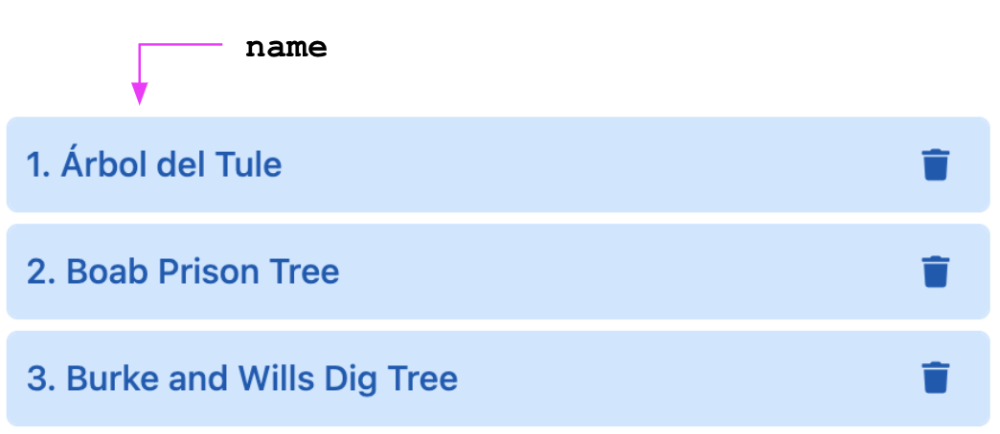
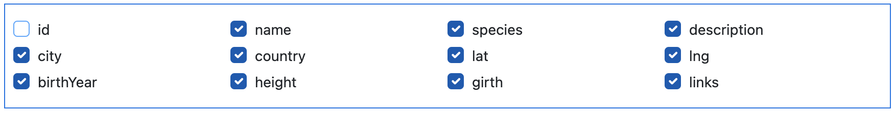
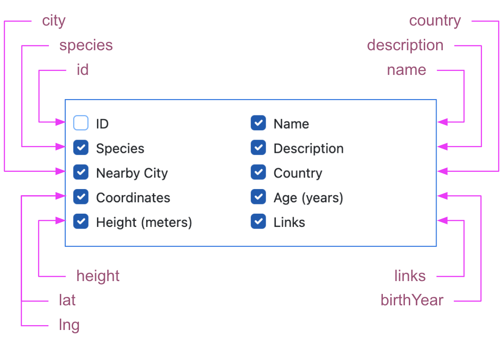
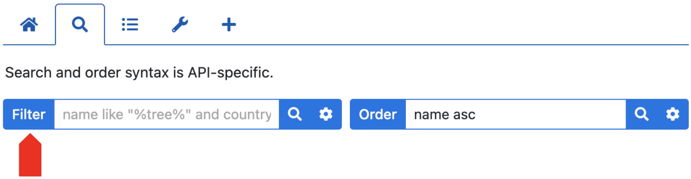
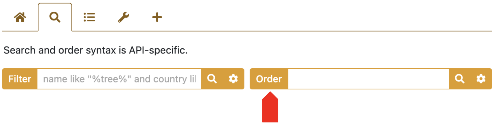
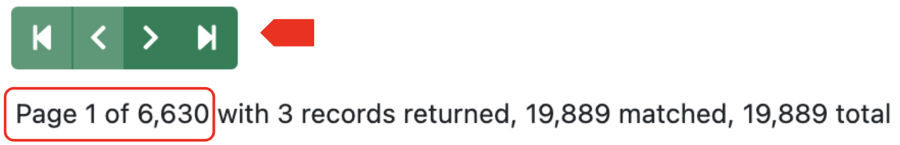

# queryParams

<table class="options-table"><tr><th>Optional</th></tr></table>

The `queryParams` option defines query parameters used in `GET` operations:

``` js nonum
new HHDataList({
  queryParams: {
    fields: {},
    filter: {},
    order: {},
    offset: {},
    page: {},
    limit: {}
  },
});
```

In general, each property is optional. Including a property name in the `queryParams` object and setting the property value to `{ }` enables the defaults for that property. So, this:

``` js nonum
new HHDataList({
  queryParams: {
    fields: {},
    offset: {},
    limit: {}
  },
});
```

enables this:

``` js nonum
new HHDataList({
  queryParams: {
    fields: { name: 'fields', default: null },
    offset: { name: 'offset' },
    limit: { name: 'limit', choices: [1, 3, 5, 10, 20, 50, 100], default: 1, hasTool: true, showTool: false, toolLabel: 'Limit' }
  },
});
```

And, this:

``` js nonum
new HHDataList({
  queryParams: {
    fields: {},
    filter: {},
    order: {},
    page: {},
    limit: {}
  },
});
```

enables this:

``` js nonum
new HHDataList({
  queryParams: {
    fields: { name: 'fields', default: null },
    filter: { name: 'filter', none: null, default: null, placeholder: '' },
    order: { name: 'order', default: null, placeholder: '' },
    page: { name: 'page' },
    limit: { name: 'limit', choices: [1, 3, 5, 10, 20, 50, 100], default: 1, hasTool: true, showTool: false, toolLabel: 'Limit' }
  },
});
```

Property values can be overridden. Here is an example:

``` js nonum
new HHDataList({
  queryParams: {
    filter: { name: 'q' },
    order: {name: 'sort' }
  },
});
```

Given this configuration, HHDataList uses `q` and `sort` (not `filter` and `order`) in URLs:

``` nonum
<a href="https://openlibrary.org/search/authors.json?q=walt%20whitman&sort=name">https://openlibrary.org/search/authors.json?q=walt%20whitman&sort=name</a>
```

# Properties

Including any of these properties in `queryParams` (a) informs HHDataList that the underlying API supports a certain type of query parameter and (b) provides details that HHDataList uses to build the query parameter. The following sections explain each `queryParams` property. 

## Fields

The `fields` query parameter specifies which fields HHDataList should return in response to API `getRecords` or `getRecord` requests. Below is the default `fields` property:

``` js nonum
new HHDataList({
  queryParams: {
    fields: { name: 'fields', default: null }
  },
});
```

Although there is no developer-defined `fields.value` property, it is helpful to picture one:

``` js nonum
new HHDataList({
  queryParams: {
    fields: { name: 'fields', value: '', default: null }
  },
});
```

Before executing a `GET` operation, HHDataList sets `fields.value`. Below is an example:

``` js nonum
new HHDataList({
  queryParams: {
    fields: { name: 'fields', value: 'id,name,species,description', default: null }
  },
});
```

Then, it builds the query parameter (e.g. `fields=id%2Cname%2Cspecies%2Cdescription`), appends it to a URL, and executes the request:

``` nonum
<a href="https://hagenhaus.com/api/famous-trees/5?fields=id%2Cname%2Cspecies%2Cdescription">https://hagenhaus.com/api/famous-trees/5?fields=id%2Cname%2Cspecies%2Cdescription</a>
```

HHDataList builds a new `fields.value` prior to each `GET` request based on the answers to the following questions:

1. Is the request a `getRecords` or a `getRecord` request?
1. If the request is a `getRecord` request, is the current [processMode](/en/hhdatalist/v0.0.2/options/processmode/) `manage`, `transform`, or `copy`?

### getRecords

For `getRecords` operations, HHDataList sets `fields.value` equal to the concatenation of [recordIdField](/en/hhdatalist/v0.0.2/options/recordidfield/) and the `fields` property of [recordTitle](/en/hhdatalist/v0.0.2/options/recordtitle/):

``` nonum
<a href="https://hagenhaus.com/api/famous-trees?fields=id%2Cname">https://hagenhaus.com/api/famous-trees?fields=id%2Cname</a>
```

`recordIdField` enables HHDataList to obtain record IDs in anticipation of subsequent calls to `getRecord` should the user expand a record. And, `recordTitle.fields` enables HHDataList to build record titles:

<p></p>

### getRecord

For `getRecord` operations, if [processMode](/en/hhdatalist/v0.0.2/options/processmode/) equals `manage`, HHDataList includes `recordIdField`, `recordTitle.fields`, and all checked field names:

<p></p>

Here is the URL:

``` nonum
<a href="https://hagenhaus.com/api/famous-trees/5?fields=name,species,description,city,country,lat,lng,birthYear,height,girth,links,id">https://hagenhaus.com/api/famous-trees/5?fields=name,species,description,city,country,lat,lng,birthYear,height,girth,links,id</a>
```

If [processMode](/en/hhdatalist/v0.0.2/options/processmode/) equals `transform`, HHDataList includes `recordIdField`, `recordTitle.fields`, and all field names that support checked labels:

<p></p>

Here is the URL:

``` nonum
<a href="https://hagenhaus.com/api/famous-trees/5?fields=name,species,description,city,country,lat,lng,birthYear,height,links,id">https://hagenhaus.com/api/famous-trees/5?fields=name,species,description,city,country,lat,lng,birthYear,height,links,id</a>
```

If [processMode](/en/hhdatalist/v0.0.2/options/processmode/) equals `copy`, HHDataList does not (and cannot) build a field list and assign it to `fields.value` because there are no [fieldDefinitions](/en/hhdatalist/v0.0.2/options/fielddefinitions/). So, HHDataList evaluates `fields.default`. If `null`, HHDataList does not include a *fields* query parameter in the request:

``` nonum
<a href="https://hagenhaus.com/api/famous-trees/5">https://hagenhaus.com/api/famous-trees/5</a>
```

If not `null`, (e.g. `fields: { default: * }`), HHDataList assigns `fields.default` to `fields.value`:

``` nonum
<a href="https://openlibrary.org/authors/OL23178A.json?fields=*">https://openlibrary.org/authors/OL23178A.json?fields=*</a>
```

## Filter

The `filter` query parameter specifies which record types HHDataList should return in response to API `getRecords` requests. Its inclusion also causes HHDataList to display the *Filter* tool:

<p></p>

Below is the default `filter` property:

``` js nonum
new HHDataList({
  queryParams: {
    filter: { name: 'filter', none: null, default: null, placeholder: '' }
  },
});
```

Although there is no developer-defined `filter.value` property, it is helpful to picture one:

``` js nonum
new HHDataList({
  queryParams: {
    filter: { name: 'filter', value: '', none: null, default: null, placeholder: '' }
  },
});
```

HHDataList sets `filter.value` using the following logic:

If `filter` specifies a `default` value (e.g. `default: "country like 'AUS'"`), HHDataList sets `filter.value` to `filter.default` and displays the value in the *Filter* tool:

<p></p>

If not, or if the user erases the default value from the *Filter* tool, HHDataList sets `filter.value` to `filter.none` and decides what to display. If `filter` specifies a `placeholder` value, HHDataList displays that:

<p></p>

Otherwise, it displays an empty input box:

<p></p>

When the user initiates a `getRecords` operation, HHDataList uses `filter.name` and `filter.value` to build the query parameter in the request:

``` nonum
<a href="https://hagenhaus.com/api/famous-trees?filter=country%20like%20%27AUS%27">https://hagenhaus.com/api/famous-trees?filter=country%20like%20%27AUS%27</a>
```

Note that the default value for `filter.default` is `filter.none`.

## Order

The `order` query parameter specifies the order of records returned in response to API `getRecords` requests. Its inclusion also causes HHDataList to display the *Order* tool:

<p></p>

Below is the default `order` property:

``` js nonum
new HHDataList({
  queryParams: {
    order: { name: 'order', default: null, placeholder: '' }
  },
});
```

Although there is no developer-defined `order.value` property, it is helpful to picture one:

``` js nonum
new HHDataList({
  queryParams: {
    order: { name: 'order', value: '', default: null, placeholder: '' }
  },
});
```

HHDataList sets `order.value` using the following logic:

If `order` specifies a `default` value (e.g. `default: "name asc"`), HHDataList sets `order.value` to `order.default` and displays the value in the *Order* tool:

<p></p>

If not, or if the user erases the default value from the *Filter* tool, HHDataList sets `filter.value` to `null` and decides what to display. If `filter` specifies a `placeholder` value, HHDataList displays that:

<p></p>

Otherwise, it displays an empty input box:

<p></p>

When the user initiates a `getRecords` operation, HHDataList uses `order.name` and `order.value` to build the query parameter in the request:

``` nonum
<a href="https://hagenhaus.com/api/famous-trees?order=name%20asc&limit=3">https://hagenhaus.com/api/famous-trees?order=name%20asc&limit=3</a>
```

Note that the default value for `filter.default` is `null`.

## Offset

The `offset` query parameter specifies the index (in the array of matching records) represents the first record to return in response to API `getRecords` requests. Its inclusion also causes HHDataList to display the *Paginator* tool and the *Page* part of the counters:

<p></p>

If `queryParams` includes `offset`, it must also include `limit`, and it cannot include `page`.

>`offset` is zero-based.

Below is the default `offset` property:

``` js nonum
new HHDataList({
  queryParams: {
    offset: { name: 'offset' },
    limit: { name: 'limit', choices: [1, 3, 5, 10, 20, 50, 100], default: 1, hasTool: true, showTool: false, toolLabel: 'Limit' }
  },
});
```

Although there is no developer-defined `offset.value` property, it is helpful to picture one:

``` js nonum
new HHDataList({
  queryParams: {
    offset: { name: 'offset', value = '' }
  },
});
```

When the user initiates a `getRecords` operation, HHDataList uses `offset.name`, `offset.value`, `limit.name`, and `limit.value` to build the query parameter in the request:

``` nonum
<a href="https://openlibrary.org/search/authors.json?q=rebecca&offset=0&limit=3">https://openlibrary.org/search/authors.json?q=rebecca&offset=0&limit=3</a>
```

## Page

The `page` query parameter specifies which page (e.g. 1, 2, 3, ...) of records to return in response to API `getRecords` requests. Its inclusion also causes HHDataList to display the *Paginator* tool and the *Page* part of the counters:

<p></p>

If `queryParams` includes `page`, it must also include `limit`, and it cannot include `offset`.

>`page` is one-based.

Below is the default `page` property:

``` js nonum
new HHDataList({
  queryParams: {
    page: { name: 'page' },
    limit: { name: 'limit', choices: [1, 3, 5, 10, 20, 50, 100], default: 1, hasTool: true, showTool: false, toolLabel: 'Limit' }
  },
});
```

Although there is no developer-defined `page.value` property, it is helpful to picture one:

``` js nonum
new HHDataList({
  queryParams: {
    page: { name: 'page', value = '' }
  },
});
```

When the user initiates a `getRecords` operation, HHDataList uses `page.name`, `page.value`, `limit.name`, and `limit.value` to build the query parameter in the request:

``` nonum
<a href="https://hagenhaus.com/api/famous-trees?page=1&limit=3">https://hagenhaus.com/api/famous-trees?page=1&limit=3</a>
```

## Limit

The `limit` query parameter specifies the maximum number of records to return in response to API `getRecords` requests. Below is the default `limit` property:

``` js nonum
new HHDataList({
  queryParams: {
    limit: { name: 'limit', choices: [1, 3, 5, 10, 20, 50, 100], default: 1, hasTool: true, showTool: false, toolLabel: 'Limit' }
  },
});
```

Although there is no developer-defined `limit.value` property, it is helpful to picture one:

``` js nonum
new HHDataList({
  queryParams: {
    limit: { name: 'limit', value: '' }
  },
});
```

HHDataList sets `limit.value` using the following logic:

If `limit` specifies a `default` value (e.g. `default: 3`) and the default value is a member of `limit.choices`, HHDataList sets `limit.value` to `limit.default` and displays the value in the *Limit* tool:

<p></p>

If not, HHDataList sets `limit.value` to `limit.choices[0]`.

When the user initiates a `getRecords` operation, HHDataList uses `limit.name` and `limit.value` to build the query parameter in the request:

``` nonum
<a href="https://hagenhaus.com/api/famous-trees?limit=3">https://hagenhaus.com/api/famous-trees?limit=3</a>
```

Note that the default value for `limit.default` is `limit.choices[0]`.

