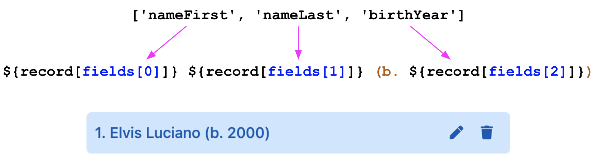

# recordTitle

<table class="options-table"><tr><th>Optional, but recommended</th></tr></table>

The `recordTitle` option provides websites with a mechanism for building record titles from record fields. The option value is an object with two properties: `fields` and `format`. The value of the first is an array of fields. The value of the second is a function that HHDataList calls to arrange the fields into a title and return the title.

# Examples

## Example 1

This example shows the default values for this option.

``` js nonum
new HHDataList({
  recordTitle: {
    fields: [this.recordIdField],
    format: (fields, record) => { return record[fields[0]]; }
  },
});
```

So, if `options` does not specify a `recordTitle` option, `recordTitle.fields` is an array with one element ([recordIdField](/en/hhdatalist/v0.0.2/options/recordidfield/)), and `recordTitle.format` is a function that returns `recordIdField` as the record title:

<div id="e1-datalist" class="hh-data-list mt-4"></div>
<script>
  var e1Options = new DLPlayersOptions002('e1-datalist');
  e1Options.expand.showTool = false;
  e1Options.queryParams.limit.showTool = false;
  e1Options.recordTitle.fields = ['playerID'];
  e1Options.recordTitle.format = (fields, record) => { return record[fields[0]]; };
  e1Options.themeDefinition.name = 'silverberry';
  new HHDataList(e1Options);
</script>

## Example 2

This example builds a record title from three fields: `nameFirst`, `nameLast`, and `birthYear`:

``` js nonum
new HHDataList({
  recordTitle: {
    fields: ['nameFirst', 'nameLast', 'birthYear'],
    format: (fields, record) => `${record[fields[0]]} ${record[fields[1]]} (b. ${record[fields[2]]})`
  },
});
```

`recordTitle.format` arranges the three fields to produce the following titles:

<p></p>

The following datalist reflects these titles:

<div id="e2-datalist" class="hh-data-list mt-4"></div>
<script>
  var e2Options = new DLPlayersOptions002('e2-datalist');
  e2Options.expand.showTool = false;
  e2Options.queryParams.limit.showTool = false;
  e2Options.themeDefinition.name = 'silverberry';
  new HHDataList(e2Options);
</script>

## Example 3

This example builds a record title that supports unknown `birthyear` values:

``` js nonum
new HHDataList({
  recordTitle: {
    fields: ['nameFirst', 'nameLast', 'birthYear'],
    format: (f, r) => `${r[f[0]] ? r[f[0]] : ''} ${r[f[1]]} (b. ${r[f[2]] ? r[f[2]] : 'unknown'})`
  },
});
```

The following datalist reflects these titles:

<div id="e3-datalist" class="hh-data-list mt-4"></div>
<script>
  var e3Options = new DLPlayersOptions002('e3-datalist');
  e3Options.expand.showTool = false;
  e3Options.queryParams.limit.showTool = false;
  e3Options.queryParams.filter.default = '';
  e3Options.queryParams.order.default = 'birthyear asc';
  e3Options.themeDefinition.name = 'silverberry';
  new HHDataList(e3Options);
</script>