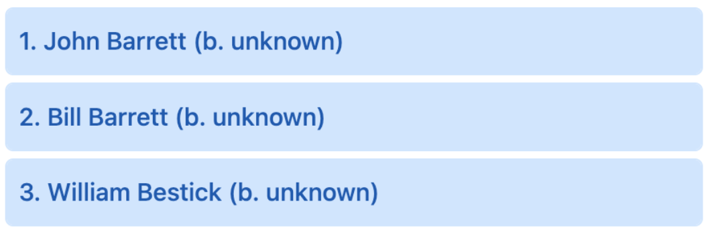
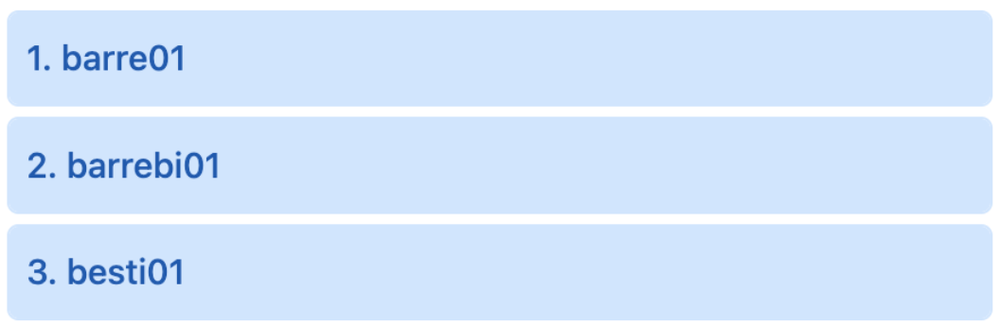

# recordTitle

<table class="options-table">
  <tr>
    <th>Necessity:</th>
    <td>Recommended</td>
  </tr>
</table>

The `recordTitle` option ...

``` js nonum
new HHDataList({
  recordTitle: '',
});
```

# Old Stuff

The *recordTitle* object specifies the list and arrangement of record fields that compose record titles:

``` js nonum
new HHDataList({
  recordTitle: {
    fields: ['nameFirst', 'nameLast', 'birthYear'],
    format: (fields, record) => `${record[fields[0]]} ${record[fields[1]]} (b. ${record[fields[2]]})`
  },
});
```

The example above arranges the *namefirst*, *namelast*, and *birthyear* record fields to produce the following titles:

<p></p>

You can support `null` field values with conditionals:

``` js nonum
`(b. ${record[fields[2]] ? record[fields[2]] : 'unknown'})`
```

<p></p>

If you do not specify a *recordTitle* option, HHDataList uses the `options.recordIdField` field for the record title:

<p></p>