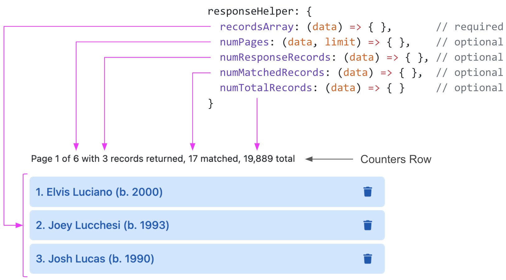
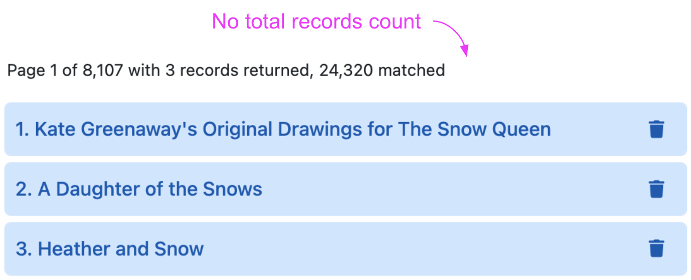

# responseHelper

<table class="options-table"><tr><th>Required</th></tr></table>

The `responseHelper` option is a set of developer-defined functions that enable HHDataList to extract data from API responses. HHDataList uses the `recordsArray` function to find the records array in the response data. It uses the other functions (if they exist) to update the *Counters Row*:

<p></p>

# Examples

## Example 1

Consider the following response data:

``` nonum
{
  metadata: {
    numTotalRecords: 19892,
    numFilteredRecords: 17,
    numResponseRecords: 3,
    page: 1,
    limit: 3,
    numTotalPages: 6,
    firstItemOnPage: 1
  },
  records: [
    { playerID: "birreba01", nameFirst: "Babe", nameLast: "Birrer", birthYear: 1929 },
    { playerID: "martiba01", nameFirst: "Babe", nameLast: "Martin", birthYear: 1920 },
    { playerID: "youngba01", nameFirst: "Babe", nameLast: "Young", birthYear: 1915 }
  ]
}
```

Here is the appropriate *responseHelper* for this response data:

``` js nonum
const dataList = new HHDataList({
  responseHelper: {
    recordsArray: (data) => data.records,
    numPages: (data, limit) => data.metadata.numTotalPages,
    numResponseRecords: (data) => data.metadata.numResponseRecords,
    numMatchedRecords: (data) => data.metadata.numFilteredRecords,
    numTotalRecords: (data) => data.metadata.numTotalRecords
  },
});
```

## Example 2

Consider the following response data from a request with limit (i.e. pageSize) set to 5:

``` nonum
{
  numFound: 21301,
  start: 0,
  docs: [
    { key: "/works/OL15049616W", title: "Kate Greenaway's Original Drawings for The Snow Queen" },
    { key: "/works/OL144812W", title: "A Daughter of the Snows" },
    { key: "/works/OL260333W", title: "Heather and Snow" }
  ],
  q: "snow"
}
```

Here is the appropriate *responseHelper* for this response data:

``` js nonum
const dataList = new HHDataList({
  responseHelper: {
    recordsArray: (data) => data.docs,
    numPages: (data, limit) => Math.ceil(data.numFound / limit),
    numResponseRecords: (data) => data.docs.length,
    numMatchedRecords: (data) => data.numFound
  },
});
```

Note that this response data does not contain information about the total number of records, so the *responseHelper* object does not define a *numTotalRecords* function, and HHDataList does not display a total records count:

<p></p>