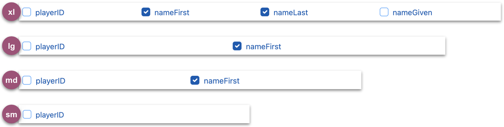

# Options

The HHDataList constructor requires an *options* argument of type *object*. Below is an example of an *options* argument with four options: `id`, `recordIdField`, `recordTitleField`, and `url`:

``` js nonum
new HHDataList({
  id: 'datalist-dodger-blue',
  recordIdField: 'ID',
  recordTitleFields: ['parkname'],
  url: `https://hagenhaus.com/api/baseball/v1/parks`,
});
```

This page describes all possible options.

# confirm

<table class="options-table">
<tr><th>Required:</th><td><code>false</code></td></tr>
<tr><th>Type:</th><td><code>function</code></td></tr>
<tr><th>Default:</th><td><code>(title, body, yesLabel, yesCb) => { yesCb(); }</code></td></tr>
</table>

The *confirm* value must be a function with four parameters:

``` js nonum
new HHDataList({
  confirm: (title, body, yesLabel, yesCb) => { ... },
});
```

Before performing certain actions like deleting a record, HHDataList invokes this function to enable the website to ask the user to confirm the action. HHDataList passes action-specific arguments to the function. For example, before deleting a record for a baseball player named *Casey Jones*, HHDataList passes the following arguments to the function:

|Parameter|Argument|
|-|-|
|*title*|"Delete Record?"|
|*body*|"Casey Jones (b. 1863)"|
|*yesLabel*|"Delete"|
|*yesCb*|HHDataList internal `DELETE` function|

The job of the *confirm* function is to call the *yesCb* callback function if the user selects the *yesLabel*. The website can leverage its own technique for presenting the *yesLabel* to the user and obtaining a response. For example, a website might display a modal:

<p></p>

If the website does not provide a *confirm* option to the HHDataList constructor, HHDataList performs all actions without pausing to ask the user for final confirmations.

# controlsAreSmall

<table class="options-table">
<tr><th>Required:</th><td><code>false</code></td></tr>
<tr><th>Type:</th><td><code>boolean</code></td></tr>
<tr><th>Default:</th><td><code>false</code></td></tr>
</table>

The *controlsAreSmall* option controls whether the sizes of the various HHDataList subcomponents are normal or small. 

``` js nonum
new HHDataList({
  controlsAreSmall: false
});
```

The diagram illustrates the effect of this option:

<p></p>

# fieldColWidth

<table class="options-table">
<tr><th>Required:</th><td><code>false</code></td></tr>
<tr><th>Type:</th><td><code>string</code></td></tr>
<tr><th>Default:</th><td><code>narrow</code></td></tr>
<tr><th>Choices:</th><td><code>narrow, medium, wide</code></td></tr>
</table>

The *fieldColWidth* option controls the width of the fields on the Fields tab:

<p></p>

The choices are *narrow*, *medium*, and *wide*. The diagram above reflects a *narrow* field column width as specified in this code snippet:

``` js nonum
new HHDataList({
  fieldColWidth: 'narrow',
});
```

Each of the three choices accommodates responsive screen widths:

**narrow**

<p></p>

**medium**

<p></p>

**wide**

<p></p>

# id

<table class="options-table">
<tr><th>Required:</th><td><code>true</code></td></tr>
<tr><th>Type:</th><td><code>string</code></td></tr>
</table>

The *id* value specifies the id of the html element into which the HHDataList constructor should append the HHDataList component:

``` html nonum
<div id="my-datalist" class="hh-data-list mt-4"></div>
```

``` js nonum
new HHDataList({
  id: 'my-datalist',
});
```

# missingFields

<table class="options-table">
<tr><th>Required:</th><td><code>false</code></td></tr>
<tr><th>Type:</th><td><code>object</code></td></tr>
<tr><th>Default:</th><td><code>{ include: true, placeholder: 'No data' }</code></td></tr>
</table>

Checked fields on the *Fields* tab dictate which fields to return for expanded records:

<p></p>

However, some APIs do not return all fields for all records, even if the fields are checked on the Fields tab:

<p></p>

The *missingFields* option provides a means of instructing HHDataList to display a field label and a field value for each field that, though checked on the Fields tab, does not exist in the returned record:

``` js nonum
new HHDataList({
  missingFields: { include: true, placeholder: 'No data'},
});
```

An included missing field might look like this:

<p></p>

# ? queryParams

<table class="options-table">
<tr><th>Required:</th><td><code>true</code></td></tr>
<tr><th>Type:</th><td><code>object</code></td></tr>
</table>

The *queryParams* object tells HHDataList how to specify query parameters in requests to the underlying API.

Showing defaults:

``` nonum
new HHDataList({
  queryParameters: {
    fields: { name: "fields" },
    filter: { name: "filter", value: "birthYear is not null", placeholder: "birthYear is not null and nameLast like \"b%\"" },
    order: { name: "order", value: "birthYear desc", placeholder: "birthYear asc, nameLast asc" },
    page: { name: "page", base: 1 },
    limit: { name: "limit", choices: [5, 10, 20, 50, 100], value: 5 }
  }
});
```

### fields

### filter

Remember `none` property.

### order

### page

``` nonum
https://hagenhaus.com:3002/api/baseball/v1/players?page=1
```

### limit

The `pageSize` option sets the initial value of the `Page Size` widget. The data type is `number`. The default value is `choices[0]`. Developers can override.

If `pageSize` is initialized to a `value` that is not a member of `choices`, then the value is ignored, and `value` is set to `choices[0]`. Users can override via the `Page Size` widget.

The `choices` property sets all possible options of the `Page Size` widget. The data type is `array`. The default value is `[5, 10, 20, 50, 100]`. Developers can override. Users cannot override.

# recordColWidth

<table class="options-table">
<tr><th>Required:</th><td><code>false</code></td></tr>
<tr><th>Type:</th><td><code>string</code></td></tr>
<tr><th>Default:</th><td><code>narrow</code></td></tr>
<tr><th>Choices:</th><td><code>narrow, medium, wide</code></td></tr>
</table>

The *recordColWidth* option controls the *default* width of expanded record columns:

<p></p>

(To override *recordColWidth* for individual record fields, see the [recordFields](#record-fields) option.)

The choices are narrow, medium, and wide. The diagram above reflects a *narrow* column width as specified in this code snippet:

``` js nonum
new HHDataList({
  recordColWidth: 'narrow',
});
```

Each of the three choices accommodates responsive screen widths:

**narrow**

<p></p>

**medium**

<p></p>

**wide**

<p></p>

# ? recordFieldValue

<table class="options-table">
<tr><th>Required:</th><td><code>false</code></td></tr>
<tr><th>Type:</th><td><code>string</code></td></tr>
<tr><th>Default:</th><td><code>value</code></td></tr>
<tr><th>Choices:</th><td><code>type, string, value</code></td></tr>
</table>

# ? recordFields

<table class="options-table">
<tr><th>Required:</th><td><code>false</code></td></tr>
<tr><th>Type:</th><td><code>array</code></td></tr>
</table>

Specifying a recordFields option in the options object passed to the HHDataList constructor has the following impact:

1. Enables you to control the order of fields displayed in an expanded record. Otherwise, the order of properties in the record inside a response body will dictate the order. 
1. Enables you to define aliases for record field names.
1. Enables you to specify whether a specific field isChecked in the Fields Tab (and shown in an expanded record).
1. Enables you to specify whether a specific field isEditable (which also means it will be included in the New Record Form).
1. Enables you to specify whether a field isRequired in the New Record Form.
1. Clears one barrier toward being able to edit/modify a field.
1. Enables you to define a field getter function. 
1. Enables you to define field width.
1. Causes the constructor to display the Fields tab unless you set the tabs option to {fields:false}.
1. Causes the constructor to display the New tab unless (a) you do not set isEditable:true for any fields or (b) you set the tabs option to {new:false}.

# ? recordIdField

# ? recordParity

<div class="row mb-2" style="font-size:92%;">
  <div class="col-auto">Required: <code>false</code></div>
  <div class="col-auto">Default: <code>false</code></div>
</div>

``` js nonum
new HHDataList({
  recordParity: true
});
```

For a definition of record parity, see [Record parity](/en/hhdatalist/v0.0.2/reference/terminology/#record-parity) on the [Terminology](/en/hhdatalist/v0.0.2/reference/terminology/) page. Only set this option to *true* if the *getRecords* operation of the underlying API can return all the record properties that the *getRecord* operation can. Setting this option to *true* tells HHDataList to use a more efficient technique for scrolling expanded pages of records.

# ? recordsAreExpanded

# ? recordsAreNumbered

# ? recordTitleFields

# ? recordTitleFormat

# ? reportError

# ? reportInfo

# ? reportRecordFields

# reportTheme

<table class="options-table">
<tr><th>Required:</th><td><code>false</code></td></tr>
<tr><th>Type:</th><td><code>function</code></td></tr>
<tr><th>Default:</th><td><code>(theme) => { }</code></td></tr>
</table>

The *reportTheme* option is a debugging tool. If you specify a *reportTheme* function, the HHDataList constructor calls the function, passing the theme object of the HHDataList instance. Usually, a *reportTheme* function calls `console.log`:

``` js nonum
const dataList = new HHDataList({
  reportTheme: (theme) => { 
    const t1 = JSON.stringify(theme, null, 2);
    const t2 = t1.replace(/"([^"]+)":/g, '$1:');
    const t3 = t2.replace(/"/g, "'");      
    console.log(t3);
  },
});
```

Output is a full theme object. The following snippet shows only the first few properties of a theme object:

``` js nonum
{
  name: 'My Theme',
  tabButtonColor: 'red',
  tabBorderColor: '#0059b3',
  controlColor: '#ffffff',
  controlColorHover: '#ffffff',
  controlBorderColor: '#0073e6',
  controlBorderColorHover: '#0059b3',
  ...
  ...
}
```

# ? reportWarning

# ? responseHelper

# ? showTabDescriptions

# ? tabs

Add ability to set initial tab to display.

# ? tabDescriptions

# ? theme

# ? themeName

# ? themeFromThemeName

# ? themeFromPaletteName

# ? themeFromPalette

# ? url

# ? urls


