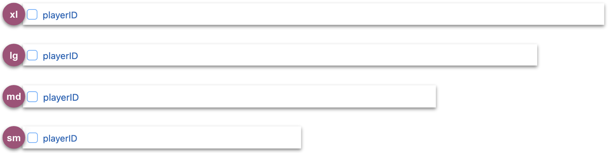
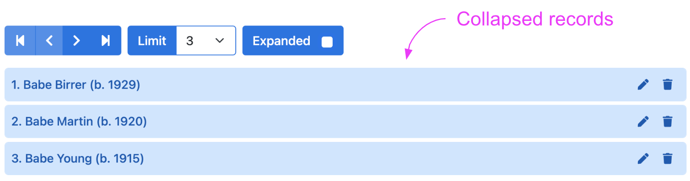

# Options

The HHDataList constructor requires an *options* argument of type *object*. Below is an example of an *options* argument:

``` js nonum
new HHDataList({
  id: 'my-data-list',
  url: `https://domain.com/api/v1/records`,
});
```

This page describes all possible options.

# confirm

<table class="options-table">
<tr><th>Required:</th><td><code>false</code></td></tr>
<tr><th>Type:</th><td><code>function</code></td></tr>
<tr><th>Default:</th><td><code>(title, body, yesLabel, yesCb) => { yesCb(); }</code></td></tr>
</table>

The *confirm* value must be a function with four parameters:

``` js nonum
new HHDataList({
  confirm: (title, body, yesLabel, yesCb) => { ... },
});
```

Before performing certain actions like deleting a record, HHDataList invokes this function to enable the website to ask the user to confirm the action. HHDataList passes action-specific arguments to the function. For example, before deleting a record for a baseball player named *Casey Jones*, HHDataList passes the following arguments to the function:

|Parameter|Argument|
|-|-|
|*title*|"Delete Record?"|
|*body*|"Casey Jones (b. 1863)"|
|*yesLabel*|"Delete"|
|*yesCb*|HHDataList internal `DELETE` function|

The job of the *confirm* function is to call the *yesCb* callback function if the user selects the *yesLabel*. The website can leverage its own technique for presenting the *yesLabel* to the user and obtaining a response. For example, a website might display a modal:

<p></p>

If the website does not provide a *confirm* option to the HHDataList constructor, HHDataList performs all actions without pausing to ask the user for final confirmations.

# controlsAreSmall

<table class="options-table">
<tr><th>Required:</th><td><code>false</code></td></tr>
<tr><th>Type:</th><td><code>boolean</code></td></tr>
<tr><th>Default:</th><td><code>false</code></td></tr>
</table>

The *controlsAreSmall* option controls whether the sizes of the various HHDataList subcomponents are normal or small. 

``` js nonum
new HHDataList({
  controlsAreSmall: false
});
```

The diagram illustrates the effect of this option:

<p></p>

# fieldColWidth

<table class="options-table">
<tr><th>Required:</th><td><code>false</code></td></tr>
<tr><th>Type:</th><td><code>string</code></td></tr>
<tr><th>Default:</th><td><code>narrow</code></td></tr>
<tr><th>Choices:</th><td><code>narrow, medium, wide</code></td></tr>
</table>

The *fieldColWidth* option controls the width of the fields on the Fields tab:

<p></p>

The choices are *narrow*, *medium*, and *wide*. The diagram above reflects a *narrow* field column width as specified in this code snippet:

``` js nonum
new HHDataList({
  fieldColWidth: 'narrow',
});
```

Each of the three choices accommodates responsive screen widths:

**narrow**

<p></p>

**medium**

<p></p>

**wide**

<p></p>

# id

<table class="options-table">
<tr><th>Required:</th><td><code>true</code></td></tr>
<tr><th>Type:</th><td><code>string</code></td></tr>
</table>

The *id* value specifies the id of the html element into which the HHDataList constructor should append the HHDataList component:

``` html nonum
<div id="my-datalist" class="hh-data-list mt-4"></div>
```

``` js nonum
new HHDataList({
  id: 'my-datalist',
});
```

# inclusionLevel

<table class="options-table">
<tr><th>Required:</th><td><code>false</code></td></tr>
<tr><th>Type:</th><td><code>number</code></td></tr>
</table>

``` js nonum
new HHDataList({
  inclusionLevel: 1,
});
```

# inclusions

<table class="options-table">
<tr><th>Required:</th><td><code>false</code></td></tr>
<tr><th>Type:</th><td><code>object</code></td></tr>
</table>

``` js nonum
new HHDataList({
  inclusions: {
    recordsAreNumberedCbx: true,
    showTabDescriptionsCbx: true
  },
});
```

# missingFields

<table class="options-table">
<tr><th>Required:</th><td><code>false</code></td></tr>
<tr><th>Type:</th><td><code>object</code></td></tr>
<tr><th>Default:</th><td><code>{ include: true, placeholder: 'No data' }</code></td></tr>
</table>

Checked fields on the *Fields* tab dictate which fields to return for expanded records:

<p></p>

However, some APIs do not return all fields for all records, even if the fields are checked on the Fields tab:

<p></p>

The *missingFields* option provides a means of instructing HHDataList to display a field label and a field value for each field that, though checked on the Fields tab, does not exist in the returned record:

``` js nonum
new HHDataList({
  missingFields: { include: true, placeholder: 'No data'},
});
```

An included missing field might look like this:

<p></p>

# queryParams

<table class="options-table">
<tr><th>Required:</th><td><code>true</code></td></tr>
<tr><th>Type:</th><td><code>object</code></td></tr>
</table>

The *queryParams* object tells HHDataList how to specify query parameters in requests to the underlying API.

Showing defaults:

``` nonum
new HHDataList({
  queryParams: {
    fields: { name: 'fields', default: '*' },
    filter: { name: 'q', none: '*', default: 'snow' },
    order: { name: 'sort' },
    page: { name: 'page' },
    limit: { name: 'limit', choices: [1, 3, 5, 10, 20, 50, 100], default: 5 }
  },
});
````

## params.fields

## params.filter

Remember `none` property.

## params.order

## params.page

``` nonum
https://hagenhaus.com:3002/api/baseball/v1/players?page=1
```

## params.limit

The `pageSize` option sets the initial value of the `Page Size` widget. The data type is `number`. The default value is `choices[0]`. Developers can override.

If `pageSize` is initialized to a `value` that is not a member of `choices`, then the value is ignored, and `value` is set to `choices[0]`. Users can override via the `Page Size` widget.

The `choices` property sets all possible options of the `Page Size` widget. The data type is `array`. The default value is `[5, 10, 20, 50, 100]`. Developers can override. Users cannot override.

# recordColWidth

<table class="options-table">
<tr><th>Required:</th><td><code>false</code></td></tr>
<tr><th>Type:</th><td><code>string</code></td></tr>
<tr><th>Default:</th><td><code>narrow</code></td></tr>
<tr><th>Choices:</th><td><code>narrow, medium, wide</code></td></tr>
</table>

The *recordColWidth* option controls the *default* width of expanded record columns:

<p></p>

(To override *recordColWidth* for individual record fields, see the [recordFields](#record-fields) option.)

The choices are narrow, medium, and wide. The diagram above reflects a *narrow* column width as specified in this code snippet:

``` js nonum
new HHDataList({
  recordColWidth: 'narrow',
});
```

Each of the three choices accommodates responsive screen widths:

**narrow**

<p></p>

**medium**

<p></p>

**wide**

<p></p>

# recordFieldValue

<table class="options-table">
<tr><th>Required:</th><td><code>false</code></td></tr>
<tr><th>Type:</th><td><code>string</code></td></tr>
<tr><th>Default:</th><td><code>value</code></td></tr>
<tr><th>Choices:</th><td><code>type, string, value</code></td></tr>
</table>

The *recordFieldValue* option is a debugging tool:

``` js nonum
new HHDataList({
  recordFieldValue: 'value',
});
```

When set to the default *value* value, HHDataList displays normal record field values:

<p></p>

When set to *type*, HHDataList displays record field types:

<p></p>

When set to *string*, HHDataList displays stringified record field values:

<p></p>

# recordFields

<table class="options-table">
<tr><th>Required:</th><td><code>false</code></td></tr>
<tr><th>Type:</th><td><code>array</code></td></tr>
<tr><th>Default:</th><td><code>null</code></td></tr>
</table>

The *recordFields* value is an array of objects, each representing a record field:

``` js nonum
new HHDataList({
  recordFields: [
    { name: "key", label: "Key", isChecked: false, isEditable: false, isRequired: false }, 
    { name: "title", label: "Title", isChecked: true, isEditable: true, isRequired: false, colWidth: 'wide' }
  ],
});
```

Each `field` object must include a `name` property and may include additional properties (e.g. `label`, `isChecked`, `isEditable`, `isRequired`, `colWidth`, `get`, and/or `subtype`.). Typically, during the initial phase of HHDataList development, while beginning to explore the contents of response data, developers omit the *recordFields* option, adding it later to control the order, appearance, and behavior of record fields. Adding a *recordFields* option has the following effects:

1. A *recordFields* option makes the display of the *Fields* and *New* tabs possible, but not inevitable.
1. A *recordFields* option specifies the order that fields appear on the *Fields* tab and in expanded records. Otherwise, the order of record properties inside response data dictates the order of fields in an expanded record.
1. A *recordFields* option can define aliases (which appear in expanded records) for record field names.
1. A *recordFields* option can specify which fields are initially displayed in expanded records.
1. A *recordFields* option can specify which fields are editable.
1. A *recordFields* option can specify which fields are required in *New Record* forms.
1. A *recordFields* option can format and modify record field values.
1. A *recordFields* option can specify screen widths for particular fields.

The sections below list and describe each *field* property.

## field.name

<table class="options-table h2">
<tr><th>Required:</th><td><code>true</code></td></tr>
<tr><th>Type:</th><td><code>string</code></td></tr>
</table>

Consider the following REST API response data:

``` nonum
{
  "key": "/works/OL53908W",
  "title": "Adventures of Huckleberry Finn"
}
```

`key` and `title` are field names. *recordField* array objects must include a `name` property to reference these fields:

``` js nonum
new HHDataList({
  recordColWidth: 'medium',
  recordFields: [
    { name: "key" }, 
    { name: "title" }
  ],
});
```

With no other *field* properties specified, HHDataList implicitly applies the following default property values to the `key` and `title` objects:

``` js nonum
new HHDataList({
  recordColWidth: 'medium',
  recordFields: [
    {
      name: 'key', 
      label: 'key', 
      isChecked: true, 
      isEditable: false, 
      isRequired: false, 
      colWidth: 'medium',
      get: (value) => value,
      subtype: { name: 'input' }
    },
    {
      name: 'title', 
      label: 'title', 
      isChecked: true, 
      isEditable: false, 
      isRequired: false, 
      colWidth: 'medium',
      get: (value) => value, 
      subtype: { name: 'input' }
    }
  ],
});
```

## field.label

<table class="options-table h2">
<tr><th>Required:</th><td><code>false</code></td></tr>
<tr><th>Type:</th><td><code>string</code></td></tr>
<tr><th>Default:</th><td><code>field.name</code></td></tr>
</table>

Consider the labels in the following expanded record:

<p></p>

The `label` property can provide a user-friendly alias for the `name` value:

``` js nonum
new HHDataList({
  recordFields: [
    { name: "key", label: "Key" }, 
    { name: "title", label: "Title" }
  ],
});
```

## field.isChecked

<table class="options-table h2">
<tr><th>Required:</th><td><code>false</code></td></tr>
<tr><th>Type:</th><td><code>boolean</code></td></tr>
<tr><th>Default:</th><td><code>true</code></td></tr>
</table>

Consider the `key` and `title` checkboxes on the following *Fields* tab:

<p></p>

The `isChecked` property dictates whether a field is (on page load) checked or unchecked on the *Fields* tab:

``` js nonum
new HHDataList({
  recordFields: [
    { name: "key", label: "Key", isChecked: false }, 
    { name: "title", label: "Title", isChecked: true }
  ],
});
```

## field.isEditable

<table class="options-table h2">
<tr><th>Required:</th><td><code>false</code></td></tr>
<tr><th>Type:</th><td><code>boolean</code></td></tr>
<tr><th>Default:</th><td><code>false</code></td></tr>
</table>

When the *Edit* button is clicked on the following expanded record, the *Title* field becomes editable:

<p></p>

And, the *Title* field appears on the following *New Record* form:

<p></p>

Setting the `isEditable` property to `true` causes (with one caveat) a field (1) to become editable in *Edit* mode, and (2) to appear on the *New Record* form:

``` js nonum
new HHDataList({
  recordFields: [
    { name: "key", label: "Key", isChecked: false, isEditable: false }, 
    { name: "title", label: "Title", isChecked: true, isEditable: true }
  ],
});
```

The caveat is a field can be editable only if the field subtype is *input* or *text*.

## field.isRequired

<table class="options-table h2">
<tr><th>Required:</th><td><code>false</code></td></tr>
<tr><th>Type:</th><td><code>boolean</code></td></tr>
<tr><th>Default:</th><td><code>false</code></td></tr>
</table>

On the following *New Record* form, the *Title* field is required:

<p></p>

Setting the `isRequired` property to `true` causes this behavior:

``` js nonum
new HHDataList({
  recordFields: [
    { name: "key", label: "Key", isChecked: false }, 
    { name: "title", label: "Title", isChecked: true, isEditable: true, isRequired: true }
  ],
});
```

## field.colWidth

<table class="options-table h2">
<tr><th>Required:</th><td><code>false</code></td></tr>
<tr><th>Type:</th><td><code>string</code></td></tr>
<tr><th>Default:</th><td><code>options.recordColWidth</code></td></tr>
<tr><th>Choices:</th><td><code>narrow, medium, wide</code></td></tr>
</table>

On the following expanded record, with a screen width of large or extra large, fields have various widths:

<p></p>

The `colWidth` property determines the width (e.g. narrow, medium, wide) of a record field element (e.g. input, select, textarea) in an expanded record:

``` js nonum
new HHDataList({
  recordColWidth: 'medium',
  recordFields: [
    { name: "key", label: "Key", isChecked: false }, 
    { name: "title", label: "Title", isChecked: true, isEditable: true, isRequired: true, colWidth: 'wide' },
    { name: "subject_places", label: "Subject Places", isChecked: true },
    { name: "subject_times", label: "Subject Times", isChecked: true },
    { name: "dewey_number", label: "Dewey Number", isChecked: true, colWidth: 'narrow' }, 
    { name: "revision", label: "Revision", isChecked: true, colWidth: 'narrow' }, 
    { name: "created", label: "Created", isChecked: true, colWidth: 'narrow' },
    { name: "last_modified", label: "Last Modified", isChecked: true, colWidth: 'narrow' }
  ],
});
```

`colWidth` settings are responsive, so even *narrow* and *medium* settings appear *wide* for narrower screen widths:

<p></p>

To learn more, see the [recordColWidth](#recordcolwidth) option.

## field.get

<table class="options-table h2">
<tr><th>Required:</th><td><code>false</code></td></tr>
<tr><th>Type:</th><td><code>function</code></td></tr>
<tr><th>Default:</th><td><code>(value) => value</code></td></tr>
</table>

### Example 1

Consider the `created` field in the following response data:

``` nonum
{
  "key": "/works/OL53908W",
  "title": "Adventures of Huckleberry Finn",
  "created": {
    "type": "/type/datetime",
    "value": "2009-10-15T18:06:09.703894"
  }
}
```

The `created` field value is an object with two properties: `type` and `value`. Note also the format for the `value` timestamp. Now, consider the (developer-chosen) display format of the `created` field value in an expanded record:

<p></p>

A *get* function is the bridge between raw data and formatted data for a field:

``` js nonum
new HHDataList({
  recordFields: [
    { name: "key", label: "Key", isChecked: false }, 
    { name: "title", label: "Title", isEditable: true, isRequired: true, colWidth: 'wide' },
    { name: "created", label: "Created", isChecked: false, get: (value) => 
      new Date(value.value).toLocaleDateString(window.navigator.language, { year: 'numeric', month: 'long', day: 'numeric' }) 
    },
  ],
});
```

HHDataList invokes `field.get(value)`, passing the raw data. The client-defined `get` function modifies the raw value as needed, and returns the modified value.

### Example 2

Consider the `title` field in the following response data:

``` nonum
{
  "key": "/works/OL53908W",
  "title": "Adventures of Huckleberry Finn"
}
```

The *title* value needs no modification prior to display:

<p></p>

The default `get` function (e.g. `(value) => value`) returns the raw value unchanged, so there is no need to specify a `get` property for the *title* field:

``` js nonum
new HHDataList({
  recordFields: [
    { name: "key", label: "Key", isChecked: false }, 
    { name: "title", label: "Title", isEditable: true, isRequired: true, colWidth: 'wide' }
  ],
});
```

### Example 3

Compare the `description` fields of these two records:

``` nonum
{
  "key": "/works/OL53908W",
  "title": "Adventures of Huckleberry Finn",
  "description": "Adventures of Huckleberry Finn or as it is known ..."
}
```

``` nonum
{
  "key": "/works/OL4134125W",
  "title": "The snow goose",
  "description": {
    "type": "/type/text",
    "value": "Against the backdrop of World War II, friendship develops ..."
  }
}
```

The first is a string and the second is an object, but the display format for both should be a string:

<p></p>

So, the `get` function must account for both possibilities:

``` js nonum
new HHDataList({
  recordFields: [
    { name: "title", label: "Title", isEditable: true, isRequired: true, colWidth: 'wide' },
    { name: "description", label: "Description", isEditable: true, colWidth: 'wide', get: (value) => {
      if (typeof value === 'object') {
        return value.value;
      } else {
        return value;
      }
    }}
  ],
});
```

### Example 4

Consider the `authors` field in the following response data:

``` nonum
{
  "title": "White Snow, Bright Snow",
  "authors": [
    {
      "author": { "key": "/authors/OL2763372A" },
      "type": { "key": "/type/author_role" }
    },
    {
      "author": { "key": "/authors/OL916848A" }
      "type": { "key": "/type/author_role" },
    },
    {
      "author": { "key": "/authors/OL1300693A" }
      "type": { "key": "/type/author_role" },
    }
  ]
}
```

The `authors` field is an array of objects. Each object represents an author, and includes a key rather than a name. Regardless, the target display is the following:

<p></p>

The transformation from raw to display requires two steps:

1. Create an array of keys that will fit into a `SELECT` element:

    ``` nonum
    ['/authors/OL2763372A', '/authors/OL916848A', '/authors/OL1300693A']
    ```

1. Replace the `key` strings with author names:

    ``` nonum
    ['Alvin Tresselt', 'Roger Duvoisin', 'Catherine Bonhomme']
    ```

The `field.get` function targets the first step:

``` js nonum
new HHDataList({
  recordFields: [
    { name: "title", label: "Title", isEditable: true, isRequired: true, colWidth: 'wide' },
    { name: "authors", label: "Authors", get: (value) => {
      const a = [];
      for (let i of value) { a.push(i.author.key); }
      return a;
    }},
  ],
});
```

The result is an array of keys:

<p></p>

The second step involves the inclusion of a `field.subtype` object:

``` js nonum
new HHDataList({
  recordFields: [
    { name: "title", label: "Title", isEditable: true, isRequired: true, colWidth: 'wide' },
    { name: "authors", label: "Authors", subtype: { name: "endpoint", field: (data) => data.name }, get: (value) => {
      const a = [];
      for (let i of value) { a.push(i.author.key); }
      return a;
    }},
  ],
});
```

See [field.subtype](#fieldsubtype) below.

## field.subtype

<table class="options-table h2">
<tr><th>Required:</th><td><code>false</code></td></tr>
<tr><th>Type:</th><td><code>object</code></td></tr>
<tr><th>Default:</th><td><code>{ name: 'input' }</code></td></tr>
</table>

### Example 1: text

### Example 2: link

Consider the `links` field in the following response data:

``` nonum
{
  "title": "The Call of the Wild",
  "links": [
    {
      "url": "https://en.wikipedia.org/wiki/The_Call_of_the_Wild",
      "title": "Wikipedia",
      "type": { "key": "/type/link" }
    },
    {
      "url": "https://www.wikidata.org/wiki/Q476871",
      "title": "Wikidata",
      "type": { "key": "/type/link" }
    },
    {
      "url": "https://viaf.org/viaf/179138821",
      "title": "VIAF ID: 179138821",
      "type": { "key": "/type/link" }
    }
  ]
}
```

The `links` field is an array of objects. Each object represents a link, and includes a `url` and a `title`. The target display is the following:

<p></p>

### Example 3: endpoint

# recordIdField

<table class="options-table">
<tr><th>Required:</th><td><code>false</code></td></tr>
<tr><th>Type:</th><td><code>string</code></td></tr>
<tr><th>Default:</th><td><code>id</code></td></tr>
</table>

The *recordIdField* value is the field name of the unique identifier field for the records:

``` js nonum
new HHDataList({
  recordIdField: 'key',
});
```

The example above is appropriate for the following record:

``` js nonum
{
  key: '/authors/OL24638A',
  name: 'Charles Dickens',
  birth_date: '7 February 1812',
  death_date: '9 June 1870',
  alternate_names: [
    'Charles John Huffam Dickens',
    '\u30c7\u30a3\u30b1\u30f3\u30ba,\u30c1\u30e3\u30fc\u30eb\u30ba',
    'Charles Dickens, Jr.',
    'Charles Culliford Boz Dickens',
    '(ying) Digengsi',
    '(ying) Di, geng si'
  ],
  wikipedia: 'http://en.wikipedia.org/wiki/Charles_Dickens'
}
```

# recordParity

<table class="options-table">
<tr><th>Required:</th><td><code>false</code></td></tr>
<tr><th>Type:</th><td><code>boolean</code></td></tr>
<tr><th>Default:</th><td><code>false</code></td></tr>
</table>

``` js nonum
new HHDataList({
  recordParity: true,
});
```

Record parity is a characteristic of a *getRecords* operation. If a particular *getRecords* operation can return all the record properties for all records that the corresponding *getRecord* operation can for a single record, then *recordParity* is *true* for that *getRecords* operation. Here, for example, is the response data from a *getRecords* operation possessing record parity:

``` json nonum
{
  "records": [
    { /* any or all record properties */ },
    { /* any or all record properties */ },
    { /* any or all record properties */ },
    { /* any or all record properties */ },
    { /* any or all record properties */ }
  ]
}
```

And, here is the response data from the corresponding *getRecord* operation:

``` json nonum
{ /* any or all record properties */ }
```

HHDataList displays a page of expanded records differently depending on whether the underlying *getRecords* operation possesses record parity. If so, HHDataList, through a single call to *getRecords*, obtains all the data it needs to display a page of expanded records. If not, HHDataList calls *getRecords* to return an array of barebones records, and then it calls *getRecord* for each record in the array to return and display record properties.

So, if you know that the *getRecords* operation of the underlying API can return all the record properties that the *getRecord* operation can, then you can set this option to *true* thus enabling HHDataList to use a more efficient technique for scrolling expanded pages of records.

# recordsAreExpanded

<table class="options-table">
<tr><th>Required:</th><td><code>false</code></td></tr>
<tr><th>Type:</th><td><code>boolean</code></td></tr>
<tr><th>Default:</th><td><code>false</code></td></tr>
</table>

The *recordsAreExpanded* option specifies whether records are collapsed or expanded on page load:

``` js nonum
new HHDataList({
  recordsAreExpanded: false,
});
```

These records are collapsed:

<p></p>

These records are expanded:

<p></p>

The user can check or uncheck the *Expander* button to alter this setting.

# recordsAreNumbered

<table class="options-table">
<tr><th>Required:</th><td><code>false</code></td></tr>
<tr><th>Type:</th><td><code>boolean</code></td></tr>
<tr><th>Default:</th><td><code>true</code></td></tr>
</table>

The *recordsAreNumbered* option specifies whether records are numbered or unnumbered on page load:

``` js nonum
new HHDataList({
  recordsAreNumbered: true,
});
```

These records are numbered:

<p></p>

These records are unnumbered:

<p></p>

The user can check or uncheck the *Records are numbered* button to alter this setting.

# recordTitle

<table class="options-table">
<tr><th>Required:</th><td><code>false</code></td></tr>
<tr><th>Type:</th><td><code>object</code></td></tr>
<tr><th>Default:</th><td><code>{ fields: [options.recordIdField],  format: (fields, record) => { return record[fields[0]]; }}</code></td></tr>
</table>

The *recordTitle* object specifies the list and arrangement of record fields that compose record titles:

``` js nonum
new HHDataList({
  recordTitle: {
    fields: ['nameFirst', 'nameLast', 'birthYear'],
    format: (fields, record) => `${record[fields[0]]} ${record[fields[1]]} (b. ${record[fields[2]]})`
  },
});
```

The example above arranges the *namefirst*, *namelast*, and *birthyear* record fields to produce the following titles:

<p></p>

You can support `null` field values with conditionals:

``` js nonum
`(b. ${record[fields[2]] ? record[fields[2]] : 'unknown'})`
```

<p></p>

If you do not specify a *recordTitle* option, HHDataList uses the `options.recordIdField` field for the record title:

<p></p>

# reportError

<table class="options-table">
<tr><th>Required:</th><td><code>false</code></td></tr>
<tr><th>Type:</th><td><code>function</code></td></tr>
<tr><th>Default:</th><td><code>(title, detail) => { }</code></td></tr>
</table>

HHDataList invokes the client-defined *reportError* function (if specified) when HHDataList encounters an error:

``` js nonum
const dataList = new HHDataList({
  reportError: (title, detail) => { reportError(title, detail); },
});
```

`reportError(title, detail)` is a client-defined error handler that might, for example, display a *toast* component like this:

<p></p>

The *More* link is not part of the *detail* string. It is, rather, built by this particular client-defined function.

# reportInfo

<table class="options-table">
<tr><th>Required:</th><td><code>false</code></td></tr>
<tr><th>Type:</th><td><code>function</code></td></tr>
<tr><th>Default:</th><td><code>(title, detail) => { }</code></td></tr>
</table>

HHDataList invokes the client-defined *reportInfo* function (if specified) when HHDataList completes certain tasks:

``` js nonum
const dataList = new HHDataList({
  reportInfo: (title, detail) => { reportInfo(title, detail); },
});
```

`reportInfo(title, detail)` is a client-defined message handler that might, for example, display a *toast* component like this:

<p></p>

# reportTheme

<table class="options-table">
<tr><th>Required:</th><td><code>false</code></td></tr>
<tr><th>Type:</th><td><code>function</code></td></tr>
<tr><th>Default:</th><td><code>(theme) => { }</code></td></tr>
</table>

The *reportTheme* option is a debugging tool. If you specify a *reportTheme* function, the HHDataList constructor calls the function, passing the theme object of the HHDataList instance. Usually, a *reportTheme* function calls `console.log`:

``` js nonum
const dataList = new HHDataList({
  reportTheme: (theme) => { 
    const t1 = JSON.stringify(theme, null, 2);
    const t2 = t1.replace(/"([^"]+)":/g, '$1:');
    const t3 = t2.replace(/"/g, "'");      
    console.log(t3);
  },
});
```

Output is a full theme object. The following snippet shows only the first few properties of a theme object:

``` nonum
{
  name: 'My Theme',
  tabButtonColor: 'red',
  tabBorderColor: '#0059b3',
  controlColor: '#ffffff',
  controlColorHover: '#ffffff',
  controlBorderColor: '#0073e6',
  controlBorderColorHover: '#0059b3',
  ...
  ...
}
```

To learn more, see [Themes](/en/hhdatalist/v0.0.2/reference/themes/).

# responseHelper

<table class="options-table">
<tr><th>Required:</th><td><code>true</code></td></tr>
<tr><th>Type:</th><td><code>object</code></td></tr>
</table>

The *responseHelper* object consists of client-defined functions that enable HHDataList to extract information from *getRecords* response data: 

``` js nonum
const dataList = new HHDataList({
  responseHelper: {
    recordsArray: (data) => { },       // required
    numPages: (data, limit) => { },    // optional
    numResponseRecords: (data) => { }, // optional
    numMatchedRecords: (data) => { },  // optional
    numTotalRecords: (data) => { }     // optional
  },
});
```

HHDataList uses the *recordsArray* function to find the records array in the response data. It uses the other functions (if they exist) to update the *Counters Row*:

<p></p>

### Example 1

Consider the following response data:

``` nonum
{
  metadata: {
    numTotalRecords: 19892,
    numFilteredRecords: 17,
    numResponseRecords: 3,
    page: 1,
    limit: 3,
    numTotalPages: 6,
    firstItemOnPage: 1
  },
  records: [
    { playerID: "birreba01", nameFirst: "Babe", nameLast: "Birrer", birthYear: 1929 },
    { playerID: "martiba01", nameFirst: "Babe", nameLast: "Martin", birthYear: 1920 },
    { playerID: "youngba01", nameFirst: "Babe", nameLast: "Young", birthYear: 1915 }
  ]
}
```

Here is the appropriate *responseHelper* for this response data:

``` js nonum
const dataList = new HHDataList({
  responseHelper: {
    recordsArray: (data) => data.records,
    numPages: (data, limit) => data.metadata.numTotalPages,
    numResponseRecords: (data) => data.metadata.numResponseRecords,
    numMatchedRecords: (data) => data.metadata.numFilteredRecords,
    numTotalRecords: (data) => data.metadata.numTotalRecords
  },
});
```

### Example 2

Consider the following response data from a request with limit (i.e. pageSize) set to 5:

``` nonum
{
  numFound: 21301,
  start: 0,
  docs: [
    { key: "/works/OL15049616W", title: "Kate Greenaway's Original Drawings for The Snow Queen" },
    { key: "/works/OL144812W", title: "A Daughter of the Snows" },
    { key: "/works/OL4134125W", title: "The snow goose" },
    { key: "/works/OL455658W", title: "The Snow Image and Other Twice-Told Tales" },
    { key: "/works/OL260333W", title: "Heather and Snow" }
  ],
  q: "snow"
}
```

Here is the appropriate *responseHelper* for this response data:

``` js nonum
const dataList = new HHDataList({
  responseHelper: {
    recordsArray: (data) => data.docs,
    numPages: (data, limit) => Math.ceil(data.numFound / limit),
    numResponseRecords: (data) => data.docs.length,
    numMatchedRecords: (data) => data.numFound
  },
});
```

Note that this response data does not contain information about the total number of records, so the *responseHelper* object does not define a *numTotalRecords* function, and HHDataList does not display a total records count:

<p></p>

# showTabDescriptions

<table class="options-table">
<tr><th>Required:</th><td><code>false</code></td></tr>
<tr><th>Type:</th><td><code>boolean</code></td></tr>
<tr><th>Default:</th><td><code>true</code></td></tr>
</table>

The *showTabDescriptions* option specifies whether tab descriptions (if they exist) are displayed on page load. 

``` js nonum
const dataList = new HHDataList({
  showTabDescriptions: true
});
```

The following diagram shows a tab description:

<p></p>

The [tabDescriptions](#tabdescriptions) option defines tab descriptions.

# tabDescriptions

<table class="options-table">
<tr><th>Required:</th><td><code>false</code></td></tr>
<tr><th>Type:</th><td><code>object</code></td></tr>
<tr><th>Default:</th><td><code>null</code></td></tr>
</table>

The *tabDescriptions* object specifies custom descriptions for one or more tabs:

``` js nonum
const dataList = new HHDataList({
  tabDescriptions: {
      home: 'These words appear on the Home tab.',
      search: 'These words appear on the Search tab.',
      fields: 'These words appear on the Fields tab.',
      new: 'These words appear on the New tab above the New Form.',
      created: 'These words appear on the New tab above the Created Form.',
      config: 'These words appear on the Config tab.'
    },
});
```

The following diagram shows a tab description:

<p></p>

The *tabDescriptions* object can include only one or a few properties, and descriptions can include HTML:

``` js nonum
const dataList = new HHDataList({
  tabDescriptions: {
      home: 'Manage baseball player records in the <a href="https://www.seanlahman.com/baseball-archive/statistics/">Lahman Baseball Dataset</a>.'
    },
});
```

The *tabDescription* object above might render like this:

<p></p>

# theme

<table class="options-table">
<tr><th>Required:</th><td><code>false</code></td></tr>
<tr><th>Type:</th><td><code>object</code></td></tr>
</table>

The *theme* option is one of many ways to apply a theme to an HHDataList instance (see [Themes](/en/hhdatalist/v0.0.2/reference/themes/)):

``` js nonum
new HHDataList({
  theme: {
    name: 'My Red Theme',
    tabButtonColor: '#961d1d',
    tabBorderColor: '#961d1d',
    controlColor: '#ffffff',
    controlColorHover: '#ffffff',
    controlBorderColor: '#da3e3e',
    ...
  },
});
```

# themeName

<table class="options-table">
<tr><th>Required:</th><td><code>false</code></td></tr>
<tr><th>Type:</th><td><code>string</code></td></tr>
</table>

The *themeName* option is one of many ways to apply a theme to an HHDataList instance (see [Themes](/en/hhdatalist/v0.0.2/reference/themes/)):

``` js nonum
new HHDataList({
  themeName: 'Wheatgerm',
});
```

# themeFromThemeName

<table class="options-table">
<tr><th>Required:</th><td><code>false</code></td></tr>
<tr><th>Type:</th><td><code>object</code></td></tr>
</table>

The *themeFromThemeName* option is one of many ways to apply a theme to an HHDataList instance (see [Themes](/en/hhdatalist/v0.0.2/reference/themes/)):

``` js nonum
new HHDataList({
  themeFromThemeName: {
    themeName: 'Silverberry',
    newThemeName: 'My Silverberry Theme',
    overrides: {
      tabButtonColor: 'red'
    }
  },
});
```

# themeFromPaletteName

<table class="options-table">
<tr><th>Required:</th><td><code>false</code></td></tr>
<tr><th>Type:</th><td><code>object</code></td></tr>
</table>

The *themeFromPaletteName* option is one of many ways to apply a theme to an HHDataList instance (see [Themes](/en/hhdatalist/v0.0.2/reference/themes/)):

``` js nonum
new HHDataList({
  themeFromPaletteName: {
    paletteName: 'Silverberry',
    newThemeName: 'My Silverberry Theme',
    overrides: {
      tabButtonColor: 'blue'
    }
  },
});
```

# themeFromPalette

<table class="options-table">
<tr><th>Required:</th><td><code>false</code></td></tr>
<tr><th>Type:</th><td><code>object</code></td></tr>
</table>

The *themeFromPalette* option is one of many ways to apply a theme to an HHDataList instance (see [Themes](/en/hhdatalist/v0.0.2/reference/themes/)):

``` js nonum
new HHDataList({
  themeFromPalette: {
    palette: {
      color1: '#ffffff',
      color2: '#fcf5e8',
      color3: '#f9ebd2',
      color4: '#f6e2bb',
      color5: '#e29d1d',
      color6: '#875e12'
    },
    newThemeName: 'My Silverberry',
    overrides: {
      tabButtonColor: 'green'
    }
  },
});
```

# url

<table class="options-table">
<tr><th>Required:</th><td><code>false</code></td></tr>
<tr><th>Type:</th><td><code>string</code></td></tr>
</table>

The *url* option specifies the base endpoint for all API operations. While the *url* option is not required, the *options* argument passed to the HHDataList constructor must specify either a *url* or a *urls* option:

``` js nonum
new HHDataList({
  url: `https://domain.com/api/v1/records`,
});
```

The HHDataList constructor, making certain assumptions, uses the *url* option to build operation-specific endpoints. Here are examples (using the url specified above):

|Operation|Endpoint|
|-|-|
|`DELETE`|`https://domain.com/api/v1/records/${options.recordIdField}`|
|`GET ONE`|`https://domain.com/api/v1/records/${options.recordIdField}`|
|`GET MANY`|`https://domain.com/api/v1/records`|
|`PATCH`|`https://domain.com/api/v1/records/${options.recordIdField}`|
|`POST`|`https://domain.com/api/v1/records`|
|`PUT`|`https://domain.com/api/v1/records/${options.recordIdField}`|

# urls

<table class="options-table">
<tr><th>Required:</th><td><code>false</code></td></tr>
<tr><th>Type:</th><td><code>object</code></td></tr>
</table>

The *urls* object specifies the endpoints for all API operations. While the *urls* option is not required, the *options* argument passed to the HHDataList constructor must specify either a *url* or a *urls* option:

``` js nonum
new HHDataList({
  urls: {
    deleteRecord: (id) => `https://domain.com/api/v1/records/${id}`,
    getRecord: (id) => `https://domain.com/api/v1/records/${id}`,
    getRecords: `https://domain.com/api/v1/records`,
    patchRecord: (id) => `https://domain.com/api/v1/records/${id}`,
    postRecord: `https://domain.com/api/v1/records`,
    putRecord: (id) => `https://domain.com/api/v1/records/${id}`
  },
});
```

HHDataList passes `options.recordIdField` as the `id` argument to the client-defined functions in the `urls` object.

If the HHDataList instance supports only `GET` operations, the `urls` object need only specify `GET` properties:

``` js nonum
new HHDataList({
  urls: {
    getRecord: (id) => `https://openlibrary.org${id}.json`,
    getRecords: `https://openlibrary.org/search.json`
  },
});
```
