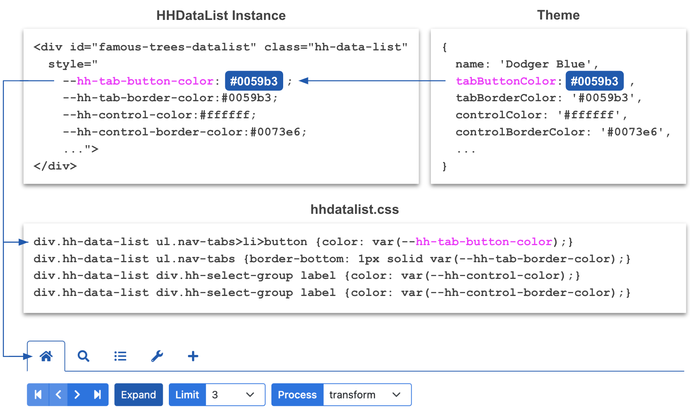
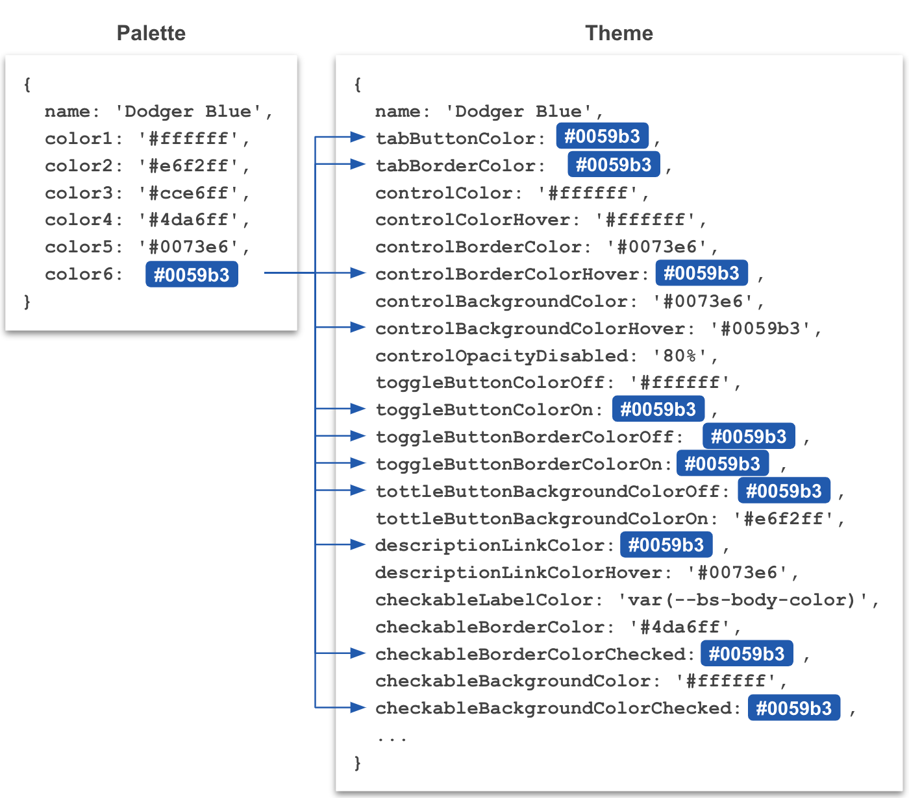
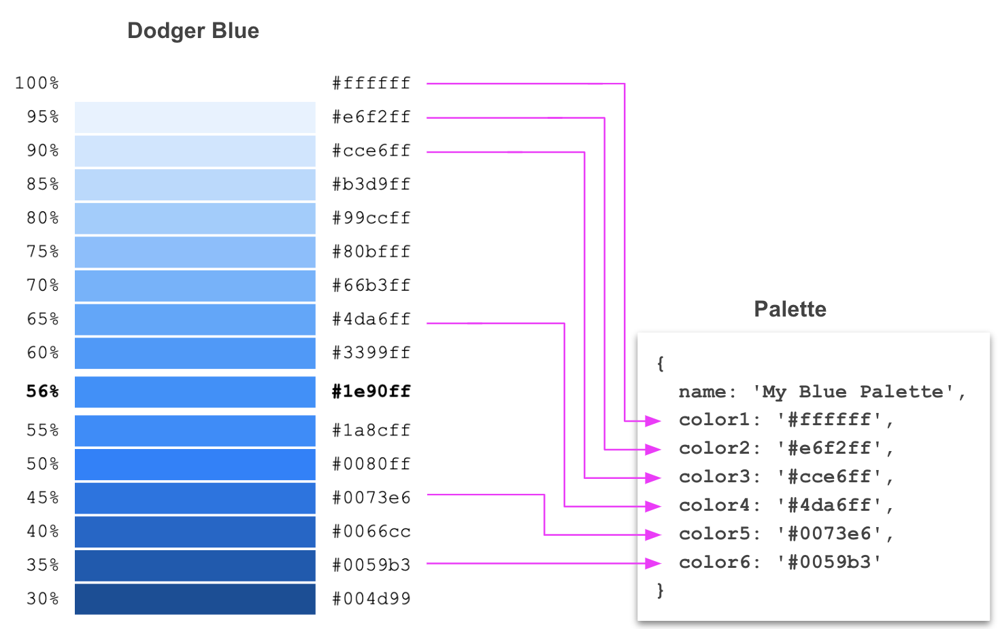
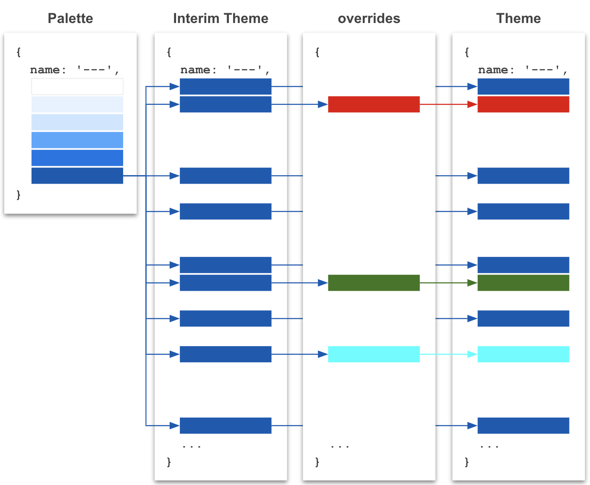

# Themes and Palettes

This page demonstrates how to theme HHDataList instances.

# What is a theme?

To view the theme of the HHDataList instance below, click the *Theme Reporter* button to generate a JSON object literal in your browser's *Developer Tools* console. 

<div id="what-is-a-theme-datalist" class="hh-data-list"></div>
<script>
  var options = new DLTreesOptions002('what-is-a-theme-datalist');
  options.descriptions.value = false;
  options.expand.showTool = false;
  options.queryParams.limit.showTool = false;
  options.reporters.theme.showTool = true;
  options.reporters.themes.showTool = true;
  options.themeDefinition.name = 'wheatgerm';
  options.themeDefinition.showTool = true;
  new HHDataList(options);
</script>

A theme is a set of properties. Theme properties associate names with HTML colors. In the diagram below, for example, one of the theme properties associates the name `tabButtonColor` with the value `#0059b3`. HHDataList maps theme properties to the styles of an HHDataList instance. In the diagram, HHDataList maps `tabButtonColor` to `--hh-tab-button-color`. Finally, hhdatalist.css associates these styles with individual elements that compose a datalist. In this case, the CSS file associates `--hh-tab-button-color` (and, therefore, `#0059b3`) with a tab button:

<p></p>

## Theme List

HHDataList maintains one theme list for a website (in browser memory). The theme list always contains at least one theme (the default theme). It can contain standard and/or custom themes. Which themes belong to the theme list is customizable. Only themes on the theme list can be applied to HHDataList instances. HHDataList provides the following functions for working with the theme list:

* [addAllStandardThemes](#addallstandardthemes)
* [addStandardTheme](#addstandardtheme)
* [addStandardThemes](#addstandardthemes)
* [addTheme](#addtheme)
* [addThemeFromPalette](#addthemefrompalette)
* [addThemeFromPaletteName](#addthemefrompalettename)
* [addThemeFromThemeName](#addthemefromthemename)
* [deleteTheme](#deletetheme)
* [getTheme](#gettheme)
* [getThemes](#getthemes)
* [getThemeCount](#getthemecount)
* [getThemeNames](#getthemenames)
* [hasTheme](#hastheme)

## Default Theme

HHDataList maintains a default theme which resides on the theme list and applies to all HHDataList instances except for those explicitly assigned other themes. Initially, HHDataList sets the default theme to the standard theme *Dodger Blue*, but the function [setDefaultThemeName](#setdefaultthemename) can override this initial setting with another standard theme or a custom theme. HHDataList provides the following functions for working with the default theme:

* [getDefaultTheme](#getdefaulttheme)
* [getDefaultThemeName](#getdefaultthemename)
* [setDefaultThemeName](#setdefaultthemename)

## Standard Themes

HHDataList supplies 13 standard themes. One, *Dodger Blue*, is built into HHDataList. The other 12 are available by including [hhdatalist-themes.js](https://hagenhaus.com/cdn/hhdatalist/v0.0.2/hhdatalist-themes.js) and invoking one or more of the following functions:

* [addAllStandardThemes](addallstandardthemes)
* [addStandardTheme](addstandardtheme)
* [addStandardThemes](#addstandardthemes)

Click the *Theme* dropdown in the instance below to view the standard themes:

<div id="standard-themes-datalist" class="hh-data-list my-4"></div>
<script>
  var options = new DLTreesOptions002('standard-themes-datalist');
  options.descriptions.value = false;
  options.expand.showTool = false;
  options.queryParams.limit.showTool = false;
  options.themeDefinition.showTool = true;
  new HHDataList(options);
</script>

> **Note**: If you specialize in UI design and would like to improve a standard theme, (1) read [How to theme](#how-to-theme), (2) build a theme that improves upon a standard theme, and (3) contact me via [Gitter](https://gitter.im/hagenhaus/hhdatalist). I welcome improvements. Thanks.

## Custom Themes

HHDataList facilitates the generation and application of *temporary* and *persistent* custom themes. Temporary themes are built and applied on the fly with the following functions:

* [addThemeFromPalette](#addthemefrompalette)
* [addThemeFromPaletteName](#addthemefrompalettename)
* [addThemeFromThemeName](#addthemefromthemename)

Persistent themes are built with the one of the first three functions below, saved to a file such as `my-hhdatalist-themes.js` which is included in the main html page, and applied with the last function below:

* [buildThemeFromPalette](#buildthemefrompalette)
* [buildThemeFromPaletteName](#buildthemefrompalettename)
* [buildThemeFromThemeName](#buildthemefromthemename)
* [addTheme](#addtheme)

See [How to theme](#how-to-theme) for details. 

# What is a palette?

A palette is a set of properties. Palette properties associate names with HTML colors.  In the diagram below, one of the palette properties associates the name `color6` with the value `#0059b3`. HHDataList uses palettes to generate themes:

<p></p>

Palettes serve as input to the following functions:

* [addThemeFromPalette](#addthemefrompalette)
* [addThemeFromPaletteName](#addthemefrompalettename)
* [buildThemeFromPalette](#buildthemefrompalette)
* [buildThemeFromPaletteName](#buildthemefrompalettename)

## Palette List

HHDataList maintains one palette list for a website (in browser memory). The palette list always contains at least one palette (the default palette). It can contain standard and/or custom palettes. Which palettes belong to the palette list is customizable. HHDataList provides the following functions for working with the palette list:

* [addAllStandardPalettes](#addallstandardpalettes)
* [addStandardPalette](#addstandardpalette)
* [addStandardPalettes](#addstandardpalettes)
* [addPalette](#addpalette)
* [deletePalette](#deletepalette)
* [getDefaultPalette](#getdefaultpalette)
* [getDefaultPaletteName](#getdefaultpalettename)
* [getPalette](#getpalette)
* [getPaletteCount](#getpalettecount)
* [getPaletteNames](#getpalettenames)
* [hasPalette]()

> **Note**: The palette list is useful only because it supports the following functions:
> * [addThemeFromPaletteName](#addthemefrompalettename)
> * [buildThemeFromPaletteName](#buildthemefrompalettename)

## Default Palette

HHDataList maintains a default palette which resides on the palette list. Initially, HHDataList sets the default palette to the standard palette *Dodger Blue*, but the function [setDefaultPaletteName](#setdefaultpalettename) can override this initial setting with another standard palette or a custom palette. HHDataList provides the following functions for working with the default palette:

* [getDefaultPalette](#getdefaultpalette)
* [getDefaultPaletteName](#getdefaultpalettename)
* [setDefaultPaletteName](#setdefaultpalettename)

## Standard Palettes

HHDataList supplies 13 standard palettes. One, *Dodger Blue*, is built into HHDataList. The other 12 are available by including [hhdatalist-palettes.js](https://hagenhaus.com/cdn/hhdatalist/v0.0.2/hhdatalist-palettes.js) and invoking one or more of the following functions:

* [addAllStandardPalettes](#addallstandardpalettes)
* [addStandardPalette](#addstandardpalette)
* [addStandardPalettes](#addstandardpalettes)

## Custom Palettes

Palette design often starts by assigning shades of the same color to palette properties where `color1` is white, `color2` is very light, `color3` is light, `color4` is medium light, `color5` is medium, and `color6` is medium dark:

<p></p>

The following functions can use custom palettes as arguments:

* [addThemeFromPalette](#addthemefrompalette)
* [buildThemeFromPalette](#buildthemefrompalette)

The following functions can use custom palettes once the palettes have been added to the palette list:

* [addThemeFromPaletteName](#addthemefrompalettename)
* [buildThemeFromPaletteName](#buildthemefrompalettename)

# What is an override?

Consider the following function:

``` js nonum
HHDataList.buildThemeFromPalette(palette, overrides, newThemeName)
```

Without an `overrides` argument, `buildThemeFromPalette` could generate a theme from a palette, but it could not customize individual theme properties. The `overrides` argument allows for the customization of generated themes:

<p></p>

The following functions leverage an `overrides` argument:

* [addThemeFromPalette](#addthemefrompalette)
* [addThemeFromPaletteName](#addthemefrompalettename)
* [addThemeFromThemeName](#addthemefromthemename)
* [buildThemeFromPalette](#buildthemefrompalette)
* [buildThemeFromPaletteName](#buildthemefrompalettename)
* [buildThemeFromThemeName](#buildthemefromthemename)

# How to theme

## Apply the default theme

To apply the current default theme to an HHDataList instance, omit the `themeDefinition` option from the constructor:

``` js nonum
new HHDataList({
  // No themeDefinition option
});
```

Or, include it, but omit the `name` property:

``` js nonum
new HHDataList({
  themeDefinition: { showTool: true }, // No name property
});
```

To set the default theme, add (if necessary) the standard or custom theme to the theme list, and then call `set`:

``` js nonum
HHDataList.setDefaultThemeName('firebrick');
 
new HHDataList({
  // No themeDefinition option
});
```

## Apply a standard theme

To apply a standard theme to an HHDataList instance, complete these steps:

1. Include [hhdatalist-themes.js](https://hagenhaus.com/cdn/hhdatalist/v0.0.2/hhdatalist-themes.js) in your main HTML file:

    ``` html nonum
    <script src="https://hagenhaus.com/cdn/hhdatalist/v0.0.2/hhdatalist-themes.js"></script>
    ```

1. Add the standard theme to the theme list using one of the following functions:

    * [addAllStandardThemes](addallstandardthemes)
    * [addStandardTheme](addstandardtheme)
    * [addStandardThemes](#addstandardthemes)
  
    Here is an example:

    ``` js nonum
    HHDataList.addStandardTheme('firebrick');
    ```

1. Specify the theme name in the `themeDefinition` option:

    ``` js nonum
    new HHDataList({
      themeDefinition: { name: 'firebrick' },
    });
    ```

## Apply a temporary theme

A temporary theme is a custom theme that is (usually) generated and added to the theme list using one of the following functions:

* [addThemeFromPalette](#addthemefrompalette)
* [addThemeFromPaletteName](#addthemefrompalettename)
* [addThemeFromThemeName](#addthemefromthemename)

Below are examples:

### Example 1

1. Generate a new theme from a palette object, and add it to the theme list:

    ``` js nonum
    HHDataList.addThemeFromPalette(
      {
        name: 'My Orange Palette',
        color1: '#ffffff',
        color2: '#fff6e6',
        color3: '#ffedcc',
        color4: '#ffe4b3',
        color5: '#b37400',
        color6: '#805300'
      },
      {
        checkableLabelColor: '#212529',
        recordFieldLabelColor: '#332100'
      },
      'My Theme From Palette'
    );
    ```

1. Specify the theme in the `themeDefinition` option:

    ``` js nonum
    new HHDataList({
      themeDefinition: { name: 'My Theme From Palette' },
    });
    ```

### Example 2

1. Generate a new theme from a palette on the palette list, and add it to the theme list:

    ``` js nonum
    HHDataList.addThemeFromPaletteName(
      'Orangewood',
      {
        checkableLabelColor: '#212529',
        recordFieldLabelColor: '#332100'
      },
      'My Theme From Palette Name'
    );
    ```

1. Specify the theme in the `themeDefinition` option:

    ``` js nonum
    new HHDataList({
      themeDefinition: { name: 'My Theme From Palette Name' },
    });
    ```

### Example 3

1. Generate a new theme from an existing theme (on the theme list) and add it to the theme list:

    ``` js nonum
    HHDataList.addThemeFromThemeName(
      'Orangewood',
      {
        checkableLabelColor: '#212529',
        recordFieldLabelColor: '#332100'
      },
      'My Theme From Theme Name'
    );
    ```

1. Specify the theme in the `themeDefinition` option:

    ``` js nonum
    new HHDataList({
      themeDefinition: { name: 'My Theme From Theme Name' },
    });
    ```

## Apply a persistent theme

To apply a persistent theme (a custom theme that is generated and persisted) complete the following steps: 

1. Generate the theme. One way to generate a persistent theme is to [Apply a temporary theme](#apply-a-temporary-theme), use the *Theme Reporter* tool to convert the new temporary theme to a JSON object literal, and then delete the code used to apply the temporary theme. See [What is a theme?](#what-is-a-theme) to learn more. Another way is to `console.log` the output of one of the following functions:

    * [buildThemeFromPalette](#buildthemefrompalette)
    * [buildThemeFromPaletteName](#buildthemefrompalettename)
    * [buildThemeFromThemeName](#buildthemefromthemename)

1. Save the theme to a file such as `my-hhdatalist-themes.js`:

    ``` js nonum
    const myHHDataListThemes = [
      {
        name: 'My Persistent Theme',
        tabButtonColor: '#961d1d',
        tabBorderColor: '#961d1d',
        controlColor: '#ffffff',
        controlColorHover: '#ffffff',
        controlBorderColor: '#da3e3e',
        controlBorderColorHover: '#961d1d',
        ...
      }
    ];
    ```

1. Add the theme:

    ``` js nonum
    if (typeof myHHDataListThemes === 'object') {
      for (const theme of myHHDataListThemes) {
        if (theme.name.toLowerCase() === 'My Persistent Theme'.toLowerCase()) {
          HHDataList.addTheme(theme);
        }
      }
    }
    ```

1. Specify the theme in the `themeDefinition` option:

    ``` js nonum
    new HHDataList({
      themeDefinition: { name: 'My Persistent Theme' },
    });
    ```

# Theme Functions

All theme functions are static class functions.

## addAllStandardThemes

This function adds all the standard themes to the theme list.

### Syntax

``` html nonum
<script src="https://hagenhaus.com/cdn/hhdatalist/v0.0.2/hhdatalist-themes.js"></script>
```

``` js nonum
HHDataList.addAllStandardThemes()
```

## addStandardTheme

This function adds the theme referenced by the theme name to the theme list.

### Syntax

``` html nonum
<script src="https://hagenhaus.com/cdn/hhdatalist/v0.0.2/hhdatalist-themes.js"></script>
```

``` js nonum
HHDataList.addStandardTheme(
  themeName  // case-insensitive string
)
```

### Example

``` js nonum
HHDataList.addStandardTheme('firebriCK');
```

## addStandardThemes

This function adds the themes referenced by the array of theme names to the theme list.

### Syntax

``` html nonum
<script src="https://hagenhaus.com/cdn/hhdatalist/v0.0.2/hhdatalist-themes.js"></script>
```

``` js nonum
HHDataList.addStandardThemes(
  themeNames  // array of case-insensitive strings
)
```

### Example

``` js nonum
HHDataList.addStandardThemes(['firebriCK', 'foRESt gREen']);
```

## addTheme

This function adds a theme to the theme list. 

### Syntax

``` js nonum
HHDataList.addTheme(
  theme  // object
)
```

* If successful, returns `true`.
* If `theme` is invalid, returns `false`.
* If `theme` is already on the theme list, returns `false`.

This function requires the generation of a theme prior to invocation (see [Generating themes](#generating-themes)). By contrast, the other add functions (1) generate themes from existing palettes or themes, and (2) add the newly generated themes to the theme list. 

### Example

``` js nonum
let isAdded = HHDataList.addTheme({
  name: 'My Theme',
  tabButtonColor: '#961d1d',
  tabBorderColor: '#961d1d',
  controlColor: '#ffffff',
  controlColorHover: '#ffffff',
  controlBorderColor: '#da3e3e',
  ...
});
```

## addThemeFromPalette

This function generates a theme from the supplied palette, and adds it to the theme list.

### Syntax

``` js nonum
HHDataList.addThemeFromPalette(
  palette,      // object
  overrides,    // object
  newThemeName  // string
)
```

* If successful, returns `true`.
* If `palette` is invalid, returns `false`.
* If `newThemeName` represents a theme already on the theme list, returns `false`.
* `overrides` is a partial theme.

This function generates a new theme from `palette`, names it `newThemeName`, replaces properties in it with properties included in `overrides`, and adds it to the theme list.

### Example

``` js nonum
let isAdded = HHDataList.addThemeFromPalette(
  HHDataList.getDefaultPalette(),
  { tabButtonColor: 'red', tabBorderColor: 'red' },
  'My Theme From Palette'
);
```

## addThemeFromPaletteName

This function generates a theme from the palette on the palette list referenced by the supplied palette name, and adds it to the theme list. 

### Syntax

``` js nonum
HHDataList.addThemeFromPaletteName(
  paletteName,  // string
  overrides,    // object
  newThemeName  // string
)
```

* If successful, returns `true`.
* If `paletteName` does not refer to a palette on the palette list, returns `false`.
* If `newThemeName` represents a theme already on the theme list, returns `false`.
* `paletteName` is case-insensitive.
* `overrides` is a partial theme.

This function generates a new theme from the palette on the palette list referenced by `paletteName`, names it `newThemeName`, replaces properties in it with properties included in `overrides`, and adds it to the theme list.

### Example

``` js nonum
let isAdded = HHDataList.addThemeFromPaletteName(
  HHDataList.getDefaultPaletteName(),
  { tabButtonColor: 'red', tabBorderColor: 'red' },
  'My Theme From Palette Name'
);
```

## addThemeFromThemeName

This function generates a theme from the theme on the theme list referenced by the supplied theme name, and adds it to the theme list.

### Syntax

``` js nonum
HHDataList.addThemeFromThemeName(
  themeName,    // string
  overrides,    // object
  newThemeName  // string
)
```

* If successful, returns `true`.
* If `themeName` does not refer to a theme on the theme list, returns `false`.
* If `newThemeName` represents a theme already on the theme list, returns `false`.
* `themeName` is case-insensitive.
* `overrides` is a partial theme.

This function generates a new theme from the theme on the theme list referenced by `themeName`, names it `newThemeName`, replaces properties in it with properties included in `overrides`, and adds it to the theme list.

### Example

``` js nonum
let isAdded = HHDataList.addThemeFromThemeName(
  HHDataList.getDefaultThemeName(),
  { tabButtonColor: 'red', tabBorderColor: 'red' },
  'My Theme From Theme Name'
);
```

## buildThemeFromPalette

This function generates a theme from the supplied palette, and returns it.

### Syntax

``` js nonum
HHDataList.buildThemeFromPalette(
  palette,      // object
  overrides,    // object
  newThemeName  // string
)
```

* If successful, returns a valid theme object.
* If `palette` is invalid, returns `null`.
* If `newThemeName` represents a theme already on the theme list, returns `null`.
* `overrides` is a partial theme.

This function generates a new theme from `palette`, names it `newThemeName`, and replaces properties in it with properties included in `overrides`.

### Example

``` js nonum
let theme = HHDataList.buildThemeFromPalette(
  HHDataList.getDefaultPalette(),
  { tabButtonColor: 'red', tabBorderColor: 'red' },
  'My Theme From Palette'
);
```

## buildThemeFromPaletteName

This function generates a theme from the palette on the palette list referenced by the supplied palette name, and returns it.

### Syntax

``` js nonum
HHDataList.buildThemeFromPaletteName(
  paletteName,  // string
  overrides,    // object
  newThemeName  // string
)
```

* If successful, returns a valid theme object.
* If `paletteName` does not refer to a palette on the palette list, returns `null`.
* If `newThemeName` represents a theme already on the theme list, returns `null`.
* `paletteName` is case-insensitive.
* `overrides` is a partial theme.

This function generates a new theme from the palette on the palette list referenced by `paletteName`, names it `newThemeName`, and replaces properties in it with properties included in `overrides`.

### Example

``` js nonum
let theme = HHDataList.buildThemeFromPaletteName(
  HHDataList.getDefaultPaletteName(),
  { tabButtonColor: 'red', tabBorderColor: 'red' },
  'My Theme From Palette Name'
);
```

## buildThemeFromThemeName

This function generates a theme from the theme on the theme list referenced by the supplied theme name, and returns it.

### Syntax

``` js nonum
HHDataList.buildThemeFromThemeName(
  themeName,    // string
  overrides,    // object
  newThemeName  // string
)
```

* If successful, returns a valid theme object.
* If `themeName` does not refer to a theme on the theme list, returns `null`.
* If `newThemeName` represents a theme already on the theme list, returns `null`.
* `themeName` is case-insensitive.
* `overrides` is a partial theme.

This function generates a new theme from the theme on the theme list referenced by `themeName`, names it `newThemeName`, and replaces properties in it with properties included in `overrides`. 

### Example

``` js nonum
let theme = HHDataList.buildThemeFromThemeName(
  HHDataList.getDefaultThemeName(),
  { tabButtonColor: 'red', tabBorderColor: 'red' },
  'My Theme From Theme Name'
);
```

## deleteTheme

This function deletes from the theme list the theme referenced by the specified theme name.

### Syntax

``` js nonum
HHDataList.deleteTheme(
  themeName  // string
)
```

* If successful, returns `true`.
* If `themeName` is not associated with a theme, returns `false`.
* If `themeName` is associated with the default theme, returns `false`.
* Otherwise, returns `false`.
* `themeName` is case-insensitive.

### Example

``` js nonum
let ans = HHDataList.deleteTheme('firebrick');
```

## getDefaultTheme

This function returns the default theme as an object.

### Syntax

``` js nonum
HHDataList.getDefaultTheme()
```

### Example

``` js nonum
let theme = HHDataList.getDefaultTheme();
```

## getDefaultThemeName

This function returns the default theme name as a string.

### Syntax

``` js nonum
HHDataList.getDefaultThemeName()
```

### Example

``` js nonum
let themeName = HHDataList.getDefaultThemeName();
```

## getTheme

This function returns the theme on the theme list referenced by the supplied theme name.

### Syntax

``` js nonum
HHDataList.getTheme(
  themeName  // string
)
```

* If successful, returns a valid theme object.
* If `themeName` does not refer to a theme on the theme list, returns `null`.
* `themeName` is case-insensitive.

### Example

``` js nonum
let theme = HHDataList.getTheme('firebrick');
```

## getThemes

This function returns an array of all themes on the theme list.

### Syntax

``` js nonum
HHDataList.getThemes()
```

### Example

``` js nonum
let themes = HHDataList.getThemes();
```

## getThemeCount

This function returns the number of themes on the theme list.

### Syntax

``` js nonum
HHDataList.getThemeCount()
```

### Example

``` js nonum
let count = HHDataList.getThemeCount();
```

## getThemeNames

This function returns an array of strings containing the names of the themes on the theme list.

### Syntax

``` js nonum
HHDataList.getThemeNames()
```

### Example

``` js nonum
let themeNames = HHDataList.getThemeNames();
```

### Example return value

``` js nonum
[
  'Dodger Blue', 
  'Firebrick', 
  'Forest Green', 
  'Lemon Chiffon', 
  'Orangewood'
]
```

## hasTheme

This function returns `true` or `false` if the specified theme `does` or `does not` exist on the theme list.

### Syntax

``` js nonum
HHDataList.hasTheme(
  themeName  // string
)
```

* If `themeName` refers to a theme on the theme list, returns `true`.
* `themeName` is case-insensitive.

### Example

``` js nonum
let ans = HHDataList.hasTheme('Frbrck');
```

## setDefaultThemeName

This function establishes a new default theme.

### Syntax

``` js nonum
HHDataList.setDefaultThemeName(
  themeName  // string
)
```

* If successful, returns `true`.
* If `themeName` does not refer to a theme on the theme list, returns `false`.
* `themeName` is case-insensitive.

### Example

``` js nonum
let isSet = HHDataList.setDefaultThemeName('Firebrick');
```

## validateTheme

This function validates a theme. 

### Syntax

``` js nonum
HHDataList.validateTheme(
  theme  // object
)
```

* If valid, returns `true`.
* If invalid, returns `false`.
* Criteria for a valid theme:
    1. A theme must be of type `object`.
    1. The property names must include all theme property names.
    1. The property values must be of type `string`.

### Example

``` js nonum
let isValid = HHDataList.validateTheme({
  name: 'My Theme',
  tabButtonColor: '#961d1d',
  tabBorderColor: '#961d1d',
  controlColor: '#ffffff',
  controlColorHover: '#ffffff',
  controlBorderColor: '#da3e3e',
  ...
})
```

# Palette Functions

All palette functions are static class functions.

## addAllStandardPalettes

This function adds all the standard palettes to the palette list.

### Syntax

``` html nonum
<script src="https://hagenhaus.com/cdn/hhdatalist/v0.0.2/hhdatalist-palettes.js"></script>
```

``` js nonum
HHDataList.addAllStandardPalettes()
```

## addStandardPalette

This function adds the palette referenced by the palette name to the palette list.

### Syntax

``` html nonum
<script src="https://hagenhaus.com/cdn/hhdatalist/v0.0.2/hhdatalist-palettes.js"></script>
```

``` js nonum
HHDataList.addStandardPalette(
  paletteName  // case-insensitive string
)
```

### Example

``` js nonum
HHDataList.addStandardPalette('firebriCK');
```

## addStandardPalettes

This function adds the palettes referenced by the array of palette names to the palette list.

### Syntax

``` html nonum
<script src="https://hagenhaus.com/cdn/hhdatalist/v0.0.2/hhdatalist-palettes.js"></script>
```

``` js nonum
HHDataList.addStandardPalettes(
  paletteNames  // array of case-insensitive strings
)
```

### Example

``` js nonum
HHDataList.addStandardPalettes(['firebriCK', 'foRESt gREen']);
```

## addPalette

This function adds a palette to the palette list.

### Syntax

``` js nonum
HHDataList.addPalette(
  palette  // object
)
```

* If successful, returns `true`.
* If `palette` is invalid, returns `false`.
* If `palette` is already on the palette list, returns `false`.

### Example

``` js nonum
let isAdded = HHDataList.addPalette({
  name: 'My Palette',
  color1: '#ffffff',
  color2: '#e6f2ff',
  color3: '#cce6ff',
  color4: '#4da6ff',
  color5: '#0073e6',
  color6: '#0059b3'
})
```

## deletePalette

This function deletes from the palette list the palette referenced by the specified palette name.

### Syntax

``` js nonum
HHDataList.deletePalette(
  paletteName  // string
)
```

* If successful, returns `true`.
* If `paletteName` is not associated with a palette, returns `false`.
* If `paletteName` is associated with the default palette, returns `false`.
* `paletteName` is case-insensitive.

### Example

``` js nonum
let ans = HHDataList.deletePalette('firebrick');
```

## getDefaultPalette

This function returns the default palette as an object.

### Syntax

``` js nonum
HHDataList.getDefaultPalette()
```

### Example

``` js nonum
let palette = HHDataList.getDefaultPalette();
```

## getDefaultPaletteName

This function returns the default palette name as a string.

### Syntax

``` js nonum
HHDataList.getDefaultPaletteName()
```

### Example

``` js nonum
let name = HHDataList.getDefaultPaletteName();
```

## getPalette

This function returns the palette on the palette list referenced by the supplied palette name.

### Syntax

``` js nonum
HHDataList.getPalette(
  paletteName  // string
)
```

* If successful, returns a valid palette object.
* If `paletteName` does not refer to a palette on the palette list, returns null.
* `paletteName` is case-insensitive.

### Example

``` js nonum
let palette = HHDataList.getPalette('firebrick');
```

## getPaletteCount

This function returns the number of palettes on the palette list.

### Syntax

``` js nonum
HHDataList.getPaletteCount()
```

### Example

``` js nonum
let num = HHDataList.getPaletteCount();
```

## getPaletteNames

This function returns an array of strings containing the names of the palettes on the palette list.

### Syntax

``` js nonum
HHDataList.getPaletteNames()
```

### Example

``` js nonum
let names = HHDataList.getPaletteNames();
```

### Example return value

``` js nonum
[
  'Dodger Blue', 
  'Firebrick', 
  'Forest Green', 
  'Lemon Chiffon', 
  'Orangewood'
]
```

## hasPalette

This function returns `true` or `false` if the specified palette `does` or `does not` exist on the palette list.

### Syntax

``` js nonum
HHDataList.hasPalette(
  paletteName  // string
)
```

* If paletteName refers to a palette on the palette list, returns true.
* paletteName is case-insensitive.

### Example

``` js nonum
let ans = HHDataList.hasPalette('Frbrck');
```

## setDefaultPaletteName

This function establishes a new default palette.

### Syntax

``` js nonum
HHDataList.setDefaultPaletteName(
  paletteName  // string
)
```

If successful, returns true.
If `paletteName` does not refer to a palette on the palette list, returns false.
`paletteName` is case-insensitive.

### Example

``` js nonum
let isSet = HHDataList.setDefaultPaletteName('Firebrick');
```

## validatePalette

This function validates a palette.

### Syntax

``` js nonum
HHDataList.validatePalette(
  palette  // object
)
```

* If valid, returns true.
* If invalid, returns false.
* Criteria for a valid palette:
    1. A palette must be of type `object`.
    1. The property names must include `name`, `color1`, `color2`, `color3`, `color4`, `color5`, `color6`.
    1. The property values must be of type `string`.

### Example

``` js nonum
let isValid = HHDataList.validatePalette({
  name: 'My Palette',
  color1: '#ffffff',
  color2: '#e6f2ff',
  color3: '#cce6ff',
  color4: '#4da6ff',
  color5: '#0073e6',
  color6: '#0059b3'
})
```

<script>
  // console.log(HHDataList.addTheme({
  // }));

  // console.log(HHDataList.addThemeFromPalette(
  //   HHDataList.getDefaultPalette(),
  //   {
  //     tabButtonColor: 'red',
  //     tabBorderColor: 'red'
  //   },
  //   'My Theme From Palette'
  // ));

  // console.log(HHDataList.addThemeFromPaletteName(
  //   HHDataList.getDefaultPaletteName(),
  //   {
  //     tabButtonColor: 'red',
  //     tabBorderColor: 'red'
  //   },
  //   'My Theme From Palette Name'
  // ));

  // console.log(HHDataList.addThemeFromThemeName(
  //   HHDataList.getDefaultThemeName(),
  //   {
  //     tabButtonColor: 'red',
  //     tabBorderColor: 'red'
  //   },
  //   'My Theme From Theme Name'
  // ));

  // console.log(HHDataList.buildThemeFromPalette(
  //   HHDataList.getDefaultPalette(),
  //   {
  //     tabButtonColor: 'red',
  //     tabBorderColor: 'red'
  //   },
  //   'My Theme From Palette'
  // ));

  // console.log(HHDataList.buildThemeFromPaletteName(
  //   HHDataList.getDefaultPaletteName(),
  //   {
  //     tabButtonColor: 'red',
  //     tabBorderColor: 'red'
  //   },
  //   'My Theme From Palette Name'
  // ));

  // console.log(HHDataList.buildThemeFromThemeName(
  //   HHDataList.getDefaultThemeName(),
  //   {
  //     tabButtonColor: 'red',
  //     tabBorderColor: 'red'
  //   },
  //   'My Theme From Theme Name'
  // ));

  // var defTheme = HHDataList.getDefaultTheme();
  // console.log(JSON.stringify(defTheme, null, 2).replace(/"([^"]+)":/g, '$1:').replace(/"/g, "'"));

  // let themeName = HHDataList.getDefaultThemeName();
  // console.log(themeName);

  // let theme = HHDataList.getTheme('firebrick');
  // console.log(theme ? JSON.stringify(theme, null, 2).replace(/"([^"]+)":/g, '$1:').replace(/"/g, "'") : null);

  // let themeCount = HHDataList.getThemeCount();
  // console.log(themeCount);

  // let themeNames = HHDataList.getThemeNames();
  // console.log(themeNames);

  // let hasTheme = HHDataList.hasTheme('Frebrick');
  // console.log(hasTheme);

  // HHDataList.setDefaultThemeName('Firebrick');
  // console.log(HHDataList.getDefaultThemeName());

  // console.log(HHDataList.validateTheme({
  //   name: 'Dodger Blue',
  //   tabButtonColor: '#0059b3',
  //   tabBorderColor: '#0059b3',
  //   controlColor: '#ffffff',
  //   controlColorHover: '#ffffff',
  //   controlBorderColor: '#0073e6',
  //   controlBorderColorHover: '#0059b3',
  //   controlBackgroundColor: '#0073e6',
  //   controlBackgroundColorHover: '#0059b3',
  //   controlOpacityDisabled: '80%',
  //   toggleButtonColorOff: '#ffffff',
  //   toggleButtonColorOn: '#0059b3',
  //   toggleButtonBorderColorOff: '#0059b3',
  //   toggleButtonBorderColorOn: '#0059b3',
  //   tottleButtonBackgroundColorOff: '#0059b3',
  //   tottleButtonBackgroundColorOn: '#e6f2ff',
  //   descriptionLinkColor: '#0059b3',
  //   descriptionLinkColorHover: '#0073e6',
  //   checkableLabelColor: 'var(--bs-body-color)',
  //   checkableBorderColor: '#4da6ff',
  //   checkableBorderColorChecked: '#0059b3',
  //   checkableBackgroundColor: '#ffffff',
  //   checkableBackgroundColorChecked: '#0059b3',
  //   recordBorderColor: '#cce6ff',
  //   recordBorderColorHover: '#cce6ff',
  //   recordBorderColorOpen: '#4da6ff',
  //   recordTitleColor: '#0059b3',
  //   recordTitleBackgroundColor: '#cce6ff',
  //   recordTitleButtonColor: '#0059b3',
  //   recordTitleButtonColorHover: '#ffffff',
  //   recordTitleButtonColorActive: '#0059b3',
  //   recordTitleButtonBorderColor: 'transparent',
  //   recordTitleButtonBorderColorHover: '#0059b3',
  //   recordTitleButtonBorderColorActive: '#0059b3',
  //   recordTitleButtonBackgroundColor: 'transparent',
  //   recordTitleButtonBackgroundColorHover: '#0059b3',
  //   recordTitleButtonBackgroundColorActive: '#ffffff',
  //   recordFieldLabelColor: '#003366',
  //   recordFieldInputColor: '#0059b3',
  //   recordFieldInputColorDisabled: '#0059b3',
  //   recordFieldInputBorderColor: '#0059b3',
  //   recordFieldInputBorderColorDisabled: '#e6f2ff',
  //   recordFieldInputBackgroundColor: '#ffffff',
  //   recordFieldInputBackgroundColorDisabled: '#e6f2ff',
  //   recordFieldTextareaColor: '#0059b3',
  //   recordFieldTextareaColorDisabled: '#0059b3',
  //   recordFieldTextareaBorderColor: '#0059b3',
  //   recordFieldTextareaBorderColorDisabled: '#e6f2ff',
  //   recordFieldTextareaBackgroundColor: '#ffffff',
  //   recordFieldTextareaBackgroundColorDisabled: '#e6f2ff',
  //   recordFieldSelectColor: '#0059b3',
  //   recordFieldSelectBorderColor: '#e6f2ff',
  //   recordFieldSelectBackgroundColor: '#e6f2ff',
  //   recordFieldLinkColor: '#0059b3',
  //   recordFieldLinkBorderColor: '#e6f2ff',
  //   recordFieldLinkBackgroundColor: '#e6f2ff',
  //   recordFieldLinkColorHover: '#0073e6',
  //   recordFieldButtonColor: '#ffffff',
  //   recordFieldButtonBorderColor: '#0059b3',
  //   recordFieldButtonBackgroundColor: '#0059b3',
  //   recordFieldButtonOpacityDisabled: '65%',
  //   newRecordBorderColor: '#0059b3',
  //   newRecordBorderColorHover: '#0059b3',
  //   newRecordBorderColorOpen: '#0059b3',
  //   newRecordTitleColor: '#ffffff',
  //   newRecordTitleBackgroundColor: '#0059b3',
  //   newRecordTitleButtonColor: '#ffffff',
  //   newRecordTitleButtonColorHover: '#0059b3',
  //   newRecordTitleButtonBorderColor: 'transparent',
  //   newRecordTitleButtonBorderColorHover: '#ffffff',
  //   newRecordTitleButtonBackgroundColor: 'transparent',
  //   newRecordTitleButtonBackgroundColorHover: '#ffffff',
  //   newRecordFieldLabelColor: '#0059b3',
  //   newRecordFieldLabelColorRequired: '#0073e6',
  //   newRecordFieldInputColor: '#0059b3',
  //   newRecordFieldInputBorderColor: '#0059b3',
  //   newRecordFieldInputBackgroundColor: '#ffffff',
  //   newRecordSubmitButtonColor: '#ffffff',
  //   newRecordSubmitButtonColorHover: '#ffffff',
  //   newRecordSubmitButtonBorderColor: '#0073e6',
  //   newRecordSubmitButtonBorderColorHover: '#0059b3',
  //   newRecordSubmitButtonBackgroundColor: '#0073e6',
  //   newRecordSubmitButtonBackgroundColorHover: '#0059b3',
  //   createdRecordBorderColor: '#0059b3',
  //   createdRecordBorderColorHover: '#0059b3',
  //   createdRecordBorderColorOpen: '#0059b3',
  //   createdRecordTitleColor: '#ffffff',
  //   createdRecordTitleBackgroundColor: '#0059b3',
  //   createdRecordTitleButtonColor: '#ffffff',
  //   createdRecordTitleButtonColorHover: '#0059b3',
  //   createdRecordTitleButtonBorderColor: 'transparent',
  //   createdRecordTitleButtonBorderColorHover: '#ffffff',
  //   createdRecordTitleButtonBackgroundColor: 'transparent',
  //   createdRecordTitleButtonBackgroundColorHover: '#ffffff',
  //   createdRecordFieldLabelColor: '#0073e6',
  //   createdRecordFieldInputColor: '#0059b3',
  //   createdRecordFieldInputBorderColor: '#e6f2ff',
  //   createdRecordFieldInputBackgroundColor: '#e6f2ff'
  // }));

  // console.log(HHDataList.addPalette({
  //   name: 'My Palette',
  //   color1: '#ffffff',
  //   color2: '#e6f2ff',
  //   color3: '#cce6ff',
  //   color4: '#4da6ff',
  //   color5: '#0073e6',
  //   color6: '#0059b3'
  // }));

  // var defPalette = HHDataList.getDefaultPalette();
  // console.log(JSON.stringify(defPalette, null, 2).replace(/"([^"]+)":/g, '$1:').replace(/"/g, "'"));

  // let paletteName = HHDataList.getDefaultPaletteName();
  // console.log(paletteName);

  // let palette = HHDataList.getPalette('firebrick');
  // console.log(palette ? JSON.stringify(palette, null, 2).replace(/"([^"]+)":/g, '$1:').replace(/"/g, "'") : null);

  // let paletteCount = HHDataList.getPaletteCount();
  // console.log(paletteCount);

  // let paletteNames = HHDataList.getPaletteNames();
  // console.log(paletteNames);

  // let hasPalette = HHDataList.hasPalette('Frebrick');
  // console.log(hasPalette);

  // HHDataList.setDefaultPaletteName('Firebrick');
  // console.log(HHDataList.getDefaultPaletteName());

  // console.log(HHDataList.validatePalette({
  //   name: 'My Palette',
  //   color1: '#ffffff',
  //   color2: '#e6f2ff',
  //   color3: '#cce6ff',
  //   color4: '#4da6ff',
  //   color5: '#0073e6',
  //   color6: '#0059b3'
  // }));
</script>