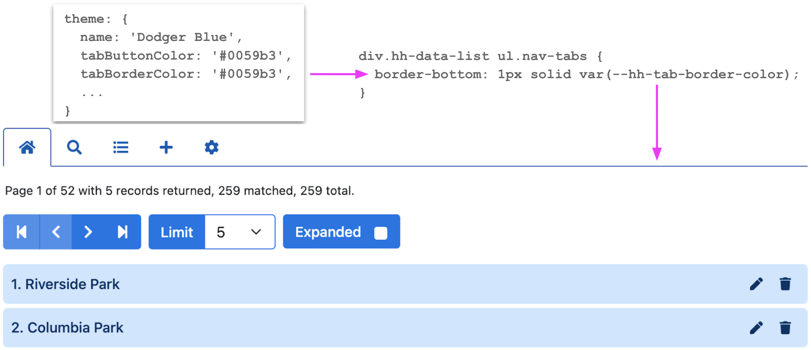

# Themes

<script>
  var queryParams = {
    fields: { name: 'fields' },
    filter: { name: 'filter' },
    order: { name: 'order' },
    page: { name: 'page' },
    limit: { name: 'limit' }
  };

  var recordFields = [
    { name: 'ID', label: 'ID', isChecked: false },
    { name: 'parkname', label: 'Name', isEditable: true, isRequired: true },
    { name: 'parkkey', label: 'Key', isEditable: true, isChecked: false },
    { name: 'parkalias', label: 'Aliases', isEditable: true },
    { name: 'city', label: 'City', isEditable: true },
    { name: 'state', label: 'State', isEditable: true },
    { name: 'country', label: 'Country', isEditable: true }
  ];

  var recordTitle = {
    fields: ['parkname']
  };
    
  var responseHelper = {
    record: (res) => res.data,
    records: (res) => res.data.records,
    numPages: (res, limit) => res.data.metadata.numTotalPages,
    numResponseRecords: (res) => res.data.metadata.numResponseRecords,
    numMatchedRecords: (res) => res.data.metadata.numFilteredRecords,
    numTotalRecords: (res) => res.data.metadata.numTotalRecords
  };
</script>

This page demonstrates how to customize the look and feel of your HHDataList instances.

# Quick start

## What is a theme?

A theme is a set of properties that specify (for the most part) HTML color names or values. Here is an example:

```
{
  name: 'Dodger Blue',
  tabButtonColor: '#0059b3',
  tabBorderColor: '#0059b3',
  controlColor: '#ffffff',
  controlColorHover: '#ffffff',
  controlBorderColor: '#0073e6',
  controlBorderColorHover: '#0059b3',
  controlBackgroundColor: '#0073e6',
  controlBackgroundColorHover: '#0059b3',
  controlOpacityDisabled: '80%',
  descriptionLinkColor: '#0059b3',
  descriptionLinkColorHover: '#0073e6',
  checkboxLabelColor: '#0059b3',
  checkboxBorderColor: '#4da6ff',
  checkboxBorderColorChecked: '#0059b3',
  checkboxBackgroundColor: '#ffffff',
  checkboxBackgroundColorChecked: '#0059b3',
  expanderCheckboxBorderColor: '#0073e6',
  expanderCheckboxBorderColorChecked: '#ffffff',
  expanderCheckboxBackgroundColor: '#ffffff',
  expanderCheckboxBackgroundColorChecked: '#0059b3',
  recordBorderColor: '#cce6ff',
  recordBorderColorHover: '#cce6ff',
  recordBorderColorOpen: '#4da6ff',
  recordTitleColor: '#0059b3',
  recordTitleBackgroundColor: '#cce6ff',
  recordTitleButtonColor: '#0059b3',
  recordTitleButtonColorHover: '#ffffff',
  recordTitleButtonColorActive: '#0059b3',
  recordTitleButtonBorderColor: 'transparent',
  recordTitleButtonBorderColorHover: '#0059b3',
  recordTitleButtonBorderColorActive: '#0059b3',
  recordTitleButtonBackgroundColor: 'transparent',
  recordTitleButtonBackgroundColorHover: '#0059b3',
  recordTitleButtonBackgroundColorActive: '#ffffff',
  recordFieldLabelColor: '#0073e6',
  recordFieldInputColor: '#0059b3',
  recordFieldInputColorDisabled: '#0059b3',
  recordFieldInputBorderColor: '#0059b3',
  recordFieldInputBorderColorDisabled: '#e6f2ff',
  recordFieldInputBackgroundColor: '#ffffff',
  recordFieldInputBackgroundColorDisabled: '#e6f2ff',
  recordFieldTextareaColor: '#0059b3',
  recordFieldTextareaColorDisabled: '#0059b3',
  recordFieldTextareaBorderColor: '#0059b3',
  recordFieldTextareaBorderColorDisabled: '#e6f2ff',
  recordFieldTextareaBackgroundColor: '#ffffff',
  recordFieldTextareaBackgroundColorDisabled: '#e6f2ff',
  recordFieldSelectColor: '#0059b3',
  recordFieldSelectBorderColor: '#e6f2ff',
  recordFieldSelectBackgroundColor: '#e6f2ff',
  recordFieldButtonColor: '#ffffff',
  recordFieldButtonBorderColor: '#0059b3',
  recordFieldButtonBackgroundColor: '#0059b3',
  recordFieldButtonOpacityDisabled: '65%',
  newRecordBorderColor: '#0059b3',
  newRecordBorderColorHover: '#0059b3',
  newRecordBorderColorOpen: '#0059b3',
  newRecordTitleColor: '#ffffff',
  newRecordTitleBackgroundColor: '#0059b3',
  newRecordTitleButtonColor: '#ffffff',
  newRecordTitleButtonColorHover: '#0059b3',
  newRecordTitleButtonBorderColor: 'transparent',
  newRecordTitleButtonBorderColorHover: '#ffffff',
  newRecordTitleButtonBackgroundColor: 'transparent',
  newRecordTitleButtonBackgroundColorHover: '#ffffff',
  newRecordFieldLabelColor: '#0059b3',
  newRecordFieldLabelColorRequired: '#0073e6',
  newRecordFieldInputColor: '#0059b3',
  newRecordFieldInputBorderColor: '#0059b3',
  newRecordFieldInputBackgroundColor: '#ffffff',
  newRecordSubmitButtonColor: '#ffffff',
  newRecordSubmitButtonColorHover: '#ffffff',
  newRecordSubmitButtonBorderColor: '#0073e6',
  newRecordSubmitButtonBorderColorHover: '#0059b3',
  newRecordSubmitButtonBackgroundColor: '#0073e6',
  newRecordSubmitButtonBackgroundColorHover: '#0059b3',
  createdRecordBorderColor: '#0059b3',
  createdRecordBorderColorHover: '#0059b3',
  createdRecordBorderColorOpen: '#0059b3',
  createdRecordTitleColor: '#ffffff',
  createdRecordTitleBackgroundColor: '#0059b3',
  createdRecordTitleButtonColor: '#ffffff',
  createdRecordTitleButtonColorHover: '#0059b3',
  createdRecordTitleButtonBorderColor: 'transparent',
  createdRecordTitleButtonBorderColorHover: '#ffffff',
  createdRecordTitleButtonBackgroundColor: 'transparent',
  createdRecordTitleButtonBackgroundColorHover: '#ffffff',
  createdRecordFieldLabelColor: '#0073e6',
  createdRecordFieldInputColor: '#0059b3',
  createdRecordFieldInputBorderColor: '#e6f2ff',
  createdRecordFieldInputBackgroundColor: '#e6f2ff'
}
```

## Appling a theme

The HHDataList constructor applies a theme to an HHDataList instance by mapping theme properties to CSS properties used in styling the individual HTML elements of the HHDataList instance:

<p></p>

**Describe theme list hereabouts.**

The list below summarizes information about themes. The rest of the page provides details.

1. HHDataList applies a *global* theme to multiple HHDataList instances except those instances that specify an *instance* theme to supercede the global theme. The name of the default global theme is [Dodger Blue](#dodger-blue). You can replace the default global theme with one of the other [Standard themes](#standard-themes) or with your own custom theme. For details, see [Setting the global theme](#setting-the-global-theme). You can also apply standard or custom themes to specific HHDataList instances. For details, see [Setting an instance theme](#setting-an-instance-theme).

1. Creating a [Custom global theme](#custom-global-theme) or a [Custom instance theme](#custom-instance-theme) is easy. You do so by either (a) cloning an existing theme and then overriding theme properties of your choice, or (b) generating a theme from a six-color palette and then overriding theme properties of your choice. It is possible to create a custom theme from scratch, too, but the first two approaches are much faster. See also the [Example theme](#example-theme).

# Standard themes

This section demonstrates the standard themes. After perusing this section, see [Setting the global theme](#setting-the-global-theme) and [Setting an instance theme](#setting-an-instance-theme) to learn how to use the standard themes. The default standard theme ([Dodger Blue](#dodger-blue-default)) resides in `hhdatalist.min.js`:

``` html nonum
<script src="https://hagenhaus.com/cdn/hhdatalist/v0.0.2/hhdatalist.min.js"></script>
```

To access the other standard themes, include `hhdatalist-themes.min.js` after `hhdatalist.min.js`:

``` html nonum
<script src="https://hagenhaus.com/cdn/hhdatalist/v0.0.2/hhdatalist.min.js"></script>
<script src="https://hagenhaus.com/cdn/hhdatalist/v0.0.2/hhdatalist-themes.min.js"></script>
```

## Dodger Blue (default)

<div id="datalist-dodger-blue" class="hh-data-list"></div>

<script>
  new HHDataList({
    confirm: confirm,
    id: 'datalist-dodger-blue',
    queryParams: queryParams,
    recordFields: recordFields,
    recordIdField: 'ID',
    recordParity: true,
    recordTitle: recordTitle,
    reportError: (title, detail) => { reportError(title, detail); },
    reportInfo: (title, detail) => { reportInfo(title, detail); },
    reportWarning: (type, title, detail) => { reportWarning(type, title, detail); },
    responseHelper: responseHelper,
    url: `${getDomain()}/api/baseball/v1/parks`,
  });
</script>

## Firebrick

<div id="datalist-firebrick" class="hh-data-list"></div>

<script>
  new HHDataList({
    confirm: confirm,
    id: 'datalist-firebrick',
    queryParams: queryParams,
    recordFields: recordFields,
    recordIdField: 'ID',
    recordParity: true,
    recordTitle: recordTitle,
    reportError: (title, detail) => { reportError(title, detail); },
    reportInfo: (title, detail) => { reportInfo(title, detail); },
    reportWarning: (type, title, detail) => { reportWarning(type, title, detail); },
    responseHelper: responseHelper,
    themeName:'Firebrick',
    url: `${getDomain()}/api/baseball/v1/parks`,
  });
</script>

## Forest Green

<div id="datalist-forest-green" class="hh-data-list"></div>

<script>
  new HHDataList({
    confirm: confirm,
    id: 'datalist-forest-green',
    queryParams: queryParams,
    recordFields: recordFields,
    recordIdField: 'ID',
    recordParity: true,
    recordTitle: recordTitle,
    reportError: (title, detail) => { reportError(title, detail); },
    reportInfo: (title, detail) => { reportInfo(title, detail); },
    reportWarning: (type, title, detail) => { reportWarning(type, title, detail); },
    responseHelper: responseHelper,
    themeName: 'Forest Green',
    url: `${getDomain()}/api/baseball/v1/parks`,
  });
</script>

## Lemon Chiffon

<div id="datalist-lemon-chiffon" class="hh-data-list"></div>

<script>
  new HHDataList({
    confirm: confirm,
    id: 'datalist-lemon-chiffon',
    queryParams: queryParams,
    recordFields: recordFields,
    recordIdField: 'ID',
    recordParity: true,
    recordTitle: recordTitle,
    reportError: (title, detail) => { reportError(title, detail); },
    reportInfo: (title, detail) => { reportInfo(title, detail); },
    reportWarning: (type, title, detail) => { reportWarning(type, title, detail); },
    responseHelper: responseHelper,
    themeName: 'Lemon Chiffon',
    url: `${getDomain()}/api/baseball/v1/parks`,
  });
</script>

## Orangewood

<div id="datalist-orangewood" class="hh-data-list"></div>

<script>
  new HHDataList({
    confirm: confirm,
    id: 'datalist-orangewood',
    queryParams: queryParams,
    recordFields: recordFields,
    recordIdField: 'ID',
    recordParity: true,
    recordTitle: recordTitle,
    reportError: (title, detail) => { reportError(title, detail); },
    reportInfo: (title, detail) => { reportInfo(title, detail); },
    reportWarning: (type, title, detail) => { reportWarning(type, title, detail); },
    responseHelper: responseHelper,
    themeName: 'Orangewood',
    url: `${getDomain()}/api/baseball/v1/parks`,
  });
</script>

## Plum

<div id="datalist-plum" class="hh-data-list"></div>

<script>
  new HHDataList({
    confirm: confirm,
    id: 'datalist-plum',
    queryParams: queryParams,
    recordFields: recordFields,
    recordIdField: 'ID',
    recordParity: true,
    recordTitle: recordTitle,
    reportError: (title, detail) => { reportError(title, detail); },
    reportInfo: (title, detail) => { reportInfo(title, detail); },
    reportWarning: (type, title, detail) => { reportWarning(type, title, detail); },
    responseHelper: responseHelper,
    themeName: 'Plum',
    url: `${getDomain()}/api/baseball/v1/parks`,
  });
</script>

## Seagreen

<div id="datalist-seagreen" class="hh-data-list"></div>

<script>
  new HHDataList({
    confirm: confirm,
    id: 'datalist-seagreen',
    queryParams: queryParams,
    recordFields: recordFields,
    recordIdField: 'ID',
    recordParity: true,
    recordTitle: recordTitle,
    reportError: (title, detail) => { reportError(title, detail); },
    reportInfo: (title, detail) => { reportInfo(title, detail); },
    reportWarning: (type, title, detail) => { reportWarning(type, title, detail); },
    responseHelper: responseHelper,
    themeName: 'Seagreen',
    url: `${getDomain()}/api/baseball/v1/parks`,
  });
</script>

## Shadowbox

<div id="datalist-shadowbox" class="hh-data-list"></div>

<script>
  new HHDataList({
    confirm: confirm,
    id: 'datalist-shadowbox',
    queryParams: queryParams,
    recordFields: recordFields,
    recordIdField: 'ID',
    recordParity: true,
    recordTitle: recordTitle,
    reportError: (title, detail) => { reportError(title, detail); },
    reportInfo: (title, detail) => { reportInfo(title, detail); },
    reportWarning: (type, title, detail) => { reportWarning(type, title, detail); },
    responseHelper: responseHelper,
    themeName: 'Shadowbox',
    url: `${getDomain()}/api/baseball/v1/parks`,
  });
</script>

## Shoreline

<div id="datalist-showline" class="hh-data-list"></div>

<script>
  new HHDataList({
    confirm: confirm,
    id: 'datalist-showline',
    queryParams: queryParams,
    recordFields: recordFields,
    recordIdField: 'ID',
    recordParity: true,
    recordTitle: recordTitle,
    reportError: (title, detail) => { reportError(title, detail); },
    reportInfo: (title, detail) => { reportInfo(title, detail); },
    reportWarning: (type, title, detail) => { reportWarning(type, title, detail); },
    responseHelper: responseHelper,
    themeName: 'Shoreline',
    url: `${getDomain()}/api/baseball/v1/parks`,
  });
</script>

## Silverberry

<div id="datalist-silverberry" class="hh-data-list"></div>

<script>
  new HHDataList({
    confirm: confirm,
    id: 'datalist-silverberry',
    queryParams: queryParams,
    recordFields: recordFields,
    recordIdField: 'ID',
    recordParity: true,
    recordTitle: recordTitle,
    reportError: (title, detail) => { reportError(title, detail); },
    reportInfo: (title, detail) => { reportInfo(title, detail); },
    reportWarning: (type, title, detail) => { reportWarning(type, title, detail); },
    responseHelper: responseHelper,
    themeName: 'Silverberry',
    url: `${getDomain()}/api/baseball/v1/parks`,
  });
</script>

## Teal Ribbon

<div id="datalist-teal-ribbon" class="hh-data-list"></div>

<script>
  new HHDataList({
    confirm: confirm,
    id: 'datalist-teal-ribbon',
    queryParams: queryParams,
    recordFields: recordFields,
    recordIdField: 'ID',
    recordParity: true,
    recordTitle: recordTitle,
    reportError: (title, detail) => { reportError(title, detail); },
    reportInfo: (title, detail) => { reportInfo(title, detail); },
    reportWarning: (type, title, detail) => { reportWarning(type, title, detail); },
    responseHelper: responseHelper,
    themeName: 'Teal Ribbon',
    url: `${getDomain()}/api/baseball/v1/parks`,
  });
</script>

## Thistle

<div id="datalist-thistle" class="hh-data-list"></div>

<script>
  new HHDataList({
    confirm: confirm,
    id: 'datalist-thistle',
    queryParams: queryParams,
    recordFields: recordFields,
    recordIdField: 'ID',
    recordParity: true,
    recordTitle: recordTitle,
    reportError: (title, detail) => { reportError(title, detail); },
    reportInfo: (title, detail) => { reportInfo(title, detail); },
    reportWarning: (type, title, detail) => { reportWarning(type, title, detail); },
    responseHelper: responseHelper,
    themeName: 'Thistle',
    url: `${getDomain()}/api/baseball/v1/parks`,
  });
</script>

## Wheatgerm

<div id="datalist-wheatgerm" class="hh-data-list"></div>

<script>
  new HHDataList({
    confirm: confirm,
    id: 'datalist-wheatgerm',
    queryParams: queryParams,
    recordFields: recordFields,
    recordIdField: 'ID',
    recordParity: true,
    recordTitle: recordTitle,
    reportError: (title, detail) => { reportError(title, detail); },
    reportInfo: (title, detail) => { reportInfo(title, detail); },
    reportWarning: (type, title, detail) => { reportWarning(type, title, detail); },
    responseHelper: responseHelper,
    themeName: 'Wheatgerm',
    url: `${getDomain()}/api/baseball/v1/parks`,
  });
</script>

# Standard palettes

# Setting the global theme

The global theme applies to all HHDataList instances that do not specify an instance theme.

## Default global theme

Do nothing. HHDataList applies the default global theme to all HHDataList instances.

## Standard global theme

Set a global theme from the list of standard themes:

``` nonum
HHDataList.setDefaultTheme('Wheatgerm');
```

## Custom global theme

Add a custom theme to the list, and set it as the global default.

``` nonum
let theme = HHDataList.buildThemeFromThemeName('Silverberry', 'My Theme', { tabButtonColor: 'red' });
HHDataList.addTheme(theme);
HHDataList.setDefaultTheme('My Theme');
```

``` nonum
let theme = HHDataList.buildThemeFromPaletteName('Plum', 'My Theme', { tabButtonColor: 'red' });
HHDataList.addTheme(theme);
HHDataList.setDefaultTheme('My Theme');
```

``` nonum
let theme = HHDataList.buildThemeFromPalette({
  color1: '#ffffff',
  color2: '#eafaea',
  color3: '#d6f5d6',
  color4: '#c1f0c1',
  color5: '#239023',
  color6: '#145214'
  }, 'My Theme', { tabButtonColor: 'red' });
HHDataList.addTheme(theme);
HHDataList.setDefaultTheme('My Theme');
```

``` nonum
HHDataList.addTheme({
  name: 'My Theme',
  tabButtonColor: '#961d1d',
  tabBorderColor: '#961d1d',
  controlColor: '#ffffff',
  controlColorHover: '#ffffff',
  ...
});
HHDataList.setDefaultTheme('My Theme');
```

# Setting an instance theme

An instance theme overrides the global theme. You set an instance theme in the HHDataList constructor.

## Standard instance theme

``` nonum
new HHDataList({
  themeName: 'Wheatgerm',
});
```

## Registered instance theme

You could also use `buildThemeFromPaletteName`, `buildThemeFromPalette`, or `addTheme`. 

``` nonum
let theme = HHDataList.buildThemeFromThemeName('Silverberry', 'My Theme', { tabButtonColor: 'red' });
HHDataList.addTheme(theme);
 
new HHDataList({
  themeName: 'My Theme',
});
```

## Custom instance theme

May not need newThemeName. Perhaps call them anonymous themes.

``` nonum
new HHDataList({
  themeFromThemeName: {
    themeName: 'Silverberry',
    newThemeName: 'My Theme',
    overrides: {
      tabButtonColor: 'red'
    }
  },
});
```

``` nonum
new HHDataList({
  themeFromPaletteName: {
    paletteName: 'Silverberry',
    newThemeName: 'My Silverberry',
    overrides: {
      tabButtonColor: 'blue'
    }
  },
});
```

``` nonum
new HHDataList({
  themeFromPalette: {
    palette: {
      color1: '#ffffff',
      color2: '#fcf5e8',
      color3: '#f9ebd2',
      color4: '#f6e2bb',
      color5: '#e29d1d',
      color6: '#875e12'
    },
    newThemeName: 'My Silverberry',
    overrides: {
      tabButtonColor: 'green'
    }
  },
});
```

``` nonum
new HHDataList({
  theme: {
    name: 'My Theme',
    tabButtonColor: '#961d1d',
    tabBorderColor: '#961d1d',
    controlColor: '#ffffff',
    controlColorHover: '#ffffff',
    ...
  },
});
```

# Functions

## Theme functions

## Palette functions

# Displaying themes

``` js nonum
let theme = HHDataList.buildThemeFromPaletteName('dodger blue', 'My Theme', { tabButtonColor: 'red' });
const t1 = JSON.stringify(theme, null, 2);
const t2 = t1.replace(/"([^"]+)":/g, '$1:');
const t3 = t2.replace(/"/g, "'");      
console.log(t3);
```