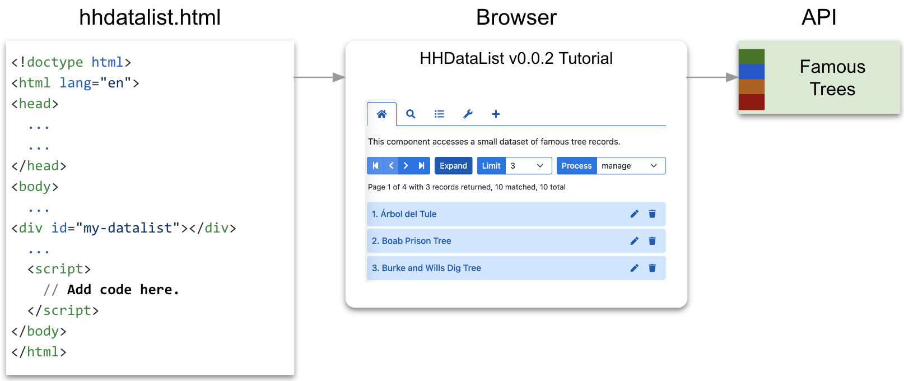
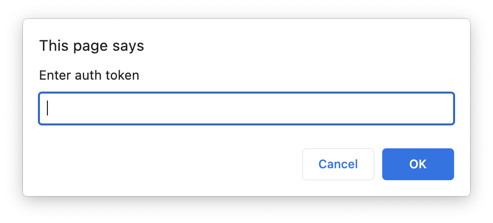
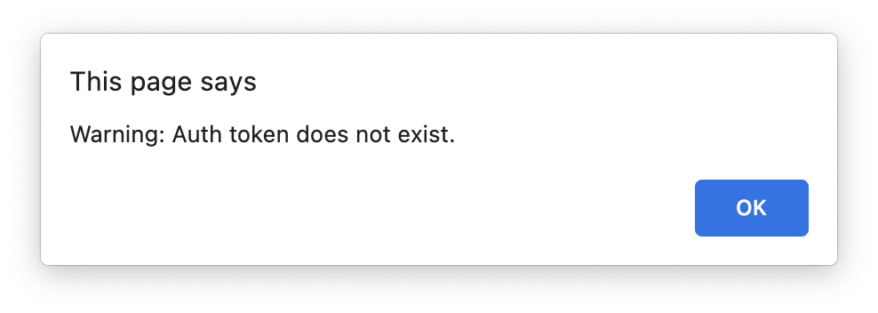
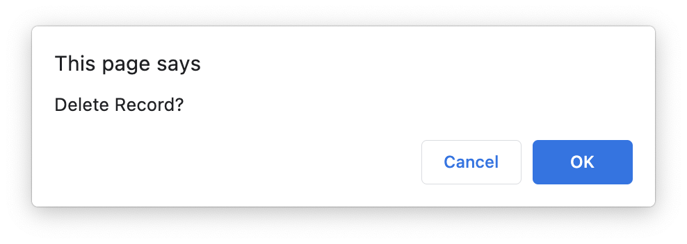
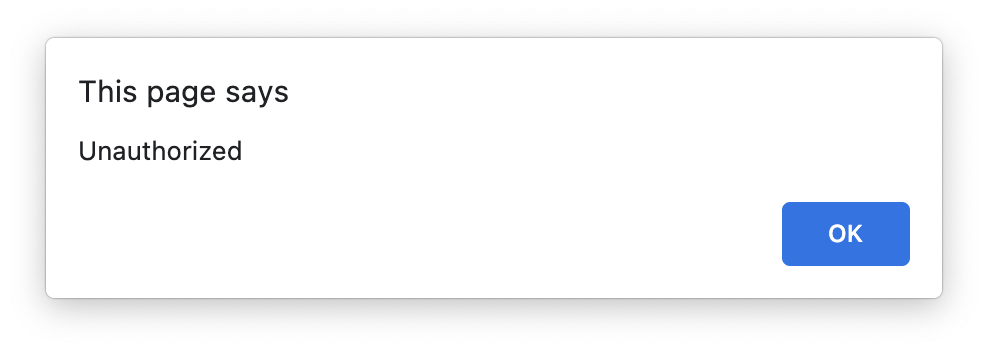
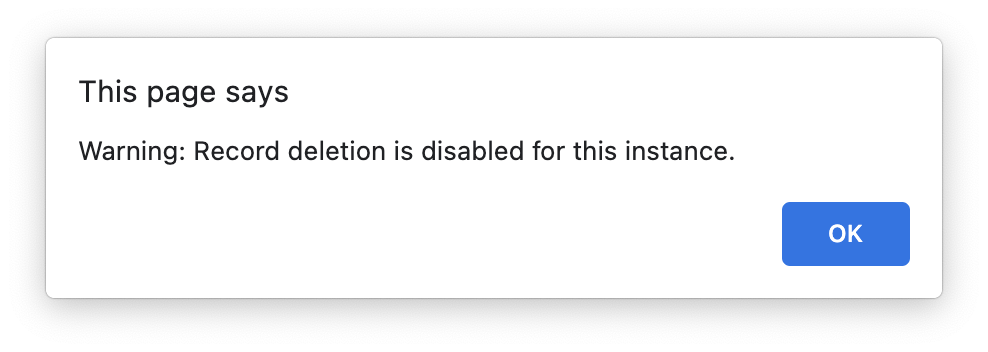
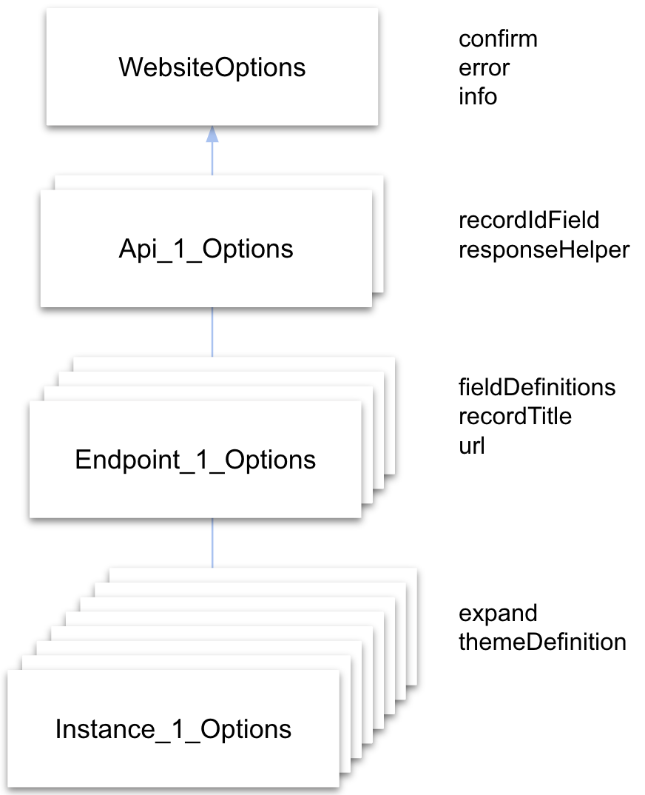

# Tutorial

This tutorial shows you how to create an HHDataList component, point it at an API, and configure it with [Options](/en/hhdatalist/v0.0.2/options/).

<p></p>

# Review the Trees API

This tutorial utilizes the [Famous Trees API](/en/hhdatalist/v0.0.2/openapi/) which provides access to a small number of records representing famous individual international trees. Record fields represent a variety of data types including strings, numbers, objects, and arrays. The API supports `GET`, `POST`, `PATCH`, and `DELETE` methods, the last three requiring `Bearer` authentication. Here are two endpoints:

``` nonum
<a href="https://hagenhaus.com:3002/api/famous/v1/trees">https://hagenhaus.com:3002/api/famous/v1/trees</a>
<a href="https://hagenhaus.com:3002/api/famous/v1/trees/1">https://hagenhaus.com:3002/api/famous/v1/trees/1</a>
```

The `getRecords` operation supports `fields`, `filter`, `order`, `page`, and `limit` query parameters. The `page` value is one-base. The `page` default is 1. The `limit` default is 10:

``` nonum
<a href="https://hagenhaus.com:3002/api/famous/v1/trees?fields=id%2Cname">https://hagenhaus.com:3002/api/famous/v1/trees?fields=id%2Cname</a>
<a href="https://hagenhaus.com:3002/api/famous/v1/trees?filter=country%20like%20%22AUS%22">https://hagenhaus.com:3002/api/famous/v1/trees?filter=country%20like%20%22AUS%22</a>
<a href="https://hagenhaus.com:3002/api/famous/v1/trees?order=name%20asc">https://hagenhaus.com:3002/api/famous/v1/trees?order=name%20asc</a>
<a href="https://hagenhaus.com:3002/api/famous/v1/trees?page=1&limit=3">https://hagenhaus.com:3002/api/famous/v1/trees?page=1&limit=3</a>
```

A `getRecords` response resembles the following:

``` nonum
{
  "metadata": {
    "numTotalRecords": 10,
    "numFilteredRecords": 8,
    "numResponseRecords": 3,
    "page": 1,
    "limit": 3,
    "numTotalPages": 4,
    "firstItemOnPage": 1
  },
  "records": [
    { "id": 1, ... },
    { "id": 2, ... },
    { "id": 3, ... }
  ]
}
```

The `getRecord` operation supports the `fields` query parameters:

``` nonum
<a href="https://hagenhaus.com:3002/api/famous/v1/trees/1?fields=name%2Cspecies%2Cdescription%2Ccity%2Ccountry%2Clat%2Clng%2CbirthYear%2Cheight%2Clinks%2Cid">https://hagenhaus.com:3002/api/famous/v1/trees/1?fields=name%2Cspecies%2Cdescription%2Ccity%2Ccountry%2Clat%2Clng%2CbirthYear%2Cheight%2Clinks%2Cid</a>
```

A `getRecord` response resembles the following:

``` nonum
{
  "id": 1,
  "birthYear": 1582,
  "city": "Bahrain",
  "country": "BHR",
  "description": "The Tree of Life (Shajarat-al-Hayat) in Bahrain is a 9.75 meters (32 feet) high Prosopis cineraria tree that is over 400 years old. It is on a hill in a barren area of the Arabian Desert, 2 kilometers (1.2 miles) from Jebel Dukhan, the highest point in Bahrain, and 40 kilometers from Manama.",
  "girth": 0,
  "height": 32,
  "lat": "25.9940730",
  "links": [
    {
      "link": "https://en.wikipedia.org/wiki/Tree_of_Life_(Bahrain)",
      "text": "Wikipedia"
    },
    {
      "link": "https://www.atlasobscura.com/places/tree-of-life",
      "text": "Atlas Obscura"
    }
  ],
  "lng": "50.5832350",
  "name": "Tree of Life",
  "species": {
    "link": "https://en.wikipedia.org/wiki/Prosopis_cineraria",
    "text": "Prosopis cineraria"
  }
}
```

# Create a project file

Follow these steps to set up a development environment (editor and browser) and create a project file:

1. Open vscode or another editor.

1. Create a file named hhdatalist.html on your file system.

1. Add the following HTML to the file and save:

    ``` html nonum
    <!doctype html>
    <html lang="en">
    <head>
      <meta charset="utf-8">
      <meta name="viewport" content="width=device-width, initial-scale=1">
      <link rel="stylesheet" type="text/css" href="https://cdn.jsdelivr.net/npm/bootstrap@5.1.3/dist/css/bootstrap.min.css">
      <link rel="stylesheet" type="text/css" href="https://use.fontawesome.com/releases/v5.15.4/css/all.css">
      <link rel="stylesheet" type="text/css" href="https://hagenhaus.com/cdn/hhdatalist/v0.0.2/hhdatalist.min.css">
      <style>
        div.page { max-width: 900px; }
        p.title { font-weight: 500; display: table; margin: 0 auto; }
      </style>
      <title>HHDataList v0.0.2 Tutorial</title>
    </head>
    <body>
      <div class="container page">
        <p class="my-3 title">HHDataList v0.0.2 Tutorial</p>
        <div id="my-datalist" class="hh-data-list my-3"></div>
      </div>
      <script src="https://cdnjs.cloudflare.com/ajax/libs/axios/0.27.2/axios.min.js"></script>
      <script src="https://cdn.jsdelivr.net/npm/bootstrap@5.1.3/dist/js/bootstrap.bundle.min.js"></script>
      <script src="https://hagenhaus.com/cdn/hhdatalist/v0.0.2/hhdatalist.min.js"></script>
      <script>
        // Add code here.
      </script>
    </body>
    </html>
    ```

1. Open the file in a browser tab, too.

# Deploy a datalist

This section helps you deploy a minimal HHDataList component. Consider this code:

``` js nonum
new HHDataList({
  displayLimit: 8,
  id: 'my-datalist',
  recordIdField: 'id',
  recordTitle: { fields: ['name'], format: (f, r) => r[f[0]] },
  responseHelper: {
    record: (res) => res.data,
    records: (res) => res.data.records,
    numPages: (res, limit) => res.data.metadata.numTotalPages,
    numResponseRecords: (res) => res.data.metadata.numResponseRecords,
    numMatchedRecords: (res) => res.data.metadata.numFilteredRecords,
    numTotalRecords: (res) => res.data.metadata.numTotalRecords
  },
  url: 'https://hagenhaus.com:3002/api/famous/v1/trees',
});
```

`HHDataList` is a class. The statement `new HHDataList()` invokes the class constructor to create a new instance. The constructor requires an object as an argument. Each property in the object is called an option. In the code snippet above, [displayLimit](/en/hhdatalist/v0.0.2/options/displaylimit/), [id](/en/hhdatalist/v0.0.2/options/id/), [recordIdField](/en/hhdatalist/v0.0.2/options/recordidfield/), [recordTitle](/en/hhdatalist/v0.0.2/options/recordtitle/), [responseHelper](/en/hhdatalist/v0.0.2/options/responsehelper/), and [url](/en/hhdatalist/v0.0.2/options/url/) are [Options](/en/hhdatalist/v0.0.2/options/).

### Steps

1. Copy the snippet above.

1. Paste it into hhdatalist.html just below the comment `Add code here`.

1. Save the file.

1. Refresh your browser and view the datalist.

### Example

<div id="deploy-datalist" class="hh-data-list my-3"></div>
<script>
  var DeployOptions = class {
    constructor(id) {
      this.displayLimit = 8;
      this.id = id;
      this.recordTitle = { fields: ['name'], format: (f, r) => r[f[0]] };
      this.recordIdField = 'id';
      this.responseHelper = {
        record: (res) => res.data,
        records: (res) => res.data.records,
        numPages: (res, limit) => res.data.metadata.numTotalPages,
        numResponseRecords: (res) => res.data.metadata.numResponseRecords,
        numMatchedRecords: (res) => res.data.metadata.numFilteredRecords,
        numTotalRecords: (res) => res.data.metadata.numTotalRecords
      };
      this.url = 'https://hagenhaus.com:3002/api/famous/v1/trees';
    }
  };
  new HHDataList(new DeployOptions('deploy-datalist'));
</script>

# Monitor API requests

Throughout this tutorial, HHDataList initiates various API requests to the Famous Trees API. From time to time, it is helpful to examine the URLs of these requests. HHDataList includes the Requests Reporter tool for this purpose. This section helps you work with the Requests Reporter tool which is controlled by the `requests` property of the [reporters](/en/hhdatalist/v0.0.2/options/reporters/) option.

### Steps

1. Click the wrench icon on your datalist. This is the Tools tab. Notice the checkboxes and corresponding labels. Each label is the name of a tool. Checking a checkbox displays the corresponding tool in the Tools row.

1. Check the checkbox beside the Requests Reporter label to display the tool. By default, this tool calls `console.log` to output requests to the Developer Tools console of your browser. Here is example output:

    ``` nonum
    GET: https://hagenhaus.com:3002/api/famous/v1/trees/1
    ```

1. Click the tool to enable it.

1. Display your browser console, expand a few records, and notice the output in the browser console.

    ``` nonum
    GET: https://hagenhaus.com:3002/api/famous/v1/trees/1
    GET: https://hagenhaus.com:3002/api/famous/v1/trees/4
    GET: https://hagenhaus.com:3002/api/famous/v1/trees/5
    GET: https://hagenhaus.com:3002/api/famous/v1/trees/8
    ```

    Because many of the sections in this tutorial ask you to inspect request URLs, the steps below configure HHDataList to output request URLs to your browser console by default.

1. Copy Line 2 below, add it to the HHDataList options in hhdatalist.html, and save:

    ``` js
    new HHDataList({
      reporters: { requests: { value: true } },
    });
    ```

1. Refresh your browser, expand records to generate more requests, and view output in the console.

    > The remainder of this tutorial assumes that the Requests Reporter is enabled (though not visible).

### Example

<div id="console-datalist" class="hh-data-list my-3"></div>
<script>
  var consoleOptions = class extends DeployOptions {
    constructor(id) {
      super(id);
      this.reporters = { requests: { value: true } };
    }
  };
  new HHDataList(new consoleOptions('console-datalist'));
</script>

# Limit response record count

Your datalist probably returned 10 records and displayed 8. It returned 10 because the Famous Trees API returns a maximum of 10 by default. It displayed 8 because [displayLimit](/en/hhdatalist/v0.0.2/options/displaylimit/) is set to 8. 

The [displayLimit](/en/hhdatalist/v0.0.2/options/displaylimit/) option does not limit the number of records an API returns. Rather, it limits the number of records HHDataList displays while you explore a new API, protecting HHDataList from APIs that do not enforce a reasonable limit.

Fortunately, the Famous Trees API does have a query parameter (i.e. `limit`) that sets the page size. This section helps you take advantage of this query parameter by adding the `limit` property of the [queryParams](/en/hhdatalist/v0.0.2/options/queryparams/) option to your datalist so users can limit the number of records returned.

### Steps

1. Add the `queryParams` option (Lines 2-4) to the HHDataList options in hhdatalist.html and save:

    ``` js
    new HHDataList({
      queryParams: {
        limit: { name: 'limit', default: 3, showTool: true },
      },
    });
    ```

1. Remove the `displayLimit` option, or set it to a higher value. HHDataList enforces a display limit of 100.

1. Refresh your browser.

1. Notice that the datalist returned 3 records and displayed 3 records.

1. Notice the newly added Limit tool which appears in the Tools row because `showTool` is set to `true`.

1. Use the Limit tool to display varying numbers of records.

1. Inspect API requests. Notice the `limit` query parameter. Here is an example:

    ``` nonum
    GET https://hagenhaus.com:3002/api/famous/v1/trees?limit=5
    ```

### Example

<div id="limit-datalist" class="hh-data-list my-3"></div>
<script>
  var LimitOptions = class extends consoleOptions {
    constructor(id) {
      super(id);
      this.displayLimit = 20;
      this.queryParams = { limit: { name: 'limit', default: 3, showTool: true } };
    }
  };
  new HHDataList(new LimitOptions('limit-datalist'));
</script>

# Paginate records

In addition to the `limit` query parameter which sets the page size, the Famous Trees API includes a `page` query parameter which specifies the page number. This section helps you take advantage of this query parameter by adding the `page` property of the [queryParams](/en/hhdatalist/v0.0.2/options/queryparams/) option to your datalist so users can scroll through pages of records.

### Steps

1. Add the `page` property (Line 3) to the `queryParams` option in hhdatalist.html and save:

    ``` js
    new HHDataList({
      queryParams: {
        page: { name: 'page' },
      },
    });
    ```

1. Refresh your browser.

1. Notice the new Paginator tool. Try it.

1. Inspect API requests. Notice the `page` query parameter. Here is an example:

    ``` nonum
    GET https://hagenhaus.com:3002/api/famous/v1/trees?page=2&limit=3
    ```

### Example

<div id="page-datalist" class="hh-data-list my-3"></div>
<script>
  var PageOptions = class extends LimitOptions {
    constructor(id) {
      super(id);
      this.queryParams.page = { name: 'page' };
    }
  };
  new HHDataList(new PageOptions('page-datalist'));
</script>

# Scroll expanded records

HHDataList scrolls expanded records more efficiently if (a) the underlying API possesses a certain characteristic called parity and (b) HHDataList is configured to take advantage of this characteristic. Happily, the Famous Trees API does possess parity, and HHDataList can be configured to leverage this quality via the [parity](/en/hhdatalist/v0.0.2/options/parity/) option. This section helps you demonstrate the concept of parity to yourself and enable it for your datalist.

### Steps

1. Display the Expand tool in the Tools row of your datalist, and click it to enable it.

1. Scroll expanded records and examine the Request URLs. Example:

    ``` nonum
    GET: https://hagenhaus.com:3002/api/famous/v1/trees?page=2&limit=3
    GET: https://hagenhaus.com:3002/api/famous/v1/trees/4
    GET: https://hagenhaus.com:3002/api/famous/v1/trees/5
    GET: https://hagenhaus.com:3002/api/famous/v1/trees/6
    ```

    This is default HHDataList behavior. HHDataList does not assume that the `getRecords` operation of the underlying API can return all the fields that the `getRecord` operation can. So, when displaying a page of expanded records, HHDataList calls `getRecords` to build all the record titles on the page, and then it calls `getRecord` iteratively to populate the fields of each expanded record.

1. Display the GET Parity tool in the Tools row of your datalist, and click it to enable it.

1. Scroll expanded records again and examine the request URLs. Example:

    ``` nonum
    https://hagenhaus.com:3002/api/famous/v1/trees?page=2&limit=3
    ```

    With parity enabled, HHDataList calls `getRecords` once to return the data needed to populate a page of expanded records. It does not call `getRecord` iteratively for each expanded record.

1. Add the `expand` and `parity` options to hhdatalist.html and save:

    ``` js nonum
    new HHDataList({
      expand: { showTool: true },
      parity: { get: { value: true } },
    });
    ```

1. Refresh your browser.

### Example

<div id="parity-datalist" class="hh-data-list my-3"></div>
<script>
  var ParityOptions = class extends PageOptions {
    constructor(id) {
      super(id);
      this.expand = { showTool: true };
      this.parity = { get: { value: true } };
    }
  };
  new HHDataList(new ParityOptions('parity-datalist'));
</script>

# Specify the theme

Dodger Blue is the name of the default HHDataList theme. It is one of the standard themes. HHDataList supports both standard and custom themes as explained in [Themes and Palettes](/en/hhdatalist/v0.0.2/themes-and-palettes/). The steps below help you set the theme of your datalist to one of the other standard themes using the [themeDefinition](/en/hhdatalist/v0.0.2/options/themedefinition/) option. The steps also help you explore theme-related tools.

### Steps

1. Display the Theme tool in the Tools row. Notice that it contains only Dodger Blue.

1. Include hhdatalist-themes.js in hhdatalist.html:

    ``` html nonum
    <script src="https://hagenhaus.com/cdn/hhdatalist/v0.0.2/hhdatalist-themes.js"></script>
    ```

1. Add the `addAllStandardThemes` invocation (Line 1) to hhdatalist.html and save.

    ``` js
    HHDataList.addAllStandardThemes();
     
    new HHDataList({
      ...
    });
    ```

    `addAllStandardThemes` is a static class function that adds all the standard themes to the site-wide theme list.

1. Refresh your browser.

1. Display the Theme tool again, notice the list of standard themes, and try some.

1. Add the `themeDefinition` option (Line 2) to hhdatalist.html and save.

    ``` js
    new HHDataList({
      themeDefinition: { name: 'wheatgerm' },
    });
    ```

1. Refresh your browser and notice the new theme.

1. Display the Theme Reporter tool and click it to display the current theme in the browser console. 

    ``` nonum
    {
      name: 'Wheatgerm',
      tabButtonColor: '#875e12',
      tabBorderColor: '#875e12',
      controlColor: '#ffffff',
      controlColorHover: '#ffffff',
      controlBorderColor: '#e29d1d',
      ...
    }
    ```

1. Display the Themes Reporter tool and click it to display the theme list in the browser console.

    > The Theme Reporter and Themes Reporter tools are useful when creating custom themes. For more information, see [Themes and Palettes](/en/hhdatalist/v0.0.2/themes-and-palettes/).

### Example

<div id="theme-datalist" class="hh-data-list my-3"></div>
<script>
  var ThemeOptions = class extends ParityOptions {
    constructor(id) {
      super(id);
      this.themeDefinition = { name: 'wheatgerm' };
    }
  };
  new HHDataList(new ThemeOptions('theme-datalist'));
</script>

# Modify default field width

The default width of fields in expanded records is set by the `records` property of the [colWidths](/en/hhdatalist/v0.0.2/options/colwidths/) option, although it may be overridden (as seen later in this tutorial) by individual `manage` or `transform` [fieldDefinitions](/en/hhdatalist/v0.0.2/options/fielddefinitions/). The steps below help you configure the [colWidths](/en/hhdatalist/v0.0.2/options/colwidths/) option.

### Steps

1. Expand a record and notice that (on wide screens) there are four fields in one row.

1. Display the Column Width tool in the Tools row of your datalist, and select other widths.

1. Add the `colWidths` option to hhdatalist.html and save:

    ``` js nonum
    new HHDataList({
      colWidths: { records: { value: 'medium' } },
    });
    ```

1. Refresh your browser.

1. Expand another record. Notice that the default column width is now `medium`.

### Example

<div id="width-datalist" class="hh-data-list my-3"></div>
<script>
  var WidthOptions = class extends ParityOptions {
    constructor(id) {
      super(id);
      this.colWidths = { records: { value: 'medium' } };
    }
  };
  new HHDataList(new WidthOptions('width-datalist'));
</script>

# Control process mode

HHDataList moves data from an API response to an expanded record in one of three ways: copy, manage, or transform. Each of these is a [processMode](/en/hhdatalist/v0.0.2/options/processmode/). This section helps you add the [processMode](/en/hhdatalist/v0.0.2/options/processmode/) option to your datalist in a way that displays the Process tool in the Tools row so you can compare process modes as you progress through the tutorial.

### Steps

1. Add the `processMode` option to hhdatalist.html and save:

    ``` js nonum
    new HHDataList({
      processMode: { showTool: true },
    });
    ```

1. Refresh your browser.

1. Notice the newly added Process tool in the Tools row. Currently, this dropdown contains only one item. The name of this item is "copy", and it represents the current [processMode](/en/hhdatalist/v0.0.2/options/processmode/). In fact, if no [fieldDefinitions](/en/hhdatalist/v0.0.2/options/fielddefinitions/) are defined, and none are at this point, copy is the only available process mode.

1. Expand a record to view the record fields. In copy mode, the fields in an expanded record are governed by the API response including the order of the fields and the labels. 

### Example

<div id="process-datalist" class="hh-data-list my-3"></div>
<script>
  var ProcessOptions = class extends WidthOptions {
    constructor(id) {
      super(id);
      this.processMode = { showTool: true };
    }
  };
  new HHDataList(new ProcessOptions('process-datalist'));
</script>

# Add manage field definitions

This section helps you add "manage" to the Process tool dropdown by adding the `manage` property of the [fieldDefinitions](/en/hhdatalist/v0.0.2/options/fielddefinitions/) option to your datalist. The `manage` property is an array of field definitions. The order of these field definitions in the array controls the order of fields in expanded records. And, each field definition controls other aspects of a record field. 

In addition to `manage` field definitions, HHDataList also supports `transform` field definitions which are the focus of the [Add transform field definitions](#add-transform-field-definitions) section below. To learn more, see [processMode](/en/hhdatalist/v0.0.2/options/processmode/) and [fieldDefinitions](/en/hhdatalist/v0.0.2/options/fielddefinitions/).

### Steps

1. Add the `fieldDefinitions` option to hhdatalist.html and save:

    ``` js nonum
    new HHDataList({
      fieldDefinitions: {
        manage: [
          { fieldName: 'id', isChecked: false },
          { fieldName: 'name', isEditable: true, isRequired: true },
          { fieldName: 'species', isEditable: true },
          { fieldName: 'description', isEditable: true },
          { fieldName: 'city', isEditable: true },
          { fieldName: 'country', isEditable: true },
          { fieldName: 'lat', isEditable: true },
          { fieldName: 'lng', isEditable: true },
          { fieldName: 'birthYear', isEditable: true, colWidth: 'narrow' },
          { fieldName: 'height', isEditable: true, colWidth: 'narrow' },
          { fieldName: 'girth', isEditable: true, isChecked: false },
          { fieldName: 'links', isEditable: true }
        ],
      },
    });
    ```

    As you can see, `manage` is an array of objects. The properties inside these objects (e.g. `fieldName`, `isChecked`) are called "field definition properties". Each object represents one field in the API response and, if `isChecked` equals `true`, each object also represents a corresponding field in an expanded record.

1. Refresh your browser.

1. Notice that "manage" appears as the default option of the Process tool.

1. Expand a record.

1. Using the Process tool, toggle between copy mode and manage mode. In copy mode, the fields in an expanded record are governed by the API response. In manage mode, the existence and order of the fields are governed by field definitions.

1. Click the newly displayed Fields tab, check and uncheck various fields, and note the appearance and disappearance of fields in the expanded record(s). 

1. Click the newly displayed New tab. All fields marked `isEditable` in `manage` field definitions appear in the New Records form. Of these, all marked `isRequired` are labeled with an asterisk. Try creating a new record without and with a name. You do not need to fill in all the fields. The browser console will display `401 (Unauthorized)`.

### Example

<div id="manage-datalist" class="hh-data-list my-3"></div>
<script>
  var ManageOptions = class extends ProcessOptions {
    constructor(id) {
      super(id);
      this.fieldDefinitions = {
        manage: [
          { fieldName: 'id', isChecked: false },
          { fieldName: 'name', isEditable: true, isRequired: true },
          { fieldName: 'species', isEditable: true },
          { fieldName: 'description', isEditable: true },
          { fieldName: 'city', isEditable: true },
          { fieldName: 'country', isEditable: true },
          { fieldName: 'lat', isEditable: true },
          { fieldName: 'lng', isEditable: true },
          { fieldName: 'birthYear', isEditable: true, colWidth: 'narrow' },
          { fieldName: 'height', isEditable: true, colWidth: 'narrow' },
          { fieldName: 'girth', isEditable: true, isChecked: false },
          { fieldName: 'links', isEditable: true }
        ]
      };
    }
  };
  new HHDataList(new ManageOptions('manage-datalist'));
</script>

# Add a confirm function

If a website provides a `confirm` function via the [confirm](/en/hhdatalist/v0.0.2/options/confirm/) option, HHDataList calls it before performing certain actions such as deleting a record. The signature of a `confirm` function is fixed, but the implementation is up to the website developer. Usually, `confirm` functions ask the user via a modal or dialog whether to proceed with the impending action. This section helps you add the [confirm](/en/hhdatalist/v0.0.2/options/confirm/) option to your datalist so users can confirm record deletions and other actions.

> The `confirm` function used in the tutorial datalist is based on the JS [confirm](https://developer.mozilla.org/en-US/docs/Web/API/Window/confirm) function which displays a dialog. The datalists on hagenhaus.com use a `confirm` function based on Bootstrap modals.

### Steps

1. Add the `myConfirm` function and the `confirm` option to hhdatalist.html and save.

    ``` js nonum
    const myConfirm = (title, detail, yesLabel, yesCb) => { if (confirm(title)) { yesCb(); } };
     
    new HHDataList({
      confirm: myConfirm,
    });
    ```

1. Refresh your browser.

1. Attempt to delete a record. HHDataList displays a dialog. If you click OK, the tutorial application does not yet display an Unauthorized error message, an omission remedied in the next section.

### Example

<div id="confirm-datalist" class="hh-data-list my-3"></div>
<script>
  var ConfirmOptions = class extends ManageOptions {
    constructor(id) {
      super(id);
      this.confirm = confirm;
    }
  };
  new HHDataList(new ConfirmOptions('confirm-datalist'));
</script>

# Add an error function

If a website provides an `error` function via the [error](/en/hhdatalist/v0.0.2/options/error/) option, HHDataList calls it to report API errors. The signature of an `error` function is fixed, but the implementation is up to the website developer. Usually, `error` functions report errors to users via modals or alerts. They may also log errors. This section helps you add the [error](/en/hhdatalist/v0.0.2/options/error/) option to your datalist.

> The `error` function used in the tutorial datalist is based on the JS [alert](https://developer.mozilla.org/en-US/docs/Web/API/Window/alert) function which displays a dialog. The datalists on hagenhaus.com use an `error` function based on Bootstrap toasts.

### Steps

1. Add the `myError` function and the `error` option to hhdatalist.html and save.

    ``` js nonum
    const myError = (error) => {
      alert('response' in error && 'statusText' in error.response && error.response.statusText
        ? error.response.statusText
        : 'Unknown Error');
    };
     
    new HHDataList({
      error: myError,
    });
    ```

1. Refresh your browser.

1. Attempt again to delete a record, and confirm the deletion. HHDataList displays an error message.

### Example

<div id="error-datalist" class="hh-data-list my-3"></div>
<script>
  var ErrorOptions = class extends ConfirmOptions {
    constructor(id) {
      super(id);
      this.error = reportError;
    }
  };
  new HHDataList(new ErrorOptions('error-datalist'));
</script>

# Add an info function

If a website provides an `info` function via the [info](/en/hhdatalist/v0.0.2/options/info/) option, HHDataList calls it to report successes and warnings related to certain non-API events. The signature of an `info` function is fixed, but the implementation is up to the website developer. Usually, `info` functions report successes and warnings to users via modals or alerts. This section helps you add the [info](/en/hhdatalist/v0.0.2/options/info/) option to your datalist.

> The `info` function used in the tutorial datalist is based on the JS [alert](https://developer.mozilla.org/en-US/docs/Web/API/Window/alert) function which displays a dialog. The datalists on hagenhaus.com use an `info` function based on Bootstrap toasts.

### Steps

1. Add the `myInfo` function and the `info` option to hhdatalist.html and save.

    ``` js nonum
    const myInfo = (code, title, detail) => { alert(`${title}: ${detail}`); };
     
    new HHDataList({
      info: myInfo,
    });
    ```

1. Notice the `code` argument. HHDataList uses `code` to pass `0` for success and `1` for warning. `info` functions can use `code` to make display decisions (e.g. green for success and orange for warning).

1. Refresh your browser.

1. Display the Uniformity tool in the Tools row of your datalist.

1. Click it to enable it. HHDataList displays a Success message.

### Example

<div id="info-datalist" class="hh-data-list my-3"></div>
<script>
  var InfoOptions = class extends ErrorOptions {
    constructor(id) {
      super(id);
      this.info = reportInfo;
    }
  };
  new HHDataList(new InfoOptions('info-datalist'));
</script>

# Populate the new record form

HHDataList includes a mechanism for auto-populating the New Record form, a feature useful for testing `POST` operations. This section helps you add the [populate](/en/hhdatalist/v0.0.2/options/populate/) option to your datalist so testers can easily populate the New Record form with test data.

> The New tab with its New Record form is visible only when `manage` [fieldDefinitions](/en/hhdatalist/v0.0.2/options/fielddefinitions/) are defined, as they are in your datalist. Whether the current [processMode](/en/hhdatalist/v0.0.2/options/processmode/) is set to `manage` is irrelevant. 

### Steps

1. Add the `popValues` map and the `populate` option to hhdatalist.html and save.

    ``` js nonum
    const popValues = new Map()
      .set('name', 'Koiwai Farm Ipponzakura')
      .set('species', `{"link":"https://en.wikipedia.org/wiki/Prunus_serrulata","text":"Prunus serrulata"}`)
      .set('description', `The solitary cherry tree stands in Koiwai Farm, a privately owned farm not far from Iwate's capital city Morioka (盛岡市 Morioka-shi). With over 500,000 visitors annually, the farm is immensely popular among the locals, and has been around since its establishment in 1891. In fact, the tree was said to be planted over 100 years ago too, and since then many people have visited the farm during different seasons just to see it. But among all the seasons, spring is often considered the best to see the tree in its full glory.`)
      .set('city', 'Morioka')
      .set('country', 'JPN')
      .set('lat', '39.7560461061616')
      .set('lng', '141.004011260734')
      .set('birthYear', '1922')
      .set('height', '0')
      .set('girth', '0')
      .set('links', `[{"link":"https://japanrailtimes.japanrailcafe.com.sg/web/article/seasons/sakura-series-4","text":"Japan Rail Cafe"},{"link":"https://www.koiwai.co.jp/makiba/","text":"Koiwai Farm"}]`);
     
    new HHDataList({
      populate: (fieldName) => popValues.get(fieldName),
    });
    ```

    The `popValues` map is not an essential aspect of the [populate](/en/hhdatalist/v0.0.2/options/populate/) option. It is an example implementation.

1. Refresh your browser, and click the New tab. 

1. Click the Populate button in the top, right corner of the New Record form next to the Clear button. 

1. Click the Clear button.

### Example

<div id="populate-datalist" class="hh-data-list my-3"></div>
<script>
  var PopulateOptions = class extends InfoOptions {
    constructor(id) {
      super(id);
      this.populate = (fieldName) => this.popValues.get(fieldName);
    }
    popValues = new Map()
      .set('name', 'Koiwai Farm Ipponzakura')
      .set('species', `{"link":"https://en.wikipedia.org/wiki/Prunus_serrulata","text":"Prunus serrulata"}`)
      .set('description', `The solitary cherry tree stands in Koiwai Farm, a privately owned farm not far from Iwate's capital city Morioka (盛岡市 Morioka-shi). With over 500,000 visitors annually, the farm is immensely popular among the locals, and has been around since its establishment in 1891. In fact, the tree was said to be planted over 100 years ago too, and since then many people have visited the farm during different seasons just to see it. But among all the seasons, spring is often considered the best to see the tree in its full glory.`)
      .set('city', 'Morioka')
      .set('country', 'JPN')
      .set('lat', '39.7560461061616')
      .set('lng', '141.004011260734')
      .set('birthYear', '1922')
      .set('height', '0')
      .set('girth', '0')
      .set('links', `[{"link":"https://japanrailtimes.japanrailcafe.com.sg/web/article/seasons/sakura-series-4","text":"Japan Rail Cafe"},{"link":"https://www.koiwai.co.jp/makiba/","text":"Koiwai Farm"}]`);
  };
  new HHDataList(new PopulateOptions('populate-datalist'));
</script>

# Specify response record fields

If the `GET` operation of the underlying API supports the ability to specify which fields to return, HHDataList leverages this feature to request only necessary fields. 

When scrolling collapsed records, for example, HHDataList requests only the record ID field and any fields needed to build record titles. When scrolling expanded records in `manage` process mode, HHDataList requests only checked fields (i.e. `isChecked === true`). When scrolling expanded records in `transform` process mode, HHDataList requests only fields that contribute to checked fields. 

The steps below help you add the `fields` property of the [queryParams](/en/hhdatalist/v0.0.2/options/queryparams/) option to your datalist so HHDataList can request from the underlying API only necessary fields. To learn more, see [Fields](/en/hhdatalist/v0.0.2/options/queryparams/#fields).

### Steps

1. Add the `fields` property to the `queryParams` option in hhdatalist.html and save:

    ``` js nonum
    new HHDataList({
      queryParams: {
        fields: { name: 'fields' },
      },
    });
    ```

1. Refresh your browser.

1. Scroll and inspect API requests. Notice the `fields` query parameter. Here is an example:

    ``` nonum
    GET: https://hagenhaus.com:3002/api/famous/v1/trees?fields=id%2Cname&page=2&limit=3
    ```

1. In `manage` process mode, expand a record. Here is example output:

   ``` nonum
    GET: https://hagenhaus.com:3002/api/famous/v1/trees/4?fields=name%2Cspecies%2Cdescription%2Ccity%2Ccountry%2Clat%2Clng%2CbirthYear%2Cheight%2Clinks%2Cid
    ```

### Example

<div id="fields-datalist" class="hh-data-list my-3"></div>
<script>
  var FieldsOptions = class extends PopulateOptions {
    constructor(id) {
      super(id);
      this.queryParams.fields = { name: 'fields' };
    }
  };
  new HHDataList(new FieldsOptions('fields-datalist'));
</script>

# Filter response records

This section helps you add the `filter` property of the [queryParams](/en/hhdatalist/v0.0.2/options/queryparams/) option to your datalist so users can specify a criteria that filters response records.

> Filter syntax is API specific. The [descriptions](/en/hhdatalist/v0.0.2/options/descriptions/) option provides a way to add instructions to the top of the Search tab. See the [Add tab descriptions](#add-tab-descriptions) section below.

### Steps

1. Add the `filter` property to the `queryParams` option in hhdatalist.html and save:

    ``` js nonum
    new HHDataList({
      queryParams: {
        filter: { name: 'filter', placeholder: 'country like "AUS"' },
      },
    });
    ```

1. Refresh your browser.

1. Click the Search tab. 

1. Type `country like "AUS"` in the Filter control.

1. Click the Filter control magnifying glass. HHDataList returns matching records.

1. Notice the `filter` query parameter in request URLs. Example:

    ``` nonum
    GET: https://hagenhaus.com:3002/api/famous/v1/trees?fields=id%2Cname&filter=country%20like%20%22AUS%22&page=1&limit=3
    ```

### Example

<div id="filter-datalist" class="hh-data-list my-3"></div>
<script>
  var FilterOptions = class extends FieldsOptions {
    constructor(id) {
      super(id);
      this.queryParams.filter = { name: 'filter', placeholder: 'country like "AUS"' };
    }
  };
  new HHDataList(new FilterOptions('filter-datalist'));
</script>

# Order response records

This section helps you add the `order` property of the [queryParams](/en/hhdatalist/v0.0.2/options/queryparams/) option to your datalist so users can specify a criteria that orders response records.

> Order syntax is API specific. The [descriptions](/en/hhdatalist/v0.0.2/options/descriptions/) option provides a way to add instructions to the top of the Search tab. See the [Add tab descriptions](#add-tab-descriptions) section below.

### Steps

1. Add the `order` property to the `queryParams` option in hhdatalist.html and save:

    ``` js nonum
    new HHDataList({
      queryParams: {
        order: { name: 'order', default: 'name asc' },
      },
    });
    ```

1. Refresh your browser.

1. Notice that the order of the returned records is controlled by the option.

1. Click the Search tab.

1. Notice that 'name asc' is in the Order control.

### Example

<div id="order-datalist" class="hh-data-list my-3"></div>
<script>
  var OrderOptions = class extends FilterOptions {
    constructor(id) {
      super(id);
      this.queryParams.order = { name: 'order', default: 'name asc' };
    }
  };
  new HHDataList(new OrderOptions('order-datalist'));
</script>

# Add tab descriptions

This section helps you add the [descriptions](/en/hhdatalist/v0.0.2/options/descriptions/) option to your datalist to display text at the top of any or all tabs.

### Steps

1. Add the `descriptions` option to hhdatalist.html and save.

    ``` js nonum
    new HHDataList({
      descriptions: {
        home: 'This component accesses a small dataset of famous tree records.',
        search: 'Search and order syntax is API-specific.',
        fields: 'Checked fields appear in records.',
        tools: 'Checked tools appear on the toolbar.',
        new: 'The New Record form consists of managed fields.',
        value: true
      },
    });
    ```

1. Refresh your browser.

1. Click the tabs and notice the descriptions.

### Example

<div id="descriptions-datalist" class="hh-data-list my-3"></div>
<script>
  var DescriptionsOptions = class extends OrderOptions {
    constructor(id) {
      super(id);
      this.descriptions = {
        home: 'This component accesses a small dataset of famous tree records.',
        search: 'Search and order syntax is API-specific.',
        fields: 'Checked fields appear in records.',
        tools: 'Checked tools appear on the toolbar.',
        new: 'The New Record form consists of managed fields.',
        value: true
      };
    }
  };
  new HHDataList(new DescriptionsOptions('descriptions-datalist'));
</script>

# Add transform field definitions

This section helps you add "transform" to the Process tool dropdown by adding the `transform` property of the [fieldDefinitions](/en/hhdatalist/v0.0.2/options/fielddefinitions/) option to your datalist. The `transform` property is an array of field definitions. To learn more, see [processMode](/en/hhdatalist/v0.0.2/options/processmode/) and [fieldDefinitions](/en/hhdatalist/v0.0.2/options/fielddefinitions/).  

### Steps

1. Add the `transform` property to the `fieldDefinitions` option in hhdatalist.html and save:

    ``` js nonum
    new HHDataList({
      fieldDefinitions: {
        transform: [
          { label: 'ID', fieldName: 'id', isChecked: false },
          { label: 'Name', fieldName: 'name' },
          {
            label: 'Species', fieldName: 'species',
            transformer: (v) => ({ url: v.link, title: v.text }),
            display: { type: 'link' }
          },
          {
            label: 'Description', fieldName: 'description', colWidth: 'wide',
            display: { type: 'text', rows: 3 }
          },
          { label: 'Nearby City', fieldName: 'city' },
          {
            label: 'Country', fieldName: 'country',
            transformer: async (v) => (await HHDataList.get(`https://hagenhaus.com:3002/api/devportals/v1/countries/${v}`)).data.name
          },
          {
            label: 'Coordinates', fieldNames: ['lat', 'lng'],
            transformer: (lat, lng) => ({
              url: `https://www.google.com/maps/search/?api=1&query=${lat},${lng}`,
              title: `${lat}, ${lng}`
            }),
            display: { type: 'link' }
          },
          {
            label: 'Age (years)', fieldName: 'birthYear',
            transformer: (v) => `${(new Date().getFullYear() - v).toLocaleString()}`
          },
          {
            label: 'Height (meters)', fieldName: 'height',
            transformer: (v) => v > 0 ? Math.round(v * 0.3048) : 'Unknown'
          },
          {
            label: 'Links', fieldName: 'links',
            transformer: (v) => {
              const a = [];
              for (let i of v) { a.push({ url: i.link, title: i.text }); }
              return a;
            },
            display: { type: 'link' }
          }
        ]
      },
    });
    ```

    As you can see, `transform` is an array of objects. The properties inside these objects (e.g. `label`, `fieldName`, `fieldNames`, `transformer`) are called "field definition properties". If `isChecked` equals `true`, each object represents a field in an expanded record. Each object also represents one or more fields in the API response. To learn more, see [fieldDefinitions](/en/hhdatalist/v0.0.2/options/fielddefinitions/).

1. Refresh your browser.

1. Notice that "transform" appears as the default option of the Process tool.

1. Expand a record.

1. Using the Process tool, toggle among the three modes. Notice that, in transform mode, some field values have been transformed including those of the Species, Country, Age, Height, and Links fields. Notice also a new field named Coordinates which represents the merging of the lat and lng fields. 

1. Click the Fields tab, check and uncheck various fields, and note the appearance and disappearance of fields in the expanded record(s). 

### Example

<div id="transform-datalist" class="hh-data-list my-3"></div>
<script>
  var TransformOptions = class extends DescriptionsOptions {
    constructor(id) {
      super(id);
      this.fieldDefinitions.transform = [
        { label: 'ID', fieldName: 'id', isChecked: false },
        { label: 'Name', fieldName: 'name' },
        {
          label: 'Species', fieldName: 'species',
          transformer: (v) => ({ url: v.link, title: v.text }),
          display: { type: 'link' }
        },
        {
          label: 'Description', fieldName: 'description', colWidth: 'wide',
          display: { type: 'text', rows: 3 }
        },
        { label: 'Nearby City', fieldName: 'city' },
        {
          label: 'Country', fieldName: 'country',
          transformer: async (v) => (await HHDataList.get(`${getHHApiDomain()}/api/devportals/v1/countries/${v}`)).data.name
        },
        {
          label: 'Coordinates', fieldNames: ['lat', 'lng'],
          transformer: (lat, lng) => ({
            url: `https://www.google.com/maps/search/?api=1&query=${lat},${lng}`,
            title: `${lat}, ${lng}`
          }),
          display: { type: 'link' }
        },
        {
          label: 'Age (years)', fieldName: 'birthYear',
          transformer: (v) => `${(new Date().getFullYear() - v).toLocaleString()}`
        },
        {
          label: 'Height (meters)', fieldName: 'height',
          transformer: (v) => v > 0 ? Math.round(v * 0.3048) : 'Unknown'
        },
        {
          label: 'Links', fieldName: 'links',
          transformer: (v) => {
            const a = [];
            for (let i of v) { a.push({ url: i.link, title: i.text }); }
            return a;
          },
          display: { type: 'link' }
        }
      ];
    }
  };
  new HHDataList(new TransformOptions('transform-datalist'));
</script>

# Explore content mode

HHDataList can display (in expanded records) field values in three ways: type, string, or value. This section helps you explore this feature. To learn more, see [contentMode](/en/hhdatalist/v0.0.2/options/contentmode/).

### Steps

1. Expand a record.

1. Display the Content tool in the Tools row of your datalist.

1. Toggle among the three choices of type, string, and value. 

### Example

<div id="content-datalist" class="hh-data-list my-3"></div>
<script>
  var ContentOptions = class extends TransformOptions {
    constructor(id) {
      super(id);
    }
  };
  new HHDataList(new ContentOptions('content-datalist'));
</script>

# Add authentication

HHDataList provides two options for authentication: [auth](/en/hhdatalist/v0.0.2/options/auth/) and [auths](/en/hhdatalist/v0.0.2/options/auths/). Both provide a function that returns a string used by HHDataList to build an authorization header in certain API requests. The string provided by this developer-defined function might look like this:

``` js nonum
Bearer abc123
```

The authorization header that HHDataList builds would, then, look like this:

``` js nonum
Authorization: Bearer abc123
```

The [auth](/en/hhdatalist/v0.0.2/options/auth/) option provides a single function that HHDataList uses for all API operations:

``` js nonum
const myGetToken = () => { return 'Bearer abc123'; };
 
new HHDataList({
  auth: myGetToken,
});
```

The [auths](/en/hhdatalist/v0.0.2/options/auths/) option specifies which operations require authentication:

``` js nonum
new HHDataList({
  auths: {
    deleteRecord: myGetToken,
    patchRecord: myGetToken,
    postRecord: myGetToken
  },
});
```

This section helps you add the [auths](/en/hhdatalist/v0.0.2/options/auths/) option to your datalist so HHDataList can attempt to acquire a token.

An `auth` function can return `null`, a zero-length string, or a non-zero-length string. Each causes HHDataList to react as follows:

* A `null` return value causes HHDataList to abort the operation without any message.

* A zero-length string causes HHDataList to abort the operation and to invoke the following function: 

    ``` js nonum
    info(1, 'Warning', 'Auth token does not exist.')
    ```

* A non-zero-length string causes HHDataList to include the string in an Authorization header, and to proceed with the operation.

> The `auth` function used in the tutorial datalist is based on the JS [prompt](https://developer.mozilla.org/en-US/docs/Web/API/Window/prompt) function which displays a dialog. The datalists on hagenhaus.com use an `auth` function that accesses browser Local Storage.

### Steps

1. Add the `myGetToken` function and the `auths` option to hhdatalist.html and save.

    ``` js nonum
    const myGetToken = () => {
      let val = prompt('Enter auth token', '');
      return val ? `Bearer ${val}` : val;
    };
     
    new HHDataList({
      auths: {
        deleteRecord: myGetToken,
        patchRecord: myGetToken,
        postRecord: myGetToken
      },
    });
    ```

    Regarding `myGetToken`, if the user clicks Cancel, `val` is `null`, so HHDataList quietly aborts the operation. If the user clicks `OK` with no input, `val` is `''`, so HHDataList aborts the operation and calls `info` with a warning. If the user types input and clicks `OK`, `val` is a non-zero-length string, so HHDataList builds an Authorization header and proceeds with the operation. 

1. Refresh your browser.

1. Click the Trash icon of a record. This dialog appears:

    <p></p>

1. Click Cancel. Nothing appears.

1. Click a Trash icon, and then click OK. This dialog appears:

    <p></p>

1. Click a Trash icon, type input, and then click OK. This dialog appears:

    <p></p>

1. Click OK. This dialog appears:

    <p></p>

### Example

<div id="auths-datalist" class="hh-data-list my-3"></div>
<script>
  var AuthsOptions = class extends ContentOptions {
    constructor(id) {
      super(id);
      this.auths = {
        deleteRecord: window.getBearerToken,
        patchRecord: window.getBearerToken,
        postRecord: window.getBearerToken
      };
    }
  };
  new HHDataList(new AuthsOptions('auths-datalist'));
</script>

# Override create, update, delete

This section helps you add the [methods](/en/hhdatalist/v0.0.2/options/methods/) option to your datalist so you can disable certain API operations and inform users.

### Steps

1. Add the `methods` option to hhdatalist.html and save.

    ``` js nonum
    new HHDataList({
      methods: {
        deleteRecord: () => { myInfo(1, 'Warning', 'Record deletion is disabled for this instance.'); },
        patchRecord: () => { myInfo(1, 'Warning', 'Record modification is disabled for this instance.'); },
        postRecord: () => { myInfo(1, 'Warning', 'Record creation is disabled for this instance.'); }
      },
    });
    ```

1. Refresh your browser.

1. Click the Trash icon of a record.

1. Confirm that you want to delete the record. Notice the message:

    <p></p>

### Example

<div id="methods-datalist" class="hh-data-list my-3"></div>
<script>
  var MethodsOptions = class extends AuthsOptions {
    constructor(id) {
      super(id);
      this.methods = {
        deleteRecord: () => { reportInfo(1, 'Warning', 'Record deletion is disabled for this instance.'); },
        patchRecord: () => { reportInfo(1, 'Warning', 'Record modification is disabled for this instance.'); },
        postRecord: () => { reportInfo(1, 'Warning', 'Record creation is disabled for this instance.'); }
      };
    }
  };
  new HHDataList(new MethodsOptions('methods-datalist'));
</script>

# Final tutorial code

After completing the sections above, the code in your project file should resemble the following:

``` js nonum
HHDataList.addAllStandardThemes();
 
const myConfirm = (title, detail, yesLabel, yesCb) => { if (confirm(title)) { yesCb(); } };
 
const myError = (error) => {
  alert('response' in error && 'statusText' in error.response && error.response.statusText
    ? error.response.statusText
    : 'Unknown Error');
};
 
const myInfo = (code, title, detail) => { alert(`${title}: ${detail}`); };
 
const popValues = new Map()
  .set('name', 'Koiwai Farm Ipponzakura')
  .set('species', `{"link":"https://en.wikipedia.org/wiki/Prunus_serrulata","text":"Prunus serrulata"}`)
  .set('description', `The solitary cherry tree stands in Koiwai Farm, a privately owned farm not far from Iwate's capital city Morioka (盛岡市 Morioka-shi). With over 500,000 visitors annually, the farm is immensely popular among the locals, and has been around since its establishment in 1891. In fact, the tree was said to be planted over 100 years ago too, and since then many people have visited the farm during different seasons just to see it. But among all the seasons, spring is often considered the best to see the tree in its full glory.`)
  .set('city', 'Morioka')
  .set('country', 'JPN')
  .set('lat', '39.7560461061616')
  .set('lng', '141.004011260734')
  .set('birthYear', '1922')
  .set('height', '0')
  .set('girth', '0')
  .set('links', `[{"link":"https://japanrailtimes.japanrailcafe.com.sg/web/article/seasons/sakura-series-4","text":"Japan Rail Cafe"},{"link":"https://www.koiwai.co.jp/makiba/","text":"Koiwai Farm"}]`);
 
const myGetToken = () => {
  let val = prompt('Enter auth token', '');
  return val ? `Bearer ${val}` : val;
};
 
new HHDataList({
  auths: {
    deleteRecord: myGetToken,
    patchRecord: myGetToken,
    postRecord: myGetToken
  },
  colWidths: { records: { value: 'medium' } },
  confirm: myConfirm,
  descriptions: {
    home: 'This component accesses a small dataset of famous tree records.',
    search: 'Search and order syntax is API-specific.',
    fields: 'Checked fields appear in records.',
    tools: 'Checked tools appear on the toolbar.',
    new: 'The New Record form consists of managed fields.',
    value: true
  },
  displayLimit: 20,
  error: myError,
  expand: { showTool: true },
  fieldDefinitions: {
    manage: [
      { fieldName: 'id', isChecked: false },
      { fieldName: 'name', isEditable: true, isRequired: true },
      { fieldName: 'species', isEditable: true },
      { fieldName: 'description', isEditable: true },
      { fieldName: 'city', isEditable: true },
      { fieldName: 'country', isEditable: true },
      { fieldName: 'lat', isEditable: true },
      { fieldName: 'lng', isEditable: true },
      { fieldName: 'birthYear', isEditable: true, colWidth: 'narrow' },
      { fieldName: 'height', isEditable: true, colWidth: 'narrow' },
      { fieldName: 'girth', isEditable: true, isChecked: false },
      { fieldName: 'links', isEditable: true }
    ],
    transform: [
      { label: 'ID', fieldName: 'id', isChecked: false },
      { label: 'Name', fieldName: 'name' },
      {
        label: 'Species', fieldName: 'species',
        transformer: (v) => ({ url: v.link, title: v.text }),
        display: { type: 'link' }
      },
      {
        label: 'Description', fieldName: 'description', colWidth: 'wide',
        display: { type: 'text', rows: 3 }
      },
      { label: 'Nearby City', fieldName: 'city' },
      {
        label: 'Country', fieldName: 'country',
        transformer: async (v) => (await HHDataList.get(`https://hagenhaus.com:3002/api/devportals/v1/countries/${v}`)).data.name
      },
      {
        label: 'Coordinates', fieldNames: ['lat', 'lng'],
        transformer: (lat, lng) => ({
          url: `https://www.google.com/maps/search/?api=1&query=${lat},${lng}`,
          title: `${lat}, ${lng}`
        }),
        display: { type: 'link' }
      },
      {
        label: 'Age (years)', fieldName: 'birthYear',
        transformer: (v) => `${(new Date().getFullYear() - v).toLocaleString()}`
      },
      {
        label: 'Height (meters)', fieldName: 'height',
        transformer: (v) => v > 0 ? Math.round(v * 0.3048) : 'Unknown'
      },
      {
        label: 'Links', fieldName: 'links',
        transformer: (v) => {
          const a = [];
          for (let i of v) { a.push({ url: i.link, title: i.text }); }
          return a;
        },
        display: { type: 'link' }
      }
    ]
  },
  id: 'my-datalist',
  info: myInfo,
  methods: {
    deleteRecord: () => { myInfo(1, 'Warning', 'Record deletion is disabled for this instance.'); },
    patchRecord: () => { myInfo(1, 'Warning', 'Record modification is disabled for this instance.'); },
    postRecord: () => { myInfo(1, 'Warning', 'Record creation is disabled for this instance.'); }
  },
  parity: { get: { value: true } },
  populate: (fieldName) => popValues.get(fieldName),
  processMode: { showTool: true },
  queryParams: {
    fields: { name: 'fields' },
    filter: { name: 'filter', placeholder: 'country like "AUS"' },
    order: { name: 'order', default: 'name asc' },
    limit: { name: 'limit', default: 3, showTool: true },
    page: { name: 'page' },
  },
  recordIdField: 'id',
  recordTitle: { fields: ['name'], format: (f, r) => r[f[0]] },
  reporters: { requests: { value: true } },
  responseHelper: {
    record: (res) => res.data,
    records: (res) => res.data.records,
    numPages: (res, limit) => res.data.metadata.numTotalPages,
    numResponseRecords: (res) => res.data.metadata.numResponseRecords,
    numMatchedRecords: (res) => res.data.metadata.numFilteredRecords,
    numTotalRecords: (res) => res.data.metadata.numTotalRecords
  },
  themeDefinition: { name: 'dodger blue' },
  url: 'https://hagenhaus.com:3002/api/famous/v1/trees',
});
```

# Organizing your code

When deploying many HHDataList instances on a website, you can organize options into a class hierarchy. A website options class might include options general to the entire website like confirm, error, and info. API options classes might include options general to an entire API like recordIdField and responseHelper. Endpoint options classes might include options general to related endpoints like fieldDefinitions, recordTitle, and url. Finally, instance options classes might include expand and themeDefinition. See the diagram below.

<p></p>

First, you might organize your functions:

``` js nonum
HHDataList.addAllStandardThemes();
 
const myConfirm = (title, detail, yesLabel, yesCb) => { if (confirm(title)) { yesCb(); } };
 
const myError = (error) => {
  alert('response' in error && 'statusText' in error.response && error.response.statusText
    ? error.response.statusText
    : 'Unknown Error');
};
 
const myInfo = (code, title, detail) => { alert(`${title}: ${detail}`); };
 
const myGetToken = () => {
  let val = prompt('Enter auth token', '');
  return val ? `Bearer ${val}` : val;
};
```

Second, you might define a base class for website-wide options: 

``` js nonum
var WebsiteOptions = class {
  constructor(id) {
    this.auths = {
      deleteRecord: myGetToken,
      patchRecord: myGetToken,
      postRecord: myGetToken
    };
    this.colWidths = { records: { value: 'medium' } };
    this.confirm = confirm;
    this.displayLimit = 20;
    this.error = reportError;
    this.expand = { showTool: true },
    this.id = id;
    this.info = myInfo;
    this.parity = { get: { value: true } };
  }
};
```

Third, you might define one or more classes specific to one or more APIs:

``` js nonum
var Api_1_Options = class extends WebsiteOptions {
  constructor(id) {
    super(id);
    this.queryParams = {
      fields: { name: 'fields' },
      filter: { name: 'filter' },
      order: { name: 'order', default: 'name asc' },
      limit: { name: 'limit', default: 3, showTool: true },
      page: { name: 'page' },
    };
    this.recordIdField = 'id';
    this.responseHelper = {
      record: (res) => res.data,
      records: (res) => res.data.records,
      numPages: (res, limit) => res.data.metadata.numTotalPages,
      numResponseRecords: (res) => res.data.metadata.numResponseRecords,
      numMatchedRecords: (res) => res.data.metadata.numFilteredRecords,
      numTotalRecords: (res) => res.data.metadata.numTotalRecords
    };
  }
};
```

Fourth, you might define one or more classes specific to one or more endpoints:

``` js nonum
var Endpoint_1_Options = class extends Api_1_Options {
  constructor(id) {
    super(id);
    this.fieldDefinitions = {
      manage: [
        { fieldName: 'id', isChecked: false },
        { fieldName: 'name', isEditable: true, isRequired: true },
        { fieldName: 'species', isEditable: true },
        { fieldName: 'description', isEditable: true },
        { fieldName: 'city', isEditable: true },
        { fieldName: 'country', isEditable: true },
        { fieldName: 'lat', isEditable: true },
        { fieldName: 'lng', isEditable: true },
        { fieldName: 'birthYear', isEditable: true, colWidth: 'narrow' },
        { fieldName: 'height', isEditable: true, colWidth: 'narrow' },
        { fieldName: 'girth', isEditable: true, isChecked: false },
        { fieldName: 'links', isEditable: true }
      ],
      transform: [
        { label: 'ID', fieldName: 'id', isChecked: false },
        { label: 'Name', fieldName: 'name' },
        {
          label: 'Species', fieldName: 'species',
          transformer: (v) => ({ url: v.link, title: v.text }),
          display: { type: 'link' }
        },
        {
          label: 'Description', fieldName: 'description', colWidth: 'wide',
          display: { type: 'text', rows: 3 }
        },
        { label: 'Nearby City', fieldName: 'city' },
        {
          label: 'Country', fieldName: 'country',
          transformer: async (v) => (await HHDataList.get(`https://hagenhaus.com:3002/api/devportals/v1/countries/${v}`)).data.name
        },
        {
          label: 'Coordinates', fieldNames: ['lat', 'lng'],
          transformer: (lat, lng) => ({
            url: `https://www.google.com/maps/search/?api=1&query=${lat},${lng}`,
            title: `${lat}, ${lng}`
          }),
          display: { type: 'link' }
        },
        {
          label: 'Age (years)', fieldName: 'birthYear',
          transformer: (v) => `${(new Date().getFullYear() - v).toLocaleString()}`
        },
        {
          label: 'Height (meters)', fieldName: 'height',
          transformer: (v) => v > 0 ? Math.round(v * 0.3048) : 'Unknown'
        },
        {
          label: 'Links', fieldName: 'links',
          transformer: (v) => {
            const a = [];
            for (let i of v) { a.push({ url: i.link, title: i.text }); }
            return a;
          },
          display: { type: 'link' }
        }
      ]
    };
    this.queryParams.filter.placeholder = 'country like "AUS"';
    this.queryParams.order.default = 'name asc';
    this.recordTitle = { fields: ['name'], format: (f, r) => r[f[0]] };
    this.url = 'https://hagenhaus.com:3002/api/famous/v1/trees';
  }
};
```

Fifth, you might define one or more classes intended for instantiation:

``` js nonum
var Instance_1_Options = class extends Endpoint_1_Options {
  constructor(id) {
    super(id);
    this.themeDefinition = { name: 'firebrick' };
  }
};
```

Finally, you might instantiate HHDataList instances on various pages:

``` js nonum
new HHDataList(new Instance_1_Options('my-datalist'));
```
