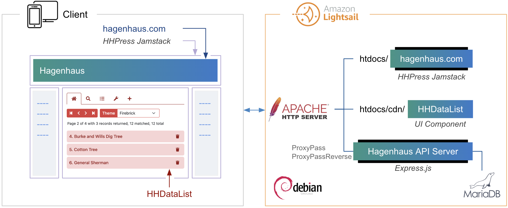
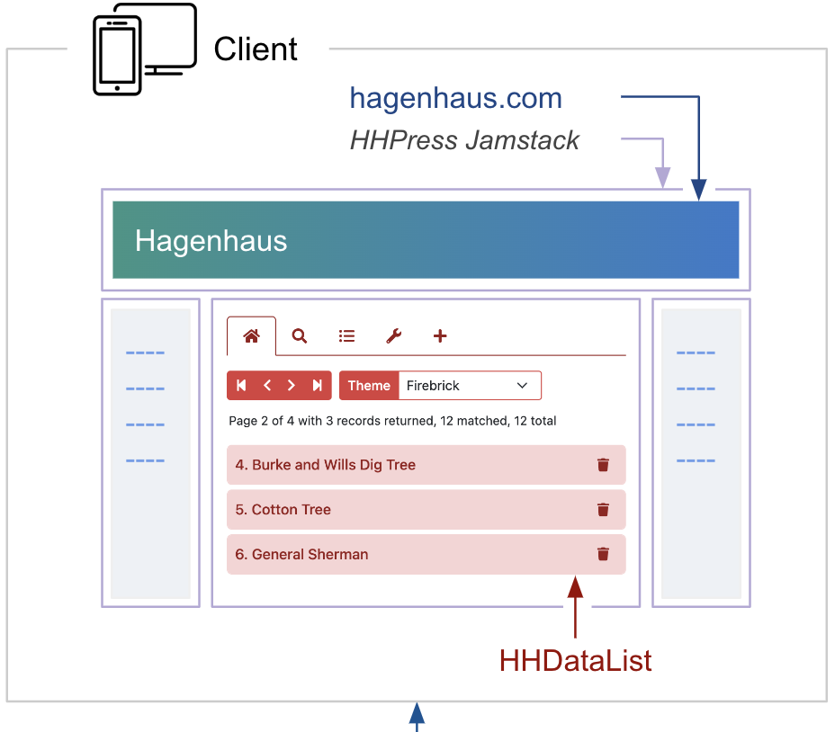
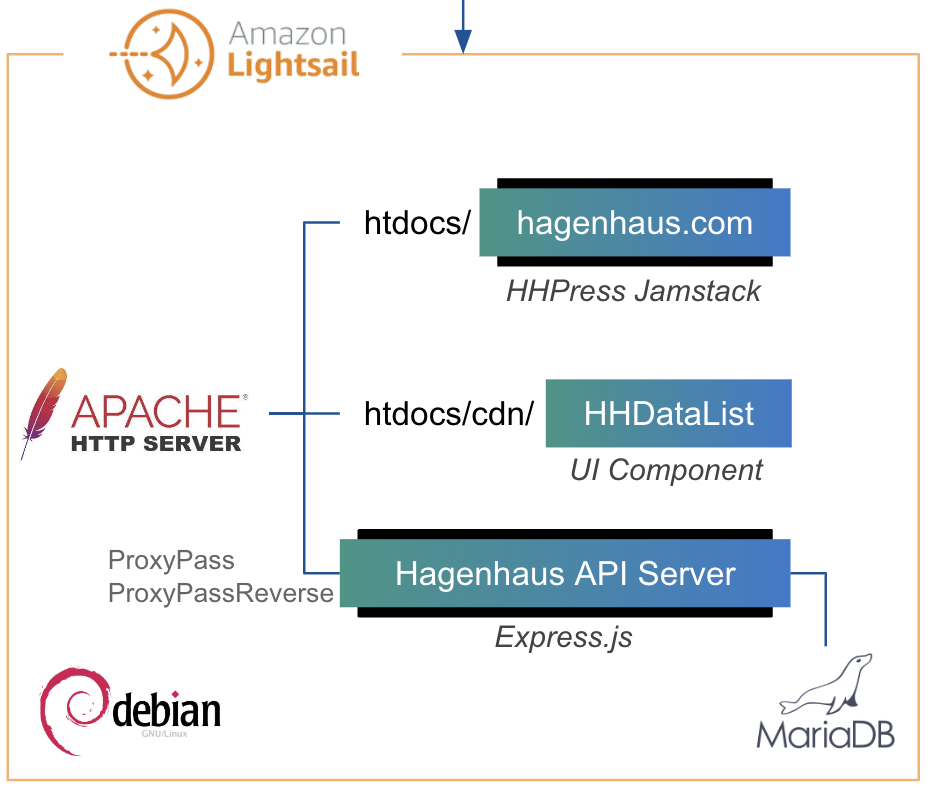
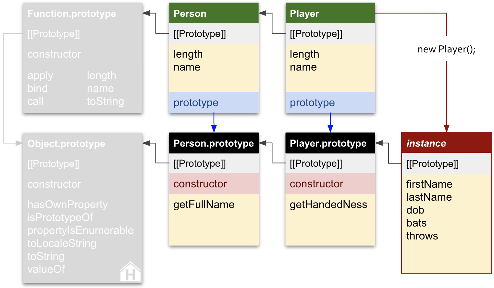
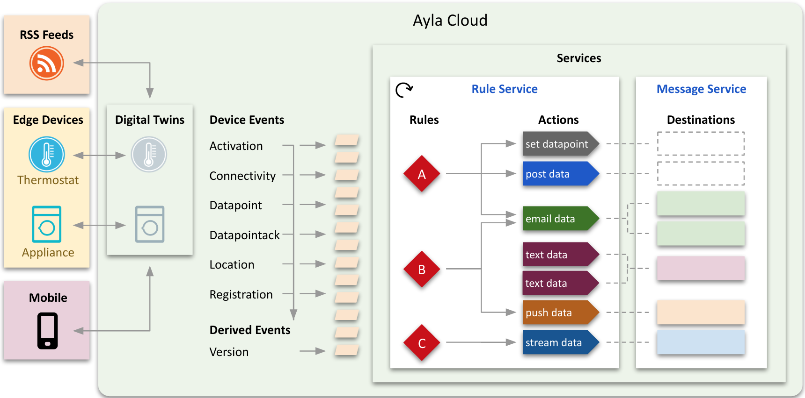

# About this website

Here are the primary building blocks of this site:

  

    

  

  

    

    

  

# Hagenhaus API Server

# HHDataList

The diagram above includes a UI component named HHDataList. Below is a live instance. Try clicking on something:

I created this highly configurable UI component (that interacts with any REST API) as an excuse to write and showcase the corresponding documentation. See my [HHDataList Docs](/en/hhdatalist/v0.0.2/).

# Developer Guides

I created the initial [Developer Portal](https://docs.aylanetworks.com/) for [Ayla Networks](https://www.aylanetworks.com/), an IoT Cloud company, and much of my original work continues to help developers set up and configure devices, dev environments, and test environments by providing clear explanations, diagrams, steps, and example code:

* [Ayla Development Kit](https://docs.aylanetworks.com/docs/ayla-development-kit)
* [Ayla Development Kit-ESP32C3 Module](https://docs.aylanetworks.com/docs/ayla-development-kit-esp32c3-module)
* [Integrated Agent: ESP32 v1.3.8](https://docs.aylanetworks.com/docs/version-138)
* [Ayla Linux Agent](https://docs.aylanetworks.com/docs/ayla-linux-device-solution)
* [Ayla Linux Gateway Agent](https://docs.aylanetworks.com/docs/ayla-linux-gateway-solution)
* [Ayla Rule Service](https://docs.aylanetworks.com/docs/ayla-rule-service-ars-preview)
* [Ayla Cloud Events](https://docs.aylanetworks.com/docs/ayla-data-export-and-streaming-features)
* [Handling Ack-enabled Properties](https://docs.aylanetworks.com/docs/handling-ack-enabled-properties)

# Diagrams

Good diagrams focus attention on information rather than lines, shapes, and colors. Below are examples.

## Constructors

In [Diagrams of JavaScript constructors](https://medium.com/hagenhaus/diagrams-of-javascript-constructors-0e348b67dfee), I explore the nuances of JS constructors by presenting an evolution of eleven diagrams based on a single pattern introduced in the first diagram and fully realized in the final one:

Instead of confronting the reader with all the information in this final diagram at once, the article uses intermediate diagrams to build understanding, focus attention, and reinforce the underlying pattern which relies on color and position. Note that putting `Function.prototype` in the top-left corner of the pattern uncrossed many wires.

## Digital Twins

In [Ayla Development Kit](https://docs.aylanetworks.com/docs/ayla-development-kit), I explain (to device programmers) how to configure a demo IoT device, connect it to the Ayla IoT Cloud service, prepare a GNU build environment, build a series of example programs, and run them on the device. I created several diagrams for the guide including the following:

This diagram illustrates that the Ayla IoT Cloud maintains, for each attached IoT device, a Digital Twin (i.e. state machine) composed of properties corresponding to those declared on the device and accessible to applications like Aura. The diagram also indicates that state changes may be initiated by applications (e.g. Blue_LED) or by devices (e.g. Blue_button).

## Cloud Services

In [Ayla Rule Service](https://docs.aylanetworks.com/docs/ayla-rule-service-ars-preview), I describe (for engineers and administrators) how the Ayla IoT Cloud translates device events into notifications. I created the following diagram as the centerpiece of the article:

# REST APIs

I have been creating and documenting various types of application programming interfaces for many years. These include REST APIs, libraries, CORBA, IoT modules, and hardware interfaces like GPIO.

Regarding a commercial example, I created the initial [ReadyRemit Developer Portal](https://developer.readyremit.com/) which describes the SDKs and REST API for a cloud service enabling client applications to accomplish cross-border payments. This work included the following:

1. Instantiated a [readme.com](https://readme.com/) instance.
1. Themed the site.
1. Organized the site into Developer Guide, API Reference, and Release Notes.
1. Wrote the original Developer Guide (SDKs had not been created yet).
1. Created an OpenAPI document describing ReadyRemit API operations.
1. Worked with the engineering team to test and improve the API.
1. Imported the YAML file into the API Reference section, and worked with ReadMe to debug issues.
1. Created the first few release notes.

Since I created it, the [ReadyRemit Developer Portal](https://developer.readyremit.com/) has evolved with an improved site theme, new SDK pages, expanded sections, and less attention to grammar. 

See also the HHDataList [OpenApi](/en/hhdatalist/v0.0.2/openapi/) page.
