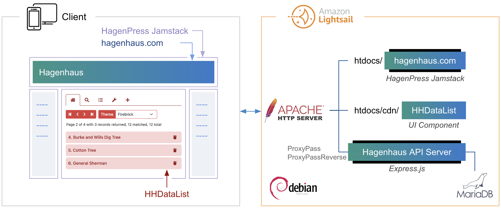
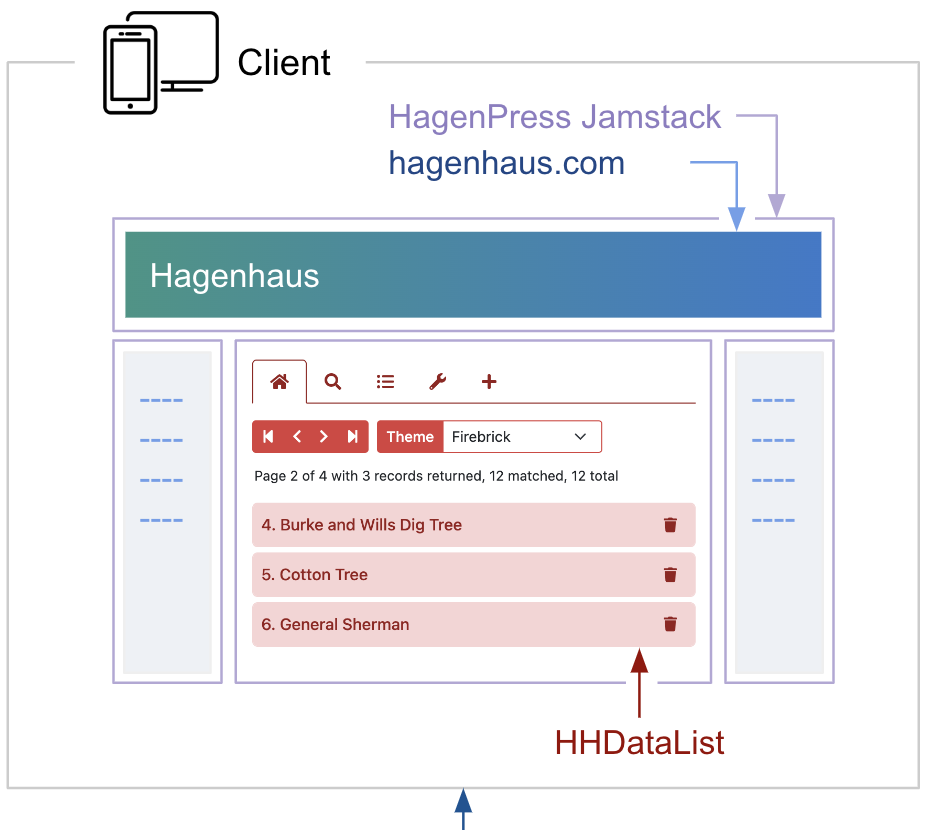
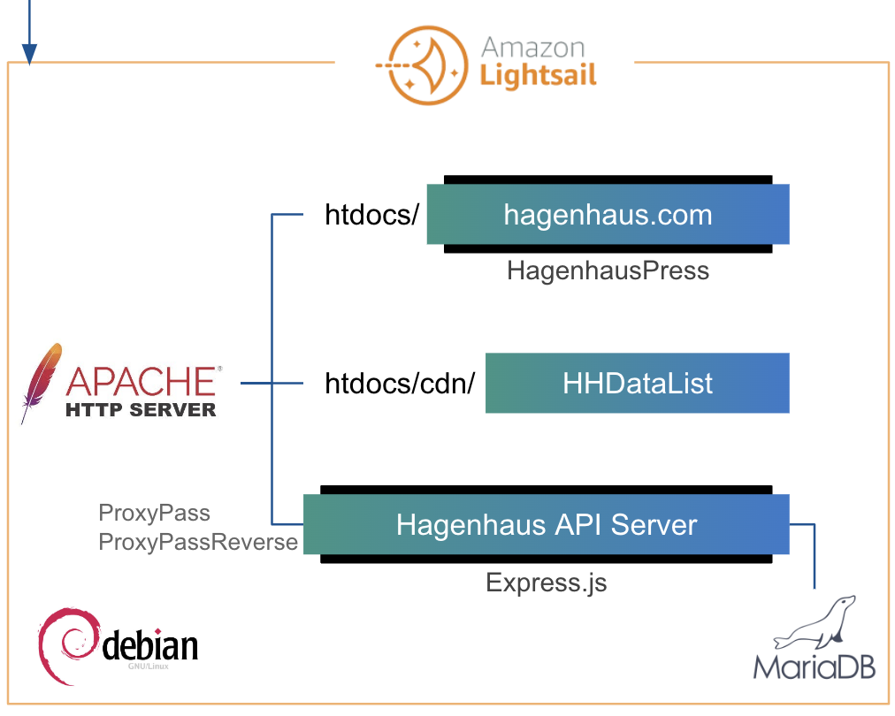

# Home

My name is [Matthew Hagen](https://www.upwork.com/freelancers/~012d439e8f89131bbb?viewMode=1), a *freelance* **Developer Portal Specialist**, and this website, [hagenhaus.com](https://hagenhaus.com/), is my demo portal consisting of the following components:

  

  

  

In the diagram, notice [HHDataList](/en/hhdatalist/v0.0.2/), my generic UI component for interacting with REST APIs. The [HHDataList](/en/hhdatalist/v0.0.2/) page provides examples of my work including guides, tutorials, diagrams, articles, OpenAPI, and themes.

Contact me via [upwork.com](https://www.upwork.com/freelancers/~012d439e8f89131bbb?viewMode=1) for all your Developer Portal needs. Most of my work consists of creating developer guides and REST API references for a wide variety of technologies and cloud services. I also organize and deploy developer portals built on standard platforms like [readme.com](https://readme.com/). And, I edit existing content, design and test REST APIs, and provide developer training.

