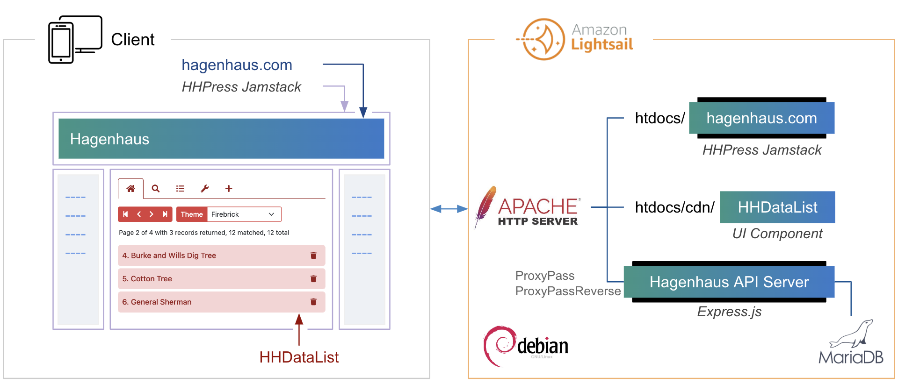
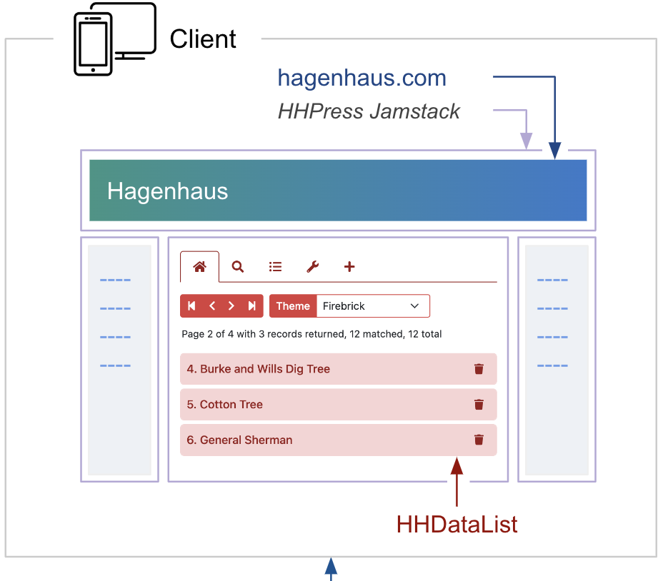
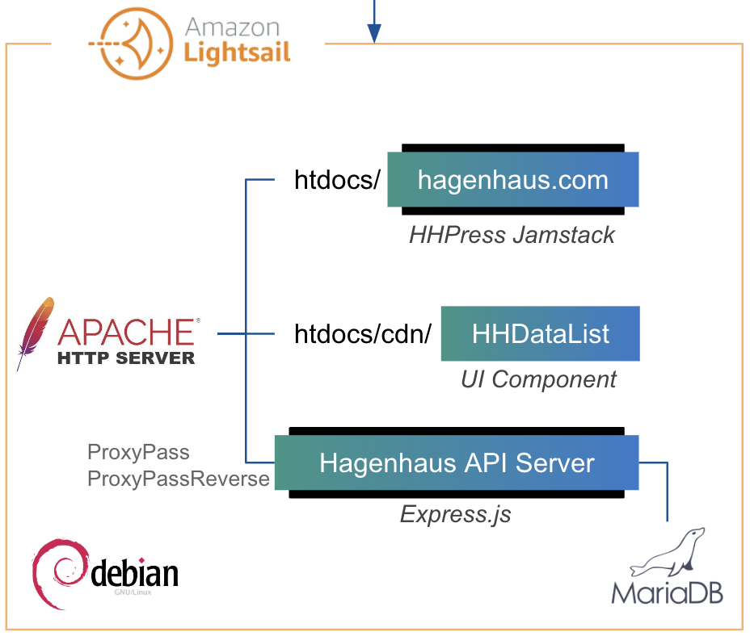
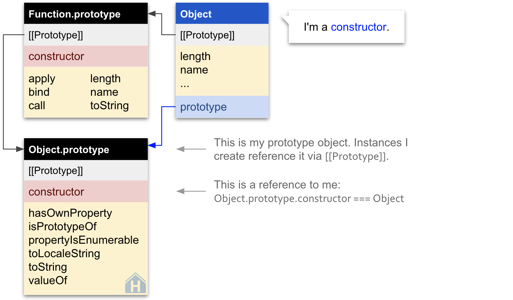

# Portfolio

From simple diagrams, guides, SDK docs, and REST API references to entire developer portals, I create concise content for software engineers. Here, for example, is a concise, responsive diagram of my webapp:

  

    

  

  

    

    

  

My name is Matt Hagen, an experienced writer, trainer, software developer, and freelancer, and this website is my portfolio. [Contact me](/en/contact-me/) for help enabling your in-house and third-party developers leverage your cloud services and SDKs.

# HHDataList

HHDataList is a highly configurable UI component for interacting with any REST API. Here is an instance:

I created HHDataList as an excuse to write the corresponding concise documentation: [HHDataList Docs](/en/hhdatalist/v0.0.2/).

# Developer Guides

I created the first [Developer Portal](https://docs.aylanetworks.com/) for [Ayla Networks](https://www.aylanetworks.com/), and much of my work remains intact except for small updates. These docs help developers set up and configure devices, developer environments, and test environments by providing clear explanations, diagrams, steps, and example code:

* [Ayla Development Kit](https://docs.aylanetworks.com/docs/ayla-development-kit)
* [Ayla Development Kit-ESP32C3 Module](https://docs.aylanetworks.com/docs/ayla-development-kit-esp32c3-module)
* [Integrated Agent: ESP32 v1.3.8](https://docs.aylanetworks.com/docs/version-138)
* [Ayla Linux Agent](https://docs.aylanetworks.com/docs/ayla-linux-device-solution)
* [Ayla Linux Gateway Agent](https://docs.aylanetworks.com/docs/ayla-linux-gateway-solution)
* [Ayla Rule Service](https://docs.aylanetworks.com/docs/ayla-rule-service-ars-preview)
* [Ayla Cloud Events](https://docs.aylanetworks.com/docs/ayla-data-export-and-streaming-features)
* [Handling Ack-enabled Properties](https://docs.aylanetworks.com/docs/handling-ack-enabled-properties)

# Diagrams

## JavaScript Constructors

[Diagrams of JavaScript constructors](https://medium.com/hagenhaus/diagrams-of-javascript-constructors-0e348b67dfee)

Lorem ipsum dolor sit amet, consectetur adipiscing elit, sed do eiusmod tempor incididunt ut labore et dolore magna aliqua. Ut enim ad minim veniam, quis nostrud exercitation ullamco laboris nisi ut aliquip ex ea commodo consequat. Duis aute irure dolor in reprehenderit in voluptate velit esse cillum dolore eu fugiat nulla pariatur. Excepteur sint occaecat cupidatat non proident, sunt in culpa qui officia deserunt mollit anim id est laborum.

Lorem ipsum dolor sit amet, consectetur adipiscing elit, sed do eiusmod tempor incididunt ut labore et dolore magna aliqua. Ut enim ad minim veniam, quis nostrud exercitation ullamco laboris nisi ut aliquip ex ea commodo consequat. Duis aute irure dolor in reprehenderit in voluptate velit esse cillum dolore eu fugiat nulla pariatur. Excepteur sint occaecat cupidatat non proident, sunt in culpa qui officia deserunt mollit anim id est laborum.

Lorem ipsum dolor sit amet, consectetur adipiscing elit, sed do eiusmod tempor incididunt ut labore et dolore magna aliqua. Ut enim ad minim veniam, quis nostrud exercitation ullamco laboris nisi ut aliquip ex ea commodo consequat. Duis aute irure dolor in reprehenderit in voluptate velit esse cillum dolore eu fugiat nulla pariatur. Excepteur sint occaecat cupidatat non proident, sunt in culpa qui officia deserunt mollit anim id est laborum.

Lorem ipsum dolor sit amet, consectetur adipiscing elit, sed do eiusmod tempor incididunt ut labore et dolore magna aliqua. Ut enim ad minim veniam, quis nostrud exercitation ullamco laboris nisi ut aliquip ex ea commodo consequat. Duis aute irure dolor in reprehenderit in voluptate velit esse cillum dolore eu fugiat nulla pariatur. Excepteur sint occaecat cupidatat non proident, sunt in culpa qui officia deserunt mollit anim id est laborum.

Lorem ipsum dolor sit amet, consectetur adipiscing elit, sed do eiusmod tempor incididunt ut labore et dolore magna aliqua. Ut enim ad minim veniam, quis nostrud exercitation ullamco laboris nisi ut aliquip ex ea commodo consequat. Duis aute irure dolor in reprehenderit in voluptate velit esse cillum dolore eu fugiat nulla pariatur. Excepteur sint occaecat cupidatat non proident, sunt in culpa qui officia deserunt mollit anim id est laborum.

Lorem ipsum dolor sit amet, consectetur adipiscing elit, sed do eiusmod tempor incididunt ut labore et dolore magna aliqua. Ut enim ad minim veniam, quis nostrud exercitation ullamco laboris nisi ut aliquip ex ea commodo consequat. Duis aute irure dolor in reprehenderit in voluptate velit esse cillum dolore eu fugiat nulla pariatur. Excepteur sint occaecat cupidatat non proident, sunt in culpa qui officia deserunt mollit anim id est laborum.

Lorem ipsum dolor sit amet, consectetur adipiscing elit, sed do eiusmod tempor incididunt ut labore et dolore magna aliqua. Ut enim ad minim veniam, quis nostrud exercitation ullamco laboris nisi ut aliquip ex ea commodo consequat. Duis aute irure dolor in reprehenderit in voluptate velit esse cillum dolore eu fugiat nulla pariatur. Excepteur sint occaecat cupidatat non proident, sunt in culpa qui officia deserunt mollit anim id est laborum.

Lorem ipsum dolor sit amet, consectetur adipiscing elit, sed do eiusmod tempor incididunt ut labore et dolore magna aliqua. Ut enim ad minim veniam, quis nostrud exercitation ullamco laboris nisi ut aliquip ex ea commodo consequat. Duis aute irure dolor in reprehenderit in voluptate velit esse cillum dolore eu fugiat nulla pariatur. Excepteur sint occaecat cupidatat non proident, sunt in culpa qui officia deserunt mollit anim id est laborum.