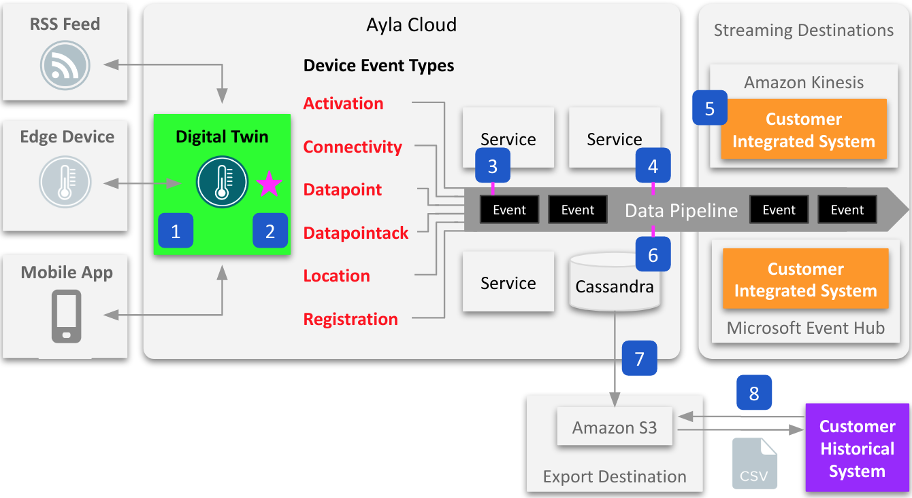
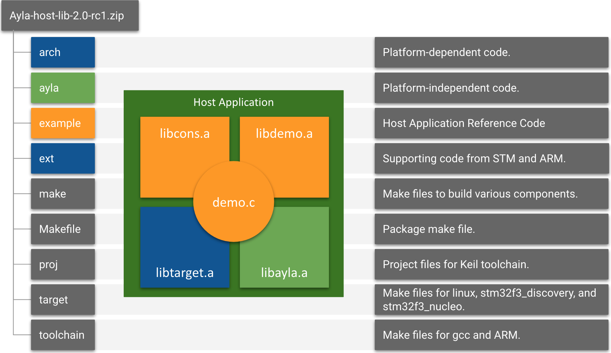

# Introduction

My name is [Matt Hagen](/en/about/), a *freelance* creator of elegant content for software developers. The following responsive diagram illustrates both my webapp, [hagenhaus.com](/en/home/), and intuitive content:

  

    

  

  

    

    

  

# HHDataList

Shown in the diagram above, [HHDataList](/en/hhdatalist/v0.0.2/) is a highly configurable UI component for interacting with any REST API. The following instance accesses the [Lahman Baseball Dataset](http://seanlahman.com/) imported into MariaDB behind Hagenhaus API Server:

Try the following:

1. Scroll using the arrows.
1. Click a record to expand. Click it again to collapse.
1. Click the Expand button to expand all. Scroll. Click Expand again to collapse all.
1. Click the Wrench icon. Check Theme. Try different themes.

The [HHDataList](/en/hhdatalist/v0.0.2/) documentation is another example of elegant content.

# Developer Guides

I created the first [Developer Portal](https://docs.aylanetworks.com/) for [Ayla Networks](https://www.aylanetworks.com/), and much of my work remains intact except for small updates. These docs help developers set up and configure devices, developer environments, and test environments by providing elegant explanations, diagrams, steps, and example code:

* [Ayla Development Kit](https://docs.aylanetworks.com/docs/ayla-development-kit)
* [Ayla Development Kit-ESP32C3 Module](https://docs.aylanetworks.com/docs/ayla-development-kit-esp32c3-module)
* [Integrated Agent: ESP32 v1.3.8](https://docs.aylanetworks.com/docs/version-138)
* [Ayla Linux Agent](https://docs.aylanetworks.com/docs/ayla-linux-device-solution)
* [Ayla Linux Gateway Agent](https://docs.aylanetworks.com/docs/ayla-linux-gateway-solution)
* [Ayla Rule Service](https://docs.aylanetworks.com/docs/ayla-rule-service-ars-preview)
* [Ayla Cloud Events](https://docs.aylanetworks.com/docs/ayla-data-export-and-streaming-features)
* [Handling Ack-enabled Properties](https://docs.aylanetworks.com/docs/handling-ack-enabled-properties)

# Diagrams

[Handling Ack-enabled Properties](https://docs.aylanetworks.com/docs/handling-ack-enabled-properties)

[Ayla Rule Service](https://docs.aylanetworks.com/docs/ayla-rule-service-ars-preview)

[Ayla Cloud Events](https://docs.aylanetworks.com/docs/ayla-data-export-and-streaming-features)

[Ayla Dataflow Overview](https://docs.aylanetworks.com/docs/message-properties#dataflow-overview)

[Ayla Development Kit](https://docs.aylanetworks.com/docs/ayla-development-kit).

[Ayla Host Library](https://docs.aylanetworks.com/docs/ayla-development-kit-esp32c3-module)

[Abstract Rule Expressions](https://docs.aylanetworks.com/docs/rules#abstract-rule-expressions)

[Aura Main Menu](https://docs.aylanetworks.com/docs/aura-mobile-app#main-menu)

