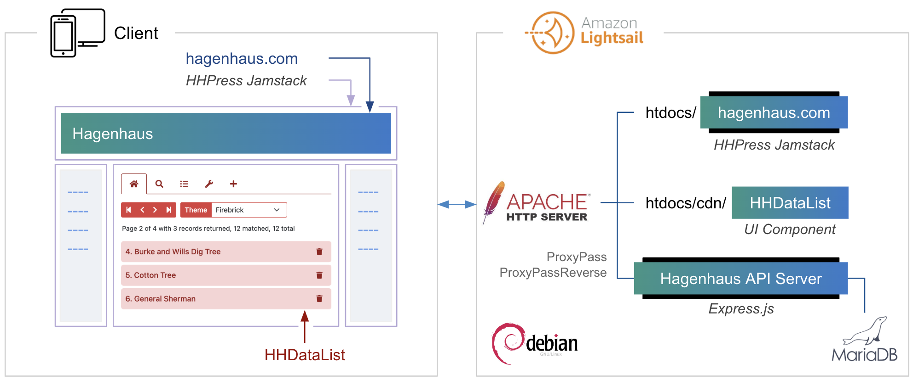
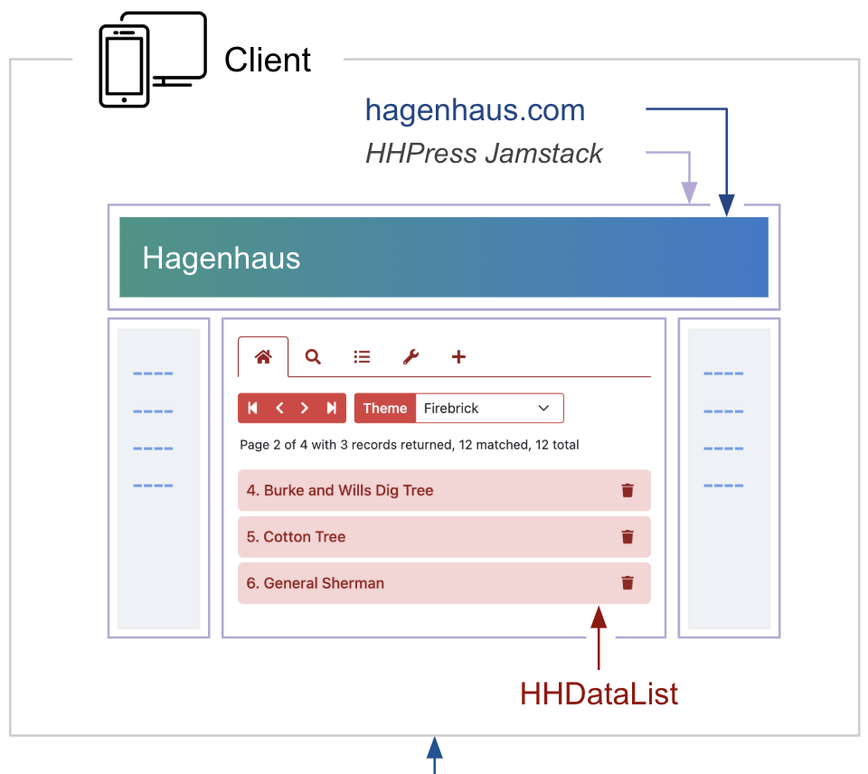
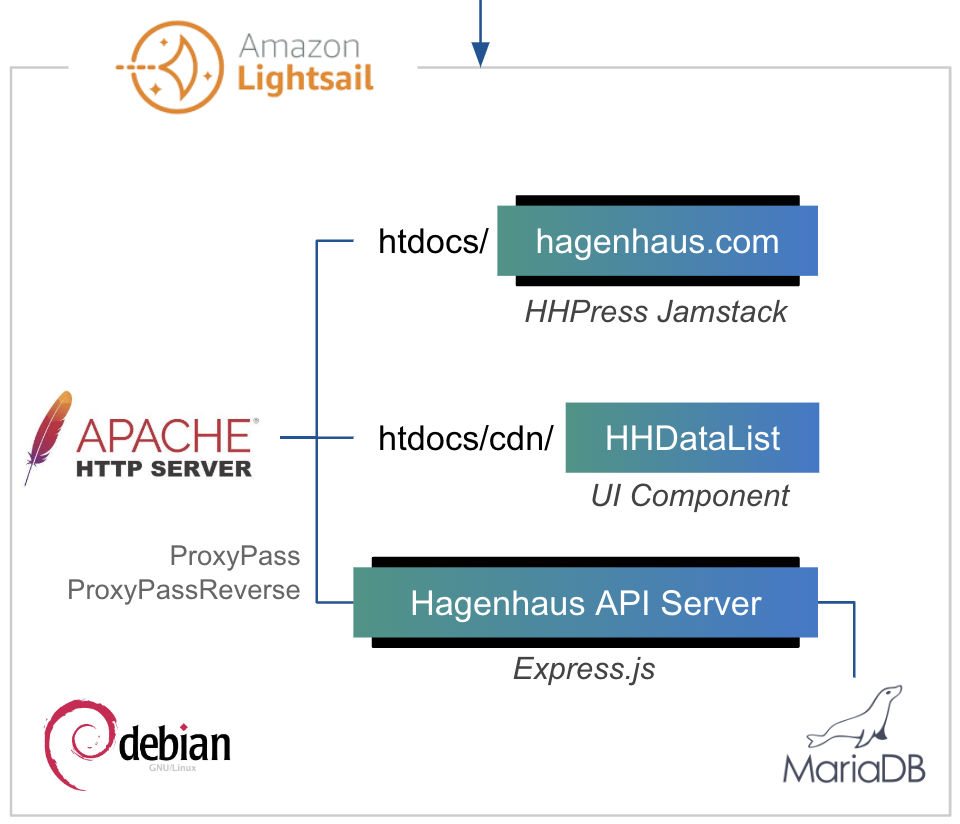

# Portfolio

The diagram below illustrates the primary building blocks of my website:

<div class="mb-3">
  <div class="d-none d-md-block">
    <div></div>
  </div>
  <div class="d-md-none">
    <div></div>
    <div></div>
  </div>
</div>

### HHPress Jamstack

I created this responsive Jamstack. It leverages [Axios](https://axios-http.com/), [Bootstrap](https://getbootstrap.com/), and [Fontawesome](https://fontawesome.com/). It does not utilize [Angular](https://angular.dev/), [React](https://react.dev/), or [Vue](https://vuejs.org/). It includes a site generator and a simple, unique technique for loading only page sections that are not already loaded. [Learn more](hhpress-jamstack/).

### Hagenhaus API Server

I created this [Express.js](https://expressjs.com/) server to which [Apache](https://httpd.apache.org/) passes all `/api` requests. The server enforces `BEARER` authentication for some `GET` requests and for all `POST`, `PATCH`, and `DELETE` requests. [Learn more](hagenhaus-api-server/).

### Hagenhaus API

I created this REST API and the corresponding [OpenAPI file](hagenhaus-api/hagenhaus-hagenhaus-api-2.0.0-resolved.yaml) to help me develop HHDataList. [Learn more](hagenhaus-api/).

### HHDataList

I created this UI component as a means to access data from any REST API and display it on a page using an html `<div>` tag and a configurable JS object like this:

``` nonum js
<div id="my-datalist" class="hh-data-list"></div>
 
new HHDataList({
  id: 'my-datalist',
  // more options
});
```

Below is an example. [Learn more](../hhdatalist/v0.0.2/).

<div id="players-datalist" class="hh-data-list mt-4"></div>
<script>
  var playersOptions = new DLPlayersOptions002('players-datalist');
  playersOptions.themeDefinition.name = 'dodger blue';
  new HHDataList(playersOptions);
</script>

### Database

The MariaDB database includes _hagenhausdb_ and _lamansbaseballdb_. The former includes the countries, trees, and users tables along with some interesting stored procedures. The latter, created by [Sean Lahman](https://en.wikipedia.org/wiki/Sean_Lahman), is a repository of baseball statistics. [Learn more](database/).