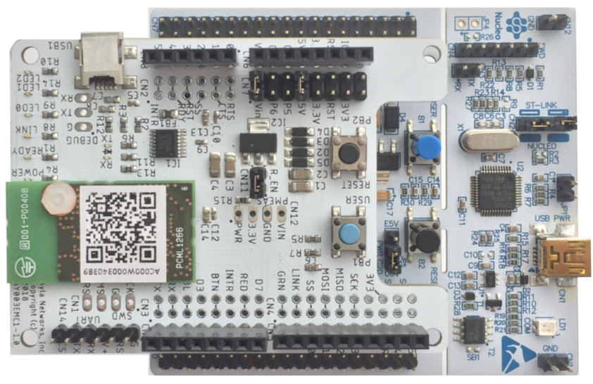
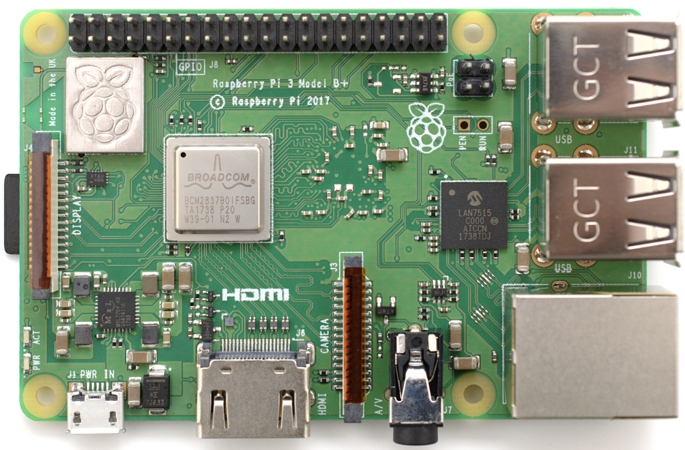
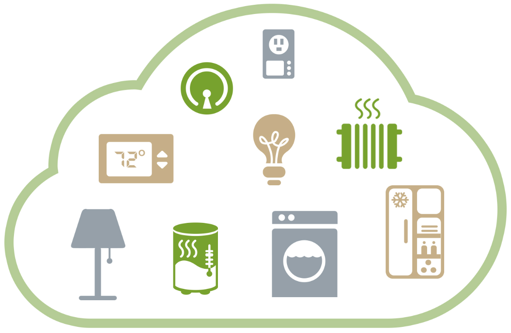
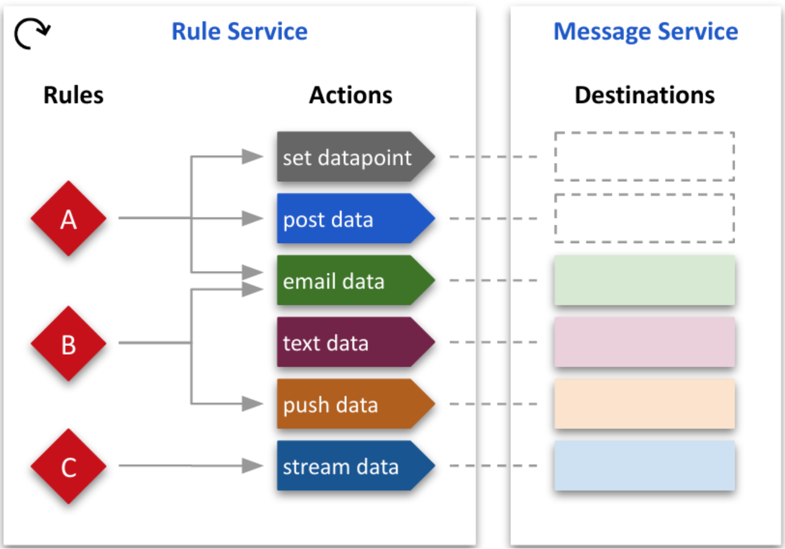
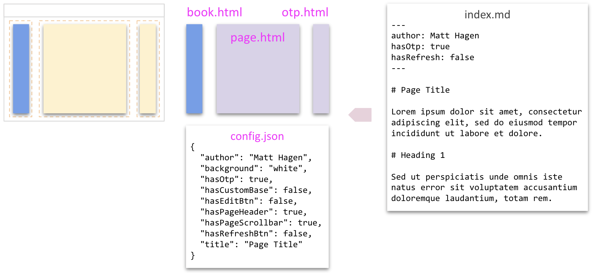

# Questions and Answers

# Course development

> Summarize the top 3 roles where you've designed courses and/or agendas for technical products, and give a brief description of the technical aspects of each product.

## Ayla Networks

For [Ayla Networks](https://www.aylanetworks.com/), an IoT cloud platform whose product suite includes device hardware & firmware, cloud services, and web/mobile software, I deployed a [developer portal](https://docs.aylanetworks.com/docs) including most of the content. My work consisted of overall design, page design, text, diagrams, videos, tutorials, and example code. Here are selections from my work:

<div class="row">
<div class="col-auto mb-3">

</div>
<div class="col mb-3"><a href="https://docs.aylanetworks.com/docs/ayla-development-kit">Ayla Development Kit</a> shows firmware developers how to connect a hardware kit to the Ayla cloud, interact with the kit as an end user, set up a development environment, and implement firmware.</div>
</div>

<div class="row">
<div class="col-auto mb-3">

</div>
<div class="col mb-3"><a href="https://docs.aylanetworks.com/docs/ayla-linux-device-solution">Linux Agent</a> uses a Raspberry Pi to show developers how to connect Linux-based devices to the Ayla cloud. Like the previous example, it leads developers through a user-level experience before engaging them at a more technical level. Note, especially, the webapp visible in my video below my diagram in the <a href="https://docs.aylanetworks.com/docs/ayla-linux-device-solution#explore-serial-io">Explore Serial I/O</a> section. I have created many small webapps like this to demo product features.</div>
</div>

<div class="row">
<div class="col-auto mb-3">

</div>
<div class="col mb-3"><a href="https://docs.aylanetworks.com/docs/introduction">Cloud Platform Overview</a> showcases another of my videos with another of my small webapps built to demo product features.</div>
</div>

<div class="row">
<div class="col-auto mb-3">

</div>
<div class="col mb-3"><a href="https://docs.aylanetworks.com/docs/ayla-rule-service-ars-preview">Ayla Rule Service (ARS)</a> is a straightforward description of a cloud-based rule service, but it also features some neat diagrams. I have created 1000s of technical diagrams using Google Slides.</div>
</div>

Note that I did not make the video on the [Getting Started](https://docs.aylanetworks.com/docs) page.

## Cabletron/Aprisma (train)

While a developer for [Cabletron](https://en.wikipedia.org/wiki/Cabletron_Systems) (circa 2002), I was asked to created a 3-4 day course to teach internal and partner engineers about the company's [CORBA](https://en.wikipedia.org/wiki/Common_Object_Request_Broker_Architecture) interface. In response, I created a set of example servlets, wrote a four-day course based on the servlets, set up a server in a classroom, rented 20 workstations, advertised the course, and taught it four times. This was my introduction to technical training, and I really enjoyed it. In fact, after this experience, I enrolled in a MS.Ed. program, graduated, and eventually became a technical trainer and course developer. Cabletron made switches, routers, and related management software. As a developer, I focused on writing software (C++ and Java) for monitoring switches (Layer 2).

## Cloudera

For [Cloudera](https://www.cloudera.com/), an open-source big-data platform, I taught [Apache Spark](https://spark.apache.org/) to software and IT departments in the US, Canada, and the UK. The duration of each training gig was 3-4 days. I did not write the original course, but because Spark was so new and evolving so quickly, I had to create a lot of supplemental slides and example software (Java, Scala, and Python), and funnel these back to the course developers.

# LMS experience

> List any roles where you've used a Learning Management System (LMS), and briefly described how you interacted with the LMS in each role.

The president of Northeast Technical Institute tasked me with finding an LMS for the company. After speaking with teachers, students, and others, I identified requirements based on use cases. For example, the LMS would need to integrate with [McGraw Hill](https://www.mheducation.com/highered/lms-integration.html), [Elsevier](https://www.elsevier.com/), and other publishing portals. And, the LMS would need to track the progress of individual students. After narrowing the choices to [Moodle](https://moodle.org/), [Brightspace](https://www.d2l.com/brightspace/), and [Canvas](https://www.instructure.com/canvas), and after meeting with teams from these companies, I proposed Canvas to the institute's board who agreed. Following this decision, I deployed Canvas, built the first courses and integrations, and hired and trained a course developer/LMS admin. 

# Software development

> List any roles, education, or personal projects where you've done development of applications or websites, and the technologies you developed with for each.

## hagenhaus.com

I built and continue to improve <a href="https://hagenhaus.com" target="_blank">hagenhaus.com</a> as a learning space and portfolio. Originally, I explored using React, Angular, and Vue for the website but decided instead to create my own mechanisms for generating and loading components. All page source files are named `index.md`. They consist of GitHub markdown with optional frontmatter and/or embedded html:

``` nonum
---
author: Matt Hagen
hasOtp: true
hasRefresh: false
---

# Page Title
 
Lorem ipsum dolor sit amet, consectetur adipiscing elit, sed do eiusmod tempor incididunt ut labore et 
dolore magna aliqua. Ut enim ad minim veniam, quis nostrud exercitation ullamco laboris nisi ut aliquip 
ex ea commodo consequat.
 
# Heading 1
 
Sed ut perspiciatis unde omnis iste natus error sit voluptatem accusantium doloremque laudantium, totam 
rem aperiam, eaque ipsa quae ab illo inventore veritatis et quasi architecto beatae vitae dicta sunt 
explicabo.
```

My Node-based generator transforms each `index.md` file into `book.html`, `page.html`, `otp.html`, and `config.json`:



When a user clicks an internal link, JS running in the browser decides which page parts need replacing based on `config.json` and which page parts are already loaded:


In this case, `book.html` is already loaded.

## HHDataList

Recently, I created a fairly complex UI component named <a href="https://hagenhaus.com/en/hhdatalist/v0.0.2/" target="_blank">HHDataList</a>, and added it to my website. An HHDataList instance can interact with a variety of APIs including one I created for test purposes which leverages Node Express and Mysql. Click <a href="https://hagenhaus.com/en/hhdatalist/v0.0.2/" target="_blank">HHDataList</a> to learn more. I have begun to write <a href="https://hagenhaus.com/en/hhdatalist/v0.0.2/articles/" target="_blank">Articles</a> about HHDataList which I think are interesting.

## readyremit.com

Recently, I created a developer portal for Brightwell featuring their new [ReadyRemit API](https://developer.readyremit.com/). The developer hub itself is powered by [Readme](https://readme.com/).

## Cabletron/Aprisma (dev)

At Cabletron, I focused on writing software (C++ and Java) for monitoring switches (Layer 2). We developer on Solaris. Throughout my career I have used a number of operating systems, development environments, and programming languages.

## Novell

At Novell, I wrote device drivers for Network Interface Cards (NICs) in 8088 assembly and, later, C.