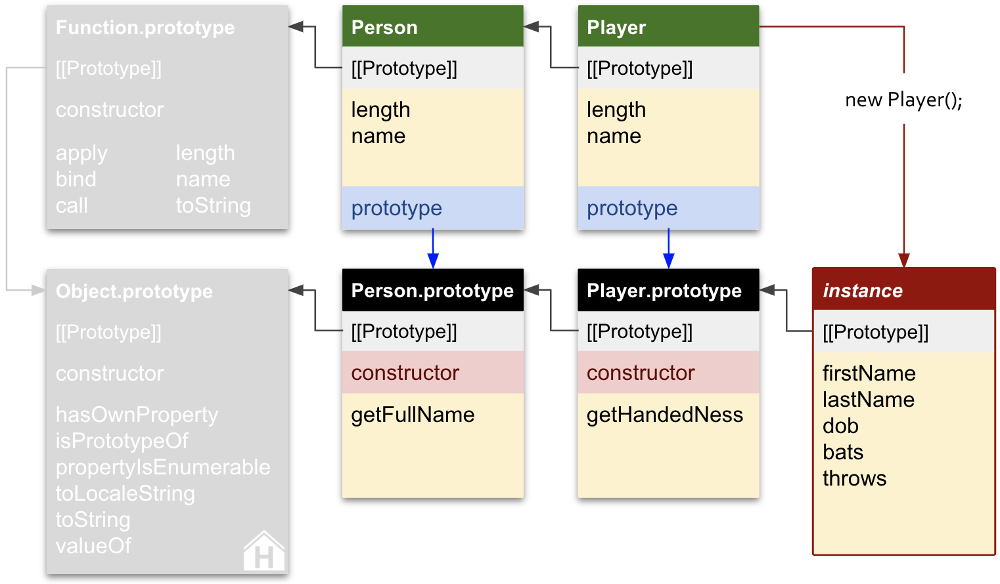
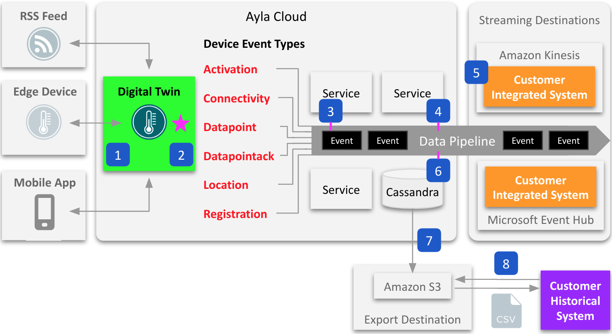
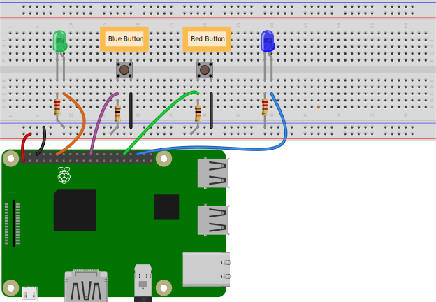

# Services

## API docs and testing

Working with your team, API tools, and workflows, I can create, host, iteratively update, and version a source-of-truth OpenAPI document for your REST API project describing your evolving API including authorization, descriptions of operations, query parameters, request bodies, response data, and errors. During this process, I can test your API, identify inconsistencies and errors, and provide helpful feedback to the team. I maintain my own [Sample OpenAPI Document](/en/website/hagenhaus-api/swagger-ui/hagenhaus-hagenhaus-api-2.0.0-resolved.yaml) and host it using [Swagger UI](/en/website/hagenhaus-api/swagger-ui/), [SwaggerHub](https://app.swaggerhub.com/apis/hagenhaus/hagenhaus-api/2.0.0), and [Postman](https://documenter.getpostman.com/view/8773841/2sAYBVhC1m). See also [Hagenhaus API](/en/website/hagenhaus-api/).

## Guides and tutorials

Working with your team, tools, and workflows, I can create guides and tutorials for your developer community on a range of programming languages and topics. Below are examples.

### Ayla Networks

I created guides and tutorials for the [Ayla Developer Portal](https://docs.aylanetworks.com/) including the following:

* [Ayla Development Kit](https://docs.aylanetworks.com/docs/ayla-development-kit)
* [Ayla Development Kit-ESP32C3 Module](https://docs.aylanetworks.com/docs/ayla-development-kit-esp32c3-module)
* [Integrated Agent: ESP32 v1.3.8](https://docs.aylanetworks.com/docs/version-138)
* [Linux Agent](https://docs.aylanetworks.com/docs/ayla-linux-device-solution)
* [Linux Gateway Agent](https://docs.aylanetworks.com/docs/ayla-linux-gateway-solution)
* [Ayla Rule Service (ARS)](https://docs.aylanetworks.com/docs/ayla-rule-service-ars-preview)
* [Ayla Cloud Events](https://docs.aylanetworks.com/docs/ayla-data-export-and-streaming-features)
* [Handling Ack-enabled Properties](https://docs.aylanetworks.com/docs/handling-ack-enabled-properties)

### HHDataList

I created a UI component named HHDataList that enables webpages to perform operations targeting any REST API, and I wrote the corresponding [HHDataList docs](/en/hhdatalist/v0.0.2/). Below is an HHDataList instance.

## Developer Portals

Working with your team, I can establish a developer portal, organize it, create content for it, and establish workflows. Below are examples:

* Using the [ReadMe](https://readme.com/) developer hub, I created the [ReadyRemit Developer Portal](https://developer.readyremit.com/) and all the original content for [Brightwell](https://www.brightwell.com/), a fintech company that makes a cross-border payment platform.

* I created hagenhaus.com including a custom JamStack, UI Component, REST API, API server, and database. See [Website](/en/website/).

## Training content and delivery

Successfully creating and delivering effective training to developer communities involves efficient project management that establishes goals and coordinates efforts among various stakeholders including marketing, sales, documentation, social media, support, developer relations, solutions engineering, and R&D engineering. The goal is to maximize adoption while minimizing the impact on company resources. A secondary goal is to maximize the quality of courseware while minimizing duplicate efforts and artifacts across departments. Based on many years of experience creating technical content and delivering it to developer audiences, I can help you build a productive developer training program.

## Supplemental diagrams

An effective diagram provides rapid insight. Consider the following:

The diagram above appears in my Medium article [Diagrams of JavaScript constructors](https://medium.com/hagenhaus/diagrams-of-javascript-constructors-0e348b67dfee). I can create diagrams that help explain your software. I draw diagrams using Google Slides, and I store related originals in a [Google Slides file](https://docs.google.com/presentation/d/1FtR22nrfqbtpzGk8lb0VcwIeRGwd1-u8VtAz0L0NR1E/edit?usp=sharing). Sometimes the file doubles as a slide deck for training. To include the diagram in a document, I use a screenshot of the original. Below are additional examples of diagrams.

### Ayla Digital Twin

This diagram appears in [Ayla Development Kit](https://docs.aylanetworks.com/docs/ayla-development-kit#explore-properties).

### Ayla Cloud Events

This diagram appears in [Ayla Cloud Events](https://docs.aylanetworks.com/docs/ayla-data-export-and-streaming-features).

### Ayla Rule Service

This diagram appears in [Ayla Rules Service](https://docs.aylanetworks.com/docs/ayla-rule-service-ars-preview).

### Raspberry Pi and Breadboard

This diagram appears in [Ayla Linux Agent](https://docs.aylanetworks.com/docs/ayla-linux-device-solution#implement-blue_led).

