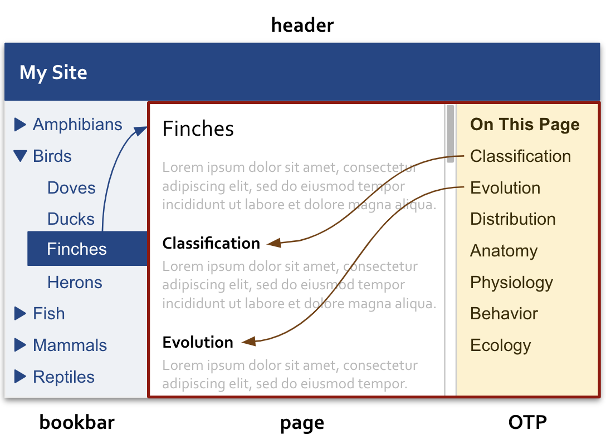

# HHPress

HHPress is a simple platform for building markdown-sourced websites. Like similar platforms, it includes a generator that transforms markdown into html:

However, unlike HHPress, most traditional generators transform markdown files into complete html webpages:

So, when replacing this type of generated html webpage with another, in addition to displaying new content, the browser often overwrites existing parts with identical parts:

This approach is not without merits. 

One of the primary drawbacks to this approach is associated with sidebars. There are two types of sidebars:

1. Bookbar. This is a sidebar that contains links to multiple pages.
1. OTPbar. This is a sidebar that contains links to headings on the current page (On This Page).

The diagram below illustrates the difference between a bookbar and an OTPbar:

Whenever 
