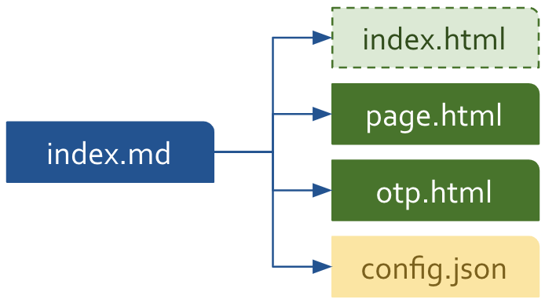

# HHPress

This page provides an overview of HHPress, a platform for building developer portals sourced from markdown files.

# Why HHPress?

Like similar platforms, HHPress includes a generator that transforms markdown into html:

<p></p>

Most other generators, however, transform markdown files into complete webpages:

<p></p>

Browsers load these webpages in their entirety even if they contain parts identical to those on the current webpage. In the following diagram, for example, the _Finches_ webpage replaces the entire _Doves_ webpage even though they both share the same header and sidebar:

<p></p>

This approach reduces sidebar usability. Consider the following diagram:

<p></p>

Note the two types of sidebars in the diagram above: OTP (On This Page) and bookbar. An OTP contains links to headings in the already loaded _page_ (i.e. main content area as opposed to the entire webpage). Clicking a link in the OTP scrolls the page to the specified heading without  generating a request for a new webpage. 

A bookbar, on the other hand, contains links to multiple webpages. So, for example, if a user were to expand Mammals, scroll down past Alpaca, Honey Badger, and Rabbit, and click on Sea Otter, given that the requested webpage was made by a traditional generator, the browser would overwrite all parts of the Finches webpage (header, bookbar, page, and OTP) with the newly downloaded Sea Otter webpage, destroying the state of the current bookbar in the process. 

HHPress loads only the parts of a newly requested webpage that are not already loaded and displayed in the browser. In this case, HHPress would load the page and OTP (see the maroon box in the diagram above) without overwriting the header or bookbar.

# Folders

Cloning HHPress results in the following folder structure:

<p></p>

You can add a folder for each human language you want to support:

<p></p>

Below is the folder structure (with only the _en_ language folder) uploaded to a web server:

<p></p>

# Markdown

HHPress supports [Github Markdown](https://docs.github.com/en/get-started/writing-on-github/getting-started-with-writing-and-formatting-on-github/basic-writing-and-formatting-syntax). The [demo-page](/en/demo-page/) demonstrates how to create paragraphs, lists, code snippets, images, videos, and more. All source markdown files are named _index.md_, and they reside in folders:

<p></p>

Together, each folder and index.md file represent a page and OTP:

<p></p>

Books are nested folders:

<p></p>

Folder names appear in urls:

``` nonum 
/en/home
/en/demo-page
/en/demo-book/amphibians/frogs
```

# Base

The _base.html_ file is the core of an HHPress webapp. It specifies the visual layout, provides standard behaviors (e.g. responsiveness, collapsability, scrollability), and references third-party dependencies (e.g. axios-http, Bootstrap, and Fontawesome):

<p></p>

>The HHPress Generator converts `/en/base.html` into `/en/index.html`. See below.

# Generator

The HHPress Generator resides in the _tools_ folder:

<p></p>

It runs in a Node.js environment:

``` nonum bash
node tools/generator.js -h
Options:
  -h, --help      Show help.  [boolean]
      --version   Show version number  [boolean]
  -d, --dir       Specify dirpath.  [string] [default: ""]
  -e, --edit      Add edit button to page.  [boolean] [default: true]
  -l, --language  Specify language (e.g. en, zh).  [string] [default: "en"]
  -r, --refresh   Add refresh button to page.  [boolean] [default: true]
  -t, --type      Specify file type.  [string] [required] [choices: "all", "base", "book", "css", "folder", "folders", "js"]
```

Below are three example commands. The first converts base.html to index.html, the second converts the index.md file in the `en/home` folder to a set of output files, and the third builds all destination files from source files:

``` nonum bash
node tools/generator.js -t base
node tools/generator.js -t folder -d en/home
node tools/generator.js -t all
```

As mentioned, the generator transforms markdown into html:

<p></p>

But the generator does not convert _index.md_ files into standard _index.html_ files. Instead, for each _index.md_ file, the generator outputs the following:

<p></p>

Each is described below:

**index.html**

This is not a file, but a symbolic link to `/en/index.html`, itself transformed from `/en/base.html`.

**page.html**

This file contains the contents of the _index.md_ file transformed into html.

**otp.html**

This file contains a list of links to the `<h1>` and `<h2>` tags in _page.html_. Here is an example:

``` nonum html
<ul>
  <li class="dynamic"><a href="#hhpress">HHPress</a></li>
  <li class="dynamic"><a href="#why-hhpress">Why HHPress?</a></li>
  <li class="dynamic"><a href="#folder-structure">Folder structure</a></li>
  <li class="dynamic"><a href="#markdown">Markdown</a></li>
  <li class="dynamic"><a href="#base">Base</a></li>
  <li class="dynamic"><a href="#generator">Generator</a></li>
  <li class="dynamic"><a href="#assets">Assets</a></li>
</ul>
```

**config.json**

This file contains page-specific configuration information used by the HHPress `scripts.js` file to make decisions when loading the page. Here is an example:

``` nonum
{
  "author": "Matthew J. Hagen",
  "background": "white",
  "bookPath": "en/website",
  "bookTitle": "Website",
  "chapters": null,
  "hasOtp": true,
  "hasCustomBase": false,
  "hasEditBtn": true,
  "hasPageHeader": true,
  "hasPageScrollbar": true,
  "hasRefreshBtn": true,
  "hhdatalist": "v0.0.2",
  "menuItem": "mi-website",
  "pages": null,
  "pathname": "/Users/matt/github/hagenhaus-com/en/website/hhpress",
  "publishedDate": null,
  "title": "HHPress"
}
```
